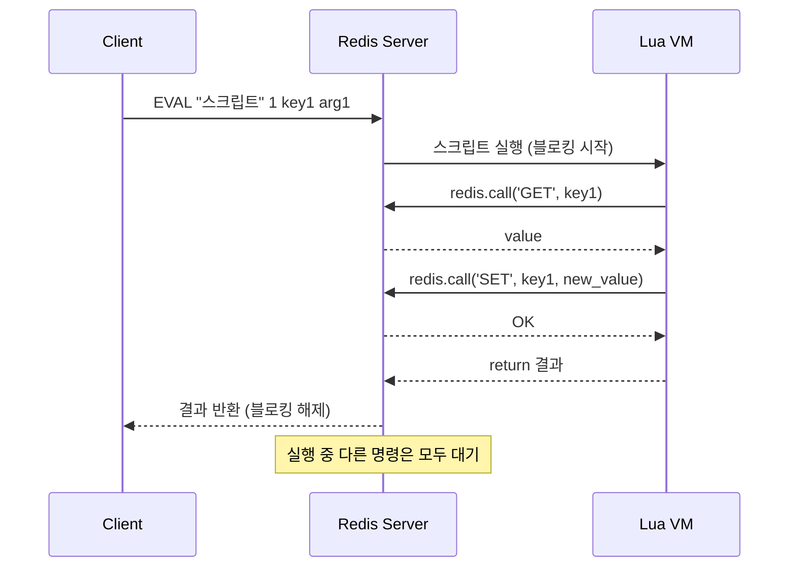

# Redis Lua Script

> 최종 업데이트: 2026-05-13 | 기준: Redis 7.x

## 개념

Redis 서버 내부에서 **Lua 스크립트를 원자적(atomic)으로 실행**시키는 기능. 여러 Redis 명령을 하나의 묶음으로 묶어 실행하며, 스크립트가 도는 동안 **다른 클라이언트의 명령은 절대 끼어들지 못한다**.

비유하자면 은행 창구에서 "출금 → 잔액 확인 → 입금"을 한 사람이 처리하는 동안 창구 문을 잠가버리는 것과 같다. 다른 손님은 끝날 때까지 기다린다.

## 배경/역사

- **2012년 Redis 2.6**에 `EVAL`/`EVALSHA` 명령으로 처음 도입 (Salvatore Sanfilippo, Redis 창시자)
- Lua가 채택된 이유: **임베디드용으로 설계된 작고 빠른 언어** (브라질 PUC-Rio 대학에서 1993년 개발). 인터프리터 자체가 작고(약 200KB), 메모리 사용량이 적으며, 의존성이 거의 없어서 Redis 같은 단일 스레드 서버에 끼워넣기 적합했다
- **2022년 Redis 7.0**에서 **Redis Functions**가 새로 도입됨 — Lua 스크립트를 영구적으로 서버에 저장하고 이름으로 호출 가능. 매번 스크립트를 전송하던 `EVAL`의 단점을 보완
- 현재 Redis는 Lua **5.1** 버전을 사용 (호환성 유지 목적)

## 왜 쓰는가

| 목적 | 설명 |
|------|------|
| **원자성** | 여러 명령을 한 트랜잭션처럼 묶음. `MULTI/EXEC`보다 강력함 (조건 분기, 반복문 가능) |
| **네트워크 RTT 절감** | 클라이언트-서버 왕복을 N회 → 1회로 줄임 |
| **race condition 방지** | "read → 판단 → write" 패턴에서 다른 클라이언트의 개입을 원천 차단 |
| **서버 측 로직** | 비즈니스 로직 일부를 데이터에 가까이 두어 처리 |

## 단일 스레드인데 왜 필요한가

가장 흔한 오해: "Redis는 명령 실행이 단일 스레드라 어차피 원자적인데 왜 Lua가 필요하지?"

단일 스레드가 보장하는 것은 **명령 1개가 쪼개지지 않음**이다. 하지만 **여러 명령을 묶은 것**은 보장하지 않는다. 문제는 명령과 명령 *사이*에 있다.

백엔드 서버가 명령 2개를 보내려면 그 사이에 **네트워크 왕복 + 애플리케이션의 판단 시간**이 끼고, 단일 스레드라도 그 틈에 다른 클라이언트의 명령을 처리한다.

### 사고 시나리오 — 재고 1개를 두 요청이 동시에

| 시각 | 클라이언트 A | 클라이언트 B | stock |
|------|-------------|-------------|-------|
| t1 | `GET stock` → **1** | | 1 |
| t2 | (1이네, 차감 판단 중) | `GET stock` → **1** | 1 |
| t3 | `DECRBY stock 1` | (1이네, 차감 판단) | 0 |
| t4 | | `DECRBY stock 1` | **-1** ← 초과 판매 |

각 명령은 단일 스레드라 원자적이었다. 그런데도 둘 다 "재고 1"을 보고 둘 다 차감해 재고가 음수가 됐다. 단일 스레드는 이걸 못 막는다.

### Lua Script가 하는 일

`GET → 판단 → DECRBY`를 **한 덩어리로 서버에 보내** 그 사이에 네트워크 왕복도, 다른 클라이언트의 개입도 없게 만든다. t1~t4가 쪼개지지 않고 한 번에 실행되므로 B는 A가 끝난 뒤(재고 0) 값을 보고 거부된다.

> **단일 스레드 = 명령 1개는 안전. 하지만 "여러 명령 + 그 사이의 클라이언트 판단"은 안전하지 않다.**
> Lua Script는 그 "여러 명령 + 판단"을 명령 1개처럼 만들어, 단일 스레드의 원자성 보장 범위 안으로 끌어넣는 장치다. 단일 명령(`INCR` 하나로 끝)이면 Lua는 불필요하다.

## 동작 방식



## 핵심 명령

### EVAL — 즉시 실행

스크립트 본문을 통째로 서버에 보내 그 자리에서 원자적으로 실행한다.

```bash
EVAL "스크립트본문" numkeys key1 key2 ... arg1 arg2 ...
```

| 위치 | 의미 |
|------|------|
| `"스크립트본문"` | 실행할 Lua 코드 (문자열) |
| `numkeys` | KEYS의 개수 — 뒤에 오는 인자 중 몇 개가 키인지 알려줌 |
| `key1 key2 ...` | 스크립트의 `KEYS[1]`, `KEYS[2]` ... 가 됨 |
| `arg1 arg2 ...` | 스크립트의 `ARGV[1]`, `ARGV[2]` ... 가 됨 |

```bash
EVAL "return redis.call('SET', KEYS[1], ARGV[1])" 1 mykey hello
#     └── Lua 코드 ──────────────────────────┘ │  │      │
#                                          numkeys │      │
#                                            KEYS[1]      │
#                                                    ARGV[1]
```

`numkeys`를 명시하는 이유: 인자 목록만 봐서는 어디까지가 키이고 어디부터가 값인지 Redis가 알 수 없다. 클러스터에서 어느 노드로 라우팅할지 판단할 때도 "어떤 게 키인지"를 알아야 한다. `numkeys`를 틀리게 주면 키가 `ARGV`로 밀려 의도와 다르게 동작한다.

매번 스크립트 본문을 전송하므로 짧은 일회성 스크립트에 적합.

### SCRIPT LOAD + EVALSHA — 캐시된 스크립트 실행

```bash
# 1. 등록 → SHA1 해시 반환
SCRIPT LOAD "return redis.call('GET', KEYS[1])"
# → "a5260dd66ce02462c5b5231c727b3f7772c0bcc5"

# 2. 해시로 호출 (네트워크 비용 절감)
EVALSHA a5260dd66ce02462c5b5231c727b3f7772c0bcc5 1 mykey
```

자주 쓰는 스크립트는 `EVALSHA`로 호출하는 게 효율적. 단, **서버 재시작 시 캐시가 날아가므로** 클라이언트는 `NOSCRIPT` 에러를 받으면 `EVAL`로 재등록하는 로직이 필요하다 (Spring Data Redis, Lettuce, Jedis 등은 자동 처리).

### SCRIPT EXISTS / SCRIPT FLUSH

```bash
SCRIPT EXISTS a5260dd66c...   # 캐시 존재 여부 확인
SCRIPT FLUSH                  # 캐시 전체 비우기
```

## KEYS와 ARGV의 구분

```bash
EVAL "return {KEYS[1], KEYS[2], ARGV[1]}" 2 user:1 user:2 hello
#                                        ↑      ↑      ↑     ↑
#                                  키 개수  KEYS[1] KEYS[2] ARGV[1]
```

- `KEYS[]`: 스크립트가 **읽거나 쓰는 키**. 클러스터에서 슬롯 라우팅에 사용됨
- `ARGV[]`: 일반 값/인자

**왜 분리하나?** Redis Cluster 환경에서 키가 어느 노드에 있는지 미리 알아야 라우팅 가능. 모든 키를 `KEYS`로 넘기지 않으면 cross-slot 에러가 난다.

## 대표 사용 사례

### 1. 분산 락 해제 (Redisson 실제 패턴)

```lua
if redis.call("GET", KEYS[1]) == ARGV[1] then
    return redis.call("DEL", KEYS[1])
else
    return 0
end
```

"내가 건 락인지 확인 후 삭제"를 원자적으로 처리. 일반 `GET` + `DEL`로 분리하면 두 명령 사이에 락이 만료되고 다른 클라이언트가 새 락을 잡았을 때, **남의 락을 지워버리는 사고**가 발생한다.

### 2. Rate Limiter (1초당 N회 제한)

```lua
local current = redis.call("INCR", KEYS[1])
if current == 1 then
    redis.call("EXPIRE", KEYS[1], ARGV[1])
end
if current > tonumber(ARGV[2]) then
    return 0
end
return 1
```

`INCR` 후 첫 호출이면 TTL을 설정. 이 두 단계를 원자적으로 묶지 않으면 카운터가 만료되지 않은 채 무한 증가할 수 있다.

### 3. 재고 차감 (조건부 감소)

```lua
local stock = tonumber(redis.call("GET", KEYS[1]))
if stock and stock >= tonumber(ARGV[1]) then
    return redis.call("DECRBY", KEYS[1], ARGV[1])
end
return -1
```

"재고가 충분하면 차감, 아니면 거부"를 한 번에 처리. 단순한 `DECR`은 음수까지 내려가버린다.

## Redis Functions (Redis 7+)

Redis 7부터 도입된 **영속적 스크립트 저장 메커니즘**. `EVAL`/`SCRIPT LOAD`의 단점(재시작 시 사라짐, 매번 캐시 관리 필요)을 해결.

```bash
# 함수 정의 (라이브러리 단위로 등록)
FUNCTION LOAD "#!lua name=mylib
redis.register_function('myget', function(keys, args)
    return redis.call('GET', keys[1])
end)"

# 호출
FCALL myget 1 mykey
```

| 항목 | EVAL/EVALSHA | Functions |
|------|--------------|-----------|
| 영속성 | 휘발성 (재시작 시 소실) | 영구 (RDB/AOF에 저장) |
| 복제 | 매 호출마다 복제 | 함수 정의가 복제됨 |
| 이름 | SHA1 해시 | 사람이 읽는 이름 |
| 권장 | 단순/임시 스크립트 | 재사용되는 비즈니스 로직 |

기존 코드는 `EVAL`을 그대로 써도 무방하나, **새로 작성하는 영구적인 로직은 Functions를 권장**한다.

## 스프링부트 구현

Spring Data Redis는 `RedisScript` + `RedisTemplate.execute()`로 Lua 스크립트를 실행한다. 내부적으로 **`EVALSHA`를 먼저 시도하고 `NOSCRIPT`면 자동으로 `EVAL`로 폴백**하므로, 캐시 관리를 직접 신경 쓸 필요가 없다.

### 1. 스크립트를 인라인 문자열로 정의

```java
RedisScript<Long> script = RedisScript.of(
    "local s = tonumber(redis.call('GET', KEYS[1])) " +
    "if s and s >= tonumber(ARGV[1]) then " +
    "  return redis.call('DECRBY', KEYS[1], ARGV[1]) " +
    "end " +
    "return -1",
    Long.class);   // 반환 타입 명시
```

### 2. 스크립트를 별도 .lua 파일로 분리 (권장)

`src/main/resources/scripts/stock-decr.lua` 에 스크립트를 두고:

```java
@Bean
public RedisScript<Long> stockDecrScript() {
    DefaultRedisScript<Long> script = new DefaultRedisScript<>();
    script.setLocation(new ClassPathResource("scripts/stock-decr.lua"));
    script.setResultType(Long.class);
    return script;
}
```

스크립트가 길어지면 Java 문자열 연결보다 `.lua` 파일이 가독성·유지보수에 유리하다.

### 3. 실행

```java
@Service
@RequiredArgsConstructor
public class StockService {

    private final StringRedisTemplate redisTemplate;
    private final RedisScript<Long> stockDecrScript;

    public boolean decrease(String itemId, long qty) {
        Long result = redisTemplate.execute(
            stockDecrScript,
            List.of("stock:" + itemId),   // KEYS
            String.valueOf(qty));         // ARGV (가변 인자)
        return result != null && result >= 0;   // -1이면 재고 부족
    }
}
```

- 2번째 인자 `List` → `KEYS`, 그 뒤 가변 인자 → `ARGV`. `numkeys`는 리스트 크기로 자동 계산됨
- 모든 인자는 문자열로 전달되므로 Lua 안에서 `tonumber()`로 변환 필요

### 분산 락 — 직접 짜지 말고 Redisson

분산 락은 lock watchdog, 재진입, fair lock 등 고려할 게 많아 직접 Lua로 짜면 버그가 나기 쉽다. **Redisson**이 검증된 Lua 스크립트로 이미 구현해 두었으니 그대로 쓰는 것을 권장한다.

```java
RLock lock = redissonClient.getLock("order:" + orderId);
if (lock.tryLock(3, 10, TimeUnit.SECONDS)) {  // 내부적으로 Lua 실행
    try {
        // 임계 영역
    } finally {
        lock.unlock();   // 내부적으로 "내 락이면 DEL" Lua 실행
    }
}
```

### 주의점

| 항목 | 내용 |
|------|------|
| 반환 타입 | `setResultType()` 누락 시 결과가 항상 `null`. Lua의 숫자는 `Long`으로 매핑 |
| 직렬화 | `RedisTemplate` 사용 시 키 직렬화 방식과 Lua 안의 키가 어긋날 수 있음 → `StringRedisTemplate` 권장 |
| boolean 반환 | Lua에서 `true`는 `1`, `false`는 `nil(null)`로 매핑됨에 주의 |

## 흔한 함정

- **긴 스크립트는 Redis 전체를 멈춘다** — Redis는 단일 스레드. 5ms 이상 도는 스크립트는 다른 모든 클라이언트를 블로킹. 루프가 큰 데이터를 훑는 작업은 절대 금물
- **시간/난수 사용 금지** — `os.time()`, `math.random()` 같은 비결정적 함수는 복제본(replica)에서 다른 결과를 낳아 데이터 불일치 유발. Redis는 이런 함수를 차단하거나 경고함. 시간/난수가 필요하면 `ARGV`로 외부에서 전달
- **클러스터에서 KEYS 슬롯 일치 필수** — 한 스크립트의 모든 `KEYS`는 같은 hash slot에 있어야 함. `{tag}` 해시 태그로 강제하는 방식이 일반적 (`user:{1000}:profile`, `user:{1000}:cart`)
- **`SCRIPT KILL`이 안 통하는 경우** — 쓰기 작업을 시작한 스크립트는 `SCRIPT KILL`로 중단 불가. `SHUTDOWN NOSAVE`만이 유일한 탈출구. 그래서 스크립트는 짧고 단순해야 한다
- **에러 처리** — `redis.call()`은 에러 시 스크립트 중단. 에러를 잡고 싶으면 `redis.pcall()` 사용

## 관련 문서

- [Redis 개념](./1\)-Redis-개념.md)
- [Redis 명령어](./3\)-Redis-명령어.md)
- [Redis 운영 시 주의할 점](./11\)-Redis-운영시-주의할-점.md)
- [Redis Cluster](./Redis-Cluster.md)
