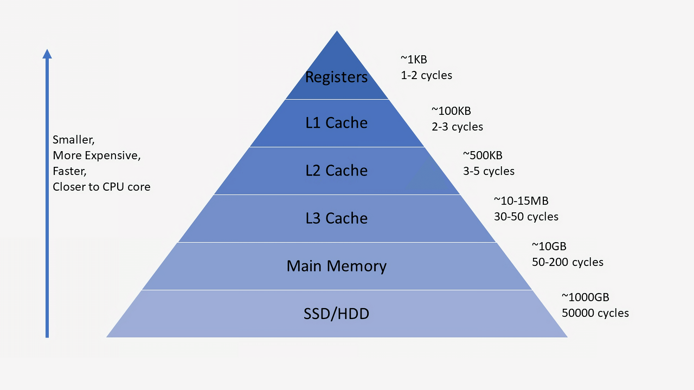
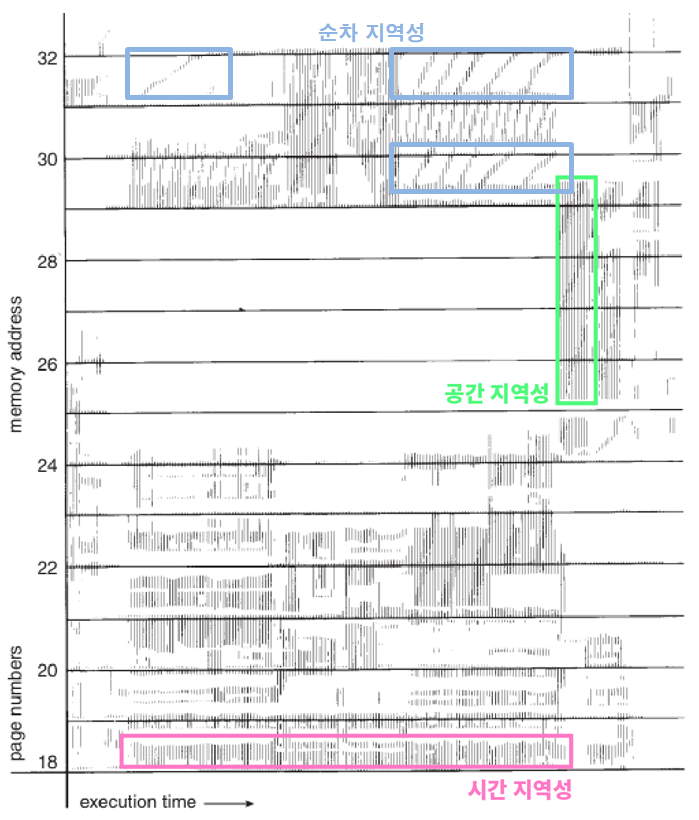
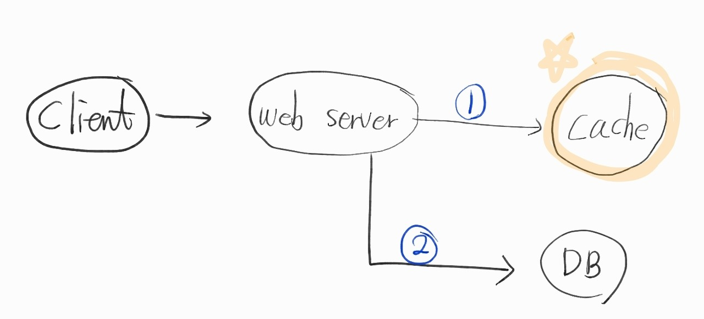
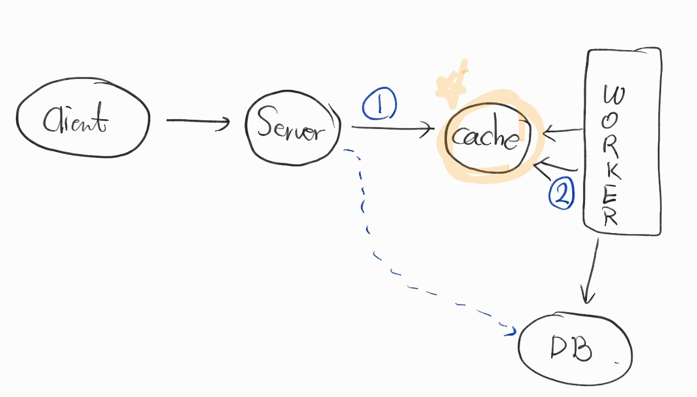

# Cache 

## 정의 

    자주 사용하는 데이터나 값을 미리 복사해 놓는 임시 장소.

    저장 공간이 작고 비용이 비싼 대신 빠른 성능을 제공.

## 언제 쓰면 좋은가 

    접근 시간에 비해 원래 데이터를 접근하는 시간이 오래 걸리는 경우(서버의 균일한 API 데이터)

    반복적으로 동일한 결과를 돌려주는 경우(이미지, 썸네일)

    캐시에 데이터를 미리 복사해 두면, 계산이나 접근시간없이 더 빠른 속도로 데이터에 접근 가능

## 어떤걸 캐시에 저장하나?

    파레토의 법칙에 따르면 상위 20%가 전체의 80%를 담당함. 

    프로그래밍에도 적용되기때문에 자주 그리고 반복적으로 쓰이는 상위 20% 데이터들을 캐시에 저장함.

#### 시간적 지역성

    특정 데이터가 한번 접근되었을 때, 근시일내에 다시 접근될 가능성이 높은 데이터.

#### 공간적 지역성

    특정 데이터와 가까운 주소가 순서대로 접근되었을 경우.

    한 메모리 주소에 접근할 때, 해당 블록을 전부 캐세이 가져옴.

#### 순차 지역성

    데이터가 순차적으로 엑세스되는 경향을 보임.

## 캐시 패턴

일반적인 캐시 쓰임새

    1. 데이터 요청이 오면 먼저 캐시 서버를 탐색
    2. cache miss(캐시가 없음) 혹은 expiration(유효기간 종료)의 경우 원본 데이터를 찾으로 DB에 요청. 동시에 캐시에 다시 저장 혹은 갱신.
    3. cache hit(캐시가 있음)의 경우 캐시에서 데이터 제공

DB를 위한 캐시 뿐만 아니라 Static한 파일을 캐시해주는 CDN 서비스와도 동일한 구조 ex) Amazon CloudFront

동시다발적인 쓰기가 발생하는 경우

티케팅이나 이벤트처럼 동시에 제출 버튼을 클릭할 떄

    1. 클라이언트가 웹서버에 쓰기 요청을 보냄.
    2. 웹서버는 Cache에 데이터를 쓴 후, 결과 리턴.
    3. 따로 작동하는 Worker서버에서 Cache 서버에 있는 데이터들을 가져와 DB에 저장함.

단점은, 캐시서버가 멈추면 데이터는 날라가 버린다. 

그래서, 디스크를 사용하게 하거나, replication을 구성해서 고가용성을 확보함.

## 참고

https://mangkyu.tistory.com/69

https://zangzangs.tistory.com/110

https://bang-jh.tistory.com/3