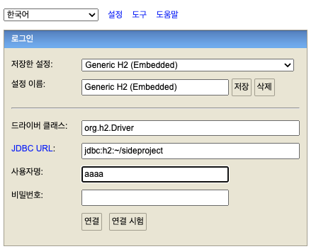
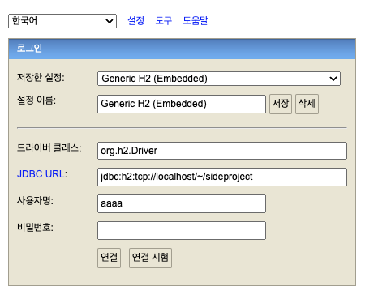
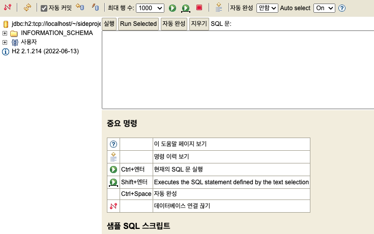

# H2 시작하는 법 

## 설치해서 사용하는 경우
https://www.h2database.com/html/download-archive.html

에 들어가서 스프링에 의존성 추가된 h2와 버전을 맞춰서 다운로드 받는다. 

맥북을 기준으로 적어두면, h2/bin 안에 h2.sh파일이 있다. 

~~~sh
chmod 755 h2.sh
~~~
먼저 h2.sh에 권한을 준다. 

~~~sh
./h2.sh
~~~
그리고 실행을 한다. 

그러면 h2 웹 브라우저가 오픈된다. 

설정은 Genereic H2 Server로 둔다. 

JDBC URL은 최초 DB를 설정할 때 
jdbc:h2:~/"원하는 이름"

사용자명 : "원하는 이름"
비밀번호는 안적어줘도 무방하다. 

그리고 연결을 눌러준다. 

그리고 다시 h2가 설치된 폴더의 상위로 가보면 적어준 이름으로 db가 생성된 것을 볼 수 있다. 

이유는 아직 확인해보진 못했지만, h2 폴더 안에 생기는 것이 아니라 상위 폴더에 생기게 된다. 설정을 변경할 수 있는지는 모르겠다. 

이제 만들어준 데이터베이스에 접근을 해보자. 

이때는 JDBC URL을 위처럼 바꿔주면 된다. 물론 마지막 DB명은 동일하다. 

연결을 누르면 

정상적으로 접근이 가능하다. 

참고로 처음에 실행시킨 ./h2.sh를 종료하면 H2 웹도 종료된다.

이제 스프링 프로젝트에 해당 H2 DB 정보를 적어주자.
~~~properties
spring.datasource.url=jdbc:h2:tcp://localhost/~/aaaa
spring.datasource.username=aaaa
spring.datasource.password=
~~~
웹에서 H2 DB에 접근할 때의 정보를 그대로 적어주면 된다.

## 인텔리제이 내부에서 사용
