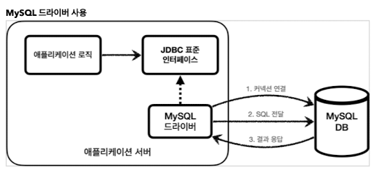

#JDBC 기본

## 탄생 배경 
서버에서 DB에 연결을 할때, DB의 종류마다 
커넥션 연결, SQL 정달, 응답 받는 방법이 모두 다르다. 
그러면 DB를 변경할 때마다, 코드를 다 바꿔줘야 하는 불편함이 있다.
그래서 통일을 해주기 위해 JDBC 자바 표준이 등장

##JDBC 표준 인터페이스
Java Database Connectivity
자바에서 데이터베이스에 접속할 수 있도록 하는 자바 API

java.sql.Connection : 연결
java.sql.Statement  : SQL을 담은 내용
java.sql.ResultSet  : SQL 요청 응답

위의 인터페이스들을 드라이버가 구현해서 제공한다.

## 동작 방식

JDBC 표준 인터페이스가 있고 

이를 각 DB 벤더에서 구현한 드라이버를 통해 DB와 동작을 수행한다.

## 발전 방향
오래된 JDBC는 복잡하다. 그래서 편리한 방향을 발전이 되었는데...

1. SQL Mapper
   1. JdbcTemplate, MyBatis
   2. SQL응답 결과를 자바 객체로 변환해줌.
   3. 반복코드 제거

2. ORM
   1. JPA 
      1. JPA는 자바진영 ORM 표준 인터페이스
      2. 이를 구현한 것이 하이버네이트
   2. 객체를 관계형DB 테이블과 매핑해줌.
   3. SQL 대신 만들어줌.

마치 JDBC를 쓰지 않는 것 처럼 보이지만, 사실 마지막에는 JDBC로 SQL을 전달해서 DB와 동작한다.
중간에 SQL Mapper혹은 ORM을 사용하는 것. 

결국 JDBC부터 알아야 한다. 기본이기 때문에.

## 쿼리

1. executeUpdate
   1. 저장, 수정, 삭제
   2. 반환값은 int, 영향받은 row 수
2. executeQuery
   1. 조회 select
   2. resultSet 표 형태 반환.