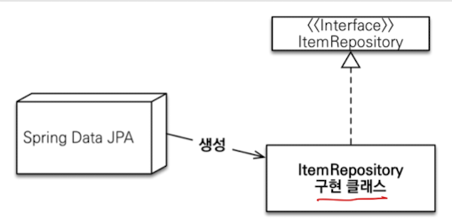

# JPA 개론

> 참고: https://docs.jboss.org/hibernate/orm/6.2/userguide/html_single/Hibernate_User_Guide.html#pc-persist

## 의의

Entity Relationship을 Object Relationship으로 바꿔주는 것.

1. JPA는 자바진영 ORM **표준 인터페이스** (스펙)
2. 이를 구현한 것이 **Hibernate** (구현체)
3. 객체를 관계형DB 테이블과 매핑해줌
4. 자바 컬렉션에 저장하고 조회하듯이 사용 가능
5. SQL을 대신 만들어줌

---

## 영속성 컨텍스트 (Persistence Context)

JPA의 핵심 동작 원리. `EntityManager`가 관리하는 엔티티 저장소다.

### 엔티티 생명주기

```
비영속 (new)  →  persist()  →  영속 (managed)
                                 ↓ detach() / clear() / close()
                               준영속 (detached)
                                 ↓ merge()
                               영속 (managed)
영속 (managed)  →  remove()  →  삭제 (removed)
```

- **비영속 (new/transient)**: `new`로 생성만 한 상태, 영속성 컨텍스트와 무관
- **영속 (managed)**: `persist()` 또는 조회로 영속성 컨텍스트에 저장된 상태
- **준영속 (detached)**: 영속성 컨텍스트에서 분리된 상태 (`detach()`, `clear()`, `close()`)
- **삭제 (removed)**: `remove()`로 삭제 요청된 상태

### 영속성 컨텍스트의 이점

**1차 캐시**
- 같은 트랜잭션 내에서 동일 엔티티를 반복 조회하면 DB가 아닌 캐시에서 반환
- 동일성 보장: `em.find(User.class, 1L) == em.find(User.class, 1L)` → `true`

**변경 감지 (Dirty Checking)**
- 트랜잭션 커밋 시점에 엔티티 변경을 자동 감지하여 UPDATE 쿼리 실행
- `save()` 호출 불필요 — 영속 상태 엔티티의 필드만 바꾸면 됨

```java
@Transactional
public void updateUserName(Long id, String newName) {
    User user = em.find(User.class, id);  // SELECT
    user.setName(newName);                // 커밋 시 자동 UPDATE
}
```

**쓰기 지연 (Write-behind)**
- SQL을 즉시 실행하지 않고 모아뒀다가 `flush()` 시점에 한꺼번에 실행
- `flush()` 시점: 트랜잭션 커밋, JPQL 쿼리 실행 전, 수동 호출

**지연 로딩 (Lazy Loading)**
- 연관 엔티티를 실제 사용 시점까지 로딩을 미룸 (프록시 객체 반환)
- 실무에서는 **모든 연관관계를 LAZY로 설정**하고 필요 시 fetch join 사용

### 주의: N+1 문제

연관 엔티티를 Lazy Loading으로 조회할 때, 부모 N건 조회 후 자식을 각각 1건씩 추가 조회하여 **총 N+1번의 쿼리** 발생

```java
// 해결 1: fetch join
@Query("SELECT u FROM User u JOIN FETCH u.orders")
List<User> findAllWithOrders();

// 해결 2: @EntityGraph
@EntityGraph(attributePaths = {"orders"})
List<User> findAll();

// 해결 3: @BatchSize (Hibernate)
@BatchSize(size = 100)
@OneToMany(mappedBy = "user")
private List<Order> orders;
```

---

## @Entity

JPA가 관리하는 객체로 지정. 엔티티라고 부른다.

- `@Id` 필수 — 식별자(PK) 매핑
- 기본 생성자 필수 (`protected` 이상)
- `final` 클래스, `final` 필드 사용 불가

---

## JPQL

객체를 대상으로 하는 SQL. 테이블이 아닌 **엔티티를 대상**으로 쿼리한다.

```java
// SQL:  SELECT * FROM users WHERE name = '홍길동'
// JPQL: SELECT u FROM User u WHERE u.name = '홍길동'
```

---

## 스프링 데이터 JPA

JPA를 편리하게 사용하도록 **추상화한 Spring 모듈**.

- `JpaRepository` 인터페이스 상속만으로 기본 CRUD 가능
- 프록시로 구현체를 자동 생성



> 참고: https://docs.spring.io/spring-data/jpa/docs/current/reference/html/#jpa.query-methods.query-creation

### @Query
`JpaRepository`를 상속받은 상태에서 JPQL을 사용하려면 `@Query`와 함께 사용.

### @Repository 필요한가?
Spring Data JPA는 `@Repository` 없어도 예외 변환을 해준다.

---

## 주의사항

- JPA의 원래 강점은 **CUD(insert, update, delete)** — 복잡한 조회에는 불리
- 복잡한 조회는 QueryDSL, jOOQ, Native SQL 등과 조합하여 사용

---

## 설정

### dependency
```gradle
implementation 'org.springframework.boot:spring-boot-starter-data-jpa'
```
참고로 JDBC 의존성도 포함하고 있다.

### SQL 로깅 설정

```properties
# 하이버네이트 SQL 출력 (logger 사용 — 권장)
logging.level.org.hibernate.SQL=debug

# 바인딩 파라미터 확인
# Spring Boot 2.x
logging.level.org.hibernate.type.descriptor.sql.BasicBinder=trace
# Spring Boot 3.x
logging.level.org.hibernate.orm.jdbc.bind=TRACE
```

```properties
# System.out으로 출력 — 권장하지 않음
spring.jpa.show-sql=true
```