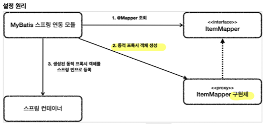

# MyBatis

https://mybatis.org/mybatis-3/ko/index.html

## 설정법
~~~groovy
implementation 'org.mybatis.spring.boot:mybatis-spring-boot-starter:2.2.0'
~~~

## properties 추가
~~~properties
mybatis.type-aliases-package=hello.itemservice.domain
//객체를 사용할 때, 패키지 정보를 생략해 주기 위해.
mybatis.configuration.map-underscore-to-camel-case=true
//DB의 언더바를 카멜로 자동 변경
logging.level.hello.itemservice.repository.mybatis=trace
//MyBatis 쿼리 로그 확인.
~~~

## @Mapper
매핑 XML을 호출해주는 매퍼 인터페이스

작동원리

역시 동적 프록시 기술이 사용됨.
@Transactional과 비슷.

## XML 파일
기본적으로 자바 코드가 아니기때문에, src/main/resources 아래 @Mapper와 같은 패키지 아래 있어야 자동 인식함.

~~~xml
<?xml version="1.0" encoding="UTF-8"?>
<!DOCTYPE mapper PUBLIC "-//mybatis.org//DTD Mapper 3.0//EN"
        "http://mybatis.org/dtd/mybatis-3-mapper.dtd">
<mapper namespace="매퍼 인터페이스의 패키지 경로">
~~~