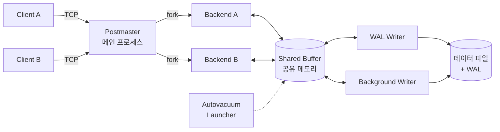

# PostgreSQL

> 최종 업데이트: 2026-05-07 | PostgreSQL 17 기준

## 개념

**PostgreSQL**은 **객체-관계형 데이터베이스(ORDBMS)** 로, 표준 SQL 준수도가 매우 높고 확장성·동시성·신뢰성이 뛰어난 **오픈소스 RDBMS**다. 단순한 테이블/행/열 모델을 넘어 **사용자 정의 타입, 함수, 연산자, 인덱스 메서드**까지 직접 추가할 수 있어 "기능을 끼워 넣을 수 있는 DB"라는 정체성이 강하다.

> 비유하자면 "레고로 만든 데이터베이스". MySQL이 잘 만든 완제품 가전이라면, PostgreSQL은 기본 성능도 좋으면서 부품(확장)을 끼워 GIS·시계열·벡터검색·검색엔진까지 변신 가능한 모듈식 장비다.

- **ACID 트랜잭션** 완벽 지원, 표준 SQL 준수율이 가장 높은 RDBMS 중 하나
- **MVCC(다중 버전 동시성 제어)** 기반으로 읽기와 쓰기가 서로 잠금 없이 진행
- **JSONB, 배열, 범위, 지리(PostGIS), 벡터(pgvector)** 등 풍부한 내장/확장 타입
- **PostgreSQL 라이선스** (BSD/MIT 계열) — 상용 사용 자유

## 배경/역사

PostgreSQL의 뿌리는 **1973년 UC Berkeley의 Ingres 프로젝트**로 거슬러 올라간다. Ingres를 이끌던 **Michael Stonebraker** 교수가 1986년 후속 연구로 시작한 **POSTGRES**가 직계 조상이다. "post-Ingres"의 의미.

| 연도 | 사건 |
|------|------|
| **1986** | UC Berkeley에서 **POSTGRES** 프로젝트 시작 (Michael Stonebraker) |
| **1994** | 학생 Andrew Yu, Jolly Chen이 SQL 파서를 추가해 **Postgres95** 공개 |
| **1996** | 오픈소스 커뮤니티가 인계받아 **PostgreSQL 6.0**으로 개명 |
| **2005** | 8.0 — Windows 네이티브 지원, PITR(시점 복구) |
| **2010** | 9.0 — 스트리밍 복제(Streaming Replication), Hot Standby |
| **2014** | 9.4 — **JSONB** 타입 도입 (NoSQL 흐름에 대응) |
| **2017** | 10 — 논리적 복제(Logical Replication), 선언적 파티셔닝 |
| **2019** | 12 — Pluggable Table Storage, 생성 컬럼 |
| **2022** | 15 — `MERGE` 문, 논리 복제 개선 |
| **2024** | 17 — 점진적 백업, 논리 복제 페일오버 향상, I/O 비동기화 |

> **이름 발음**: 공식 발음은 "post-gres-Q-L" (포스트그레스큐엘). 흔히 "Postgres"라 줄여 부른다.

## 아키텍처 — 프로세스 모델

PostgreSQL은 **멀티 프로세스 모델**을 쓴다. 클라이언트마다 별도의 백엔드 프로세스를 fork하는 것이 특징.



| 구성 요소 | 역할 |
|---|---|
| **Postmaster** | 부모 프로세스. 연결 수락, 백엔드 fork, 백그라운드 워커 관리 |
| **Backend Process** | 클라이언트 1명당 1개. SQL 파싱·실행·결과 반환 담당 |
| **Shared Buffer** | 디스크 페이지를 캐싱하는 공유 메모리 영역 (`shared_buffers`) |
| **WAL Writer** | 변경 사항을 WAL(Write-Ahead Log)에 기록 — 크래시 복구의 핵심 |
| **Background Writer** | 더티 페이지를 디스크로 주기적으로 플러시 |
| **Checkpointer** | 체크포인트 시점에 더티 버퍼 전체를 디스크에 동기화 |
| **Autovacuum** | 죽은 튜플(dead tuple) 정리, 통계 업데이트 |
| **WAL Sender / Receiver** | 복제(Replication)에서 WAL 전송/수신 |

> MySQL/MariaDB는 **스레드 모델**(스레드 풀 기반)이지만 PostgreSQL은 **프로세스 모델**이다. 한 연결당 메모리 비용이 더 크기 때문에 **PgBouncer 같은 커넥션 풀러**를 운영 환경에서 사실상 필수로 쓴다.

## MVCC — 동시성의 핵심

**MVCC(Multi-Version Concurrency Control)** 는 **읽기와 쓰기가 서로 잠금을 걸지 않게** 하는 방식이다. 행을 수정하면 원본을 덮어쓰지 않고 **새 버전의 튜플**을 만들고, 트랜잭션마다 자기 시점에 보이는 버전을 골라 읽는다.

| 동작 | PostgreSQL의 방식 |
|------|---------|
| `UPDATE` | 기존 행에 "삭제 표시"(xmax) + 새 튜플 추가 |
| `DELETE` | "삭제 표시"만 남기고 실제로 지우지는 않음 |
| `SELECT` | 자기 트랜잭션 시점에 유효한 버전(xmin~xmax)을 골라 읽음 |
| 정리 | **VACUUM**이 더 이상 보이지 않는 튜플을 회수 |

> **장점**: 읽기 트랜잭션이 쓰기를 막지 않고 그 반대도 마찬가지. 읽기 전용 보고서가 OLTP를 방해하지 않는다.
> **함정**: 죽은 튜플이 쌓이면 테이블이 비대해지는 **Bloat** 현상 → Autovacuum 튜닝이 운영 핵심 과제.

## 인덱스 종류

PostgreSQL은 다양한 인덱스 메서드를 지원한다. 단순 B-Tree 외에 **데이터 형태에 맞는 전용 인덱스**를 골라 쓸 수 있다.

| 종류 | 용도 |
|------|------|
| **B-Tree** (기본) | 일반적인 등호/범위 검색. 99% 케이스 |
| **Hash** | 등호 비교 전용. 9.x 이후 WAL 지원 |
| **GIN** (Generalized Inverted Index) | **다중 값**(배열, JSONB, 전문 검색) — 한 행에 여러 키 |
| **GiST** (Generalized Search Tree) | 기하/범위/전문검색 등 트리 기반 일반화 |
| **SP-GiST** | 비균형 트리(quad-tree, k-d tree). 공간 데이터 |
| **BRIN** (Block Range INdex) | 거대한 정렬 데이터(시계열 로그). 인덱스 크기 매우 작음 |
| **벡터 인덱스** (확장) | `pgvector`의 IVFFlat / HNSW — 임베딩 유사도 검색 |

```sql
-- JSONB의 임의 키 검색에는 GIN
CREATE INDEX idx_data ON events USING GIN (data jsonb_path_ops);

-- 시계열 로그처럼 거대한 append-only 테이블엔 BRIN
CREATE INDEX idx_logged_at ON logs USING BRIN (logged_at);

-- 전문 검색은 GIN + tsvector
CREATE INDEX idx_search ON docs USING GIN (to_tsvector('english', body));
```

## 풍부한 데이터 타입

| 타입 | 예시/용도 |
|------|---------|
| **JSONB** | `{"a": 1}` — 인덱싱·연산자 풍부, NoSQL 대체 가능 |
| **ARRAY** | `INTEGER[]`, `TEXT[]` — 1차원/다차원 배열 |
| **HSTORE** | 키-값 쌍 (단순 KV) |
| **RANGE** | `int4range`, `tstzrange` — 예약 시스템에 유용 |
| **UUID** | 분산 환경 식별자 |
| **GEOMETRY/GEOGRAPHY** | PostGIS — 지리 정보 |
| **VECTOR** | pgvector — 임베딩 (RAG, 추천) |
| **사용자 정의 타입** | `CREATE TYPE`으로 enum, composite, domain 직접 정의 |

```sql
-- JSONB 연산자
SELECT data->>'name' FROM users WHERE data @> '{"role":"admin"}';

-- 배열
SELECT * FROM posts WHERE 'postgres' = ANY(tags);

-- 범위
SELECT * FROM bookings WHERE during && tstzrange('2026-05-01','2026-05-08');
```

## 확장(Extension) 생태계

PostgreSQL의 가장 강력한 무기. **`CREATE EXTENSION`** 한 줄로 기능을 추가한다.

| 확장 | 용도 |
|------|------|
| **PostGIS** | 지리 정보 시스템(GIS) — 사실상 표준 |
| **pgvector** | 벡터 임베딩 저장/검색 (LLM RAG) |
| **TimescaleDB** | 시계열 DB로 변신 |
| **pg_stat_statements** | 쿼리 통계 — 운영 필수 |
| **pg_partman** | 파티셔닝 관리 자동화 |
| **pgcrypto** | 암호화 함수 |
| **Citus** | 분산 PostgreSQL (수평 샤딩) |
| **hypopg** | 가상 인덱스 (실제 생성 없이 영향 시뮬레이션) |

```sql
CREATE EXTENSION IF NOT EXISTS vector;
CREATE EXTENSION IF NOT EXISTS pg_stat_statements;
```

## 복제와 고가용성

| 방식 | 특징 |
|------|------|
| **Streaming Replication** | WAL을 실시간으로 스탠바이에 전송 (물리 복제) |
| **Logical Replication** | 테이블/행 단위 복제 — 다른 버전·다른 스키마 가능 |
| **Synchronous Commit** | `synchronous_commit=on/remote_apply` — 데이터 무손실 보장 |
| **Hot Standby** | 복제 중인 스탠바이에서 읽기 쿼리 가능 |
| **외부 도구** | Patroni, repmgr, pg_auto_failover — 자동 페일오버 |

> 17부터는 **논리 복제 페일오버 시 슬롯 동기화**가 향상되어 HA 구성이 한층 쉬워졌다.

## MySQL vs PostgreSQL

| 항목 | **PostgreSQL** | **MySQL** |
|------|---------------|----------|
| 분류 | 객체-관계형 DB (ORDBMS) | 관계형 DB (RDBMS) |
| 동시성 모델 | MVCC (snapshot isolation) | InnoDB MVCC + 갭 락 |
| 프로세스 모델 | 멀티 프로세스 (커넥션 풀러 필수) | 멀티 스레드 |
| 표준 SQL 준수 | 매우 높음 | 보통 (확장 문법 일부 비표준) |
| JSON 지원 | **JSONB** + 풍부한 연산자/인덱스 | JSON (8.0+) — 기능은 부족 |
| 복잡 쿼리 / OLAP | 강함 (CTE, 윈도우, GIS, 분석함수) | 약함 (분석엔 별도 DW) |
| 단순 OLTP 처리량 | 좋음 | **매우 좋음** (전통적으로 빠름) |
| 라이선스 | PostgreSQL (BSD/MIT 계열) | GPL + 상용 듀얼 |
| 운영자 | PostgreSQL Global Dev Group | Oracle |
| 한국 시장 점유 | 빠르게 상승 중 | 여전히 가장 많음 |

> 단순 CRUD 위주의 웹 서비스는 MySQL이 충분하지만, **복잡한 도메인·검색·GIS·JSON·분석 쿼리·확장성**이 필요하면 PostgreSQL의 우위가 분명하다.

## 트랜잭션 격리 수준

| 수준 | 설정 시 동작 |
|------|---------|
| Read Uncommitted | PostgreSQL은 **Read Committed로 자동 승격** (Dirty Read 발생 불가) |
| **Read Committed** (기본) | 매 쿼리마다 새 스냅샷 |
| Repeatable Read | 트랜잭션 시작 시점 스냅샷 — Phantom Read도 막음 (PostgreSQL의 Snapshot Isolation) |
| Serializable | SSI(Serializable Snapshot Isolation)로 직렬 가능성 보장. 충돌 시 자동 abort |

> 다른 DB와 다른 점: PostgreSQL의 **Repeatable Read는 사실상 Snapshot Isolation**이라 Phantom Read까지 막는다. SQL 표준보다 강하다.

## 주요 사용처

| 분야 | 예시 |
|------|------|
| **Geospatial** | Uber 초기, Foursquare — PostGIS 표준 |
| **금융 / 결제** | Stripe, 신한은행 일부 시스템 — ACID와 정확성 |
| **SaaS 백엔드** | Instagram, Reddit, GitLab |
| **AI / RAG** | pgvector 기반 임베딩 저장소 — Supabase, Vercel |
| **분석 워크로드** | OLAP-lite, BI — CTE/윈도우 함수 강점 |
| **클라우드 매니지드** | AWS RDS / Aurora PostgreSQL, GCP Cloud SQL, Azure Database for PostgreSQL |
| **국내 공공/금융** | 오픈소스 전환 흐름 속 Oracle 대체 후보 1순위 |

## Spring Boot 연동

### 의존성 (Gradle)

```groovy
dependencies {
    runtimeOnly 'org.postgresql:postgresql'
    implementation 'org.springframework.boot:spring-boot-starter-data-jpa'
}
```

### `application.yml`

```yaml
spring:
  datasource:
    url: jdbc:postgresql://localhost:5432/myapp
    username: postgres
    password: secret
    driver-class-name: org.postgresql.Driver
  jpa:
    database-platform: org.hibernate.dialect.PostgreSQLDialect
    hibernate:
      ddl-auto: validate
    properties:
      hibernate.jdbc.batch_size: 50
      hibernate.order_inserts: true
```

### Docker로 빠르게 띄우기

```sh
docker run -d --name pg17 \
  -e POSTGRES_PASSWORD=secret \
  -e POSTGRES_DB=myapp \
  -p 5432:5432 \
  postgres:17
```

### 자주 쓰는 명령(`psql`)

```sh
\l        -- 데이터베이스 목록
\c myapp  -- 데이터베이스 접속
\dt       -- 테이블 목록
\d users  -- 테이블 구조
\du       -- 사용자(role) 목록
\timing   -- 쿼리 실행 시간 표시
```

## 백엔드 개발자 관점 실무 포인트

- **커넥션 풀러는 사실상 필수** — 프로세스 모델이라 1 커넥션 = 1 OS 프로세스. 보통 **PgBouncer**를 앞단에 두고 트랜잭션 풀 모드로 운영
- **Autovacuum 모니터링** — Bloat가 쌓이면 디스크·성능 모두 악화. `pg_stat_user_tables`의 `n_dead_tup`, `last_autovacuum` 추적
- **`pg_stat_statements`로 느린 쿼리 추적** — 운영 클러스터엔 거의 필수 확장
- **`EXPLAIN (ANALYZE, BUFFERS)`** — `ANALYZE`만으로는 부족. 실제 I/O까지 보려면 `BUFFERS` 옵션
- **JSONB 인덱싱은 GIN** — `WHERE data->>'k' = ?`만 자주 쓰면 표현식 인덱스가 더 효율적, 키가 다양하면 `jsonb_path_ops`
- **마이그레이션은 Flyway/Liquibase** — `CREATE INDEX CONCURRENTLY`처럼 트랜잭션 외부 실행이 필요한 DDL은 별도 마이그레이션 파일로 분리
- **`SERIAL`보다 `IDENTITY`** — PG 10부터 표준 SQL 호환 `GENERATED ... AS IDENTITY` 권장
- **`text` vs `varchar(n)`** — PostgreSQL은 길이 제약을 줘도 성능 이득이 없다. 대부분 그냥 `text` 권장
- **타임존은 `timestamptz`** — `timestamp` (without time zone)는 가능하면 피하기
- **연결 종료 후 트랜잭션 누수 주의** — `idle in transaction` 세션이 Vacuum을 막아 Bloat 유발. `idle_in_transaction_session_timeout` 설정 권장

## 문제 해결

| 증상 | 원인 / 해결 |
|------|-----------|
| `FATAL: too many connections` | `max_connections` 한계 → **PgBouncer 도입**, 풀 사이즈 재조정 |
| 테이블이 비정상적으로 큼 (Bloat) | Autovacuum 부족 → `VACUUM (VERBOSE, ANALYZE)`, `vacuum_cost_limit` 상향 |
| 인덱스 사용 안 됨 | 통계 부정확 → `ANALYZE table;`, `EXPLAIN`으로 플랜 확인 |
| `could not serialize access` | Serializable 격리에서 충돌 → 재시도 로직 추가 |
| 느린 인덱스 생성으로 락 | `CREATE INDEX CONCURRENTLY` 사용 |
| 디스크 가득참 | WAL 누적 점검(`pg_wal/`), 미사용 슬롯 제거 (`pg_replication_slots`) |
| `idle in transaction` 누적 | 애플리케이션 측 트랜잭션 누수 → `idle_in_transaction_session_timeout` |

## 라이선스

**PostgreSQL License** — BSD/MIT 계열 허가형 라이선스. 상용 사용·수정·재배포·비공개 모두 자유. 라이선스 표기 의무만 충족하면 된다. **MySQL의 GPL보다 더 자유로운 라이선스**라는 점이 클라우드/SaaS 사업자의 채택 이유 중 하나.

## 출처

- https://www.postgresql.org/about/
- https://www.postgresql.org/docs/17/
- https://wiki.postgresql.org/wiki/History_of_PostgreSQL
- https://www.postgresql.org/docs/current/mvcc.html

## 관련 문서

- [../MySQL/](../MySQL/)
- [../H2/H2 기본.md](../H2/H2%20기본.md)
- [../SQLite/SQLite.md](../SQLite/SQLite.md)
- [../DB Transaction.md](../DB%20Transaction.md)
- [../Flyway.md](../Flyway.md)
