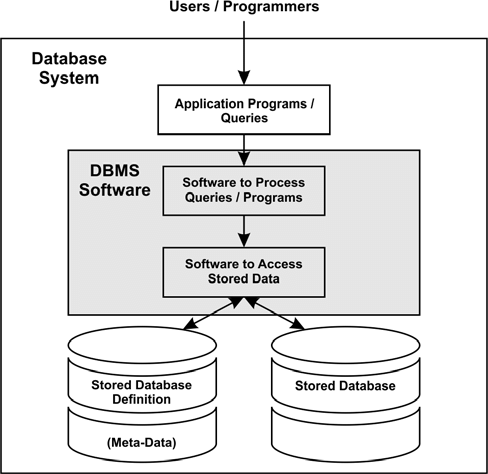
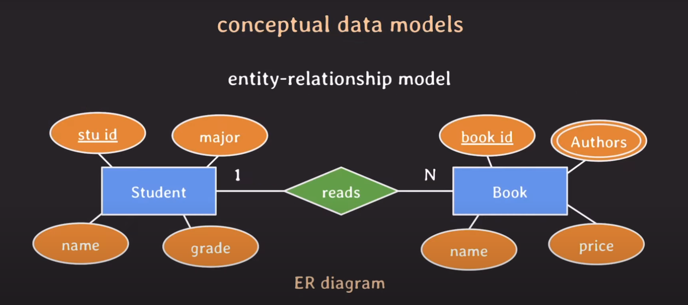
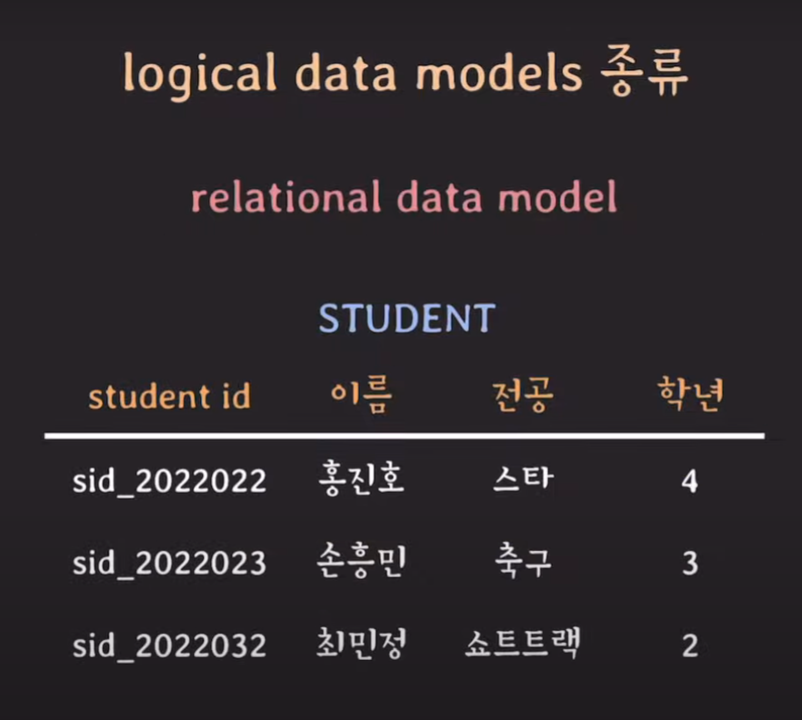
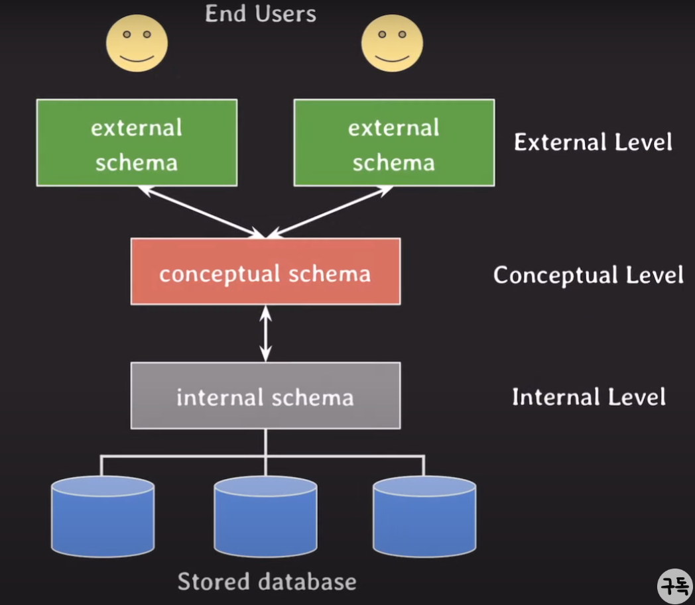

# Database 기본 이론

## Database의 의미

전자적(electronically)으로 저장되고 사용되는 관련있는(related) 데이터들의 조직화된 집합(organized collection)

### 관련있는 데이터

같은 출처, 서비스, 목적으로 생성되는 일련의 데이터들

### 조직화된 집합

찾으려는 데이터를 빨리 찾고, 중복을 막을 수 있도록

### 전자적으로

데이터가 컴퓨터에 저장되고 사용될 때

## DBMS

DataBase Management Systems

사용자에게 DB를 정의하고 만들고 관리하는 기능을 제공하는 소프트웨어시스템

MySQL, Oracle, PostgreSQL 등등

## metadata

DB를 정의하다 보면 부가적인 데이터가 발생하는데, 이 부가적인 데이터를 메타데이터라고 한다.

원래의 의미는 **Data About Data** 라고도 부른다.
데이터를 설명하기 위한 데이터. 사진의 메타데이터(화질, 위치 등등 부가적인 정보들)

database를 정의하거나 기술하는 data.

**catalog**라고도 부른다.

ex) 데이터 유형, 데이터베이스 구조, 제약 조건, 보안, 저장, 인덱스, 사용자 그룹

metatdate들 또한 DBMS를 통해 저장/관리 된다.

## DB Structure

DB 구조
데이터 타입, 데이터 관계, 제약사항 등등

## Database System

database + DBMS + 연관된 applications

줄여서 database라고도 부른다. 문맥에 따라 다름.

## Data models

- DB의 구조를 기술하는데 사용될 수 있는 개념들이 모인 집합

- DB구조를 **추상화**해서 표현할 수 있는 수단을 제공

- 추상화 수준과 DB 구조화 방식에 따라 여러 종류가 있다.

### conceptual (high-level) data models

- 일반 사용자(비개발자도)도 쉽게 이해할 수 있는 개념들로 이뤄진 모델

- 추상화 수준이 가장 높다.

- 비즈니스 요구사항을 추상화하여 기술할 떄 사용

- entity와 entity들의 관계로 설명한 모델
  - relational data model의 relation이 entity 개념이 됨
- er diagram

### logical (representational) data models

- 디테일하게 DB를 구조화할 수 있는 개념 제공
- 특정 DBMS나 storage에 종속되지 않는 수준에서
- relational data model, object data model(객체 개념), 2개를 합친 object-relational data model

- relation(테이블 형태)
- 가장 많이 사용됨
- oracle, mysql, mssql 모두 relational 기반

### physical (low-level) data models

- 컴퓨터에 데이터가 어떻게 파일 형태로 저장되는지 기술
- 실제로 저장되는 형태 가장 근접하게 표현
- data format, data orderings, access path(데이터 검색을 빠르게 하기 위한 구조체, index)

## Database Schema

- data model을 바탕으로 **database 구조를 기술**한 것
- schema는 database를 설계할 떄 정히지며 자주 바뀌지 않음.
- ex) 각 테이블과 테이블이 어떤 속성을 가지는지

## Database State

- database의 실제 데이터는 자주 바뀐다.

- 특정 시점의 database에 있는 데이터를 **database state** 혹은 **snapshot**이라 부름.

## three-schema architecture

- db system을 구축하는 architecture 중에 하나.

- 거의 이 아키텍처를 따름.

- user application으로 부터 물리적인 database를 분리시키는 목적

  - 물리적 database의 구조는 바뀔 수 있는데 그 때마다 user application에는 영향을 끼치지 않기 위해

- 각 레벨을 독립시켜서 어느 레벨에서의 변화가 상위 레벨에 영향을 주자 않기 위해

  - 각 level 별 mapping만 변화시켜 주면 된다.

- DBMS가 완벽하게 구현하지는 못한다.

- 실제 데이터가 존재하는 곳은 internal 이다.

### external schemas at external level

- 실제 사용자가 바라보는 schema

- 특정 유저들이 필요로 하는 데이터만 표현

  - 알려줄 필요가 없는 데이터는 숨김

- logical data model을 통해 표현

### conceptual schemas at conceptual level

- 초창기에는 external, internal schema만 있었음
- 문제는 각각의 user마다 필요로하는 data가 달라지다보니 internal에서 점점 중복되는 data가 생겨버림
- 관리가 어렵고 data 불일치 발생

- 이를 해결하기 위해 conceptual 생김.

- 전체 database 구조를 기술

  - internal schema를 한번 추상화 시킨 schema

- 물리적인 저장 구조 내용은 숨김

  - entities, data types, relationships, user operations(데이터를 활용할 수 있는), constraints(data 제약사항)에 집중

- logical data model을 통해 표현

### internal schemas at internal level

- 물리적인 저장장치에 가장 가까이 위치.
- 물리적으로 데이터가 어떻게 저장되는지
- physical data model을 통해 표현
  - data storage, data structure, access path 기술

## database language

- 오늘날에는 통합된 언어로 존재
  - RDBMS의 **SQL**

### DDL (Data Definition Language)

- conceptual schema를 정의하기 위해 사용

### SDL (Storage Definition Language)

- internal schema를 정의하기 위해 사용

- 요즘 RDBMS에서는 파라미터 설정으로 대체됨

### VDL (View Definition Language)

- external schema를 정의하기 위해 사용

- 대부분의 DBMS에서는 DDL이 VDL 역할까지 수행

### DML (Data Manipulation Language)

- database에 있는 data를 활용하기 위한 언어

- data 추가, 삭제, 수정, 검색의 기능 제공

## 출처

https://www.youtube.com/watch?v=aL0XXc1yGPs&list=PLcXyemr8ZeoREWGhhZi5FZs6cvymjIBVe&index=1
