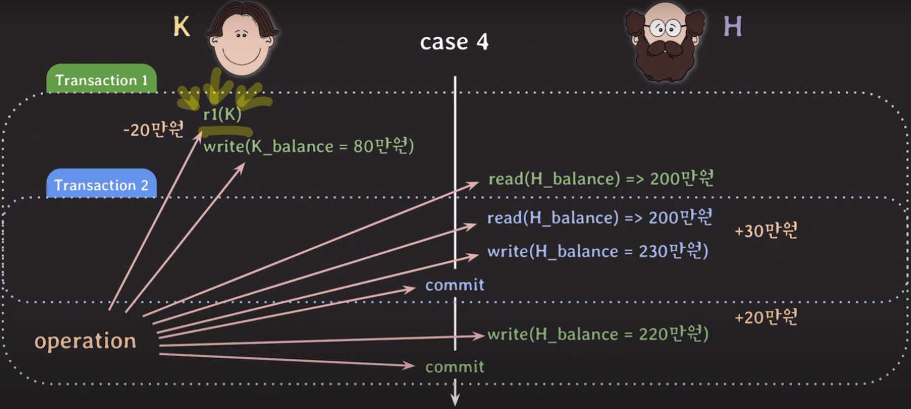
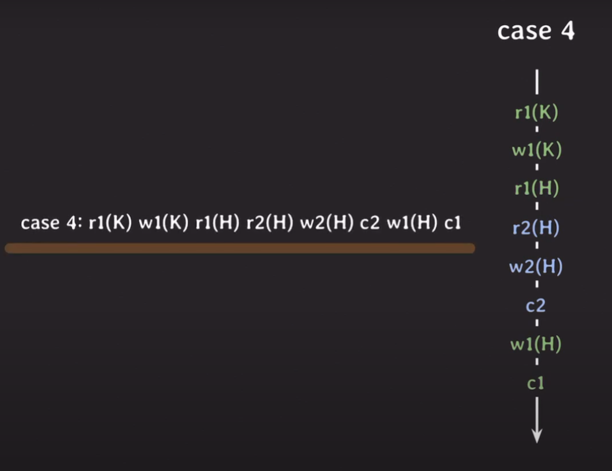
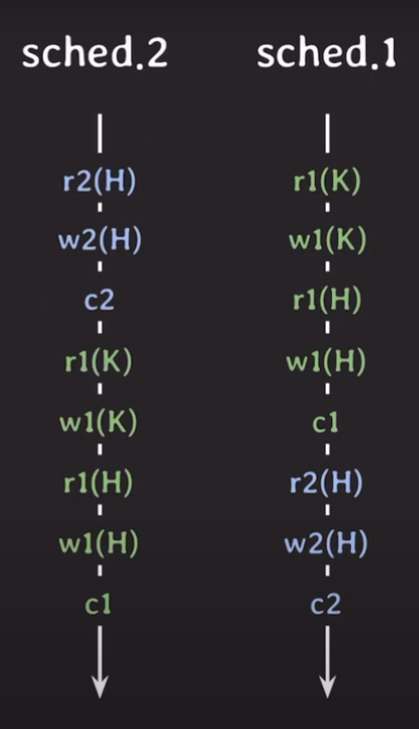
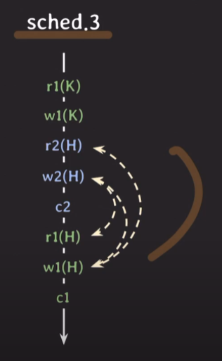
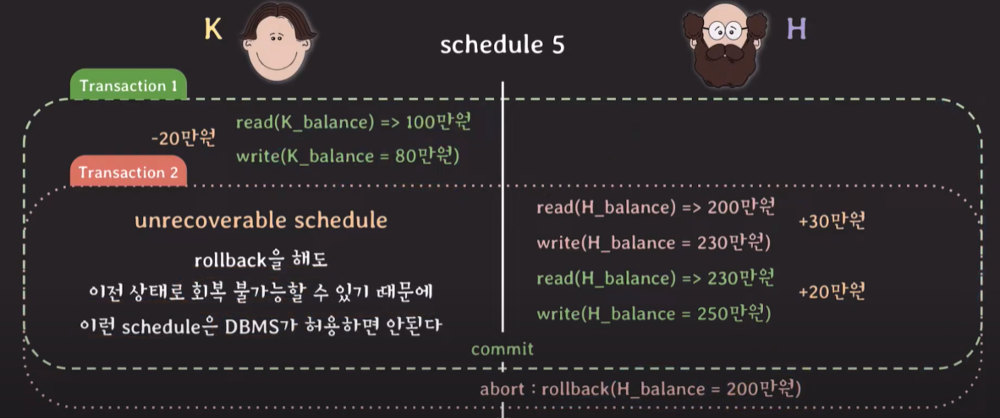
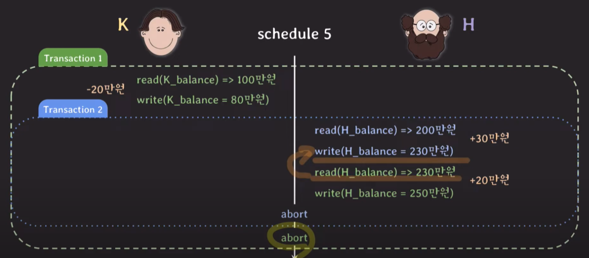
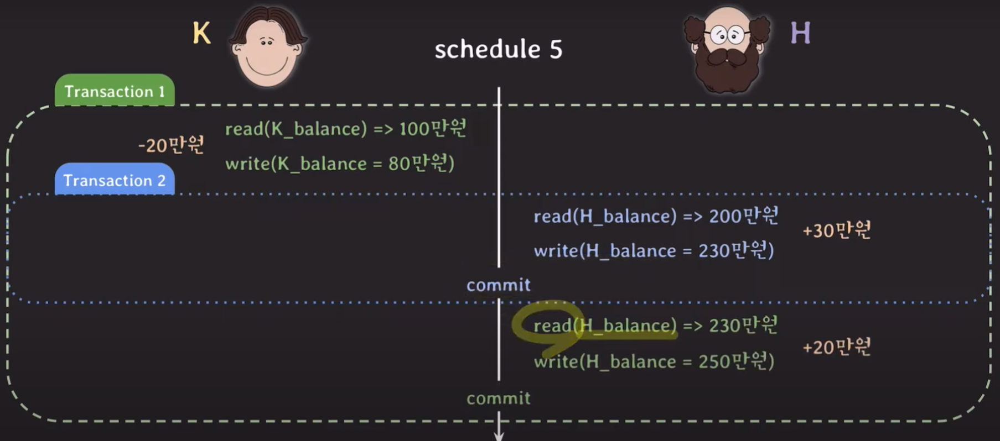

# database concurrency

## 사례

- lost update
  - update 처리를 한 트랜잭션을 다른 트랜잭션 도중에 발생해서 update된 데이터가 사라지는 현상
- operation
  - 실행된 각각을 부르는말
  - 간소화가 가능하다 - r1(k) - r : 읽기, 1 : 1번 트랜잭션 , k : 데이터

## schedule

- 여러 transaction들이 동시에 실행될 때, 각 transaction에 속한 operation들의 실행 순서
- 각 transaction 내의 operations들의 순서는 바뀌지 않는다.

### serial schedule

- transaction들이 겹치지 않고 한 번에 하나씩 실행되는 경우
- 2번 스케쥴 성능
  - r2(H) : I/O 작업. 결과를 가져올 때 까지 CPU를 계속 놀게 둔다.
  - w2(H) : I/O 작업. 역시 write를 하고 결과를 받을 때까지 CPU는 논다.
- 이상한 결과를 만들일은 없다.
- 한 번에 하나의 transaction만 실행되기 때문에 좋은 성능을 낼 수 없다.

### Nonserial schedule

- transaction들이 겹쳐서(interleaving) 실행되는 schedule
- 성능
  - 트랜잭션 1을 처리하고 기다리는 동안 트랜잭션 2를 처리한다.
- 동시성이 높아져서 같은 시간 동안 더 많은 transaction들을 처리할 수 있다.
- 단점
  - transaction들이 어떤 형태로 겹쳐서 실행되는지에 따라 이상한 결과가 나올 수 있음.

## conflict of two operations

- 2개의 operation이 3가지 조건을 모두 만족하면 conflict하다.
  - 서로 다른 transaction 소속
  - 같은 데이터에 접근
  - 최소 하나는 write operation
    - read-write conflict
    - write-write conflict
- **conflict operation은 순서가 바뀌면 결과도 바뀐다.**
  - 입금 후 잔액 읽는 것과 잔액을 읽고 입금을 하는 것은 값이 바뀐다.

## conflict equivalent for two schedule

- 2개의 schedule이 2가지 조건을 모두 만족하면 conflict equivalent
  - 같은 transaction들을 가진다.
  - 모든 conflict operations의 순서가 양쪽 schedule 모두 동일해야 한다.
- sched_3과 sched_2는 conflict equivalent

## conflict serializable (serializability)

- 고민
  - Nonserial schedule로 실행해도 정상결과가 나오려면?
- 아이디어
  - serial schedule과 동일한(equivalent) nonserial schedule을 실행하자
- serial schedule과 nonserial schedule이 conflict equivalent할 때.

## DBMS에서의 구현

- 여러 transactino을 동시에 실행해도 schedule이 conflict serializable하도록 보장하는 **프로토콜**을 적용
- **concurrency control**이 어떤 schedule도 serializable하게 만들어준다.
  - isolation level

## recoverability

### unrecoverable schedule

- shedule 내에서 commit된 transaction이 rollback된 transaction이 write한 데이터를 읽은 경우.
- rollback을 해도 이전상태로 회복이 불가능하게됨.
- DBMS에서 이런 schedule은 허용해선 안됨

### recoverable schedule

- schedule 내에서 그 어떤 transaction도 자신이 잃은 데이터를 write한 transaction이 먼저 commit/rollback 전까지는 commit하지 않는 경우
- **cascading rollback**
  - 하나의 transaction이 rollback하면 의존성이 있는 다른 transaction도 rollback해야 한다.
  - 여러 transaction의 rollback을 연쇄적을 하면 비용이 많이 든다.

#### cascadeless schedule

- schedule 내에서 어떤 transaction도 commit되지 않는 transaction들이 write한 데이터는 읽지 않는 경우
- 하지만, 애초에 read를 하지않고 동일한 attribute를 write했다면, commit한 transaction의 write는 사라지게 된다.

#### strict schedule

- schedule 내에서 어떤 transaction도 commit 되지 않는 transaction들이 write한 데이터는 쓰지도 읽지도 않는 경우
- rollback 할 때, recovery가 쉽다.

## 출처

https://www.youtube.com/watch?v=89TZbhmo8zk&list=PLcXyemr8ZeoREWGhhZi5FZs6cvymjIBVe&index=16
