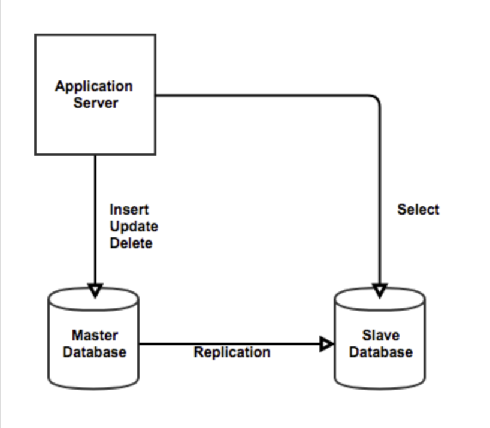
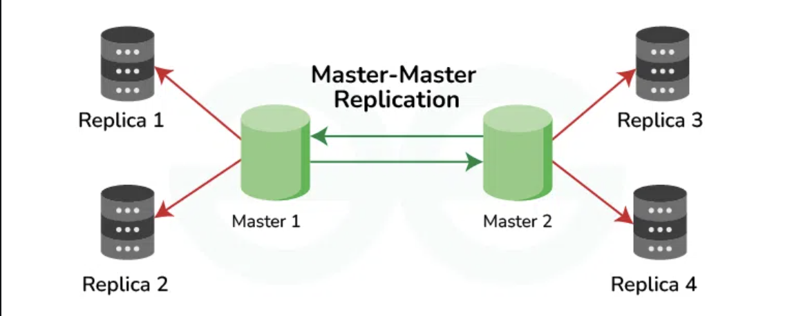
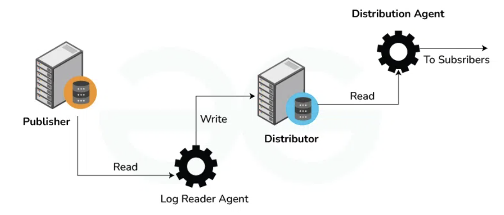
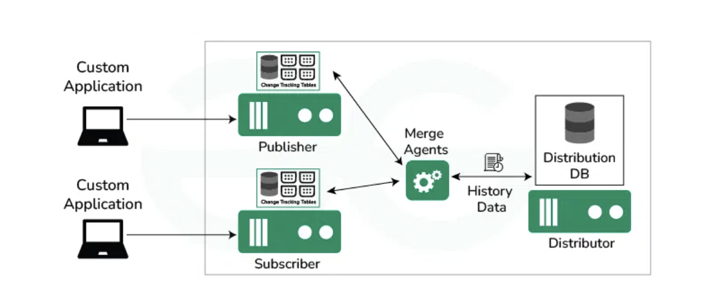
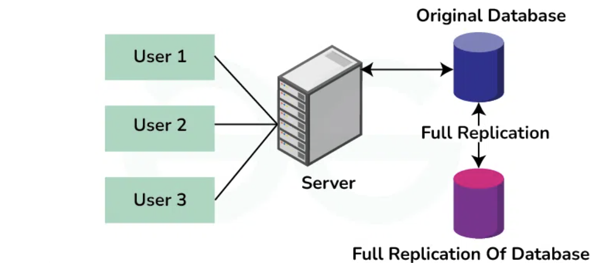
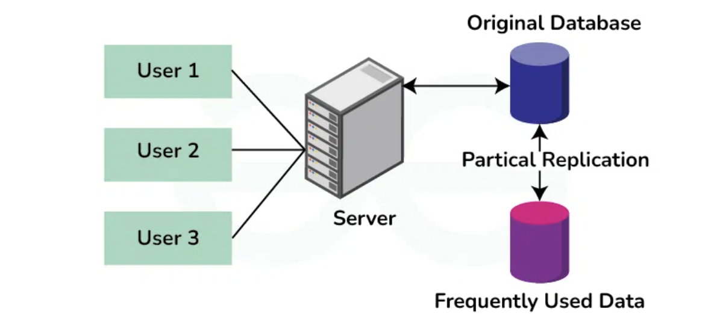
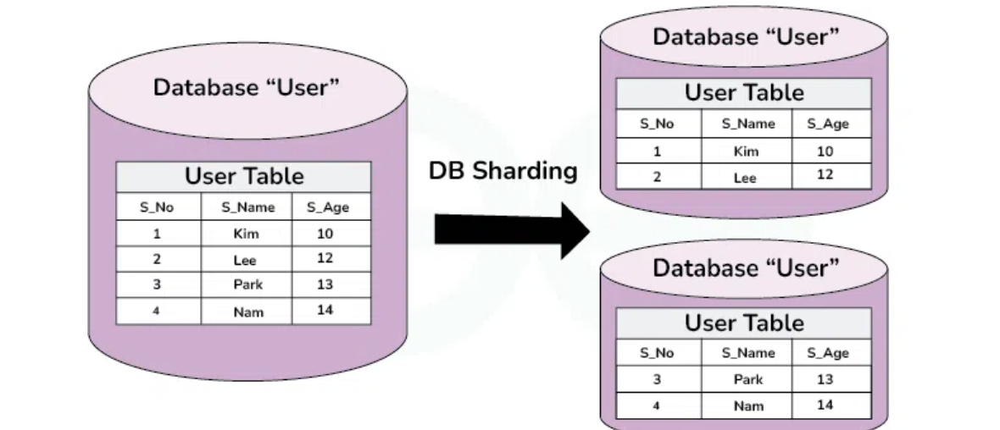

# Database Replication

## 개념
- 다른 서버에 데이터베이스의 중복 복사본을 만들고 유지하는 것
- Primary : 기준이 되는 서버. 1대로 구성
- Secondary : 복제된 서버. N대로 구성

## 장점
- 고가용성
  - 하나 이상의 서버에 장애가 발생하더라도 데이터를 사용할 수 있도록 보장. 여러 서버에 데이터 복사본을 유지함으로써 애플리케이션을 중단 없이 계속 운영할 수 있다.
- 재해 복구
  - 복제는 재해 발생 시 데이터를 복구할 수 있는 수단을 제공. 데이터 사본을 여러 위치에 저장해 두면 재해가 발생한 후에도 조직은 신속하게 운영을 복구할 수 있다.
- 로드 밸런싱
  - 읽기 쿼리를 여러 서버에 분산하여 단일 서버의 부하를 줄이고 성능을 개선할 수 있다.
- 내결함성
  - 한 서버에 장애가 발생하면 다른 서버가 최소한의 중단으로 이를 대신할 수 있도록 하여 내결함성을 향상시킨다.
- 확장성
  - 복제는 쓰기 작업을 여러 서버에 분산하여 단일 서버의 부하를 줄임으로써 확장성을 향상시킬 수 있다.
- 데이터 로컬리티
  - 복제를 통해 데이터를 사용자에게 더 가까이 가져와 지연 시간을 줄이고 사용자 경험을 개선할 수 있다.

## Replication Type
### Primary-Secondary Replication

- 하나의 Primary 데이터베이스와 N개의 Secondary 데이터베이스로 구성
- Primary는 쓰기 작업을 Secondary는 읽기 작업을 수신
- Primary의 변경 사항이 Secondary에 복제되어 데이터의 사본을 유지한다.
- 일종의 도서관을 예시로 두면 된다. 
  - 원본 책이 있는 primary 도서관
  - 책의 사본을 가지고 있고 고객이 책을 빌려갈 수 있는 Secondary 도서관

### Primary-Primary Replication

- 양방향 복제
- 2개 이상의 db를 Primary로 구성하고 각 Primary db에 쓰기 작업이 허용되는 설정 
- 각 Primary DB는 양방향 통신을 하면서 각자의 변경 사항은 모든 Primary DB에 복제된다.

### Snapshot Replication

- 특정 시점에 전체 데이터베이스의 복사본을 만든 다음 해당 스냅샷을 하나 이상의 대상 서버에 복제하는 데 사용되는 방법
- 백업 또는 분산 데이터베이스 목적으로 수행
- 예시 
  - 특정 시간에 방의 사진을 스냅샵으로 찍어둠. 
  - 방이 어질러진 다음에 찍어둔 스냅샵 상태로 복원

### Transactional Replication

- 데이터베이스의 여러 복사본을 실시간으로 동기화하는 방법
- 중앙 서버 publisher DB에 대한 모든 변경사항은 Subscriber DB에 즉시 복제됨
- 주식 자트에서 가격 변동이 즉각적으로 모든 사람에게 업데이트 되는 것을 생각하면 됨

### Merge Replication

- 중앙 서버 Publisher와 연결된 디바이스인 Subscriber가 모두 데이터 변경이 가능한 방법.
- Transactional은 단방향(Publisher -> Subscriber)였지만 Merge 방식은 양방향잉다.
- 여러 곳에서 동일한 데이터를 편집할 수 있기 때문에 충돌 해결에 주의하여야 한다.
- 구글 문서에서 여러사람이 동시에 수정하는 경우를 예시로 들 수 있다.
  - 오프라인에서 문서를 편집할 때는 임시로 저장되고, 온라인에 연결하면 각 변경니용이 문서에 병합된다.

## Database Replication 전략

### Full Replication 

- 전체 복제
- 데이터베이스의 모든 테이블, 행, 열을 하나 이상의 서버에 복제하는 전략
- 원본과 완벽하게 동일한 복사본을 만든다.

### Partial Replication

- 부분 복제
- 특정 테이블, 행, 열을 복제하는 전략
- 리소스를 보다 효율적으로 사용할 수 있음.
- 보고, 분석, 등 특정 목적의 데이터만 복제해야 할 때 유용하다.
  - 금융기관의 경우 가장 자주 엑세스하는 고객 계정 정보들만 보조 DB에 복제한다.

### Selective Replication

- 선택적 복제
- 미리 정의된 기준 또는 조건에 따라 데이터를 복제하는 데이터베이스 복제 전략
- 선택적 복제를 사용하면 복제되는 데이터를 보다 세밀하게 제어할 수 있다.

### Sharding

- 여러 데이터베이스 인스턴스(샤드)에 걸쳐 데이터를 분할하는 데이터베이스 확장 기술
- 온라인 게임 회사는 지리적 위치에 따라 사용자 데이터베이스를 샤드화하여 각 샤드가 특정 지역의 사용자를 담당

## 출처
https://www.geeksforgeeks.org/database-replication-and-their-types-in-system-design/

https://www.youtube.com/watch?v=NPVJQz_YF2A