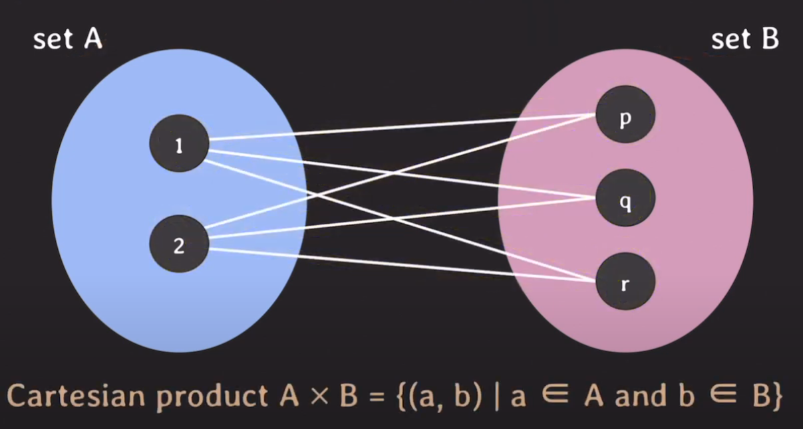
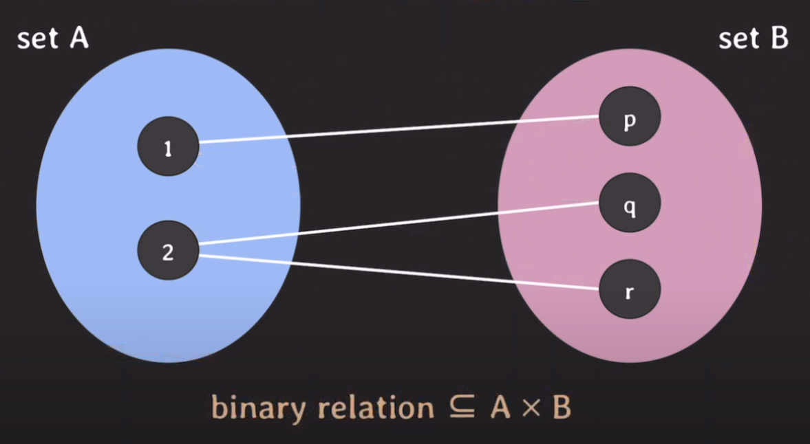
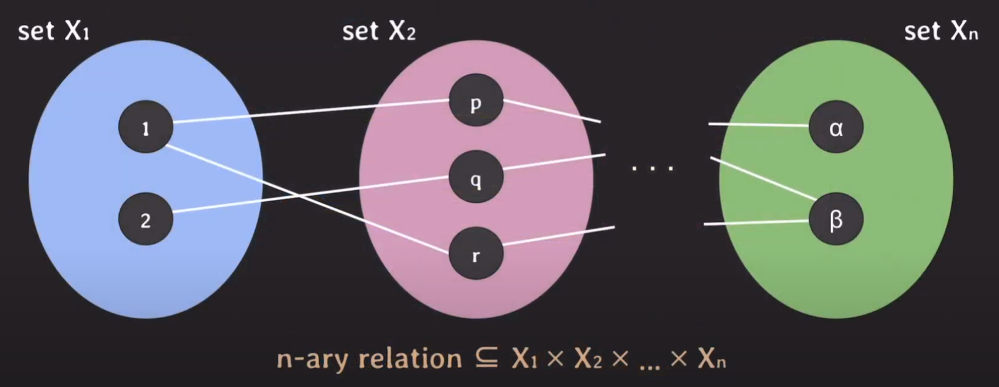
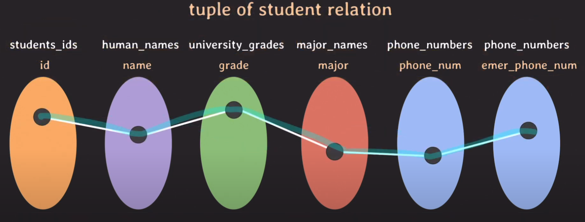
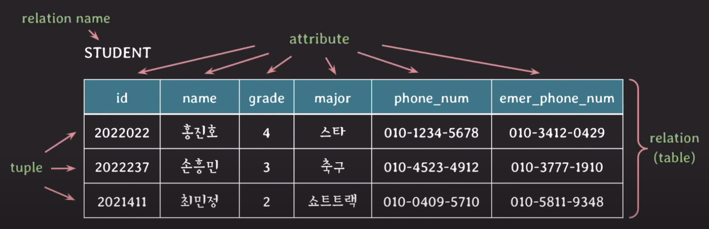

# relational data model

## Set

- 서로 다른 elements를 가지는 collection
  - **중복이 없다**
- set 안에서 순서는 중요하지 않다.
  - {1,3,11,4,7}

## 수학에서의 Relation

- 수학에서 나온 개념
- Cartesion product의 부분집합
- tuple들의 set(집합)

### Cartesion product



- set A {1,2} & set B {p,q,r} 가 존재.
- 각 set에서 element를 하나씩 골라 만들 수 있는 pair의 집합
- 수학으로는 **A \* B** 로 표현

### binary relation



- set이 2개일 때의 relation
- 총 3개의 pair가 나오는데, 이것은
- set A와 set B의 cartesion procudt의 **부분집합**

### n-ary relation



- set이 N개 일 때 relation
- 역시 n개의 집합에 대한 cartesion product의 부분집합

#### tuple

- n개의 element로 이뤄진 list
  - n-tuple
- n개의 list로 이뤄진 relation에서
- 각각의 list를 tuple이라고도 부른다.

## data model에서의 relation

### Domain

- 수학에서의 set
- **atomic value** 값들의 집합
  - 나눠질수 없는 값

### domain name

- 각 domain의 이름

### Attribute

- relational data model에서 각각의 domain이 어떤 역할을 수행하는지
- **domain이 relation에서 맡은 역할**

### tuple

- 각 attribute의 값으로 이뤄진 리스트.
- ## 일부 값은 **NULL**일 수도 있다.

### relation

- 실제 tuple의 집합 (relation state)

### relation name

- relation의 이름

### table

- relation을 relational data model 가장 잘 표현하는 방식

### 예시




## relation schema

- relation의 구조
- relation 이름과 attributes 리스트로 표기
- attributes와 관련된 contraints도 포함

```sql
STUDENT(id, name, grade)
```

### degree of relation

- relation schema에서 attributes의 갯수
- 위의 예시에서는 6개. degree 6

## relational database

- relational data model에 기반하여 구조화된 database
- 여러개의 relations로 구성된다.

### relational database schema

- relation schema들의 집합 + relation들 간의 integrity constraints 집합

## relation의 특징

- 중복된 tuple을 가질 수 없다.
  - relation이 결국 tuple들의 set인데
  - set은 중복을 허용하지 않는다.
- tuple을 식별하기 위해, attribute의 부분집합을 key로 설정한다.
  - ex) id 값을 통해 unique하게
- tuple의 순서는 중요하지 않다.
  - 정렬 기준을 마음대로
- attribute의 이름은 중복되면 안된다.
- 하나의 tuple에서 attribute의 순서는 중요하지 않다.
- attribute는 atomic 해야 한다.
  - 더이상 나눠질 수 없는.
  - composite attribute는 허용 x
    - ex ) 주소 attribute의 값이 "서울시 서초구 잠원동"일 때 이 값은 나눠질 수 있게됨.

### NULL

- 여러 의미로 쓰인다
  - 값이 존재하지 않음
  - 값이 존재하지만 아직 값을 모른다.
  - 해당 사항과 관련이 없다.
- 중의적인 의미를 가지가 때문에 최대한 쓰지 않는 것이 좋다.

### Key

#### superkey

- relation에서 tuple들을 unique하게 식별할 수 있는 attribute set
  - 하나의 attribute일수도 있고 여러 attribute의 조합일수도 있다.

#### candidate key

- 어느 한 attribute라도 제거하면 unique하게 tuple들을 식별할 수 없는 superkey
- key 혹은 minimal superkey라고 불림
- superkey의 조건을 만족할 수 있는 최소한의 attribute들의 조합으로 된 superkey라고 생각하면 된다.

#### primary key

- relation에서 tuple들을 unique하게 식별하기 위해 선택된 candidate key
- 보통 attribute 숫자가 적은 조합을 선택함. 편하기 때문에
  - id 값

#### unique key

- primary key가 아닌 나머지 candidate keys
- alternate key라고도 불림

#### foreign key

- 다른 relation의 PK를 참조하는 attribute

### Constraints

- relation들이 항상 지켜줘야 하는 제약사항

#### implicit constraints

- relational data model 자체가 가지는 제약사항
- relation은 중복되는 tuple을 가질 수 없다.
- relation 내에 같은 이름의 attribute를 가질 수 없다.

#### schema-based constraints

- DDL을 통해 schema에 직접 명시할 수 있는 constraints
- explicit constraints

##### domain constraints

- attribute의 값은 해당 attribute의 domain에 속한 값이어야 한다.
- ex) 학년이라는 attribute에 100학년이란 값을 들어갈 수 없다.

##### key constraints

- 서로 다른 tuple은 같은 값의 key를 가질 수 없다.

##### NULL value constraint

- attribute가 NOT NULL로 명시됐다면, NULL 값을 가질 수 없다.

##### entitiy integrity constraint

- primary key는 NULL일 수 없다.

##### referential integrity constraint

- FK와 PK와 도메인이 같아야 하고 PK에 없는 값을 FK가 값으로 가질 수 없다.
- FK의 값은 무조건 참조하는 해당 relation의 PK에 존재하는 값중 하나여야 한다는 뜻.

## 출처

https://www.youtube.com/watch?v=gjcbqZjlXjM&list=PLcXyemr8ZeoREWGhhZi5FZs6cvymjIBVe&index=2
