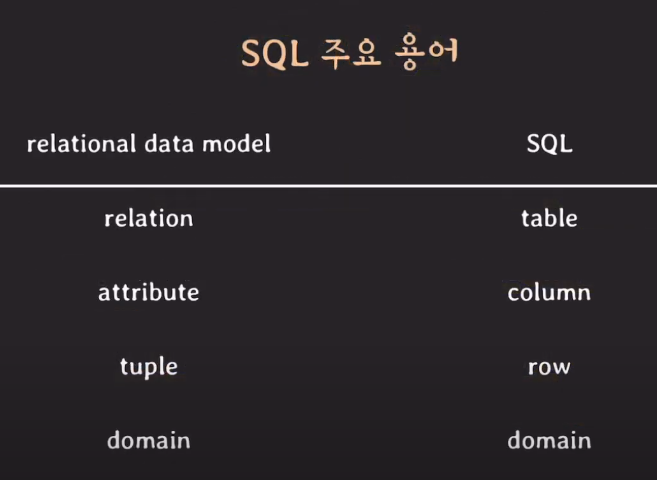

# SQL

## SQL 개념

- Structured Query Language
- RDBMS의 표준어
- 종합적인 database 언어
  - DDL + DML + VDL

## SQL 용어



- 칼같이 구분지어서 쓰이진 않는다.

### SQL에서의 relation(table)

- multiset(bag) of tuples
  - multiset -- 중복을 허용하는 set
- 중복된 tuple을 허용한다.

## SQL과 RDBMS

- SQL을 표준이지만 각 RDBMS마다 스펙이 조금씩 다르다.

### DATABASE vs SCHEMA

- MySQL에서는 같은 의미
- CREATE DATABASE aa; == CREATE SHEMA aa;
- 다른 RDBMS에서는 다른 의미

## DATABASE 명령어

```sql
SHOW DATABASES;
```

- 현재 있는 DATABASE 출력

```sql
CREATE DATABASE company(database 이름);
```

- database 생성

```sql
SELECT database();
```

- 사용하겠다고 지정한 database 출력
  - NULL인 경우 아직 지정을 안한 상태

```sql
USE company(database 이름);
```

- 사용하고자 하는 database 지정

```sql
DROP DATABASE company(database 이름);
```

- 생성한 database 삭제

## TABLE 명령어

```sql
create table DEPARTMENT(
  id INT PRIMARY KEY,
  name VARCHAR(20) NOT NULL UNIQUE,
  leader_id INT
  혹은
  PRIMARY KEY(id, name) //attribute 여러개로 PK 설정할 때는 따로 써준다.
); // 세미콜론을 붙여야 명령의 끝을 의미.
```

```sql
create table EMPLOYEE(
  id INT PRIMARY KEY,
  name VARCHAR(30) NOT NULL,
  birth_date DATE,
  sex CHAR(1) CHECK(sex in ('M','F')),
  position VARCHAR(10),
  salary INT DEFAULT 50000000,
  dept_id INT,
  FOREIGN KEY (dept_id) references DEPARTMENT(id)
  on delete SET NULL on update CASCADE,
  CHECK(salary >= 50000000)
);
```

- table 생성 명령어

- 각 라인은 각 attribute 하나
  - attribute name
  - data type
  - PK

```sql
ALTER TABLE DEPARTMENT
ADD FOREIGN KEY(leader_id) references EMPLOYEE(id) on update CASCADE on delete SET NULL;
```

### attribute data type

#### 정수

정수를 저장할 때 사용

- **TINYINT**
  - 1 byte
- **SMALLINT**
  - 2 byte
- **MEDIUMINT**
  - 3 byte
- **INT** or **INTEGER**
  - 4 byte
- **BIGINT**
  - 8 byte

#### 부동 소수점 방식(floating-point)

실수(real number)를 저장할 때 사용
고정 소수점 방식에 비해 정확하지 않다.

- **FLOAT**
  - 4 byte
- **DOUBLE** or **DOUBLE PRECISION**
  - 8 byte

#### 고정 소수점 방식(fixed-point)

실수를 정확하게 저장할 때 사용
돈처럼 정확하게 저장이 필요한 경우

- **DECIMAL** or **NUMERIC**
  - variable
  - MySQL에서는 동일하게 쓰임.
  - DECIMAL(precision,scale)
    - precision : 전체 숫자에서 몇자리
    - scale : 소수점 이하 몇자리
    - 엄격하게 precision의 자릿수만큼만 저장한 다.

#### 고정 크기 문자열

- **CHAR(n)**
  - 0 ~ 255 문자
  - 최대 몇 개의 '문자'를 가지는 문자열을 저장할지.
  - 저장될 문자열의 길이가 최대 길이보다 작으면 나머지를 빈칸으로 채워서 저장한다.
    - char(4)인 attribute에 'a\_\_\_' 이렇게 저장됨

#### 가변 크기 문자열

- **VARCHAR(n)**
  - 0 ~ 65,535
  - 저장될 문자열의 길이 만큼만 저장
  - 빈칸 안생김
  - 스토리지에의 이점은 있지만, 시간적 성능이 CHAR 보다 안좋다는 얘기가 있음
  - MySQL은 문자열의 크기가 고정되면 CHAR 권장
  - 문자열 크기가 가변적이면 VARCHAR

#### 사이즈가 큰 문자열

- **TINYTEXT TEXT MEDIUMTEXT LONGTEXT**
  - 사이즈가 큰 문자열을 저장할 때
  - medium과 long이 VARCHAR 보다 길다

#### 날짜

- **DATE**
  - 1000-01-01 ~ 9999-12-31
  - YYYY-MM-DD 연월일 형태로 저장

#### 시간

- **TIME**
  - -838:59:59 ~ 838:58:59
    - 경과된 시간을 표시할 때, 3자리로 표시 가능
    - 하루가 넘어갈 수 있기 떄문에
  - hh:mm:ss 시:분:초 형태로 저장

#### 날짜+시간

날짜와 시간을 같이 표현

- **DATETIME**
  - YYYY-MM-DD hh:mm:ss
- **TIMESTAMP**
  - UTC 표준시간 time-zone이 같이 저장됨.
  - MySQL 서버의 설정을 반영해서 표준시간대로 저장
    - 값을 반환할 때는 다시 time zone을 반영해서 반환

#### 기타

- **BINARY, VARBINARY, BLOB type**
  - 문자열이 아니라 **byte string**으로 저장
  - 보안과 관련된 암호화 키.
- **BOOLEAN**
  - MySQL에는 따로 없다.
  - TINYINT의 0과 1로 대체
- **GEOMETRY**
  - 위치 관련 정보 저장
- **JSON**
  - json 형태 데이터 저장

### Key Constraint

#### Primary Key

- tuple을 식별하기 위한 값
- 하나 이상의 attribute로 구성됨
- 중복될 수 없으며 NULL이 될 수도 없다.

#### FOREIGN KEY

- Referential Integrity constraint
- attribute가 다른 table의 PK나 Unique Key를 참조할 때 지정해주기 위해 사용
- 실제 존재하는 값이 FK로 올 수 있다.

- on delete / on update 조건
  - 참조하고 있는 값이 삭제되거나, 수정될 때 행동 조건
  - CASCADE
    - 참조값의 삭제/변경을 그대로 반영
    - 삭제되면 이 row도 삭제
  - SET NULL
    - 참조값이 삭제/변경되면 값을 NULL로 변경
  - RESTRICT
    - 참조값이 삭제/변경되는 것을 금지
  - NO ACTION
    - RESTRICT와 유사
    - MySQL에서는 완전 동일
  - SET DEFAULT
    - 참조값이 삭제/변경되면 default 값으로 변경

#### UNIQUE

- 중복된 값을 가질 수 없음.
- NULL은 중복을 허용 할 수 있다.
  - MySQL은 허용

```sql
create table PLAYER(
  .
  .
  UNIQUE(team_id, back_number) //둘 이상의 attribute의 조합에 제약을 주려면 따로 써줘야 한다.
);
```

#### NOT NULL

- 해당 attribute는 NULL을 값으로 가질 수 없음.
- attribute 하나의 레벨에서만 선언 가능
- 보통 UNIQUE랑 같이 사용됨.

### 기타 Constraint

#### DEFAULT

- attribute의 기본값을 정의

#### CHECK

- attribute의 값을 제한하고 싶을 때 사용

```sql
create table PROJECT(
  start_date DATE,
  end_date DATE,
  CHECK(start_date < end_date>) //2개의 attribute의 값을 사용할 때는 따로 적어준다.
);
```

### Constraint 이름 명시

```sql
create table TEST(
  age INT COSTRAINT age_over_20 CHECK(age>=20)
);
```

- 이름을 붙이면 어떤 constraint를 위반했는지 쉽게 파악 가능
- constraint 삭제할 때, 이름으로 쉽게 삭제 가능
- 이름 안붙이면 자동으로 'test(테이블이름)\_chk_1'로 생성됨

## 출처

https://www.youtube.com/watch?v=c8WNbcxkRhY&list=PLcXyemr8ZeoREWGhhZi5FZs6cvymjIBVe&index=3
