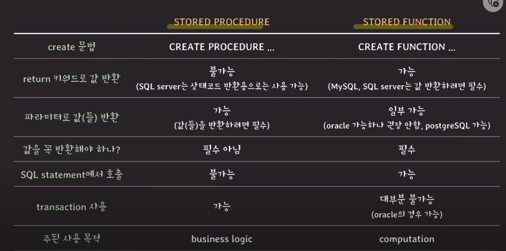
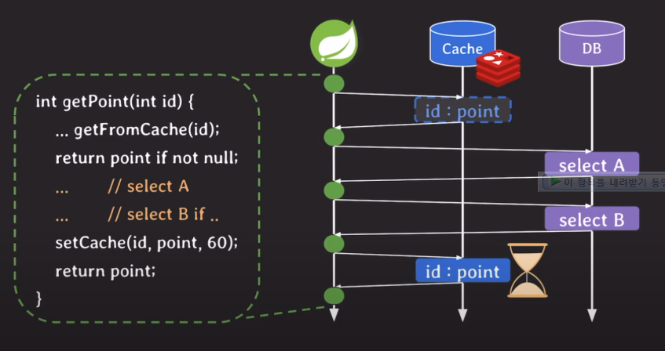

# stored procedure

- 사용자가 정의한 프로시저
- RDBMS에 저장되고 사용되는 프로시저
- 구체적인 하나의 task 수행
  - 조건문을 통해 분기처리
  - 반복문 수행
  - 에러 핸들링

## 사용법

두 정술의 곱셈 결과를 가져오는 프로시저

```sql
delimiter $$
CREATE PROCEDURE product(IN a int, IN b int, OUT result int)
BEGIN
  SET result a * b;
END
$$
delimiter ;
```

- CREATE PROCEDURE 프로시저이름
  - 프로시저 생성
- IN 파라미터이름 파라미터타입
  - input 파라미터
  - 안적어주면 기본값으로 IN이라고 인식됨.
  - IN으로 들어온 파라미터의 값은 바꿀 수 없다.
- OUT 파라미터이름 파라미터타입
  - 반환을 위한 output 파라미터
  - OUT은 반드시 적어줘야 함.
- SET out파라미터
  - 값을 out파라미터에 저장

```sql
call product(5,6,@result);

select @result;
```

- call 프로시저이름
  - 프로시저 호출
- @result
  - @ : 사용자가 정의한 변수

---

두 정수를 맞바꾸는 프로시저

```sql
CREATE PROCEDURE swap(INOUT a int, INOUT b int)
BEGIN
  SET @temp = a;
  SET a = b;
  SET b = @temp;
END
```

- INOUT
  - input이자 output인 파라미터

```sql
set @a = 5, @b = 7;
call swap(@a, @b);
select @a, @b;
```

---

각 부서별 평균 연봉을 가져오는 procedure

```sql
CREATE PROCEDURE get_dept_avg_salary()
BEGIN
  select dept_id, avg(salary)
  from employee
  group by dept_id
END
```

- select문을 작성해주면 따로 IN, OU 파라미터가 없어도 됨.

```sql
call get_dept_avg_salary();
```

---

사용자가 프로필 닉네임을 바꾸면 이전 닉네임을 로그에 저장하고 새 닉네임으로 업데이트하는 프로시저

```sql
CREATE PROCEDURE change_nickname(user_id INT, new_nick varchar(30))
BEGIN
  insert into nickname_logs (
    select id, nickname, now()
    from users
    where id = user_id
  );
  update users
  set nickname = new_nick
  where id = user_id;
END

call change_nickname(1, 'zidane');
```

---

## stored function vs procedure



## 3 tier architecture에서 stored procedure의 의미

- stored procedure는 RDBMS에 저장되고 사용된다.
- Data tier에서 사용
- 주로 비즈니스 로직 구현을 위해 프로시저를 쓴다.
- 즉, data tier에도 비즈니스 로직이 존재하게 된다.

## 장/단점

- application에 대해 transparent 하다.
  - 비즈니스 로직이 담긴 프로시저가 data tier에 있으면 내용을 수정해도, 이 프로시저를 호출하는 application들의 서버를 내렸다 올렸다 하지 않아도 됨.
- 네트워크 트래픽을 줄여서 응답 속도를 향상시킬 수 있다.
  - 애플리케이션에 쿼리 여러개를 날리면 순차적으로 하나씩 DB와 네트워크를 연결해야 함.
  - 만약. 이 쿼리들이 프로시저 안에 있게되면 프로시저를 한번 호출하는 것으로 끝낼 수 있다.
- 여러 서비스에서 재사용 가능하다.
  - 같은 DB를 보는 여러 애플리케이션 서버가 있더라고 하나의 프로시저로 처리가능.
- 민감한 정보에 대해 접근을 제한할 수 있다.
  - 개발자에게 프로시저에 접근을 허용해서 로직을 구현하게 함.

## 일반적으로 stored procedure를 쓰기 조심스러운 이유

- 유지 관리 보수 비용이 커진다.
  - 비즈니스 로직이 분산된다.
  - 버전관리를 2곳에서 해야한다.
  - 프로시저 문법을 추가로 알아야 한다.
- DB 서버를 추가하는 것은 복잡하다.
  - 클라이언트의 트래픽이 결국엔 DB로 온다.
  - 이때, 여러대의 애플리케이션 서버가 연결되있고, 비즈니스 로직도 수행해야 하기 때문에
  - DB의 CPU 사용량이나 메모리 사용량이 logic tier보다 높아진다.
  - RDBMS의 사용량이 90%를 찍게된다.
  - DB서버를 추가해봤자 데이터를 복제해야 하는데 시간이 걸린다.
  - 애플리케이션 서버는 서버 긴급 투입이 용이하다.
- 언제나 transparent하지는 않다.
  - 프로시저 이름을 바꾸게 되면 애플리케이션도 다 바꿔줘야 한다.
- transparent가 무조건 좋은 것이 아니다.
  - 프로시저의 내용을 바꿨을 때 버그가 생김.
  - rollback을 해도 버그일 때 왔던 전체 요청들은 비정상적으로 응답을 하게됨.
  - 만약 logic tier에 있었다면 서버의 개수만큼 나눠서 비정상 응답이 나갔을 것임.
- 재사용이 가능하다는 것의 단점
- 비즈니스 로직을 소스코드에 두고도 응답속도를 향상 시킬 수 있다.
  - insert와 update를 동시에 진행한다면?
  - threadpool 이나 nonblock I/O를 사용해서 동시에 DB에 요청을 보내면 전체 응답시간이 줄어든다.
  - 서로 다른 select를 순차적으로 해야할 때
    - 레디스같은 캐시를 쓰면 된다.
    - 
    - getFormCache() : 캐시에 있는지 먼저 확인. 없으면 이후 로직.
    - setCache() : 결과의 point를 캐쉬에 넣어줌. 라이프타임도 같이
    - 추후, 같은 id에 대해 요청을 하면 바로 캐시에서 리턴하게 됨. 응답속도 빨라짐. DB 부하도 줄일 수 있음.

## 출처

https://www.youtube.com/watch?v=SOLm-GXFzG8&list=PLcXyemr8ZeoREWGhhZi5FZs6cvymjIBVe&index=12
