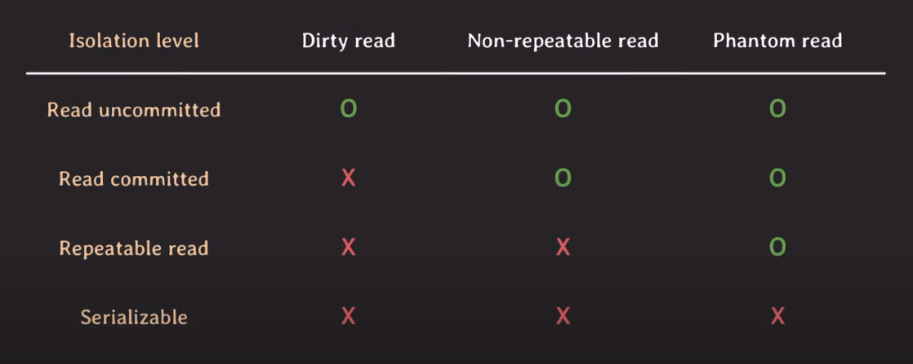

# isolation level

## 이상한 현상들

- 이상한 현상들은 일어나지 않는게 좋다.
- 하지만, 동시에 제약사항이 많아져서 동시 처리 가능한 트랜잭션 수가 줄어든다.
- 결국 DB의 전체 **처리량(throughout)**이 하락한다.
- 일부 이상한 현상들은 허용하는 단계별 level을 만들어서 개발자가 선택하게 하자

### dirty read

- commit되지 않은 변화를 읽음
- **unrecoverable schedule**가 유사

### non-repeatable read (fuzzy read)

- 같은 데이터의 값이 달라짐

### phantom read

- 없던 데이터가 생김

## isolation level

- 1992년 11월 SQL 표준에서 정의됨.

### 비판

- standard SQL 92 isolation level 비판 논문
- 3가지 이상한 현상의 정의가 모호
- 이상 현상은 3가지 외에도 많다.
  - **dirty write**
    - commit이 안된 데이터를 write
    - rollback 시 정상적인 recovery는 매우 중요하기 때문에, 모든 isolation level에서 dirty write를 허용하면 안된다.
  - **lost update**
    - 업데이트를 덮어씀
  - **Read skew**
    - 데이터가 불일치한 읽기
  - **write skew**
    - 데이터가 불일치한 쓰기
- 상업적인 DBMS에서 사용하는 방법을 반영해서 isolation level을 반영하지 않았다.
  - **snapshot isolation**
    - 어떻게 concurrency control을 구현할지에 기반한 level
    -  

### serializable

- 이상한 현상이 아예 일어나지 않는 level
