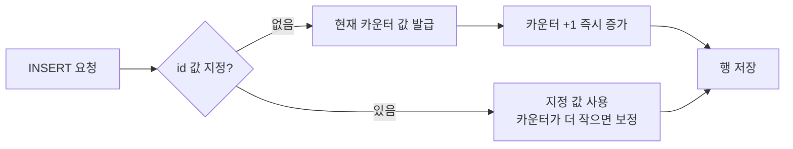

# Auto Increment (자동 증가 컬럼)

> 최종 업데이트: 2026-05-19 | 기준: SQL:2003 IDENTITY 표준 / MySQL 8.x · PostgreSQL 16 · Oracle 23 · SQL Server 2022

## 개념

**Auto Increment**는 새 행이 INSERT될 때 특정 정수 컬럼 값을 DB가 자동으로 +1 발급해주는 기능이다. 값을 직접 지정하지 않아도 DB가 내부 카운터를 들고 1, 2, 3... 순서로 채워주며, 주로 **중복 없는 기본키(PK)를 손쉽게 만들기 위해** 쓴다.

> 비유하자면 은행 창구의 "번호표 발급기". 손님이 올 때마다 다음 번호를 자동으로 뽑아주고, 한 번 뽑힌 번호는 다시 안 나온다. 누가 번호표를 뽑고 그냥 가버려도(롤백) 그 번호는 비어버리는 것까지 똑같다.

```sql
CREATE TABLE users (
    id   BIGINT       NOT NULL AUTO_INCREMENT,  -- MySQL 문법
    name VARCHAR(50),
    PRIMARY KEY (id)
);

INSERT INTO users (name) VALUES ('철수');  -- id = 1
INSERT INTO users (name) VALUES ('영희');  -- id = 2
```

## 배경/역사

- 초기 SQL 표준에는 없던 기능이라 DB 벤더마다 제각각 구현했다(MySQL `AUTO_INCREMENT`, SQL Server `IDENTITY`, Oracle `SEQUENCE` 등).
- **SQL:2003** 표준에서 `GENERATED ... AS IDENTITY` 구문이 도입되어 표준화되었고, PostgreSQL(10+)·Oracle(12c+)·SQL Server·H2 등이 이 표준 문법을 지원한다. MySQL은 여전히 비표준 `AUTO_INCREMENT`를 사용한다.
- 그래서 "개념은 하나, 문법·내부 구현은 DB마다 다름"이 이 주제의 핵심이다.

## DB별 문법

| DB | 문법 | 비고 |
|---|---|---|
| MySQL / MariaDB | `AUTO_INCREMENT` | 테이블당 1개, PK/UNIQUE 컬럼이어야 함 |
| PostgreSQL | `GENERATED ALWAYS AS IDENTITY` 또는 `SERIAL` | `SERIAL`은 구식, 신규는 IDENTITY 권장 |
| Oracle | `GENERATED AS IDENTITY` (12c+) 또는 `SEQUENCE` | 12c 이전엔 시퀀스+트리거 |
| SQL Server | `IDENTITY(시작값, 증가폭)` | 예: `IDENTITY(1,1)` |
| SQLite | `INTEGER PRIMARY KEY` (rowid 자동) / `AUTOINCREMENT` | [SQLite 문서](../SQLite/SQLite.md) 참고 |
| H2 | `AUTO_INCREMENT` 또는 `IDENTITY` | 둘 다 지원 |

```sql
-- PostgreSQL (표준 IDENTITY)
CREATE TABLE users (
    id   BIGINT GENERATED ALWAYS AS IDENTITY PRIMARY KEY,
    name VARCHAR(50)
);

-- SQL Server (시작 100, 증가폭 10)
CREATE TABLE users (
    id   BIGINT IDENTITY(100, 10) PRIMARY KEY,
    name VARCHAR(50)
);

-- Oracle (시퀀스 직접 사용)
CREATE SEQUENCE seq_users START WITH 1 INCREMENT BY 1;
INSERT INTO users (id, name) VALUES (seq_users.NEXTVAL, '철수');
```

## DB는 "다음 번호"를 어떻게 알고 있는가

가장 자주 헷갈리는 부분이다. **"다음에 발급할 값"을 어디에 저장하느냐는 DB마다 다르다.** 크게 두 갈래로 나뉜다.

> 비유하자면, 번호표 발급기의 카운터가 ① 기계 안에 숨어 있느냐(MySQL식), ② 옆에 따로 떼어낼 수 있는 별도 부품으로 달려 있느냐(PostgreSQL·Oracle식)의 차이다.

### ① 테이블에 딸린 내부 카운터형 — MySQL, SQL Server

별도 객체가 아니라 **테이블 메타데이터에 붙은 카운터 하나**를 들고 다닌다. 사용자가 직접 조회할 객체는 없다.

- **MySQL 8.0 미만**: 카운터가 **메모리에만** 존재. 서버 재시작 시 사라지고, 첫 접근 시 `SELECT MAX(id)+1`로 **재계산**해 복원 → 맨 끝 행을 지우고 재시작하면 그 번호가 재사용되는 현상이 있었다.
- **MySQL 8.0+ (커뮤니티 InnoDB)**: 카운터 값이 **redo log에 영속화**되어 재시작해도 보존된다. MAX 재계산을 하지 않으므로 삭제 후 재시작해도 번호가 돌아오지 않는다.
- **SQL Server**: `IDENTITY` 값도 테이블 메타데이터에 보관하며 `DBCC CHECKIDENT`로 확인·조정한다.

> ⚠️ **Aurora MySQL 예외 (중요)**: 위 "8.0+ redo log 영속화"는 **커뮤니티 InnoDB 한정**이다. Aurora는 InnoDB redo log를 자체 분산 스토리지로 대체했기 때문에 그 영속화 메커니즘이 **존재하지 않는다**. Aurora MySQL은 **3.x(8.0 호환)에서도** auto_increment 카운터를 **메모리에만** 들고, 재시작·페일오버 후 첫 INSERT 때 `SELECT MAX(id)+1`로 **재계산**한다 — 사실상 커뮤니티 5.7과 같은 방식이다.
>
> - 정상 운영 중에는 정상 증가하며, 행이 있고 최상위 id를 안 지웠으면 `MAX+1`은 정확해 무해하다.
> - **터지는 케이스**: `최상위 id 행 DELETE → 재시작/페일오버 → 새 INSERT` 순서일 때 카운터가 **퇴행(regress)** 해, 그 값이 복제본·자식 FK·앱 캐시 등에 살아있으면 **`Duplicate entry` (중복 PK)** 발생. Aurora는 페일오버가 잦아 일반 MySQL보다 더 잘 노출된다.
> - **대응**: 페일오버/재시작 직후 민감 테이블에 `ALTER TABLE t AUTO_INCREMENT = (SELECT MAX(id)+1)` 로 카운터를 명시 보정(AWS 권장 워크어라운드). 충돌이 치명적인 테이블은 DB 채번 대신 **UUIDv7/ULID** 또는 **하이브리드(내부 BIGINT PK + 외부 노출용 UUID UNIQUE 컬럼)** 로 전환한다.
> - AWS는 이 "MAX+1 재계산" 방식을 버그가 아닌 **의도된 설계**로 유지 중이다(redo log가 구조적으로 없으므로). 출처: [AWS Migration Playbook — Identity and sequences](https://docs.aws.amazon.com/dms/latest/sql-server-to-aurora-mysql-migration-playbook/chap-sql-server-aurora-mysql.tsql.identitysequences.html), [Percona — Persistence of autoinc fixed in MySQL 8.0](https://www.percona.com/blog/persistence-of-autoinc-fixed-in-mysql-8-0/)

### ② 별도 SEQUENCE 객체형 — PostgreSQL, Oracle

"다음 값"을 **눈에 보이는 독립 객체(시스템 카탈로그/데이터 딕셔너리 항목)** 에 저장한다. 직접 조회·조작이 가능하다.

```sql
-- PostgreSQL: IDENTITY/SERIAL 컬럼을 만들면 users_id_seq 시퀀스가 함께 생성됨
SELECT last_value, is_called FROM users_id_seq;  -- 현재 카운터 상태가 그대로 보임
SELECT nextval('users_id_seq');                  -- 다음 값 발급 + 카운터 증가

-- Oracle: USER_SEQUENCES 뷰로 시퀀스 상태 조회
SELECT sequence_name, last_number FROM user_sequences;
```

성능을 위해 시퀀스는 보통 값 여러 개를 미리 받아두는 **캐시(`CACHE n`)** 를 쓴다. 캐시 미사용분은 버려지므로 캐시가 클수록 번호 구멍이 커진다.

| DB | "다음 번호" 저장 위치 |
|---|---|
| MySQL 8.0+ (커뮤니티) | 테이블 메타 카운터 (메모리 + redo log 영속화) |
| MySQL 8.0 미만 | 메모리 카운터만 (재시작 시 `MAX(id)+1` 재계산) |
| **Aurora MySQL (3.x 8.0 호환 포함)** | **메모리 카운터만** — 재시작/페일오버 시 `MAX(id)+1` 재계산 (InnoDB redo log 영속화 미적용 → 퇴행·중복 PK 위험) |
| PostgreSQL | **별도 SEQUENCE 객체** (시스템 카탈로그) |
| Oracle | **별도 SEQUENCE 객체** (데이터 딕셔너리) |
| SQL Server | 테이블 메타 카운터 / 또는 별도 SEQUENCE 객체 |

공통점은 어느 방식이든 **카운터가 트랜잭션과 분리되어 동작**한다는 것이다 — 그래서 롤백해도 값이 돌아오지 않는다.

## 동작 원리

INSERT가 들어오면 현재 카운터 값을 부여하고 **즉시** 카운터를 증가시킨다. 이 증가는 트랜잭션 커밋/롤백과 무관하다.



## 발급 값 조회

INSERT 직후 방금 발급된 키 값을 알아야 하는 경우가 많다(예: 자식 테이블에 FK로 넣기).

```sql
-- MySQL
INSERT INTO users (name) VALUES ('철수');
SELECT LAST_INSERT_ID();

-- PostgreSQL
INSERT INTO users (name) VALUES ('철수') RETURNING id;

-- SQL Server
INSERT INTO users (name) VALUES ('철수');
SELECT SCOPE_IDENTITY();
```

> JPA/MyBatis 같은 ORM은 `@GeneratedValue(strategy = IDENTITY)` / `useGeneratedKeys="true"`로 이 과정을 자동 처리해 엔티티 객체에 발급된 id를 채워준다.

## 백엔드 개발자가 주의할 점

연속성을 절대 가정하면 안 된다. 발급 값은 **단조 증가(monotonic)는 보장하지만, 빈틈 없는 연속(1,2,3,4...)은 보장하지 않는다.**

- **삭제해도 안 메워짐**: `id=2`를 DELETE해도 다음은 3으로 진행. 구멍이 영구적으로 남는다.
- **롤백 시 건너뜀**: INSERT 후 트랜잭션을 롤백해도 카운터는 이미 올라가 있어 그 번호는 영영 비게 된다. → "id 최댓값 = 총 행 수"라고 추정하면 안 됨. 개수는 `COUNT(*)`로 세야 한다.
- **MySQL `innodb_autoinc_lock_mode`**: 대량 INSERT 시 채번 락 동작 방식이 모드(0/1/2)에 따라 다르다. 기본값 2(interleaved)에서는 멀티 INSERT 간 값이 인터리빙되어 더더욱 비연속적이 된다.
- **노출 위험**: 순차 ID를 URL(`/users/1`, `/users/2`)에 그대로 쓰면 전체 데이터 규모와 증가 속도가 외부에 추측된다(IDOR·정보 노출). 외부 식별자는 UUID 등으로 분리하는 것을 고려한다.

## 분산 환경에서의 한계와 대안

DB 단일 카운터는 **단일 인스턴스 안에서만** 유효하다. 샤딩·다중 쓰기 노드 환경에서는 노드 간 ID가 충돌하므로 그대로 쓸 수 없다.

| 전략 | 방식 | 특징 |
|---|---|---|
| 노드별 offset/step | 노드A는 1,3,5… 노드B는 2,4,6… | 간단하지만 노드 추가 시 재설계 부담 |
| UUID / ULID | 애플리케이션에서 랜덤 생성 | 충돌 없음, 단 인덱스 단편화·정렬성 약함(ULID는 시간순) |
| Snowflake 류 | `타임스탬프 + 노드ID + 시퀀스` 비트 조합 | 64bit 정수, 시간순 정렬, 분산 환경 표준적 선택 |
| 중앙 시퀀스 서버 | 별도 채번 서버(예: Redis INCR, 티켓 서버) | 단순하나 채번 서버가 SPOF/병목 가능 |

> 정리: **단일 DB·소규모면 Auto Increment로 충분**, 분산·대용량이면 Snowflake류 또는 ULID를 검토한다.

## Auto Increment vs UUID — PK 선택

대규모 트래픽에서 PK 선택은 단순 취향이 아니다. 핵심 전제: **InnoDB(= Aurora MySQL)에서 PK는 클러스터링 인덱스**다. PK가 ① 데이터의 물리 정렬 순서를 정하고 ② 모든 보조 인덱스에 행 포인터로 함께 저장된다. 그래서 PK 한 컬럼이 INSERT 패턴·인덱스 크기·캐시 효율 전부를 좌우한다.

> 비유: PK는 도서관의 "책 꽂는 규칙". 순번대로 꽂으면(auto increment) 새 책은 항상 맨 끝에만 꽂으면 되지만, 무작위 ISBN으로 꽂으면(랜덤 UUID) 매번 서가 중간을 비집고 끼워 넣어야 한다.

### 저장 크기

| | Auto Increment (BIGINT) | UUID |
|---|---|---|
| 키 크기 | **8바이트** | 16바이트(`BINARY(16)`) / 36바이트(`CHAR(36)`, 최악) |
| 보조 인덱스 영향 | 작음 | 인덱스마다 비대 → 메모리·디스크·캐시 전부 불리 |

UUID를 `CHAR(36)`로 저장하는 게 가장 흔한 실수다. 반드시 `BINARY(16)`(+ MySQL 8 `UUID_TO_BIN()`)로 저장한다.

### INSERT 성능 (대규모 쓰기)

- **Auto Increment**: 항상 B+Tree 맨 오른쪽 끝에 **순차 append** → 페이지 분할 거의 없음, 충전율 높음, 순차 I/O. **단일 노드 쓰기 최강.** 단, 그 끝 페이지에 동시 INSERT가 몰리면 tail hotspot(리프 래치 경합).
- **랜덤 UUIDv4**: 값이 트리 전 구간에 흩뿌려짐 → 잦은 페이지 분할, 낮은 충전율, 단편화, 랜덤 I/O, 버퍼풀 thrash. **테이블이 커질수록 쓰기 성능 붕괴 — 대규모에서 최악.**
- **시간순 UUIDv7 / ULID**: 앞부분이 타임스탬프라 거의 순차 → auto increment에 근접한 INSERT 성능 + 전역 유니크. **현대 권장 절충안.**

### SELECT 성능 (대규모 읽기)

- **Auto Increment / 시간순 ID**: 최신 데이터가 물리적으로 뭉쳐 있어 "최근 N건"·범위 스캔·페이지네이션이 자연스럽고 빠름. 키가 작아 페이지당 행 수↑, 캐시 적중률↑.
- **랜덤 UUID**: 단건 조회는 무난하나 범위/시간 쿼리·페이지네이션이 비자연 → 별도 `created_at` 인덱스 필요. 큰 키로 조인 비교 CPU·인덱스 메모리 불리.

### 안정성·운영

| 항목 | Auto Increment | UUID |
|---|---|---|
| 전역 유니크 | ✗ (노드 내) | ✓ |
| 분산/샤딩/멀티마스터 | 충돌, 조율 필요 | 충돌 없음, 병합·오프라인 생성 자유 |
| ID 확보 시점 | DB INSERT 후 | 앱에서 INSERT 전 미리 생성(왕복·중앙 채번 경합 없음, 멱등성 유리) |
| Aurora 재시작/페일오버 | 카운터 `MAX+1` 재계산 → 퇴행·중복 PK 위험 (위 Aurora 예외 참조) | 해당 문제 없음 |
| 열거/정보 노출 | `/users/1,2,3…` 추측 가능(IDOR) | 추측 불가 |

### 결론 — 상황별 권장

| 상황 | 권장 |
|---|---|
| 단일 DB, 쓰기 폭주, 내부용 PK | **Auto Increment (BIGINT)** — 성능 최강 |
| 분산/샤딩/멀티마스터, 페일오버 잦음, 외부 노출 | **UUIDv7 / ULID** (`BINARY(16)`) — 성능 근접 + 안정 |
| 랜덤 UUIDv4를 PK로 | **대규모에서 지양** (단편화로 붕괴) |
| 실무 절충 (가장 흔한 베스트) | **내부 PK = BIGINT auto increment** + **외부 노출 `public_id` = UUID/ULID UNIQUE 컬럼**. 작고 빠른 내부 키 + 비열거·안정 외부 키, 두 장점만 취함 |

> Aurora MySQL + 잦은 페일오버 환경이라면, 충돌이 치명적인 테이블만 시간순 UUID로 전환하거나 위 하이브리드 패턴을 쓰면 카운터 퇴행 위험을 구조적으로 제거하면서 내부 성능을 유지할 수 있다.

## 관련 문서

- [SQL CREATE](sql-create.md) — 테이블/컬럼 정의 기초
- [SQL INSERT/UPDATE/DELETE](sql-insert-update-delete.md)
- [관계형 데이터 모델](relational-data-model.md) — 기본키 개념
- [데이터베이스 트랜잭션](database-transaction.md) — 롤백과 카운터 독립성
- [SQLite](../SQLite/SQLite.md) — rowid / AUTOINCREMENT 동작
