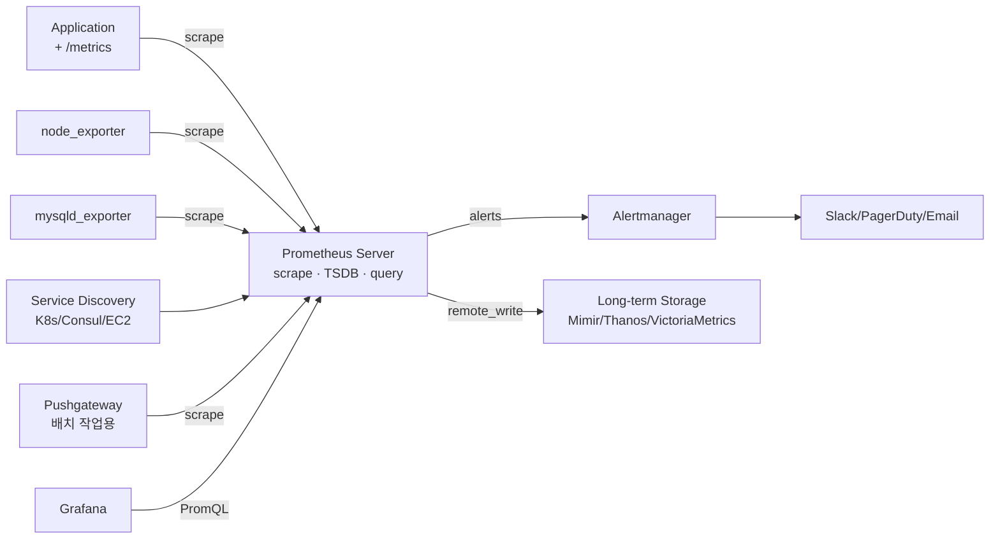
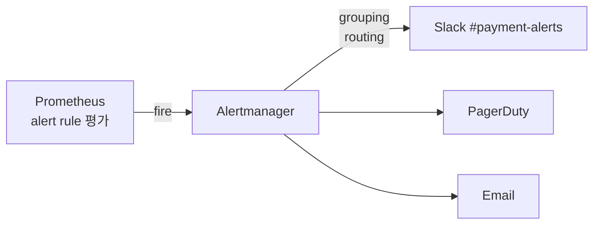

# Prometheus

> 최종 업데이트: 2026-05-03 | Prometheus 3.x + OpenMetrics·OTLP 수신 기준

## 개념

Prometheus는 **오픈소스 시계열 메트릭 모니터링·알림 시스템**이다. Pull 방식으로 타깃에서 메트릭을 주기적으로 수집·저장하고, **PromQL**이라는 자체 쿼리 언어로 분석·알림을 한다.

> 비유: 회사의 정기 점검자. 정해진 시간마다 모든 부서(타깃)에 들러 "지금 상태 어때?"라고 묻고 그 답을 장부에 기록. 누가 답을 안 하면 "그 부서 죽었구나" 자동 인지. 평소처럼 일하지 않고 일정 형식의 답을 받기만 하면 됨.

핵심 명제: **Pull 방식 + 다차원 라벨 + PromQL** 세 가지 결합. 단일 바이너리·의존성 없음·자체 TSDB로 운영 단순.

## 배경/역사

- **2012** **Matt T. Proud**·**Julius Volz** 등이 SoundCloud에서 개발 시작 — Google의 내부 모니터링 시스템 **Borgmon**에서 영감
- **2015-01** Prometheus 1.0 발표
- **2016-05** **CNCF 가입** — Kubernetes에 이은 **CNCF의 두 번째 프로젝트**
- **2017** Prometheus 2.0 — 새 TSDB 엔진 (Fabian Reinartz가 주도). 디스크 효율·쿼리 속도 대폭 향상
- **2018-08** **CNCF 졸업** — Kubernetes에 이어 두 번째
- **2019** OpenMetrics 표준 분리 (Prometheus 노출 포맷 기반 CNCF 표준화)
- **2024-11** **Prometheus 3.0** — UTF-8 라벨, **OTLP(OpenTelemetry) 수신**, 빠른 PromQL, Native Histogram 안정화

> Borgmon은 Google 내부에서만 사용되던 시스템. SRE 책 "Monitoring Distributed Systems" 챕터에 그 사상이 기술됨. **Prometheus는 Borgmon의 오픈소스 정신적 후계자**다.

## 핵심 특징

| 특징 | 설명 |
|---|---|
| **Pull 기반** | 서버가 타깃에서 메트릭을 끌어옴 (vs Push) |
| **다차원 데이터 모델** | metric name + key-value 라벨 |
| **PromQL** | 강력한 시계열 쿼리 언어 |
| **자체 TSDB** | 외부 DB 없이 단일 바이너리로 동작 |
| **Service Discovery** | K8s, Consul, EC2, DNS, 파일 등 자동 타깃 발견 |
| **HTTP/text 노출** | 누구나 `/metrics` 엔드포인트 노출하면 끝. 단순 표준 |
| **Federation** | 여러 Prometheus 인스턴스 계층 연결 |
| **No clustering** | 단일 노드 설계. HA는 2개 인스턴스 병렬 실행 |

## 아키텍처



| 컴포넌트 | 역할 |
|---|---|
| **Prometheus Server** | scrape·저장·쿼리 (단일 바이너리) |
| **Exporters** | "메트릭 노출 변환기" — 메트릭 없는 시스템(MySQL·Redis·Linux 등)을 Prometheus 포맷으로 노출 |
| **Pushgateway** | 짧은 배치 작업용. 보통 사용 자제 |
| **Alertmanager** | 알림 라우팅·그룹화·중복 제거·silencing |
| **Service Discovery** | 동적 환경에서 타깃 자동 발견 |
| **Web UI / Grafana** | 쿼리·시각화 (기본 UI는 빈약, Grafana 권장) |

## Pull vs Push

| 방식 | Prometheus | Push 시스템 (StatsD 등) |
|---|---|---|
| 메트릭 흐름 | 서버가 **끌어옴** | 클라이언트가 **밀어넣음** |
| 헬스체크 | scrape 실패 = 타깃 죽음. 자동 인지 | 별도 헬스체크 필요 |
| 디버깅 | `/metrics` URL 호출로 즉시 확인 | 클라이언트가 보낸 후만 알 수 있음 |
| 짧은 작업 | 부적합 (작업 끝나면 scrape 못함) | 적합 |
| 서버리스/Lambda | 부적합 → Pushgateway 필요 | 적합 |
| 대규모 환경 | 서버 부담 (수많은 scrape) | 클라이언트 부담 분산 |

> Prometheus는 Pull을 선택한 이유: **"누가 살아있는지 자동 안다"**가 모니터링의 핵심. 짧은 작업엔 **Pushgateway**로 보완 (단, 남용 자제).

## 데이터 모델

**metric name + 라벨**의 다차원 구조.

```
http_requests_total{method="POST", status="200", handler="/api/orders"}  1027
http_requests_total{method="GET",  status="500", handler="/api/login"}   3
```

→ 같은 `http_requests_total`이라도 라벨 조합마다 **별도 시계열**(time series). 라벨로 자유롭게 슬라이스·집계.

## 4가지 메트릭 타입

| 타입 | 의미 | 예시 |
|---|---|---|
| **Counter** | 단조 증가 (리셋만 가능) | 요청 수, 에러 수, 처리한 바이트 |
| **Gauge** | 임의로 오르락내리락 | CPU 사용률, 메모리, 큐 크기 |
| **Histogram** | 분포 — **버킷별 카운터**들 | 응답시간 분포, payload 크기 |
| **Summary** | 분포 — **클라이언트 측 quantile** 계산 | p95·p99 응답시간 |

```
# Counter
http_requests_total 1027

# Gauge  
memory_used_bytes 8.7e+09

# Histogram (자동 _bucket·_sum·_count 생성)
http_request_duration_seconds_bucket{le="0.1"} 24054
http_request_duration_seconds_bucket{le="0.5"} 33444
http_request_duration_seconds_bucket{le="+Inf"} 33598
http_request_duration_seconds_sum   88425.2
http_request_duration_seconds_count 33598
```

> **Histogram vs Summary**: Histogram이 거의 항상 더 적합. **Summary는 합산·재집계 불가**(quantile은 평균낼 수 없음). Histogram은 `histogram_quantile()`로 서버 측 계산 가능.

## PromQL — 시계열 쿼리 언어

### Instant vs Range Vector

| 구분 | 의미 | 예시 |
|---|---|---|
| **Instant vector** | 한 시점의 값들 | `http_requests_total` |
| **Range vector** | 시간 범위의 값들 | `http_requests_total[5m]` |
| **Scalar** | 단일 숫자 | `42` |

### 자주 쓰는 함수

```promql
# 분당 요청 수 증가율 (Counter는 항상 rate로!)
rate(http_requests_total[5m])

# 합산 (라벨 그룹화)
sum by (status) (rate(http_requests_total[5m]))

# 5xx 에러율
sum(rate(http_requests_total{status=~"5.."}[5m]))
  / sum(rate(http_requests_total[5m]))

# Histogram의 p95 응답시간
histogram_quantile(0.95,
  sum by (le, path) (rate(http_request_duration_seconds_bucket[5m]))
)

# 1분간 증가량 (재시작 보정 자동)
increase(http_requests_total[1m])

# 평균 ↔ 합산
avg by (instance) (cpu_usage_percent)
sum without (instance) (memory_used_bytes)
```

### 매처 (label matchers)

```promql
{method="GET"}        # 같음
{method!="POST"}      # 다름
{method=~"GET|POST"}  # 정규식
{method!~"DELETE"}    # 정규식 부정
```

## Exporter — 메트릭 노출 변환기

메트릭 없는 시스템에 `/metrics` 엔드포인트를 추가해주는 사이드카.

| Exporter | 대상 |
|---|---|
| **node_exporter** | Linux/macOS 시스템 메트릭 (CPU·메모리·디스크·네트워크) |
| **cAdvisor** | 컨테이너 런타임 메트릭 |
| **kube-state-metrics** | Kubernetes 객체 상태 |
| **blackbox_exporter** | HTTP/TCP/DNS/ICMP 헬스체크 (외부에서 probe) |
| **mysqld_exporter / postgres_exporter** | DB 메트릭 |
| **redis_exporter** | Redis |
| **JMX exporter** | Java JMX → Prometheus |
| **kafka_exporter** | Kafka |
| **nginx-prometheus-exporter** | Nginx |

> **1000+ exporter**가 커뮤니티에 존재. 직접 만드는 것보다 먼저 검색하는 게 답.

## Service Discovery

동적 환경에서 타깃을 자동으로 찾아 scrape.

| SD 방식 | 사용처 |
|---|---|
| **Kubernetes** | K8s 환경 표준. Pod 라벨로 자동 scrape |
| **Consul** | Consul 서비스 메시 |
| **EC2** | AWS 인스턴스 자동 발견 |
| **DNS** | SRV 레코드 기반 |
| **File-based** | JSON/YAML 파일 갱신으로 |
| **Static** | 설정 파일에 직접 명시 |

```yaml
# K8s Service Discovery 예시
scrape_configs:
  - job_name: 'kubernetes-pods'
    kubernetes_sd_configs:
      - role: pod
    relabel_configs:
      - source_labels: [__meta_kubernetes_pod_annotation_prometheus_io_scrape]
        action: keep
        regex: true
```

## Alertmanager

알림 라우팅·그룹화·중복 제거 전담 서버. Prometheus와 별도 프로세스.



| 기능 | 설명 |
|---|---|
| **Grouping** | 같은 종류 알림 묶어 한 번에 보냄 (alert spam 방지) |
| **Routing** | 라벨·심각도별로 다른 채널로 |
| **Inhibition** | 상위 알림 발생 시 하위 알림 억제 |
| **Silence** | 점검 시간 등 일시 음소거 |
| **Receivers** | Slack·PagerDuty·Email·Webhook·Opsgenie 등 |

## 라벨 cardinality — 가장 큰 함정

Prometheus의 시계열 수 = **유니크한 (metric name, label set) 조합 수**. 폭발하면 메모리 폭발 + 쿼리 폭발.

| 라벨에 넣어도 OK | 라벨에 넣으면 안 됨 |
|---|---|
| `service`, `namespace`, `cluster`, `env` | `user_id`, `request_id`, `trace_id` |
| `method`, `status_code`, `handler` (path는 정형화 후) | 무한대 cardinality (UUID, timestamp 등) |
| `region`, `zone`, `instance` | URL 전체 (path parameter 포함) |

```
# Bad — path에 ID가 그대로 들어감
http_requests_total{path="/api/orders/12345"}
http_requests_total{path="/api/orders/12346"}
...
# 시계열 수가 주문 ID 수만큼 증가 → 폭발

# Good — path를 라우트 패턴으로 정형화
http_requests_total{path="/api/orders/:id"}
```

> **시계열 수 100만 개 이상 = 위험**. 1000만 개 = OOM. Loki와 정확히 같은 함정.

## 한계와 보완

| 한계 | 보완 |
|---|---|
| **단일 노드** | HA = 2개 인스턴스 병렬 실행 + Grafana에서 dedup |
| **로컬 TSDB만** (장기 보관 어려움) | **remote_write**로 Mimir·Thanos·Cortex·VictoriaMetrics에 전송 |
| **Pull만** (짧은 작업 부적합) | Pushgateway로 보완 (남용 자제) |
| **Push 기반 메트릭 표준 부재** | OpenTelemetry로 보완 (Prometheus 3.0부터 OTLP 수신 가능) |
| **자체 UI 빈약** | **Grafana**로 시각화 (사실상 표준) |
| **로그·트레이스 미지원** | Loki(로그) + Tempo(트레이스)로 분담 |

### Long-term Storage 비교

| 솔루션 | 운영사 | 특징 |
|---|---|---|
| **Mimir** | Grafana Labs | LGTM 스택의 M. Cortex 기반 |
| **Thanos** | Improbable | Sidecar/Receiver 모드 |
| **Cortex** | (CNCF) | Mimir의 전신, 멀티 테넌시 강함 |
| **VictoriaMetrics** | VictoriaMetrics | Prometheus 호환 + 빠름 + 적은 자원 |

## OpenTelemetry와의 관계

- **OpenMetrics** — Prometheus 노출 포맷이 CNCF 표준화된 것 (2019)
- **OTLP 수신** — Prometheus 3.0부터 OpenTelemetry 메트릭 직접 수신 가능
- **Push + Pull 공존** — 기존 Pull 모델 유지하면서 OTel Push도 지원
- **장기 트렌드** — OpenTelemetry가 메트릭·로그·트레이스 표준 통합. Prometheus는 백엔드 역할로 진화

## 백엔드 개발자 관점 실무 포인트

- **Spring Boot 권장 스택** — Spring Boot Actuator + **Micrometer** + `micrometer-registry-prometheus`. `/actuator/prometheus` 자동 노출
- **Counter는 반드시 `rate()`로 보기** — 누적값을 그대로 그래프에 그리면 의미 없음. 항상 `rate(...[5m])`
- **Histogram 사용 (Summary 회피)** — 합산·재집계 가능해야 마이크로서비스 환경에서 유용
- **라벨 cardinality 통제** — `user_id`·`trace_id` 절대 라벨에 X. path는 라우트 패턴으로 정형화
- **Recording rules 활용** — 자주 쓰는 복잡한 쿼리는 미리 계산해 시계열로 저장 → 대시보드 응답 속도 ↑
- **Alert는 SLO 기반으로** — "에러율 5%"보다 "에러 예산 소진율 2배" 같은 multi-window multi-burn-rate
- **HA 구성** — 2개 Prometheus 인스턴스 동일 설정 + Grafana data source에서 dedup, 또는 Thanos/Mimir로 통합
- **Long-term은 처음부터 결정** — 데이터 보관 30일 넘으면 Mimir/Thanos/VictoriaMetrics 도입 검토
- **scrape interval은 15s가 표준** — 너무 짧으면 부하, 너무 길면 detail 손실
- **Job·Service·Instance 라벨 표준화** — 운영 일관성. relabel_configs로 환경별 자동 부여
- **Pushgateway는 진짜 짧은 배치만** — `cron job` 같은 케이스. 일반 서비스는 절대 사용 X
- **Native Histogram 도입 검토** (Prometheus 3.0+) — 기존 bucket histogram 대비 메모리·정밀도 우수

## 안티패턴

| 안티패턴 | 왜 위험 |
|---|---|
| **고cardinality 라벨** (`user_id`, `request_id`) | 시계열 폭발 → OOM |
| **Counter 그대로 그래프** | 누적값 그래프는 의미 없음. `rate()` 필수 |
| **Pushgateway 일반 서비스에 사용** | "헬스체크 자동" 장점 무력화. Pull 철학 위반 |
| **Summary 사용** | 분산 환경에서 quantile 합산 불가 → 마이크로서비스에 부적합 |
| **HA 없이 단일 Prometheus** | scrape 누락 시 데이터 영구 손실 |
| **로컬 디스크에만 보관** | 디스크 가득 차면 메트릭 끊김. retention + remote_write 필수 |
| **Alert 평가 간격 = scrape 간격** | 평가 부하·알림 노이즈. evaluation_interval은 보통 30s~1m |
| **모든 메트릭에 Alert** | Alert fatigue. SLI/SLO 기반 핵심만 |
| **Exporter 없이 직접 노출 코드 작성** | 1000+ exporter가 이미 존재. 검색부터 |

## 한 줄 요약

> **Prometheus = "Pull 기반 + 다차원 라벨 + PromQL"의 오픈소스 시계열 메트릭 시스템.** Google Borgmon의 오픈소스 정신적 후계자, **CNCF 두 번째 졸업 프로젝트**(2018, Kubernetes 다음). 단일 바이너리·자체 TSDB로 운영 단순. 핵심 함정은 **라벨 cardinality 폭발**, 한계는 **단일 노드·로컬 보관**으로 **Mimir·Thanos·VictoriaMetrics**가 보완. Spring Boot는 **Actuator + Micrometer**로 표준 통합. **Prometheus 3.0(2024)부터 OpenTelemetry OTLP 직접 수신** — 차세대 통합 가속화.

## 관련 문서

- [Grafana](../grafana/Grafana.md) — Prometheus의 시각화 프론트엔드 (사실상 짝)
- [Loki](../로깅%20서비스/Loki.md) — 로그 버전 Prometheus (LGTM 스택)
- [newrelic](../newrelic/) — 통합 관찰성 SaaS 비교 대상
- [opentelemery](../opentelemery/) — 차세대 표준

## 참조

- [Prometheus 공식 문서](https://prometheus.io/docs/)
- [Prometheus GitHub](https://github.com/prometheus/prometheus)
- [PromQL 공식 가이드](https://prometheus.io/docs/prometheus/latest/querying/basics/)
- [Best practices — Naming, labels](https://prometheus.io/docs/practices/naming/)
- [Best practices — Histograms and summaries](https://prometheus.io/docs/practices/histograms/)
- [Google SRE Book — Monitoring Distributed Systems](https://sre.google/sre-book/monitoring-distributed-systems/)
- [Prometheus 3.0 Release Notes](https://prometheus.io/blog/2024/11/14/prometheus-3-0/)
- [OpenMetrics 공식](https://openmetrics.io/)
- [CNCF Prometheus Project Page](https://www.cncf.io/projects/prometheus/)
