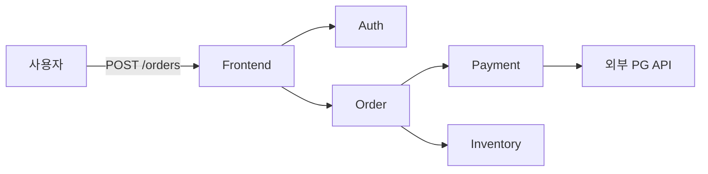
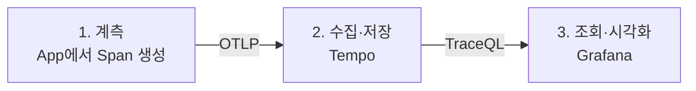
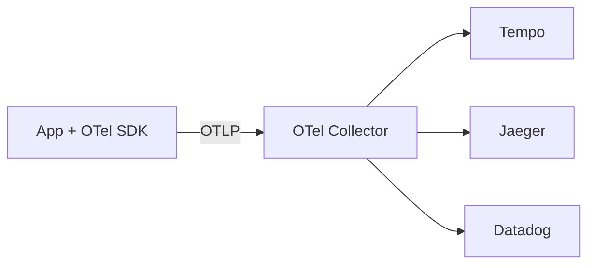
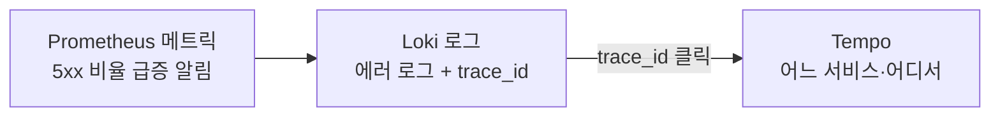

# Tempo

> 최종 업데이트: 2026-05-03 | Tempo 2.x 기준

## 개념

Tempo는 **분산 추적(distributed tracing) 데이터를 저장·조회하는 오픈소스 백엔드**다. Grafana Labs가 만들었으며, 마이크로서비스 환경에서 한 요청이 여러 서비스를 거친 흐름을 모아두고, Grafana 같은 UI에서 검색·시각화할 수 있게 해준다.

> 비유: 택배 추적 시스템의 **데이터베이스**. 운송장 번호로 검색하면 "창고 → 분류 → 배송 → 도착" 각 단계 시각·소요 시간이 나온다. UI는 별도(Grafana), Tempo는 그 데이터를 모아두는 창고.

핵심 명제: **"trace ID만 인덱싱 + Object Storage 저장"**으로 분산 추적의 운영 비용을 대폭 절감 — Loki의 트레이싱 버전.

## 배경/역사

분산 추적은 새 개념이 아니다. **Google의 2010년 Dapper 논문**이 원전이며, Twitter Zipkin → Uber Jaeger → OpenTelemetry → Tempo로 이어진다.

- **2010** Google, ["Dapper, a Large-Scale Distributed Systems Tracing Infrastructure"](https://research.google/pubs/pub36356/) — 분산 추적의 사실상 원전
- **2012** Twitter가 Dapper 영감으로 **Zipkin** 오픈소스화
- **2015** Uber가 **Jaeger** 발표 (CNCF 졸업 2019)
- **2019** **OpenTelemetry** 출범 — OpenTracing + OpenCensus 통합. 벤더 중립 표준
- **2020-10** Grafana Labs가 **KubeCon 2020에서 Tempo 발표** — Loki의 "인덱스 최소화" 철학을 트레이스에 적용
- **2021-06** Tempo 1.0 GA
- **2022** **TraceQL** 도입 — 트레이스 쿼리 언어
- **2023** **Metrics Generator**(span → RED 메트릭 자동 생성)·**Service Graph** 추가
- **2024** Tempo 2.x

> Tempo는 이 계보의 가장 늦은 후발주자. **차별화 포인트는 비용** — Cassandra/Elasticsearch 같은 인덱스 DB 없이 객체 저장소 하나로 동작.

## 분산 추적이란 (선행 개념)

Tempo를 이해하려면 분산 추적 자체부터 알아야 한다.

**모놀리식 시대**엔 한 요청 = 한 서버 → 로그 한 군데만 보면 됐다. **마이크로서비스 시대**엔 한 요청이 여러 서비스를 거친다:



**문제**: 이 요청이 5초 걸렸다면 어디서? 로그만 봐선 알 수 없다. 서비스마다 시계가 다르고, 어떤 호출이 어떤 호출의 결과로 일어났는지 추적 불가.

**해결**: 첫 요청에 고유한 **Trace ID**를 부여하고, 그 Trace ID를 모든 후속 호출의 HTTP 헤더로 넘긴다. 각 서비스는 자기 작업을 **Span**으로 기록하면서 Trace ID를 함께 남긴다. 나중에 그 Trace ID로 모은 모든 Span을 시간·계층순으로 정렬하면 → 전체 요청 흐름을 재구성 가능.

| 용어 | 정의 |
|---|---|
| **Span** | 단일 작업 단위 (HTTP 요청·DB 쿼리·함수 호출 등). 시작/종료 시각 + 메타데이터 |
| **Trace** | 여러 span을 묶은 **전체 요청 흐름** |
| **Trace ID** | 한 trace를 식별하는 고유 ID. 모든 span이 공유 |
| **Parent Span ID** | 어떤 span에서 파생됐는지 — 트리 구조 |
| **Context Propagation** | HTTP 헤더(`traceparent`)로 trace ID를 다음 서비스로 전달 |

→ 이 메커니즘 전체를 **분산 추적(distributed tracing)**이라 부른다.

## Tempo가 분산 추적 안에서 정확히 뭘 하는가

분산 추적은 크게 3단계 파이프라인이다.



| 단계 | 누가 함 | Tempo의 위치 |
|---|---|---|
| **1. 계측 (Instrument)** | App 코드 (OpenTelemetry SDK·Java Agent 등) | Tempo 영역 X |
| **2. 수집·저장 (Ingest & Store)** | **Tempo** ← 여기 | **Tempo의 본업** |
| **3. 조회·시각화 (Query & Visualize)** | Grafana UI | Tempo가 쿼리 처리·결과 반환 |

→ **Tempo는 "수집·저장 + 조회"만 담당**. 계측은 OpenTelemetry, 시각화는 Grafana가 한다. 흔한 오해는 "Tempo가 trace를 보여준다"인데, **Tempo는 보여주지 않고 저장·반환만 한다**. 보여주는 건 Grafana.

구체적으로 Tempo가 하는 일:

1. **수신** — 앱이 OpenTelemetry로 보낸 span을 받음 (OTLP·Jaeger·Zipkin 프로토콜 모두 지원)
2. **저장** — span들을 trace ID 단위로 묶어 Object Storage(S3·GCS)에 영속화
3. **인덱싱** — trace ID로 빠르게 찾을 수 있게 인덱스 유지 (다른 attribute는 인덱싱 X)
4. **조회 응답** — Grafana가 trace ID 또는 TraceQL 쿼리를 보내면 결과 반환
5. **부수 기능** — span에서 RED 메트릭 자동 생성(Metrics Generator), 서비스 의존성 그래프 자동 생성(Service Graph)

## 사용자가 결국 보는 것 — Trace Waterfall

Tempo에 trace를 던지고 Grafana에서 trace ID로 조회하면, 다음 같은 화면이 나온다:

```
POST /orders ──────────────────────── 5.2s
├─ auth.verify ─── 50ms
├─ order.create ─── 5.1s
│  ├─ payment.charge ─── 4.8s        ← 범인
│  │  └─ external_pg_api ─── 4.7s    ← 진짜 범인
│  └─ inventory.reserve ─── 200ms
└─ response.serialize ─── 50ms
```

각 막대가 span. 시간 순서·계층 관계가 한눈에. 클릭하면 HTTP/DB 상세, 에러 메시지, 커스텀 attribute(orderId, userId 등) 확인.

→ **분산 추적의 본질이 이 화면 하나에 응축**. "이 요청이 왜 5초 걸렸나? 어디서 에러 났나?"의 답을 즉시.

## Tempo의 차별점

**trace ID만 인덱싱**하고, trace 본문은 객체 저장소에 그대로 저장.

| 기존 방식 (Jaeger 등) | Tempo |
|---|---|
| Trace + service + tags 모두 인덱싱 | **Trace ID만** 인덱싱 |
| Cassandra·Elasticsearch 필요 | **Object Storage** (S3·GCS·Azure Blob) |
| 운영·비용 부담 큼 | 매우 낮음 |
| 임의 attribute 검색 빠름 | TraceQL로 가능하나 풀스캔 |

→ **"trace ID로 좁힌 후 분석"** 패턴에 최적. 메트릭/로그에서 trace ID를 클릭해 점프하는 흐름과 잘 맞물림.

## 다른 트레이싱 도구와의 관계

| 도구 | 특징 |
|---|---|
| **Tempo** | OS, 비용 효율, Grafana 통합 |
| **Jaeger** | OS, CNCF 졸업, attribute 검색 빠름 (인덱스 DB 운영 필요) |
| **Zipkin** | OS, 가장 오래됨(2012), 단순 |
| **Datadog APM** | SaaS, UI 좋음, 비쌈 |
| **New Relic** | SaaS, One Platform, 비쌈 |
| **Honeycomb** | SaaS, high-cardinality 분석 강함 |

→ OS 3종(Tempo·Jaeger·Zipkin)은 모두 **OpenTelemetry로 데이터를 받을 수 있어 백엔드 교체가 비교적 자유롭다**.

## OpenTelemetry와의 관계

OpenTelemetry(OTel)는 **벤더 중립 관찰성 표준**. 계측은 OTel SDK로, 저장은 Tempo·Jaeger·Datadog 등 자유롭게 선택.



→ 코드는 OTel SDK로 **한 번만 계측**하면 백엔드는 자유 교체. 벤더 락인 회피의 표준 패턴.

## LGTM 스택에서의 위치

| 시그널 | 도구 | 역할 |
|---|---|---|
| 로그 | **L**oki | 텍스트 로그 |
| 메트릭 | **M**imir / Prometheus | 시계열 수치 |
| 트레이스 | **T**empo | 요청 흐름 |
| 시각화 | **G**rafana | 통합 UI |

LGTM = Grafana Labs의 통합 관찰성 스택. 모두 *"인덱스 최소화 + Object Storage"* 철학 공유 — **Datadog·New Relic 같은 통합 SaaS의 오픈소스 대안**.

## Span의 데이터 모델

OTel/Tempo의 span이 담는 정보:

| 필드 | 예시 |
|---|---|
| `trace_id`, `span_id`, `parent_span_id` | 16바이트 식별자 |
| `name` | "POST /orders", "db.query" |
| `start_time`, `end_time` | 타임스탬프 |
| `status` | OK / ERROR |
| `attributes` | `http.status_code=200`, `db.statement="SELECT ..."` |
| `events` | span 내 이벤트 (예외 발생, 로그 등) |
| `links` | 다른 trace와의 연결 |

## 진짜 가치: 메트릭·로그와 함께 쓸 때

Tempo 단독은 "trace를 본다" 정도. 진짜 가치는 **메트릭(이상 감지) → 로그(에러 내용) → 트레이스(원인 위치)** 점프 흐름.



→ 그래서 **trace_id를 로그에 박는 것**이 운영의 핵심. Spring Boot 3.x + Micrometer Tracing이 자동 처리.

## 백엔드 개발자 관점 실무 포인트

- **Spring Boot 3.x는 Micrometer Tracing이 표준** — Spring Cloud Sleuth는 deprecated
- **OTel Java Agent** — JVM 옵션 한 줄로 자동 계측 가능 (코드 수정 X)
- **trace_id 자동 로그 포함** — Logback MDC에 자동 주입. Grafana에서 로그 ↔ 트레이스 점프
- **PII는 attribute에 X** — `user.email` 같은 거 절대 X
- **path parameter 정형화** — `/api/orders/12345`가 아닌 `/api/orders/:id`. 안 그러면 trace 그룹이 사용자별로 분리됨
- **OTel Collector를 거치는 게 표준** — 변환·sampling·라우팅을 Collector에서 처리
- **샘플링 정책 처음부터** — 100% 보관은 비용 폭발. 보통 정상 1~10% + 에러 100%

## 한 줄 요약

> **Tempo = 분산 추적 데이터의 저장·조회용 오픈소스 백엔드.** 분산 추적 파이프라인(계측 → 수집·저장 → 조회·시각화) 중 **수집·저장**만 담당하며, 계측은 OpenTelemetry, 시각화는 Grafana가 맡는다. 핵심 차별점은 **trace ID만 인덱싱 + Object Storage 저장**으로 운영 비용 대폭 절감 (Loki의 트레이싱 버전). 사용자가 결국 보는 것은 **Trace Waterfall** — "이 요청이 왜 느린가? 어디서 에러 났나?"의 답을 시각적으로 즉시. **LGTM 스택의 T**로 Datadog·New Relic의 오픈소스 대안 위치.

## 관련 문서

- [Grafana](../grafana/Grafana.md) — Tempo 시각화 프론트엔드 (LGTM의 G)
- [Loki](../로깅%20서비스/Loki.md) — 로그 시스템. trace_id 점프 연결 (LGTM의 L)
- [Prometheus](../Prometheus/Prometheus%20개념.md) — 메트릭 시스템
- [opentelemery](../opentelemery/) — Tempo의 표준 계측 방법
- [newrelic](../newrelic/) — 통합 SaaS 비교 대상

## 참조

- Google, ["Dapper, a Large-Scale Distributed Systems Tracing Infrastructure"](https://research.google/pubs/pub36356/) (2010) — 분산 추적 원전 논문
- [Tempo 공식 문서](https://grafana.com/docs/tempo/latest/)
- [Tempo GitHub](https://github.com/grafana/tempo)
- [TraceQL 레퍼런스](https://grafana.com/docs/tempo/latest/traceql/)
- [Grafana Tempo 발표 블로그 (2020)](https://grafana.com/blog/2020/10/27/announcing-grafana-tempo-a-massively-scalable-distributed-tracing-system/)
- [OpenTelemetry 공식](https://opentelemetry.io/)
- [W3C Trace Context](https://www.w3.org/TR/trace-context/)
