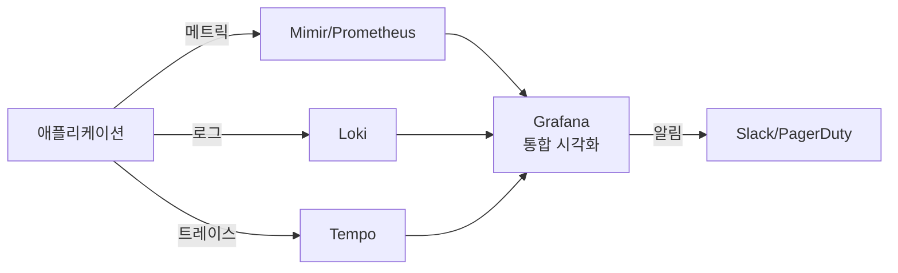

# Grafana

> 최종 업데이트: 2026-05-03 | Grafana 11.x + LGTM 스택 (Loki·Grafana·Tempo·Mimir) 기준

## 개념

Grafana는 **다양한 데이터 소스(메트릭·로그·트레이스·DB 등)를 단일 대시보드에서 시각화·분석하는 오픈소스 관찰성 플랫폼**이다. 데이터를 직접 저장하지 않고, 외부 데이터 소스에 쿼리를 던져 결과를 그래프·표로 보여주는 게 핵심.

> 비유: 자동차 계기판. 엔진 ECU(Prometheus)·연료 게이지(InfluxDB)·내비게이션(Elasticsearch)에서 각자 데이터를 가져와 운전석 한 화면에 통합 표시. 계기판 자체는 데이터를 저장하지 않고 "보여주는 역할"만 한다.

핵심 명제: **"데이터는 어디 있어도 좋다. 보는 곳은 한 곳."** — 데이터 소스 중립(vendor-neutral) 시각화 레이어.

## 배경/역사

- **2014-01** **Torkel Ödegaard**(스웨덴 개발자)가 Kibana 3을 포크해 시작 — InfluxDB·Graphite 시각화가 Kibana보다 부족했던 게 동기
- **2014-12** **Grafana Labs** 설립 (스웨덴 스톡홀름)
- **2017** Grafana 4.0 — **알림(Alerting)** 기능 추가
- **2019** **Loki** 출시 — Prometheus 철학을 로그로 확장한 오픈소스 로그 시스템
- **2020** **Tempo** 출시 — 분산 추적(distributed tracing) 백엔드
- **2021** Grafana 8 — **Unified Alerting** 도입 (대시보드별 알림 → 통합 알림)
- **2022** **Mimir** 출시 — Prometheus 호환 장기 저장(long-term storage)
- **2023** Grafana 10 — Scenes 라이브러리, Public Dashboards
- **2024~2026** Grafana 11.x — Scenes 기반 대시보드 재작성, AI 기반 어시스턴트

> Torkel Ödegaard는 Grafana Labs CTO. Grafana는 **CNCF 인큐베이팅 프로젝트는 아니지만**, Loki·Tempo·Mimir 등은 사실상의 CNCF 표준 스택과 어깨를 나란히 한다.

## 핵심 기능

| 기능 | 설명 |
|---|---|
| **Dashboard** | 여러 패널을 모은 화면. JSON으로 정의 |
| **Panel** | 차트·표·통계 등 시각화 단위. Time Series·Bar·Stat·Gauge·Table·Heatmap·Logs·Traces 등 |
| **Explore** | 데이터 소스에 즉석 쿼리 (대시보드 만들기 전 탐색) |
| **Alert** | 메트릭 임계치 초과 시 알림. Slack/PagerDuty/Email/Webhook |
| **Variables** | 대시보드 동적 필터 (`$namespace`, `$service` 등) |
| **Annotations** | 대시보드에 이벤트 마커 표시 (배포 시점·인시던트 등) |
| **Plugins** | 데이터 소스·패널·앱 플러그인 (300+) |
| **Provisioning** | 코드(파일)로 데이터 소스·대시보드 자동 등록 |

## 데이터 소스 — Grafana의 진정한 강점

Grafana는 **데이터를 직접 저장하지 않는다**. 외부 시스템에 쿼리를 던질 뿐.

| 카테고리 | 주요 데이터 소스 |
|---|---|
| **시계열·메트릭** | Prometheus, **Mimir**, InfluxDB, Graphite, OpenTSDB |
| **로그** | **Loki**, Elasticsearch, Splunk, CloudWatch Logs |
| **트레이스** | **Tempo**, Jaeger, Zipkin |
| **관계형 DB** | MySQL, PostgreSQL, MS SQL Server |
| **클라우드** | AWS CloudWatch, Azure Monitor, GCP Monitoring |
| **APM** | Datadog, New Relic (커뮤니티 플러그인) |
| **검색** | Elasticsearch, OpenSearch |

→ 같은 대시보드에 **메트릭(Prometheus) + 로그(Loki) + 트레이스(Tempo)**를 띄워 한 화면에서 cross-domain 분석 가능.

## LGTM 스택 — Grafana Labs의 풀스택 관찰성

| 약자 | 도구 | 역할 |
|---|---|---|
| **L** | **Loki** | 로그 집계 (Prometheus 철학 + 로그) |
| **G** | **Grafana** | 시각화 |
| **T** | **Tempo** | 분산 추적 |
| **M** | **Mimir** | 메트릭 장기 저장 (Prometheus 호환) |



→ 한 회사(Grafana Labs)가 메트릭·로그·트레이스·시각화·알림을 모두 제공. **Datadog/New Relic 같은 통합 SaaS의 오픈소스 대안**.

## 쿼리 언어 — 데이터 소스마다 다름

| 언어 | 데이터 소스 |
|---|---|
| **PromQL** | Prometheus, Mimir |
| **LogQL** | Loki |
| **TraceQL** | Tempo |
| **InfluxQL / Flux** | InfluxDB |
| **SQL** | MySQL, PostgreSQL |
| **Lucene / KQL** | Elasticsearch |

```promql
# PromQL — HTTP 5xx 에러율
sum(rate(http_requests_total{status=~"5.."}[5m]))
  / sum(rate(http_requests_total[5m]))
```

```logql
# LogQL — error 로그 추출 + 분당 카운트
sum(rate({app="payment"} |= "error" [1m]))
```

> Grafana는 쿼리를 **번역하지 않는다**. 각 데이터 소스의 native 쿼리를 그대로 보낸다. 그래서 데이터 소스별 쿼리 언어 학습이 필수.

## Variables — 동적 대시보드의 핵심

```
$namespace: kubectl get ns에서 가져오는 드롭다운
$service: $namespace에 따라 동적으로 갱신
```

대시보드 패널의 쿼리:

```promql
sum(rate(http_requests_total{namespace="$namespace", service="$service"}[5m]))
```

→ 같은 대시보드를 **수백 개의 서비스·환경에 재사용**. variables 없으면 서비스마다 별도 대시보드 만들어야 함.

## Alerting — Unified Alerting (Grafana 8+)

Grafana 8 이전엔 대시보드 패널마다 별도 알림. 이후 **Unified Alerting**으로 통합.

| 구성요소 | 역할 |
|---|---|
| **Alert Rule** | "CPU > 80% 5분 지속 시" 같은 조건 |
| **Contact Point** | 알림 받는 곳 (Slack, PagerDuty, Email, Webhook 등) |
| **Notification Policy** | 어떤 Alert를 어떤 Contact Point로 보낼지 (라우팅) |
| **Mute Timing** | 알림 끄는 시간대 (점검 시간 등) |
| **Silence** | 일시적으로 특정 알림만 음소거 |

→ **Prometheus Alertmanager와 호환** — 동일한 라벨/매처 기반. Alertmanager 노하우 그대로 활용 가능.

## Dashboard as Code — Git으로 대시보드 관리

UI에서만 대시보드를 만들면 **재현 불가·롤백 불가·환경 차이**가 생긴다. 코드화가 답.

| 도구 | 방식 |
|---|---|
| **JSON 직접 작성** | Grafana 대시보드의 native 포맷 |
| **Grafonnet** | Jsonnet 기반 DSL — 가장 정통 |
| **Terraform Provider** | `grafana_dashboard` 리소스 |
| **Ansible** | `community.grafana` 모듈 |
| **Grafana CLI / API** | `grafana-cli admin` 또는 HTTP API |
| **Provisioning** | `/etc/grafana/provisioning/` 파일 자동 로드 |

```hcl
# Terraform 예시
resource "grafana_dashboard" "api_metrics" {
  config_json = file("${path.module}/dashboards/api-metrics.json")
}
```

## 좋은 대시보드 패턴

| 패턴 | 적용 |
|---|---|
| **Four Golden Signals** (Google SRE) | Latency·Traffic·Errors·Saturation 4개 패널 |
| **RED Method** (Tom Wilkie) | Rate·Errors·Duration — 마이크로서비스 표준 |
| **USE Method** (Brendan Gregg) | Utilization·Saturation·Errors — 자원 모니터링 |
| **Drilldown 구조** | 상위 대시보드 → 클릭 → 상세 대시보드로 이동 |

## Grafana 제품 라인업

| 제품 | 가격 | 특징 |
|---|---|---|
| **Grafana OSS** | 무료 (AGPLv3) | 자체 호스팅. 대부분 기능 포함 |
| **Grafana Cloud** | 무료 티어 + 사용량 기반 | SaaS. Loki·Tempo·Mimir도 함께 |
| **Grafana Enterprise** | 유료 | OSS + 추가 기능 (Reporting, Enterprise plugins, RBAC 강화) |

## 경쟁 제품 비교

| 제품 | 강점 | 약점 |
|---|---|---|
| **Grafana** | OSS 무료, 데이터 소스 중립, LGTM 풀스택 | 자체 호스팅 시 운영 부담 |
| **Kibana** | Elasticsearch 통합 강함 | ES 종속, ES 외 데이터 소스 약함 |
| **Datadog** | 올인원 SaaS, UI 직관적 | 비쌈, 벤더 락인 |
| **New Relic** | One Platform 통합, NRQL | UI 복잡, 학습 곡선 |
| **Tableau / Looker** | BI 강함 | 시계열·로그 약함, 비쌈 |
| **Chronograf** | InfluxDB 전용 | 데이터 소스 제한적 |

## Kubernetes 환경 명령어 모음

자주 쓰는 명령어 (기존 본문 보존):

```sh
# 1. 모든 네임스페이스에서 Grafana 파드 검색
kubectl get pods --all-namespaces -l app.kubernetes.io/name=grafana

# 2. 네임스페이스의 Grafana Deployment YAML
kubectl get deployment grafana -n <namespace> -o yaml

# 3. Grafana Service YAML
kubectl get service grafana -n dev-ops -o yaml

# 4. 네임스페이스의 모든 Ingress YAML
kubectl get ingress -n dev-ops -o yaml

# 5. Grafana ConfigMap (대시보드·데이터소스 provisioning 확인)
kubectl get configmap grafana -n dev-ops -o yaml

# 6. Helm 릴리스 전체 정보
helm get all grafana -n dev-ops

# 7. Grafana 파드 로그
kubectl logs -n dev-ops -l app.kubernetes.io/name=grafana --tail=200

# 8. Grafana admin 비밀번호 추출 (Helm 설치 시)
kubectl get secret -n dev-ops grafana -o jsonpath="{.data.admin-password}" | base64 -d

# 9. Port-forward로 로컬 접속
kubectl port-forward -n dev-ops svc/grafana 3000:80
```

## 백엔드 개발자 관점 실무 포인트

- **Spring Boot Actuator + Micrometer + Prometheus + Grafana**가 사실상 표준 스택 — `micrometer-registry-prometheus` 의존성만 추가하면 `/actuator/prometheus` 엔드포인트 자동 노출
- **대시보드는 반드시 코드로 관리** — UI에서 만들면 재현 불가. Terraform Provider 또는 Provisioning ConfigMap 사용
- **Variables 적극 활용** — `$service`·`$namespace`·`$pod` 변수로 대시보드 1개를 모든 서비스에 재사용
- **RED 패턴부터 시작** — 마이크로서비스마다 Rate(요청수)·Errors(에러율)·Duration(지연) 3개 패널이 기본. 이후 USE로 인프라 자원 추가
- **Annotation으로 배포 시점 표시** — CI/CD에서 `POST /api/annotations`로 배포 이벤트 등록 → 그래프에 수직선 표시 → "이 배포 후부터 에러율 증가" 즉시 시각화
- **Alert를 SLO 기반으로** — "CPU > 80%"보다 "에러 예산(error budget) 소진율 > 2배"가 더 의미 있음. Multi-window multi-burn-rate 패턴 권장
- **Loki 로그 라벨 신중히** — Loki는 라벨 cardinality에 민감. 사용자 ID 같은 고cardinality 값을 라벨에 넣지 말 것 (line content로)
- **데이터 소스 secret 관리** — DB password 등은 Kubernetes Secret 또는 Provisioning에서 환경 변수 참조
- **인증은 OAuth/SAML로** — anonymous access는 보안 사고 단골. GitHub·Google·OIDC·SAML 연동
- **대시보드 수 통제** — 50개 넘어가면 누구도 안 봄. 폴더 정리 + 표준 라이브러리 만들기
- **Grafana Cloud Free Tier 활용** — 작은 팀/프로젝트라면 무료 티어로 시작 가능 (10K series, 50GB logs/traces)

## 안티패턴

| 안티패턴 | 왜 위험 |
|---|---|
| **UI에서만 대시보드 작성** | 재현 불가, 환경 간 동기화 안 됨, 실수로 삭제 시 복구 불가 |
| **패널 30개+ 한 대시보드** | 인지 과부하, 로딩 느림. 5~10개 이내로 분리 |
| **Auto-refresh 5초** | 모든 사용자가 데이터 소스에 부하. 30초~1분 권장 |
| **모든 메트릭에 Alert** | 알림 피로 (alert fatigue). 진짜 액션 필요한 것만 |
| **anonymous 인증** | 누구나 데이터 조회 가능. OAuth/SAML로 잠금 |
| **데이터 소스 직접 노출** | Grafana를 통하지 않고 Prometheus를 외부에 노출 → 보안 사고 |
| **변수 없는 대시보드 복제** | "결제 서비스용 / 주문 서비스용 / 재고 서비스용"으로 복제 → 변경 시 N개 동기화 지옥 |
| **Loki에 고cardinality 라벨** | 라벨 폭발 → 쿼리 성능 폭락 |

## 한 줄 요약

> **Grafana = "데이터 소스 중립 오픈소스 시각화·관찰성 플랫폼."** 2014 Torkel Ödegaard 시작, 데이터를 직접 저장하지 않고 외부 소스(Prometheus·Loki·Tempo·DB·CloudWatch 등 100+)에 쿼리를 던져 단일 대시보드에서 통합 분석. **Grafana Labs의 LGTM 스택(Loki·Grafana·Tempo·Mimir)**이 Datadog·New Relic의 오픈소스 대안. 실무 핵심은 **Dashboard as Code + Variables + RED/USE 패턴 + Unified Alerting**. 자체 호스팅과 Grafana Cloud(SaaS) 둘 다 가능.

## 관련 문서

- [Prometheus](../Prometheus/) — 메트릭 데이터 소스 표준
- [newrelic](../newrelic/) — 통합 관찰성 SaaS 비교 대상
- [Monitoring](../Monitoring/) — 모니터링 일반론

## 참조

- [Grafana 공식 문서](https://grafana.com/docs/grafana/latest/)
- [Grafana 공식 GitHub](https://github.com/grafana/grafana)
- [Loki 공식](https://grafana.com/oss/loki/)
- [Tempo 공식](https://grafana.com/oss/tempo/)
- [Mimir 공식](https://grafana.com/oss/mimir/)
- [Grafonnet](https://grafana.github.io/grafonnet-lib/)
- [Terraform Grafana Provider](https://registry.terraform.io/providers/grafana/grafana/latest/docs)
- [Google SRE Book — The Four Golden Signals](https://sre.google/sre-book/monitoring-distributed-systems/)
- [Tom Wilkie — RED Method](https://thenewstack.io/monitoring-microservices-red-method/)
- [Brendan Gregg — USE Method](https://www.brendangregg.com/usemethod.html)
