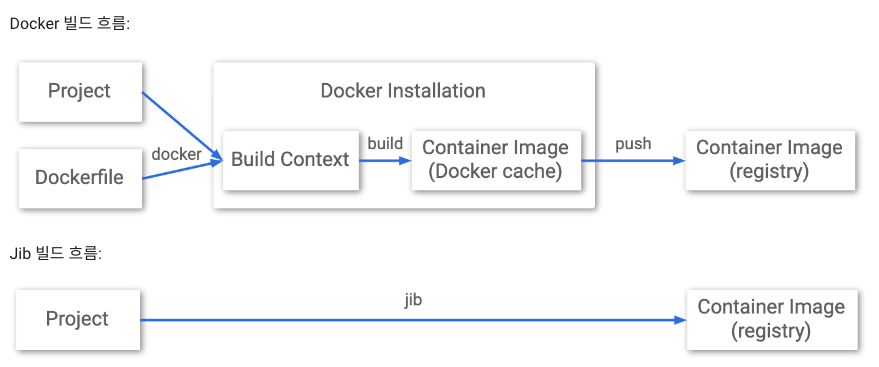
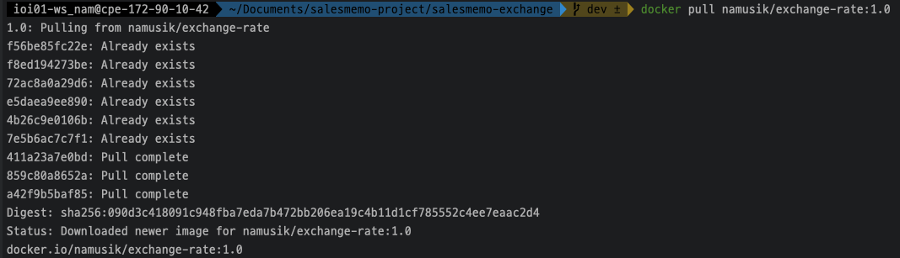

# jib 

## 무엇인가

~~~
Dockerfile을 사용하지 않거나 Docker를 설치할 필요 없이
컨테이너를 빌드할 수 있도록 도와주는 도구

애플리케이션을 컨테이너 이미지로 패키징하는 모든 단계를 처리

프로젝트를 빌드함과 동시에 컨테이너 이미지까지 만들어준다.
~~~

## Dockerimage를 쓰는 것에 비해 장점이 무엇인가

~~~
종속 항목, 리소스, 클래스 등 별개의 레이어로 구성
Docker 이미지 레이어 캐싱을 활용하여 변경사항만 다시 빌드함으로써 빌드를 빠르게 유지
1) 빠르다 
Jib은 애플리케이션을 여러 계층으로 분리하여 클래스에서 종속성을 분리한다. 
변경된 레이어만을 배포하면 되기 때문에 빠르다. 

2) 재사용성
layer caching을 사용하기 때문에 코드에 변경이 없을 경우, 이미지 빌드 과정이 따로 또 수행되지 않는다.

3) Docker daemon이 필요없다
dockerfile이나 docker 명령어를 사용할 필요 없이 maven/gradle에서 해결이 된다. 
~~~

## 동작 방식 

    기존의 java 애플리케이션은 하나의 jar 파일을 사용
    즉, 단일 이미지 layer를 빌드하였다.
    이 jar 파일을 복사해서 이미지를 생성하는 방식은 Docker의 image caching을 활용하지 못한다. 

    반면, jib은 Java 애플리케이션을 여러 layer로 분리한다.
    코드를 변경하면, 전체를 빌드하는 것이 아니라,
    변경사항만 빌드한다.

## 이미지 레이어 확인
~~~sh
docker history 이미지명
~~~

## jib pull

jib을 이용해서 이미지를 빌드하였다. 
그리고 코드를 수정해서 docker-hub에 업로드하였다가 pull을 해보면
처음 빌드한 이미지와 같은 layer는 "Already exists"라고 뜨면서 넘어가고 바뀐 layer만 pull 하는 것을 알 수 있다.

## 참고
https://cloud.google.com/java/getting-started/jib?hl=ko

https://medium.com/@gaemi/spring-boot-%EA%B3%BC-docker-with-jib-657d32a6b1f0

https://jh-labs.tistory.com/509

https://tomgregory.com/jib-vs-spring-boot-for-building-docker-images/

https://github.com/GoogleContainerTools/jib/blob/master/docs/faq.md#how-are-jib-applications-layered