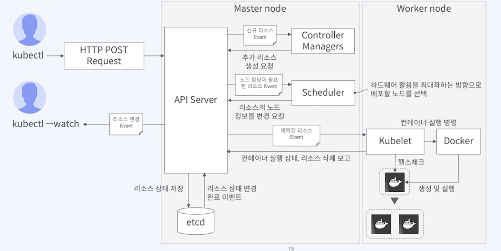
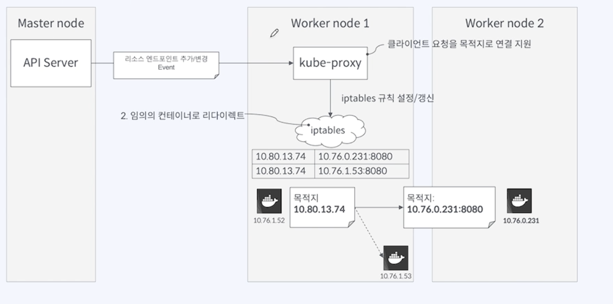

# 쿠버네티스

https://kubernetes.io/ko/docs/home/

## 개발 배경
- 기존에 docker만 사용할 때 docker image를 운영 서버에 올리고 run 하는 작업을 수백개의 서버에서 하게 된다면?? 
- 너무 많은 시간과 비용이 소모된다.
- 컨테이너를 사용할 때 가장 큰 문제 중 하나는 컨테이너의 오케스트레이션(배치, 관리, 확장 등)을 어떻게 할 것인가
- 구글이 개발한 오픈소스 컨테이너 관리 시스템
- 구글은 Borg라는 내부 컨테이너 오케스트레이션 시스템을 운영
- https://research.google/pubs/borg-omega-and-kubernetes/
- 외부 개발자들도 사용할 수 있도록 쿠버네티스를 개발
- 2014년 구글은 Kubernetes 프로젝트를 공개적으로 시작

## 대표 기능
-	자동화된 스케일링: 수요에 맞게 애플리케이션의 복제본 수를 자동으로 조정
-	자체 복구 기능: 실패한 컨테이너를 자동으로 재시작하고, 필요에 따라 새로운 인스턴스를 배치
-	서비스 디스커버리와 로드 밸런싱: 컨테이너 간의 통신을 관리하고, 로드 밸런싱을 통해 트래픽을 분산
-	다양한 환경에서의 지원: 온프레미스 데이터센터, 퍼블릭 클라우드 등 다양한 환경에서 실행

## 정의
- 그리스어로 **조타수**
- **여러개**의 컨테이너화된 애플리케이션을 **여러개**의 서버(쿠버네티스 클러스터)에 자동으로 배포, 스케일링 및 관리해주는 오픈소스 시스템

## 쿠버네티스 클러스터
- 쿠버네티스가 관리하는 애플리케이션 컨테이너를 배포하기 위한 서버 집합

### Master 노드
- 클러스터의 상태를 저장하고 관리하는 서버
- control plane

#### API 서버

- 옵저버 패턴 비슷
  - 구독하고자 하는 이벤트를 중앙장치에 등록하고, 이벤트가 발생할 때마다 이벤트의 알림을 받는 패턴
    - 클러스터의 REST API 서버
    - 외부와 내부의 모든 요청을 처리하는 입구 역할
    - kubectl 명령어가 HTTP로 변환돼서 API server로 전달됨.
    - 클러스터 상태 조회, 변경을 위한 API 인터페이스 제공
#### etcd (key-value data store) 
  - 영구 저장소
  - 클러스터에 배포된 애플리케이션  실행 정보를 저장

#### Scheduler
  - 노드 스케쥴링

#### Controller Managers
  - 클러스터 상태를 관리하고, 클러스터 리소스의 상태를 자동으로 조정하는 컨트롤러들을 실행
  - 각 컨트롤러는 특정 리소스의 상태를 모니터링하고, 해당 리소스의 상태가 정의된 목표 상태에 맞춰 변경될 수 있도록 조치
  - 클러스터의 다양한 작업을 자동화하고, 예를 들어 **Pod의 개수를 유지**하거나, 디플로이먼트가 원하는 상태를 유지하게 합니다.
  -	**노드 추가 및 삭제**와 같은 자원 관리 작업을 수행합니다.
 -	**ReplicaSet** 및 **Deployment**와 같은 객체들을 **관리**하고, 클러스터 내의 리소스가 안정적으로 유지되도록 합니다.

### Worker 노드
컨테이너 실행을 담당
### Kubelet
### Container Runtime (Docker, …)
### kube-proxy

  - 각각 worker node에 존재
  - iptables에 전달
  - 트래픽을 pod로 전달

## 쿠버네티스 애플리케이션 배포

- **쿠버네티스 오브젝트 Manifest 파일**을 작성해서 마스터 노드에 있는 API Server에게 요청을 보내는 행위
- Manifest 파일이란?
  - 쿠버네티스 오브젝트를 생성하기 위한 **필수 정보**
  - “일을 시키기 위한 지시서”


## 서비스 디스커버리 (Service Discovery)

### 서비스 디스커버리의 필요성

- 분산 시스템에서는 서비스들이 동적으로 생성되고, 종료되며, IP 주소나 포트가 변경될 수 있다.
- 특히 쿠버네티스에서는 파드(Pod)라는 단위로 애플리케이션을 실행하는데, 파드는 언제든지 재시작하거나 새로운 인스턴스가 생성될 수 있기 때문에, **IP 주소가 고정되지 않는다.**

**시스템 내의 서비스를 찾고 접근하는 과정을 자동화하는 메커니즘**
각 서비스는 **변경된 IP 주소나 포트에 관계없이 서로를 자동으로 인식하고 연결**

### 쿠버네티스의 서비스 디스커버리 방식

- 쿠버네티스에서 서비스 디스커버리는 주로 **서비스(Service)**라는 리소스를 통해 이루어짐.
- 분산형 서비스 디스커버리
- 쿠버네티스 서비스는 파드들을 묶어서 하나의 네트워크 엔드포인트로 접근할 수 있게 만들어주는 추상화 계층

a. `서비스 리소스(Service Resource)`

- 쿠버네티스에서 서비스는 하나 이상의 파드를 로드 밸런싱하고, 서비스 이름을 통해 다른 파드들이 해당 서비스를 찾을 수 있도록 합니다. 
- 서비스는 IP 주소와 DNS 이름을 통해 서비스를 노출시킵니다. 이를 통해 각 파드가 고유한 IP 주소 대신 서비스 이름을 사용해 다른 파드나 서비스와 통신가능
	-	ClusterIP: 기본적인 서비스 유형으로, 클러스터 내에서만 접근할 수 있는 가상 IP를 제공합니다.
	-	NodePort: 클러스터 외부에서 특정 포트를 통해 접근할 수 있게 해줍니다. 노드의 IP와 함께 지정된 포트를 통해 서비스에 접근할 수 있습니다.
	-	LoadBalancer: 클라우드 환경에서 로드 밸런서를 자동으로 설정하여 외부에서 접근할 수 있는 IP를 제공합니다.
	-	ExternalName: DNS 이름을 사용해 외부 서비스에 대한 접근을 가능하게 합니다.

b. `DNS 서비스`

- 쿠버네티스에서는 DNS 서비스를 자동으로 제공하여, 클러스터 내에서 각 서비스는 서비스 이름으로 접근
- 예를 들어, my-service라는 서비스가 존재한다면, 클러스터 내의 다른 파드는 my-service.default.svc.cluster.local과 같은 DNS 이름을 통해 해당 서비스에 접근할 수 있습니다. 쿠버네티스는 서비스 이름을 IP 주소로 변환하여 네트워크 통신을 가능하게 합니다.

c. `서비스와 파드의 연관`

서비스는 **셀렉터(Selector)** 를 사용하여 관련된 파드를 선택합니다. 셀렉터는 **파드의 레이블(label)을 기준으로 필터링**하여 해당 서비스와 연결되는 **파드들을 동적으로 결정**합니다. 예를 들어, app: frontend라는 레이블을 가진 파드를 서비스가 자동으로 찾아내어 로드 밸런싱을 수행합니다. 이는 파드가 변경되거나 새로 생성되더라도 자동으로 서비스에 포함되도록 해줍니다.

### 서비스 디스커버리의 동작 원리

서비스 디스커버리의 기본적인 동작 원리는 다음과 같습니다:
1.	서비스 생성: 쿠버네티스에서 서비스가 생성될 때, 해당 서비스는 특정 레이블을 가진 파드를 선택하여 자동으로 연결합니다.
2.	서비스 DNS: 쿠버네티스 DNS 시스템은 서비스 이름에 대한 IP 주소를 자동으로 매핑합니다. 예를 들어, my-service라는 서비스가 존재하면, 클러스터 내에서 my-service라는 이름을 통해 IP를 조회할 수 있게 됩니다.
3.	로드 밸런싱: 서비스는 내부적으로 로드 밸런서를 사용하여 트래픽을 서비스에 포함된 파드로 분배합니다. 파드가 동적으로 생성되거나 종료되면, 서비스는 이를 자동으로 감지하고 트래픽 분배를 업데이트합니다.
4.	자동 복구 및 확장: 쿠버네티스는 파드의 상태를 지속적으로 모니터링합니다. 만약 파드가 실패하거나 종료되면, 해당 서비스는 자동으로 트래픽을 다른 건강한 파드로 리디렉션하여 시스템의 가용성을 보장합니다.

### 서비스 디스커버리의 장점
-	자동화된 서비스 등록: 서비스 디스커버리는 서비스가 클러스터에 동적으로 추가되거나 제거될 때, 자동으로 이를 반영하여 새로운 인스턴스를 찾아내고 트래픽을 적절히 분배합니다.
-	고가용성: 서비스는 여러 파드에 걸쳐 로드 밸런싱을 수행하고, 파드가 실패하면 다른 파드로 트래픽을 리디렉션하여 시스템의 가용성을 높입니다.
-	유연성: 파드가 이동하거나 재시작되더라도 서비스는 DNS 이름을 통해 접근할 수 있기 때문에, 애플리케이션은 서비스 주소만 사용해도 지속적인 연결이 가능합니다.

### 다양한 서비스 디스커버리 메커니즘

쿠버네티스는 다양한 방식으로 서비스 디스커버리를 구현할 수 있습니다. 기본적으로는 쿠버네티스 서비스와 DNS를 사용하지만, 다음과 같은 다른 방식들도 존재합니다:
-	Consul: HashiCorp Consul은 서비스 디스커버리와 구성 관리 도구로 사용될 수 있습니다.
-	Etcd: 쿠버네티스의 내부 데이터 저장소인 Etcd는 서비스 디스커버리와 클러스터 상태 관리에 사용될 수 있습니다. 


## resourceVersion


resourceVersion은 쿠버네티스 API에서 리소스의 특정 버전을 나타내는 문자열입니다. 쿠버네티스는 리소스 객체(예: 파드, 서비스, 디플로이먼트 등)가 변경될 때마다 그 리소스의 resourceVersion을 업데이트합니다. 이 값은 리소스가 수정될 때마다 증가하며, 이 값을 통해 리소스의 변경 이력을 추적할 수 있습니다.

2. 주요 사용 사례

resourceVersion은 주로 다음과 같은 경우에 사용됩니다:

a. 리소스 동기화 (Watch)

resourceVersion은 리소스의 변경을 추적하고, 클러스터 내의 다른 클라이언트와 동기화하는 데 사용됩니다. 예를 들어, kubectl get 명령어를 사용하여 특정 리소스를 요청하면, 리소스의 상태와 함께 resourceVersion이 반환됩니다. 이후 watch API를 사용하여 변경 사항을 추적할 때, 클라이언트는 이전에 받은 resourceVersion을 기준으로 변경된 리소스만을 확인할 수 있습니다.
	-	클라이언트가 최초로 리소스를 가져올 때 resourceVersion을 함께 저장합니다.
	-	이후 클라이언트가 변경된 리소스를 추적하려면 watch API를 사용하여, 이전에 받은 resourceVersion 이후의 변경사항을 받아옵니다.
	-	이를 통해 클라이언트는 리소스가 변경된 부분만 효율적으로 추적할 수 있습니다.

b. 변경된 리소스 필터링

리소스를 조회할 때, resourceVersion을 기준으로 특정 버전 이후에 변경된 리소스만 필터링할 수 있습니다. 예를 들어, kubectl get pods --resource-version=<version> 명령어를 사용하면, 특정 버전 이후에 변경된 파드 리소스만 조회할 수 있습니다.

c. 리소스 충돌 방지

resourceVersion을 사용하면 리소스를 수정할 때 다른 클라이언트와의 동시 수정 충돌을 방지할 수 있습니다. 예를 들어, 리소스를 수정할 때 클라이언트가 해당 리소스의 resourceVersion을 포함해서 요청하면, 리소스의 resourceVersion이 일치하는 경우에만 수정 작업이 진행됩니다. 만약 다른 클라이언트가 이미 해당 리소스를 수정했다면, resourceVersion이 변경되었기 때문에 수정 요청은 거부되고 충돌을 방지할 수 있습니다.

3. resourceVersion의 형식

resourceVersion은 일련번호 형식으로, 쿠버네티스 클러스터 내에서 리소스의 상태 변경 시 자동으로 증가합니다. 이는 클러스터 내에서 리소스가 몇 번째 버전인지 추적할 수 있는 값입니다. 예를 들어:
	-	최초로 리소스를 생성하면, resourceVersion은 1부터 시작합니다.
	-	리소스가 수정될 때마다 해당 값은 증가하며, 새로운 버전이 만들어집니다.

4. resourceVersion과 resourceVersionMatch

resourceVersion은 watch API에서 중요한 역할을 합니다. watch API에서는 리소스의 변경 사항을 실시간으로 추적할 수 있으며, 이때 **resourceVersionMatch**라는 필드를 사용하여 특정 resourceVersion 이후의 변경 사항을 추적할 수 있습니다.
	-	**resourceVersionMatch**는 watch 요청 시, 클라이언트가 resourceVersion과 함께 사용하여 해당 리소스의 특정 버전 이후의 변경 사항만을 추적하는 방법입니다.
	-	resourceVersionMatch 값으로는 Exact, Before, NotOlderThan 등이 사용될 수 있습니다.

5. resourceVersion의 예시

다음은 리소스와 관련된 resourceVersion을 조회하는 예시입니다.

a. 리소스 정보 조회

```
kubectl get pod my-pod -o=jsonpath='{.metadata.resourceVersion}'
```
- 이 명령은 my-pod 파드의 resourceVersion 값을 조회합니다.

b. Watch를 사용한 리소스 변경 감지
```
kubectl get pods --watch --resource-version=12345
```
- 위 명령어는 resourceVersion이 12345인 이후의 변경 사항을 추적합니다.

	-	resourceVersion은 클러스터 내에서 고유하지만, 영구적인 식별자가 아닙니다. 시간이 지나면서 이전 버전의 resourceVersion은 더 이상 유효하지 않게 될 수 있습니다. 예를 들어, 오래된 리소스 버전의 변경 사항을 watch하려면 해당 버전이 더 이상 존재하지 않거나 삭제될 수 있습니다.
	-	리소스의 resourceVersion을 오랜 기간 동안 추적하려면, resourceVersion에 대한 적절한 캐싱이나 수명 관리가 필요합니다.