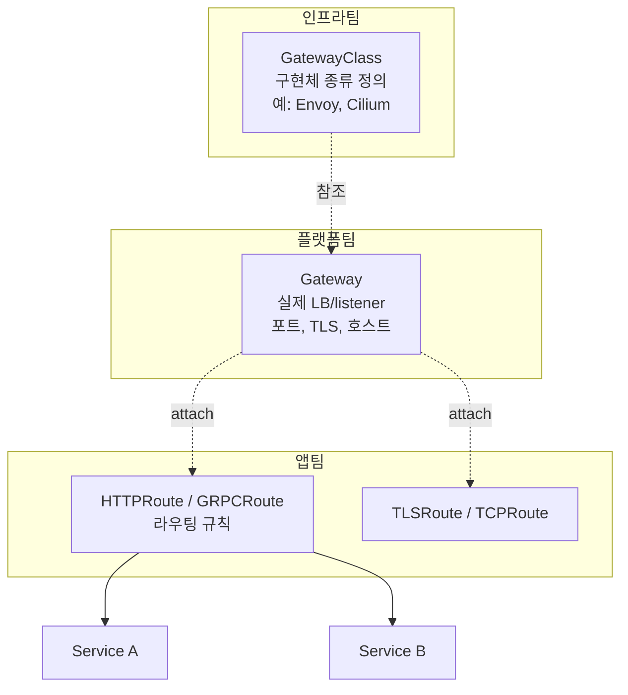

# 쿠버네티스 Gateway API

> 최종 업데이트: 2026-05-14 | Gateway API v1.5 (Standard 채널) 기준

## 개념

Gateway API는 **쿠버네티스 외부에서 들어오는 트래픽을 라우팅하기 위한 차세대 표준 API**다. 기존 [[쿠버네티스-Ingress|Ingress]]의 한계(어노테이션 파편화, 단일 리소스, 제한된 프로토콜)를 해결하기 위해 SIG Network가 만든 후속 표준으로, 2026년 2월 v1.5에서 핵심 기능이 Standard 채널로 승격되어 사실상 정식 표준 자리에 올랐다.

> 회사 빌딩의 보안 시스템에 비유하면 쉽다. **건물 관리자(인프라팀)** 가 출입 게이트 종류와 보안 정책을 정하고(GatewayClass), **층별 매니저(플랫폼팀)** 가 실제 출입구를 설치하며(Gateway), **각 사무실 직원(앱팀)** 이 자기 사무실로 오는 사람 안내 규칙만 정한다(HTTPRoute). Ingress는 이걸 한 사람이 다 했지만, Gateway API는 **역할이 분리**되어 있다.

핵심 차별점:
- **역할 기반 분리(role-oriented)**: 인프라/플랫폼/앱 팀이 서로 다른 리소스를 관리
- **다중 프로토콜**: HTTP, HTTPS, TCP, UDP, gRPC, TLS passthrough
- **표준 라우팅 기능**: 헤더 매칭, 트래픽 분할, 가중치 등이 어노테이션 없이 표준 스펙
- **확장성**: 새로운 라우트 타입(GRPCRoute, TCPRoute 등) 추가 가능

## 배경/역사

| 시기 | 사건 |
|---|---|
| 2019~2020 | Ingress의 어노테이션 파편화 문제가 누적. SIG Network가 후속 표준 작업 시작 (당시 "Service APIs"라는 이름) |
| 2021 | "Gateway API"로 명칭 확정. v0.x 알파/베타 진행 |
| 2023-10 | **v1.0 GA** — GatewayClass, Gateway, HTTPRoute가 Standard 채널 진입 |
| 2024~2025 | GRPCRoute, ReferenceGrant 등 점진적 승격. 주요 구현체(Envoy Gateway, Istio, Cilium, Contour, NGINX Gateway Fabric, Kong, Traefik)들이 채택 |
| **2026-02** | **v1.5 릴리스** — TLSRoute, HTTPRoute CORS Filter, ListenerSet, Client Certificate Validation 등 6개 기능이 Standard 채널로 승격 |
| **2026-03** | **Ingress-NGINX 공식 은퇴** + **Ingress2Gateway 1.0** 마이그레이션 도구 정식 릴리스. K8s 공식 권장 진입점이 Gateway API로 전환됨 |

## 리소스 모델 — 3개 층의 분리

Gateway API의 핵심은 **하나의 리소스가 아니라 여러 리소스가 책임을 나눠 갖는 구조**다.



| 리소스 | 범위 | 누가 관리 | 역할 |
|---|---|---|---|
| **GatewayClass** | 클러스터 전역 | 인프라/플랫폼 팀 | "이 클러스터에서 사용 가능한 Gateway 구현체"를 정의 (Envoy, Cilium, Nginx 등) |
| **Gateway** | 네임스페이스 | 플랫폼 팀 | 실제 진입 지점 — 포트, 프로토콜, TLS, 호스트명 정의. 클라우드 LB가 생성됨 |
| **HTTPRoute** 등 | 네임스페이스 | 앱 팀 | 어느 호스트/경로를 어느 Service로 보낼지 규칙. Gateway에 attach해서 사용 |

> Ingress는 위 세 가지가 **단일 리소스에 뭉쳐** 있었다 → 권한 분리 불가능, 다중 팀 운영 시 충돌. Gateway API는 RBAC을 리소스 단위로 줄 수 있어 **멀티 테넌시에 자연스럽다**.

## GatewayClass — 구현체 선언

클러스터에 "어떤 Gateway 구현을 쓸 수 있는지" 등록하는 리소스. 보통 Controller를 설치하면 자동으로 GatewayClass도 함께 만들어진다.

```yaml
apiVersion: gateway.networking.k8s.io/v1
kind: GatewayClass
metadata:
  name: envoy-gateway
spec:
  controllerName: gateway.envoyproxy.io/gatewayclass-controller
```

`controllerName`이 핵심 — 이 GatewayClass를 처리할 컨트롤러를 지정한다.

## Gateway — 진입점 정의

실제 외부에서 받을 포트/프로토콜/호스트를 선언. 이 리소스가 생성되면 컨트롤러가 실제 LB나 프록시 Pod를 띄운다.

```yaml
apiVersion: gateway.networking.k8s.io/v1
kind: Gateway
metadata:
  name: prod-gateway
  namespace: infra
spec:
  gatewayClassName: envoy-gateway
  listeners:
    - name: https
      protocol: HTTPS
      port: 443
      hostname: "*.example.com"
      tls:
        mode: Terminate
        certificateRefs:
          - name: example-tls-cert
      allowedRoutes:
        namespaces:
          from: Selector
          selector:
            matchLabels:
              shared-gateway-access: "true"
```

`allowedRoutes`로 어느 네임스페이스의 Route가 이 Gateway에 붙을 수 있는지 제어 — Ingress에는 없던 멀티 테넌시 보안 장치.

## HTTPRoute — HTTP 라우팅 규칙

가장 자주 쓰는 라우트 타입. Ingress의 `spec.rules`에 해당하지만 훨씬 강력하다.

```yaml
apiVersion: gateway.networking.k8s.io/v1
kind: HTTPRoute
metadata:
  name: api-route
  namespace: app
spec:
  parentRefs:
    - name: prod-gateway
      namespace: infra
  hostnames:
    - api.example.com
  rules:
    - matches:
        - path:
            type: PathPrefix
            value: /v1
          headers:
            - name: x-version
              value: stable
      backendRefs:
        - name: api-v1-service
          port: 80
          weight: 90
        - name: api-v2-service
          port: 80
          weight: 10   # ← 10% 카나리
```

`parentRefs`로 어느 Gateway에 붙을지 지정. **헤더 매칭**과 **가중치 기반 트래픽 분할(canary)** 이 표준 스펙으로 포함된 점이 Ingress와의 큰 차이.

### Match 종류

| 매칭 | 설명 |
|---|---|
| `path` | `Exact`, `PathPrefix`, `RegularExpression` |
| `headers` | 헤더 이름·값 매칭 |
| `queryParams` | 쿼리 파라미터 매칭 |
| `method` | HTTP 메서드 (GET, POST 등) |

### Filter (요청 변환)

```yaml
rules:
  - matches: [...]
    filters:
      - type: RequestHeaderModifier
        requestHeaderModifier:
          add:
            - name: x-traced-by
              value: gateway-api
      - type: URLRewrite
        urlRewrite:
          path:
            type: ReplacePrefixMatch
            replacePrefixMatch: /
    backendRefs: [...]
```

CORS, URL 재작성, 헤더 조작, 리디렉트 등을 **어노테이션 없이 표준 필드**로 처리.

## 다른 Route 타입

| 리소스 | 프로토콜 | 채널 (v1.5 기준) |
|---|---|---|
| **HTTPRoute** | HTTP/HTTPS | Standard |
| **GRPCRoute** | gRPC | Standard |
| **TLSRoute** | TLS passthrough | **Standard (v1.5에서 승격)** |
| **TCPRoute** | TCP | Experimental |
| **UDPRoute** | UDP | Experimental |

> **Standard 채널** = 정식 표준, **Experimental 채널** = 실험 기능. 운영 환경에서는 Standard만 쓰는 게 안전.

## v1.5 주요 변화 (2026-02 릴리스)

| 기능 | 의미 |
|---|---|
| **TLSRoute** Standard 승격 | TLS passthrough 라우팅 정식 표준 |
| **HTTPRoute CORS Filter** | CORS 정책을 어노테이션 없이 표준 필드로 |
| **ListenerSet** | Gateway의 listener를 별도 리소스로 분리해 관리 |
| **Client Certificate Validation** | mTLS 클라이언트 인증서 검증 표준화 |
| **Certificate Selection for TLS Origination** | 백엔드 방향 TLS 인증서 선택 표준화 |
| **ReferenceGrant** 강화 | 네임스페이스 간 참조 권한 모델 개선 |

## 주요 구현체 (Controller)

| 구현체 | 특징 |
|---|---|
| **Envoy Gateway** | CNCF 프로젝트, Envoy 기반 공식 레퍼런스 구현 |
| **Istio** | 서비스 메시와 통합, mTLS·트래픽 정책 강력 |
| **Cilium** | eBPF 기반, 네트워킹·보안·옵저버빌리티 통합 |
| **Contour** | VMware/Heptio, 안정적인 Envoy 기반 |
| **NGINX Gateway Fabric** | NGINX Inc.의 Gateway API 공식 구현 |
| **Kong** | API Gateway 기능까지 확장 |
| **Traefik** | 간단한 설치, 자동 디스커버리 |
| **AWS Gateway API Controller** | VPC Lattice 기반 (EKS) |
| **GKE Gateway Controller** | GCP L7 LB 연동 (GKE 기본) |

## Ingress에서 마이그레이션

[Ingress2Gateway](https://github.com/kubernetes-sigs/ingress2gateway) 1.0 (2026-03)을 사용하면 기존 Ingress 리소스를 Gateway API로 자동 변환할 수 있다.

```bash
# 현재 클러스터의 Ingress를 Gateway API YAML로 변환 출력
ingress2gateway print --providers ingress-nginx
```

30개 이상의 주요 어노테이션(CORS, backend TLS, regex matching, path rewrite 등)을 자동 변환. 단순 변환 후에도 검증·테스트는 필수.

### 마이그레이션 전략

1. **공존 단계**: 기존 Ingress를 유지하면서 Gateway API Controller를 함께 설치
2. **점진적 이전**: 새 서비스부터 HTTPRoute로 시작
3. **트래픽 전환**: DNS 또는 가중치로 단계적 cutover
4. **Ingress 제거**: 모든 서비스 이전 후 Ingress 리소스 정리

## Ingress vs Gateway API 결정 기준

| 상황 | 권장 |
|---|---|
| 신규 클러스터/서비스 | **Gateway API** |
| 기존 Ingress 안정 운영 중 | 당장 급한 게 아니면 유지, 신규는 Gateway API로 |
| 멀티 테넌시 / 팀 권한 분리 필요 | **Gateway API** (역할 분리 모델) |
| gRPC, TCP, UDP, mTLS 등 고급 라우팅 | **Gateway API** |
| 단순한 HTTP 라우팅만 필요 + 기존 Ingress 자산 많음 | Ingress 유지 가능 (단, 새 기능은 안 들어옴) |

## 관련 문서

- [[쿠버네티스-Ingress]] — 이전 세대 진입점 리소스, Gateway API의 전신
- [[Ingress]] — 일반 네트워크 개념으로서의 ingress/egress
- [[쿠버네티스-네트워킹]] — Service, CoreDNS, external-dns
- [[쿠버네티스-오브젝트]] — 다른 리소스 타입 전반
