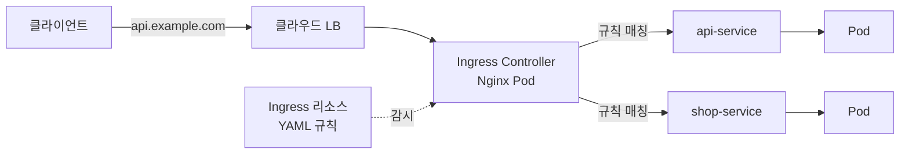

# 쿠버네티스 Ingress

> 최종 업데이트: 2026-05-14 | Kubernetes 1.30+ / Gateway API v1.5 기준

## 개념

쿠버네티스 Ingress는 **클러스터 외부에서 들어오는 HTTP/HTTPS 트래픽을 클러스터 내부 Service로 라우팅하는 리소스**다. 호스트명/경로 기반 규칙을 YAML로 선언하면, 별도 **Ingress Controller**가 그 규칙을 실제 라우팅 동작으로 구현한다.

> 호텔 로비의 안내 데스크와 같다. 손님(요청)이 "1203호 가려고요"라고 말하면(Host/Path), 데스크(Ingress)가 안내 규칙표를 보고 해당 객실(Service)로 보내준다. 데스크가 없으면 손님은 객실 번호를 외워서 직접 찾아가야 한다.

- "ingress = 들어오는 트래픽"이라는 [[Ingress|일반 네트워크 개념]]에서 이름을 따온 K8s 전용 리소스
- 한 개의 공인 IP/LoadBalancer로 여러 서비스를 분기 처리해 비용·관리 효율을 높인다
- TLS 인증서 종료(termination), 가상 호스팅, 경로 기반 라우팅을 표준화한 진입점

## 배경/역사

| 시기 | 사건 |
|---|---|
| 2015~2016 | Kubernetes 1.1에서 `Ingress` 베타 도입. Service의 `LoadBalancer` 타입이 서비스마다 외부 LB를 하나씩 붙여야 했던 비효율을 해결하려는 시도 |
| 2019 (v1.18) | `networking.k8s.io/v1`로 GA 승격 |
| 2020~2024 | 각 Controller(Nginx, Traefik, HAProxy, AWS ALB 등)가 **annotation으로 기능 확장** → 표준 스펙 부족이 드러남. 같은 Ingress 리소스라도 Controller에 따라 동작이 달라지는 파편화 문제 |
| 2023~2025 | **Gateway API** 표준 작업 본격화. 역할 분리(인프라/앱), 다중 프로토콜, 표준 라우팅 규칙 등 Ingress의 한계 해결 목적 |
| **2026-02** | **Gateway API v1.5 정식 릴리스** — TLSRoute, HTTPRoute CORS, ListenerSet 등 Standard 채널로 승격 |
| **2026-03** | **Ingress-NGINX 프로젝트 공식 은퇴(retirement)**. Ingress API는 **frozen** 상태로 유지보수만 진행. K8s 공식 권장: **Gateway API로 마이그레이션** |

> 즉, 2026년 현재 Ingress는 **여전히 널리 쓰이지만 새 기능은 추가되지 않는 "동결" 상태**이며, 신규 설계는 Gateway API가 권장된다. 자세한 비교는 아래 "Ingress vs Gateway API" 섹션 참고.

## 왜 필요한가 — Service만으로 안 되는 이유

| 방식 | 한계 |
|---|---|
| `Service: ClusterIP` | 클러스터 내부에서만 접근 가능, 외부 노출 불가 |
| `Service: NodePort` | 노드 IP의 고정 포트(30000~32767) 노출 — 도메인/경로 라우팅 불가, 포트 관리 번거로움 |
| `Service: LoadBalancer` | 서비스마다 클라우드 LB가 1:1로 붙음 → **비용 증가**, TLS 인증서 분산, 도메인별 분기 불가 |
| **Ingress** | **하나의 LB로 여러 서비스 분기**, host/path 라우팅, TLS 통합 관리 |

## 구조 — 리소스와 컨트롤러는 별개

쿠버네티스 Ingress는 **두 가지가 짝**이다:

| 구성요소 | 역할 | 형태 |
|---|---|---|
| **Ingress 리소스** | "어느 호스트/경로를 어느 Service로" 라우팅 규칙 선언 | YAML (kubectl apply) |
| **Ingress Controller** | 위 규칙을 읽어 실제 프록시(L7) 동작으로 구현 | 클러스터에 배포된 Pod (Nginx, Traefik 등) |

> Ingress 리소스만 생성하고 Controller가 없으면 **아무 일도 안 일어난다**. 둘이 세트라는 점이 입문자가 가장 자주 헤매는 부분.



## 라우팅 규칙

### Host-based (가상 호스팅)

```yaml
apiVersion: networking.k8s.io/v1
kind: Ingress
metadata:
  name: host-routing
spec:
  rules:
    - host: api.example.com
      http:
        paths:
          - path: /
            pathType: Prefix
            backend:
              service: { name: api-service, port: { number: 80 } }
    - host: shop.example.com
      http:
        paths:
          - path: /
            pathType: Prefix
            backend:
              service: { name: shop-service, port: { number: 80 } }
```

### Path-based

```yaml
spec:
  rules:
    - host: example.com
      http:
        paths:
          - path: /api
            pathType: Prefix
            backend: { service: { name: api-service, port: { number: 80 } } }
          - path: /admin
            pathType: Prefix
            backend: { service: { name: admin-service, port: { number: 80 } } }
```

### pathType 종류

| 값 | 매칭 방식 | 예시 |
|---|---|---|
| `Prefix` | 접두사 매칭 | `/api` → `/api`, `/api/v1`, `/api/users` |
| `Exact` | 완전 일치 | `/api` → `/api`만 (단, `/api/v1`은 매칭 X) |
| `ImplementationSpecific` | Controller가 알아서 처리 (정규식 등) | Controller 의존 |

## TLS / HTTPS

인증서를 Secret으로 만들어두고 Ingress에서 참조하면 **TLS 종료(termination)** 가 Controller에서 처리된다.

```yaml
apiVersion: v1
kind: Secret
metadata:
  name: tls-cert
type: kubernetes.io/tls
data:
  tls.crt: <base64-encoded>
  tls.key: <base64-encoded>
---
apiVersion: networking.k8s.io/v1
kind: Ingress
metadata:
  name: tls-ingress
spec:
  tls:
    - hosts: [api.example.com]
      secretName: tls-cert
  rules:
    - host: api.example.com
      http:
        paths:
          - path: /
            pathType: Prefix
            backend: { service: { name: api-service, port: { number: 443 } } }
```

> 실무에서는 **cert-manager + Let's Encrypt** 조합으로 인증서 자동 발급·갱신을 거의 표준처럼 쓴다.

## 주요 Ingress Controller

| Controller | 특징 | 비고 |
|---|---|---|
| **Ingress-NGINX** | 가장 널리 쓰이던 표준 | **2026-03 공식 은퇴**, 신규 도입 비권장 |
| **NGINX Inc. NGINX Ingress Controller** | NGINX Inc.(F5)의 공식 상용/오픈소스 버전 (위와 다름) | 유지보수 활발 |
| **Traefik** | 자동 서비스 디스커버리, 대시보드 내장 | 설정이 간결, 작은 클러스터에 인기 |
| **HAProxy Ingress** | 고성능, 세밀한 TCP/HTTP 제어 | 트래픽 많은 환경 |
| **AWS Load Balancer Controller** | ALB/NLB 네이티브 연동 | EKS 표준 선택 |
| **GCE Ingress** | GCP L7 LB 연동 | GKE 기본 |
| **Cilium** | eBPF 기반, Gateway API 지원 우수 | 차세대 선택지 |
| **Istio Gateway** | 서비스 메시와 통합 | mTLS, 트래픽 분할 등 고급 기능 |

## 어노테이션 — Controller별 확장

표준 Ingress 스펙에 빠진 기능들은 **어노테이션**으로 채워졌고, 바로 이 점이 Gateway API 등장의 원인이 되었다.

```yaml
metadata:
  annotations:
    # Nginx Ingress Controller 예시
    nginx.ingress.kubernetes.io/rewrite-target: /
    nginx.ingress.kubernetes.io/ssl-redirect: "true"
    nginx.ingress.kubernetes.io/proxy-body-size: 10m

    # AWS ALB Controller 예시
    alb.ingress.kubernetes.io/scheme: internet-facing
    alb.ingress.kubernetes.io/target-type: ip
```

같은 Ingress 리소스라도 어노테이션 prefix가 다르면 다른 Controller에서는 무시된다 → **이식성 떨어짐**.

## Ingress vs Gateway API (2026 기준)

| 구분 | Ingress | Gateway API |
|---|---|---|
| 상태 | **Frozen** (신규 기능 X) | **활발히 개발**, v1.5 Standard 채널 (2026-02) |
| 표준 기능 범위 | HTTP/HTTPS 라우팅 중심 | HTTP, HTTPS, TCP, UDP, gRPC, TLS passthrough |
| 확장 방식 | **어노테이션** (Controller별 비표준) | **표준 리소스**(HTTPRoute, TLSRoute 등) |
| 역할 분리 | 단일 리소스 | **GatewayClass(플랫폼)** / **Gateway(인프라)** / **Route(앱팀)** 분리 |
| RBAC | 거친 단위 | 역할별 세밀한 RBAC |
| 라우팅 고급 기능 | 어노테이션으로 흉내 | 헤더 기반 라우팅, 트래픽 분할(canary), 가중치 등 표준 지원 |
| 마이그레이션 | — | **Ingress2Gateway 1.0** (2026-03) — 30+ 어노테이션 자동 변환 |

> **권장 방향**: 신규 클러스터/서비스는 **Gateway API**로 시작. 기존 Ingress 운영 환경은 [Ingress2Gateway](https://github.com/kubernetes-sigs/ingress2gateway)로 단계적 마이그레이션.

### Gateway API 최소 예시

```yaml
apiVersion: gateway.networking.k8s.io/v1
kind: HTTPRoute
metadata:
  name: api-route
spec:
  parentRefs:
    - name: my-gateway
  hostnames: [api.example.com]
  rules:
    - matches:
        - path: { type: PathPrefix, value: / }
      backendRefs:
        - name: api-service
          port: 80
```

## 관련 문서

- [[쿠버네티스-Gateway-API]] — Ingress의 후속 표준, 2026년 현재 권장 진입점
- [[Ingress]] — 일반 네트워크 개념으로서의 ingress/egress 방향성
- [[쿠버네티스-네트워킹]] — Service, CoreDNS, external-dns 등 클러스터 네트워킹 전반
- [[쿠버네티스-오브젝트]] — Service, Deployment 등 다른 리소스 타입
- [[방화벽]] — ingress/egress rule 관점
