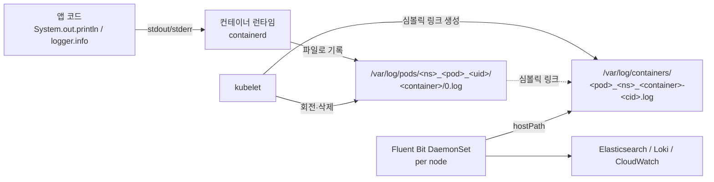

# 쿠버네티스 Pod 로그 저장 방식

> 최종 업데이트: 2026-05-12 | Kubernetes 1.28+ / containerd 1.7+ / EKS 1.29+ 기준

## 개념

쿠버네티스에서 컨테이너 로그는 **앱이 직접 파일에 쓰는 게 아니라, 컨테이너 런타임이 stdout/stderr 스트림을 가로채 노드 파일시스템의 정해진 경로에 기록**한다. 그래서 앱은 로그 경로·파일명을 몰라도 되고, 클러스터는 표준화된 한 곳만 보면 모든 파드 로그를 수집할 수 있다.

> 비유: 회사 사무실의 우편 시스템과 같다. 직원(앱)은 그냥 봉투에 내용을 써서 책상 위(stdout/stderr)에 올려두면, 우편실 직원(컨테이너 런타임)이 정해진 시각마다 회수해서 **층별 우편함 룸**(`/var/log/pods/`)에 분류해 보관한다. 외부 우편 회사(Fluent Bit)는 그 우편함만 보면 되니까, 직원 책상 위치를 일일이 알 필요가 없다.

핵심 명제 3가지:
1. **앱은 stdout/stderr만 쓴다** — 파일 경로는 컨테이너 런타임의 책임
2. **`/var/log/pods/`가 원본, `/var/log/containers/`는 평탄화된 심볼릭 링크**
3. **그 노드에 떠 있는 컨테이너 로그만** 거기에 있다 — 다른 노드 로그는 없음 (DaemonSet으로 수집해야 하는 이유)

## 배경/역사

| 시기 | 변화 |
|------|------|
| **~2020** Kubernetes 초기 | Docker가 사실상 표준 런타임 → 로그는 Docker JSON-file 로깅 드라이버(`/var/lib/docker/containers/<id>/<id>-json.log`)에 저장 |
| **2020-12** Kubernetes 1.20 | Docker shim **deprecated** 발표 |
| **2022-04** Kubernetes 1.24 | **Docker shim 제거** — 표준 런타임이 **containerd** / CRI-O로 전환 |
| **2024+** | 거의 모든 매니지드 K8s(EKS·GKE·AKS)가 **containerd 기본**. 로그 경로도 containerd 규격(`/var/log/pods/...`)으로 통일 |

> **CRI(Container Runtime Interface)**: kubelet ↔ 런타임 사이의 표준 인터페이스. CRI를 따르는 런타임은 모두 같은 로그 파일 경로 규칙을 따른다(`/var/log/pods/<ns>_<pod>_<uid>/<container>/0.log`). 그래서 EKS·GKE·AKS·온프렘 모두 동일.

## 로그가 흐르는 경로



| 단계 | 주체 | 동작 |
|---|---|---|
| 1 | 앱 | `stdout` / `stderr`에 한 줄 출력 |
| 2 | 컨테이너 런타임(containerd) | 그 스트림을 가로채 노드 파일시스템의 `/var/log/pods/<...>/0.log`에 append |
| 3 | kubelet | `/var/log/containers/` 아래에 사용자 친화 이름으로 심볼릭 링크 생성 |
| 4 | kubelet | 파일 크기 도달 시 회전, 파드 삭제 시 정리 |
| 5 | Fluent Bit (DaemonSet) | `/var/log/containers/*.log`를 hostPath로 읽어 외부 sink로 전송 |

## 디렉토리 구조

### `/var/log/pods/` — 진짜 파일이 사는 곳

```
/var/log/pods/
  default_payment-7d4f-abc_18a3b9e2-uid/
    payment/
      0.log                ← 진짜 파일 (containerd가 직접 append)
      0.log.20260510-0712  ← 회전된 백업 (gzip 압축은 옵션)
    sidecar/
      0.log                ← 같은 파드의 사이드카 컨테이너
  kube-system_coredns-xxx_yyy-uid/
    coredns/
      0.log
```

- 디렉토리명 패턴: `<namespace>_<pod>_<uid>`
- 그 안에 **컨테이너 이름 디렉토리** 하나씩 — 한 파드에 컨테이너가 3개면 디렉토리도 3개
- 컨테이너 재시작 시 `0.log`가 회전되고 새 컨테이너 인스턴스의 새 `0.log`가 시작

### `/var/log/containers/` — 평탄화된 심볼릭 링크

```
/var/log/containers/
  payment-7d4f-abc_default_payment-d3a8f2c9e1...log   → /var/log/pods/default_payment-7d4f-abc_18a3b9e2-uid/payment/0.log
  payment-7d4f-abc_default_sidecar-7b1e0c3a8d...log   → /var/log/pods/default_payment-7d4f-abc_18a3b9e2-uid/sidecar/0.log
  coredns-xxx_kube-system_coredns-9af2...log          → /var/log/pods/kube-system_coredns-xxx_yyy-uid/coredns/0.log
```

- 파일명 패턴: `<pod>_<namespace>_<container>-<containerID>.log`
- 모두 **심볼릭 링크** — 실제 데이터는 `/var/log/pods/` 쪽에 있음
- 로그 수집기가 `glob /var/log/containers/*.log` 한 줄로 **모든 파드 로그**를 잡을 수 있는 이유

| 디렉토리 | 누가 만듦 | 실체 | 용도 |
|---|---|---|---|
| `/var/log/pods/` | containerd | **실제 파일** | 원본 저장소 |
| `/var/log/containers/` | kubelet | **심볼릭 링크** | 수집기 편의용 평탄화 뷰 |

## 로그 수집기는 어느 경로를 읽는가 — 두 패턴 공존

심볼릭 링크 덕분에 둘 중 어느 쪽을 입력으로 잡아도 **읽히는 파일의 실제 내용은 같다** (같은 디스크 블록). 다만 미묘한 운영 차이가 있어 두 패턴이 공존한다.

| 입력 path | 특징 | 흔한 사용처 |
|---|---|---|
| `Path /var/log/containers/*.log` | 평탄한 glob 한 줄. 파일명만 파싱해도 pod·ns·container 추출 가능 | **기존 표준** — Fluentd/Fluent Bit 대부분의 예제, EFK 가이드 |
| `Path /var/log/pods/*/*/*.log` | 디렉토리 구조에서 메타데이터 추출. 심볼릭 링크 미경유 | **AWS 공식 최신 권장**(`aws-for-fluent-bit`), 일부 대규모 운영 |

**`/var/log/pods/`를 직접 읽는 게 유리한 경우**

| 시나리오 | 이유 |
|---|---|
| inotify watch 안정성 | 심볼릭 링크 watch는 일부 환경에서 새 파일 감지 누락. 원본 디렉토리 watch가 안전 |
| 회전 백업까지 수집 | `0.log.20260510-...` 회전 파일도 같은 디렉토리에 있어 glob 포함 쉬움 |
| 컨테이너 ID 노이즈 회피 | `/var/log/containers/`는 파일명에 컨테이너 ID 포함 → 재시작마다 이름 바뀜 → tail 상태 관리 복잡 |
| 심볼릭 링크 비신뢰 환경 | SecurityContext·AppArmor 등이 심볼릭 추적을 차단하는 경우 |
| 일부 K8s 배포판 | `/var/log/containers/` 심볼릭 생성을 보장 안 하는 CRI 구현이 드물게 존재 |

→ 트래픽이 매우 많거나 보안 정책이 엄격한 환경이 아니면 **`/var/log/containers/` 사용이 여전히 무난한 기본**. 신규 셋업이라면 AWS 공식 예제처럼 `/var/log/pods/`를 검토해볼 만함.

## 파일 명명에서 얻을 수 있는 메타데이터

`/var/log/containers/`의 파일명만 파싱해도 다음 정보가 모두 나옴:

```
payment-7d4f-abc_default_payment-d3a8f2c9e1b4...log
└─────────┬──────┘ └──┬───┘ └──┬──┘ └──────┬──────┘
       pod 이름     네임      컨테이너   컨테이너 ID
                  스페이스    이름
```

→ Fluent Bit의 `kubernetes` 필터는 이걸 정규식으로 파싱해 라벨로 붙여준다. K8s API 호출 없이도 기본 메타데이터를 알 수 있음.

> 더 풍부한 메타데이터(파드 라벨, 어노테이션, 노드명 등)는 K8s API 호출이 필요해서 `kubernetes_metadata_filter` 같은 별도 플러그인이 처리.

## 로그 로테이션

kubelet이 관리. 기본값은 보수적이라 운영에서는 보통 늘려준다.

| 설정 (kubelet) | 기본값 | 의미 |
|---|---|---|
| `containerLogMaxSize` | `10Mi` | 단일 로그 파일 크기 한도 — 도달 시 회전 |
| `containerLogMaxFiles` | `5` | 보관할 회전 파일 개수 — 넘으면 가장 오래된 것 삭제 |
| `containerLogMaxWorkers` | `1` | 회전 작업 동시성 (1.30+) |
| `containerLogMaxMonitorInterval` | `10s` | 크기 점검 간격 (1.30+) |

```
0.log                      ← 현재 활성 (가장 최신)
0.log.20260510-071245      ← 회전됨
0.log.20260510-064102
0.log.20260510-053018
0.log.20260510-041924      ← 5번째 (다음 회전 시 삭제)
```

> **운영 함정**: 기본 10MB × 5 = 50MB만 노드에 보관. 트래픽 많은 파드는 **수 분 만에** 회전돼서 옛 로그가 사라짐. Fluent Bit이 그 사이 못 읽으면 **영구 손실**. EKS에서는 노드 그룹의 kubelet config에서 `containerLogMaxSize: 100Mi`, `containerLogMaxFiles: 10` 정도로 늘리는 게 일반적.

## 컨테이너/파드 라이프사이클과 로그 파일

| 이벤트 | 로그 파일에 일어나는 일 |
|---|---|
| 컨테이너 시작 | 새 `0.log` 시작, `/var/log/containers/`에 새 컨테이너 ID로 심볼릭 링크 생성 |
| **컨테이너 재시작**(같은 파드 안) | 새 컨테이너 ID 발급 → **새 디렉토리·새 심볼릭 링크** 생성. 이전 파일은 일정 시간 후 정리됨 |
| 파드가 다른 노드로 재스케줄 | 옛 노드의 `/var/log/pods/<...>/`는 일정 시간 후 삭제. 새 노드에서 새로 시작 |
| **파드 삭제** | `/var/log/pods/<ns>_<pod>_<uid>/` **통째로 삭제** — 수집되지 않은 로그는 영구 손실 |
| 노드 재시작 | 컨테이너 다시 시작되며 로그 파일도 새로 시작. 기존 회전 파일은 디스크에 남아 있을 수 있음 |

> 그래서 **Fluent Bit이 충분히 빨리 따라잡고 있는지**가 핵심. 파드 삭제와 회전 사이의 경주를 이기지 못하면 로그가 사라진다.

## stdout/stderr 황금률 — 왜 이게 절대 규칙인가

```java
// ✅ 권장 — 노드 파일시스템에 자동 기록
logger.info("payment processed");           // stdout으로 흐름
System.err.println("error happened");       // stderr로 흐름

// ❌ 안 됨 — 컨테이너 안에만 남음
new FileWriter("/app/logs/app.log");        // 노드에선 안 보임. Fluent Bit이 수집 불가
```

| 출력 방식 | 노드 파일시스템에서 보이나? | 파드 삭제 시 |
|---|---|---|
| `stdout` / `stderr` | **예** (`/var/log/pods/...`) | 디렉토리 삭제 (수집 못 했으면 손실) |
| 컨테이너 내부 파일 (`/app/logs/...`) | **아니오** (컨테이너 파일시스템에 갇힘) | 컨테이너 종료와 함께 즉시 소멸 |
| `emptyDir` 볼륨에 쓰기 | 파드 안에서만 보임 | 파드 삭제 시 함께 소멸 |
| 영구 볼륨(PVC/EFS) | 노드 외부 스토리지에 보존 | 살아남지만 K8s 표준 수집 경로 아님 |

> 그래서 **12-factor App**도 "로그는 이벤트 스트림으로 stdout에"라고 못 박음. 컨테이너 시대의 표준 답안.

### 그래도 파일 로그를 써야 한다면

레거시 앱·라이브러리 제약으로 파일 로그가 강제되는 경우의 우회 패턴:

```yaml
# 사이드카 패턴: 앱은 emptyDir에 파일로 쓰고, 사이드카가 그걸 tail해서 stdout으로 흘려보냄
spec:
  containers:
    - name: app
      volumeMounts:
        - name: applogs
          mountPath: /app/logs
    - name: log-streamer
      image: busybox
      command: ["/bin/sh", "-c", "tail -F /app/logs/app.log"]   # → 이 사이드카의 stdout이 K8s 표준 경로로
      volumeMounts:
        - name: applogs
          mountPath: /app/logs
  volumes:
    - name: applogs
      emptyDir: {}
```

→ 결국 **누군가는 stdout으로 흘려보내야** 표준 수집 파이프라인에 태울 수 있다.

## EKS 특이사항

대부분은 K8s 표준 동작과 동일. EKS만의 추가 포인트는 다음 정도.

| 항목 | EKS에서의 특징 |
|---|---|
| 컨테이너 런타임 | EKS 1.24+는 **containerd 기본** (Docker shim 제거 이후). 따라서 로그 경로는 `/var/log/pods/...` 표준 |
| AMI | EKS Optimized AMI는 위 kubelet 설정이 기본값으로 박혀 있음 — 커스텀하려면 **Launch Template + User Data**로 kubelet config 오버라이드 |
| 로그 수집 표준 | **Fluent Bit DaemonSet** (`aws-for-fluent-bit` 이미지) + **CloudWatch Container Insights** 조합이 AWS 공식 권장 |
| 권한 | Fluent Bit이 CloudWatch에 쓰려면 **IRSA**(IAM Roles for Service Accounts)로 IAM Role 부여 |
| Fargate | DaemonSet 미지원 → **사이드카 패턴** 또는 Fargate Logging(CloudWatch/Kinesis 직접 전송)으로 대체 |
| 로그 보관 | 노드 로컬은 50MB 기본. 장기 보관은 CloudWatch Logs / S3 |

### EKS Fluent Bit 권장 셋업

```yaml
apiVersion: apps/v1
kind: DaemonSet
metadata:
  name: fluent-bit
  namespace: amazon-cloudwatch
spec:
  selector:
    matchLabels:
      k8s-app: fluent-bit
  template:
    spec:
      serviceAccountName: fluent-bit       # IRSA로 CloudWatch 권한 부여
      tolerations:
        - operator: Exists                 # 모든 taint 허용 → 클러스터 전 노드 커버
      containers:
        - name: fluent-bit
          image: public.ecr.aws/aws-observability/aws-for-fluent-bit:stable
          volumeMounts:
            - name: varlog
              mountPath: /var/log
              readOnly: true
      volumes:
        - name: varlog
          hostPath:
            path: /var/log                 # 노드의 /var/log를 통째로 마운트
```

핵심은 **hostPath로 노드의 `/var/log`를 그대로 보여주는 것**. 이 한 디렉토리만 있으면 `/var/log/containers/`와 `/var/log/pods/`가 모두 보인다.

## 흔한 함정

### 1. 컨테이너 안에 파일로 로그 쓰기

가장 자주 만나는 안티패턴. **컨테이너 종료 시 즉시 소멸**, K8s 표준 경로에 안 보임, Fluent Bit이 수집 불가. → stdout 강제 또는 사이드카 tail.

### 2. 회전 주기보다 느린 수집

기본 `10Mi × 5` = 50MB만 노드에 보관. 트래픽 많으면 분 단위로 회전됨. Fluent Bit이 처리 능력보다 로그가 빨리 쌓이면 **회전되어 사라진 로그를 영영 못 읽음**.

→ `containerLogMaxSize`를 100Mi 이상으로 늘리거나, Fluent Bit 리소스·스레드 늘리거나, 출력 sink의 백프레셔 점검.

### 3. `pos_file` 미설정

Fluent Bit의 `tail` 입력은 "어디까지 읽었는지"를 `pos_file`에 기록. 이게 메모리에 있거나 hostPath가 아닌 곳에 있으면 **DaemonSet 파드 재시작 시 처음부터 다시 읽거나, 그 사이 회전된 로그를 건너뜀**.

```ini
[INPUT]
    Name              tail
    Path              /var/log/containers/*.log
    DB                /var/log/flb-state/flb.db   # hostPath로 영속화 권장
```

### 4. 멀티라인 로그 (스택트레이스)

Java 예외 스택트레이스는 한 이벤트지만 여러 줄. 기본 `tail`은 줄마다 별개 이벤트로 끊음 → 검색·인덱싱 깨짐.

→ 앱에서 **JSON 한 줄 로깅**(`logstash-logback-encoder`)으로 출력하거나, Fluent Bit `multiline` 파서로 결합.

### 5. 로그 양 통제 부재

DEBUG/TRACE 그대로 보내면 CloudWatch·Elasticsearch 인제스트 비용 폭증. Fluent Bit Filter에서 `grep` exclude 또는 sampling.

### 6. 컨테이너 ID로 식별하려 시도

심볼릭 링크 파일명의 컨테이너 ID는 **재시작 때마다 바뀜**. 식별자로 부적절. **파드 이름 + 네임스페이스 + 컨테이너 이름** 조합을 쓸 것.

### 7. Fargate에 DaemonSet 배포 시도

Fargate 노드는 사용자가 제어 불가 → DaemonSet 스케줄 안 됨. **사이드카** 또는 **Fargate 로깅 구성**으로 우회.

### 8. `kubectl logs`와 외부 수집기 혼동

`kubectl logs`는 **kubelet이 노드의 같은 파일을 읽어 반환**하는 것. 즉 외부 수집기와 동일한 소스. 다만 회전된 백업은 못 보고 현재 컨테이너 인스턴스 기준만 보임 (`--previous`로 이전 인스턴스 1개까지).
| Fargate 파드 로그가 안 수집됨 | DaemonSet 미지원 → Fargate Logging 구성(CloudWatch/Firehose) |
| 파드 삭제 후 마지막 로그가 안 보임 | terminationGracePeriod 짧음 + 수집 지연 → grace 늘리거나 preStop 훅에서 flush 대기 |
| 디스크 가득 참 (`/var/log`) | 로테이션 설정·Fluent Bit 버퍼·기타 시스템 로그 점검. 노드 evict 위험 |
| `kubectl logs --previous`가 빈 응답 | 컨테이너 첫 시작 또는 회전된 이전 파일 삭제됨 |

## 관련 문서

- [[쿠버네티스-Pod]] — Pod 자체의 라이프사이클·구성
- [[쿠버네티스-개념]] — 클러스터 전체 개념
- [[../로깅-서비스/fluentd]] — 이 로그 파일들을 수집해 외부로 보내는 수집기
- [[../로깅-서비스/Loki]] — 수집된 로그를 저장·검색하는 백엔드
- [[../../AWS/EKS/EKS-AMI]] — EKS 노드 AMI 및 kubelet 설정 커스터마이징

## 참조

- Kubernetes 공식 로깅 아키텍처: https://kubernetes.io/docs/concepts/cluster-administration/logging/
- kubelet 로그 회전 옵션: https://kubernetes.io/docs/reference/config-api/kubelet-config.v1beta1/
- CRI 로그 포맷 명세: https://github.com/kubernetes/community/blob/master/contributors/design-proposals/node/kubelet-cri-logging.md
- AWS for Fluent Bit: https://github.com/aws/aws-for-fluent-bit
- EKS Container Insights: https://docs.aws.amazon.com/AmazonCloudWatch/latest/monitoring/Container-Insights.html
- 12-Factor App XI. Logs: https://12factor.net/logs
