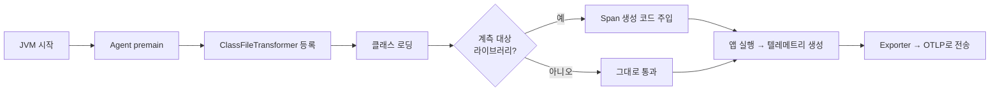

# OpenTelemetry Java Agent (자동 계측)

> 최종 업데이트: 2026-05-27 | 기준: opentelemetry-java-instrumentation 2.x

## 개념

**OpenTelemetry Java Agent**는 **애플리케이션 코드를 한 줄도 고치지 않고** 추적(trace)·메트릭(metric)·로그(log)를 자동 수집해주는 JAR 파일이다. JVM 실행 시 `-javaagent` 옵션으로 끼워 넣으면, 실행 중인 바이트코드를 가로채 관측(observability) 코드를 자동으로 주입한다. 이런 방식을 **zero-code instrumentation(무코드 계측)** 이라 부른다.

> 비유하자면 자동차를 분해하지 않고 **블랙박스를 장착**하는 것과 같다. 엔진(애플리케이션 코드)은 그대로 두고, 주행 기록(텔레메트리)만 알아서 찍어준다. Spring, JDBC, HTTP 클라이언트 같은 주요 부품을 지날 때마다 자동으로 기록이 남는다.

OpenTelemetry 자체의 개념·기능은 [opentelemetry.md](opentelemetry.md)를 참고하고, 이 문서는 그중 **Java Agent를 통한 자동 계측**에 집중한다.

## 배경/역사

- **상위 프로젝트**: OpenTelemetry — 2019년 CNCF에서 **OpenTracing + OpenCensus**가 합쳐져 출범한 관측성 표준 프로젝트
- **Java Agent**: `open-telemetry/opentelemetry-java-instrumentation` 저장소에서 관리되며, Apache 2.0 라이선스
- **기술적 토대**: Java 표준 `java.lang.instrument` API와 바이트코드 조작 라이브러리 **[Byte Buddy](https://bytebuddy.net/)** 위에서 동작
- **버전 흐름**: 1.x를 거쳐 **2.0(2024년)** 부터 안정화된 API/시맨틱 컨벤션을 채택. 현재 2.x 라인이 표준

## Java Agent란 — premain 메커니즘

**Java Agent**는 OpenTelemetry만의 개념이 아니라 **JVM이 제공하는 표준 확장 기능**이다. `main()`보다 먼저 실행되는 `premain()` 진입점을 가진 특수 JAR로, 클래스가 로딩되는 순간에 개입할 수 있다.

| 단계 | 동작 |
| --- | --- |
| **1. premain 호출** | JVM이 `main()` 실행 전, Agent의 `premain()` 메서드를 먼저 호출 |
| **2. Transformer 등록** | Agent가 `ClassFileTransformer`를 JVM에 등록 |
| **3. 클래스 로딩 가로채기** | 이후 클래스가 로딩될 때마다 Transformer가 바이트코드를 받아봄 |
| **4. 바이트코드 재작성** | 대상 클래스(예: Spring 컨트롤러)에 텔레메트리 수집 코드를 삽입 |

> 즉 "코드를 고치는" 게 아니라, **JVM 메모리에 올라가는 순간의 바이트코드를 다시 쓰는** 방식이다. 그래서 원본 소스나 빌드 결과물(jar)은 전혀 건드리지 않는다.

## 동작 원리 — 바이트코드 계측

OTel Agent는 Byte Buddy를 이용해, 자기가 알고 있는 라이브러리(Spring MVC, JDBC, Kafka, OkHttp 등)의 특정 메서드 진입/종료 지점에 Span 생성·종료 코드를 끼워 넣는다.



요청이 서비스 A → B → C로 흐를 때, Agent는 **trace context(traceparent 헤더)** 를 HTTP/메시지에 자동으로 실어 보내고 받는다. 덕분에 여러 서비스에 걸친 하나의 요청이 **단일 trace로 연결**된다(분산 추적).

## 적용 방법

릴리스 페이지에서 `opentelemetry-javaagent.jar`를 받아 JVM 옵션으로 붙이기만 하면 된다.

```bash
# -javaagent 플래그로 Agent 부착
java -javaagent:./opentelemetry-javaagent.jar \
     -jar myapp.jar
```

```bash
# 환경변수로 서비스명과 수집 서버(Collector) 지정
export OTEL_SERVICE_NAME=order-service
export OTEL_EXPORTER_OTLP_ENDPOINT=http://otel-collector:4317
java -javaagent:./opentelemetry-javaagent.jar -jar myapp.jar
```

```dockerfile
# 컨테이너에서는 JAVA_TOOL_OPTIONS로 주입하는 방식도 흔함
ENV JAVA_TOOL_OPTIONS="-javaagent:/otel/opentelemetry-javaagent.jar"
```

## 주요 설정 (환경변수 / 시스템 프로퍼티)

설정은 **환경변수**(`OTEL_*`) 또는 **시스템 프로퍼티**(`-Dotel.*`) 두 방식 모두 지원하며, 동일 항목은 시스템 프로퍼티가 우선한다.

| 환경변수 | 시스템 프로퍼티 | 역할 |
| --- | --- | --- |
| `OTEL_SERVICE_NAME` | `otel.service.name` | 서비스 이름 (대시보드에서 식별되는 단위) |
| `OTEL_EXPORTER_OTLP_ENDPOINT` | `otel.exporter.otlp.endpoint` | Collector 주소 (gRPC `4317` / HTTP `4318`) |
| `OTEL_TRACES_EXPORTER` | `otel.traces.exporter` | trace 내보내기 방식 (`otlp` 기본, `none`으로 끔) |
| `OTEL_METRICS_EXPORTER` | `otel.metrics.exporter` | metric 내보내기 방식 |
| `OTEL_LOGS_EXPORTER` | `otel.logs.exporter` | log 내보내기 방식 |
| `OTEL_TRACES_SAMPLER` | `otel.traces.sampler` | 샘플링 전략 (`parentbased_traceidratio` 등) |
| `OTEL_RESOURCE_ATTRIBUTES` | `otel.resource.attributes` | 공통 태그 (`deployment.environment=prod` 등) |
| `OTEL_PROPAGATORS` | `otel.propagators` | context 전파 형식 (`tracecontext,baggage` 기본) |

> **OTLP**(OpenTelemetry Protocol)는 텔레메트리 전송 표준 프로토콜이다. Agent는 데이터를 OTLP로 **OpenTelemetry Collector**에 보내고, Collector가 다시 Tempo·Jaeger·Prometheus 등 백엔드로 분배한다. 샘플링은 "모든 요청을 다 기록하면 비용이 크니, 일부 비율만 추적하라"는 설정이다.

## 자동 계측(Agent) vs 수동 계측(SDK)

같은 OpenTelemetry라도 적용 방식이 둘로 나뉜다. 둘은 **함께 쓸 수 있다** — Agent로 큰 그림을 자동 수집하고, 중요한 비즈니스 구간만 SDK로 직접 계측하는 식이다.

| 구분 | 자동 계측 (Java Agent) | 수동 계측 (SDK / API) |
| --- | --- | --- |
| **코드 수정** | 불필요 (zero-code) | 필요 (`@WithSpan`, Tracer API 직접 호출) |
| **적용 범위** | 지원하는 라이브러리 경계 자동 | 원하는 임의 지점 |
| **장점** | 빠른 도입, 표준 구간 일괄 수집 | 비즈니스 의미 단위로 세밀한 추적 |
| **단점** | 내부 커스텀 로직은 안 잡힘 | 코드 침투, 유지보수 부담 |

```java
// 수동 계측 예 — Agent가 함께 떠 있으면 @WithSpan 한 줄로 커스텀 Span 추가
@WithSpan
public Order placeOrder(Cart cart) { ... }
```

## 지원 라이브러리

Agent는 Java 8 이상에서 동작하며, **대부분의 인기 프레임워크/라이브러리와 주요 애플리케이션 서버**를 기본 지원한다.

- **웹/프레임워크**: Spring MVC, Spring WebFlux, Servlet, JAX-RS
- **HTTP 클라이언트**: OkHttp, Apache HttpClient, Java `HttpClient`
- **DB/데이터**: JDBC, Hibernate, MongoDB, Redis(Lettuce/Jedis)
- **메시징**: Kafka, RabbitMQ, JMS
- **앱 서버**: Tomcat, Jetty, WildFly, WebLogic

특정 계측만 끄고 싶을 때는 `-Dotel.instrumentation.<name>.enabled=false`로 개별 비활성화할 수 있다.

## 관련 문서

- [OpenTelemetry](opentelemetry.md) — OTel 전체 개념과 분산 추적·메트릭·로그
- [Tempo](../Tempo) — 수집된 trace 저장·조회 백엔드
- [grafana](../grafana) — 텔레메트리 시각화 대시보드
- [Prometheus](../Prometheus) — 메트릭 수집·저장
