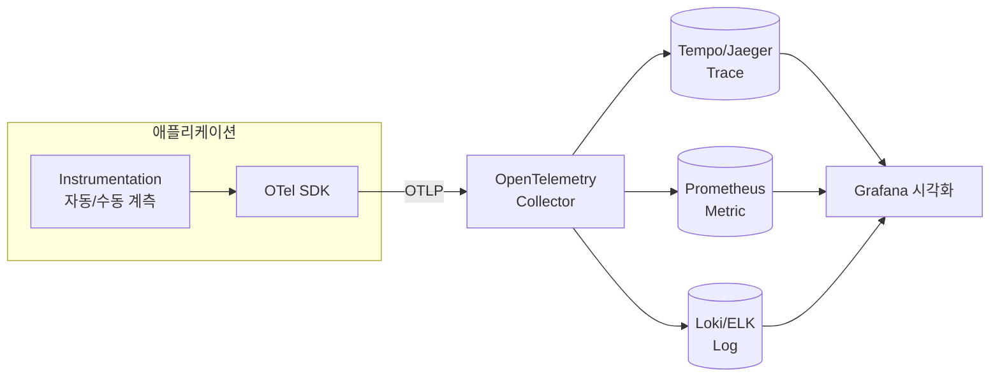

# OpenTelemetry

> 최종 업데이트: 2026-05-27 | 기준: OpenTelemetry 스펙 1.x (Traces·Metrics·Logs 안정화)

## 개념

**OpenTelemetry**(줄여서 **OTel**)는 애플리케이션의 **추적(Trace)·메트릭(Metric)·로그(Log)** 를 수집·생성·내보내기 위한 **벤더 중립(vendor-neutral) 관측성(Observability) 표준 프레임워크**다. 특정 모니터링 회사 제품에 종속되지 않고, 표준 형식으로 텔레메트리를 만들어 어떤 백엔드(Grafana, Jaeger, Datadog 등)로든 보낼 수 있는 것이 핵심이다.

> 비유하자면 **전기 콘센트의 표준 규격**과 같다. 예전엔 모니터링 도구마다 플러그(데이터 형식)가 제각각이라 갈아탈 때마다 코드를 다시 짰다. OTel은 "콘센트 규격"을 통일해, 한 번 계측해두면 어떤 도구에든 꽂아 쓸 수 있게 했다.

마이크로서비스 환경에서 여러 서비스에 걸친 요청을 추적하고 성능 병목을 찾는 데 특히 유용하다.

## 배경/역사

- **출범**: 2019년, **CNCF(Cloud Native Computing Foundation)** 산하에서 **OpenTracing**(추적 표준) + **OpenCensus**(구글의 메트릭·추적 라이브러리) 두 프로젝트가 **합쳐져** 탄생
- **등장 이유**: 두 진영으로 갈라져 있던 관측성 표준을 하나로 통일하기 위함. 현재 CNCF에서 **Kubernetes 다음으로 활발한** 프로젝트
- **언어 지원**: Java·Kotlin·Go·Python·JavaScript·.NET 등 12개 이상 언어에 SDK 제공
- **안정화 흐름**: Trace → Metric → **Log** 순으로 스펙이 안정(stable)화되어, 현재는 세 시그널 모두 정식 지원

## 세 가지 시그널 (Signals)

OTel이 다루는 텔레메트리는 **세 종류의 신호(signal)** 로 나뉜다. 이들이 **서로 연결(correlation)** 되는 것이 OTel의 강점이다 — 로그에 trace ID가 자동으로 붙어, 에러 로그 하나에서 해당 요청의 전체 흐름으로 바로 넘어갈 수 있다.

| 시그널 | 무엇을 답하나 | 예시 | 비유 |
| --- | --- | --- | --- |
| **Trace (추적)** | "이 요청이 **어디를** 거쳐갔나?" | A→B→C 서비스 호출 경로와 각 구간 소요 시간 | 택배 배송 추적 |
| **Metric (메트릭)** | "**얼마나** 많이/빠르게?" | 초당 요청 수, 응답 지연, CPU·메모리 사용률 | 자동차 계기판 |
| **Log (로그)** | "그때 **무슨 일이** 있었나?" | 이벤트 메시지, 예외 스택트레이스 | 일지/메모 |

> 하나의 요청을 추적하는 단위는 **Trace**, 그 안에서 개별 작업 구간 하나하나는 **Span**이라 부른다. 여러 Span이 부모-자식으로 묶여 하나의 Trace를 이룬다.

## 핵심 구성 요소

| 구성 요소 | 역할 |
| --- | --- |
| **API** | 코드에서 텔레메트리를 만들 때 쓰는 인터페이스 (구현과 분리되어 안정적) |
| **SDK** | API의 실제 구현체 — 샘플링·처리·내보내기 동작을 담당 |
| **Instrumentation** | 계측 코드. **자동(Java Agent)** 또는 **수동(직접 코드 작성)** 으로 데이터 생성 |
| **Exporter** | 수집한 데이터를 외부로 내보내는 모듈 (보통 **OTLP** 형식) |
| **Collector** | 텔레메트리를 받아 가공·중계하는 독립 서버 (선택 사항) |

> **OTLP**(OpenTelemetry Protocol)는 텔레메트리를 주고받는 **표준 전송 프로토콜**이다. gRPC(`4317`) 또는 HTTP(`4318`) 포트를 쓴다.

## 아키텍처



앱이 직접 백엔드로 보낼 수도 있지만, 보통 중간에 **Collector**를 두어 수집을 한 곳으로 모은다.

## OpenTelemetry Collector

**Collector**는 여러 앱에서 오는 텔레메트리를 한곳에서 **받고(Receiver) → 가공하고(Processor) → 내보내는(Exporter)** 독립 실행형 서버다.

> 비유하자면 **물류 집하장**이다. 각 매장(앱)에서 보낸 택배(데이터)를 모아, 분류·라벨링한 뒤 목적지(백엔드)별로 다시 배송한다. 앱은 "집하장 주소" 하나만 알면 되고, 백엔드를 바꿔도 앱 코드는 그대로다.

| 파이프라인 단계 | 역할 |
| --- | --- |
| **Receiver** | OTLP 등으로 데이터 수신 |
| **Processor** | 배치 처리, 속성 추가/필터링, 샘플링 |
| **Exporter** | Tempo·Prometheus 등 백엔드로 전송 |

Collector를 두면 **재시도·배치·민감정보 마스킹**을 앱이 아닌 인프라 계층에서 일괄 처리할 수 있어, 앱은 가벼워지고 백엔드 교체도 쉬워진다.

## Spring Boot 통합

Spring Boot 애플리케이션에 적용하는 방식은 크게 두 가지다. 둘은 함께 쓸 수 있다.

| 방식 | 설명 |
| --- | --- |
| **자동 계측 (Java Agent)** | `-javaagent` 옵션으로 Agent JAR을 붙여 **코드 수정 없이** 자동 수집. 도입이 가장 빠름 → 상세: [opentelemetry-agent.md](opentelemetry-agent.md) |
| **수동 계측 (SDK)** | `opentelemetry-sdk` 의존성을 추가하고, 중요한 비즈니스 구간을 직접 계측 |

```java
// 수동 계측 — 비즈니스 메서드에 커스텀 Span 추가
@WithSpan
public Order placeOrder(Cart cart) { ... }
```

```bash
# 자동 계측 — 코드 변경 없이 Agent 부착
export OTEL_SERVICE_NAME=order-service
export OTEL_EXPORTER_OTLP_ENDPOINT=http://otel-collector:4317
java -javaagent:./opentelemetry-javaagent.jar -jar app.jar
```

수집된 데이터는 Jaeger·Zipkin(추적), Prometheus(메트릭), Grafana(통합 시각화) 등과 연동해 대시보드에서 본다.

## 왜 쓰는가 — 장점

- **벤더 중립**: 한 번 계측하면 백엔드(Grafana/Datadog/New Relic 등)를 자유롭게 갈아탈 수 있어 종속(lock-in)이 없다
- **문제 진단**: 분산된 서비스의 성능 저하 원인과 병목 지점을 trace로 빠르게 짚어낸다
- **신호 간 연결**: trace·metric·log가 ID로 엮여, 지표 이상 → 해당 요청 추적 → 에러 로그까지 한 흐름으로 파고들 수 있다
- **자동화**: Java Agent로 코드 변경 없이 표준 구간을 일괄 수집

## 관련 문서

- [OpenTelemetry Java Agent](opentelemetry-agent.md) — `-javaagent` 자동 계측 상세
- [Tempo](../Tempo) — Trace 저장·조회 백엔드
- [Prometheus](../Prometheus) — 메트릭 수집·저장
- [grafana](../grafana) — 텔레메트리 통합 시각화
