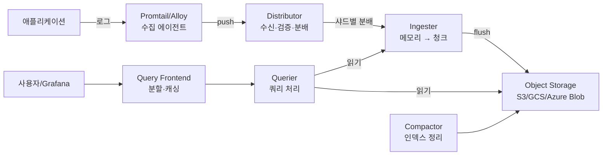

# Loki

> 최종 업데이트: 2026-05-03 | Loki 3.x + Grafana Alloy(통합 에이전트) 기준

## 개념

Loki는 **Grafana Labs가 개발한 오픈소스 로그 집계 시스템**으로, *"Prometheus처럼 로그를 다루자"*는 철학으로 만들어졌다. 가장 큰 특징은 **로그 본문(라인)을 인덱싱하지 않고 메타데이터(라벨)만 인덱싱**한다는 점.

> 비유: 도서관에서 책 본문을 통째로 색인하지 않고 **서가 위치(라벨)만 색인**하는 방식. "결제 서가 → 2024년 10월 칸"까지는 빠르게 찾고, 거기서부터는 grep으로 본문 검색. 책 본문 색인을 안 만드니 도서관 운영비(스토리지)가 1/10로 줄어든다.

핵심 명제: **"모든 로그 라인을 인덱싱하는 것은 비용 낭비"** — 라벨로 좁힌 후 line filter(grep)로 충분하다는 가설. Elasticsearch 대비 저장 비용을 대폭 절감.

## 배경/역사

- **2018-12** **Tom Wilkie**(Grafana Labs, Cortex 창시자)가 **KubeCon Seattle**에서 Loki 첫 발표
- **2019-11** Loki 1.0 GA
- **2020-09** Loki 2.0 — LogQL 대폭 강화, single-binary 모드, 다중 테넌트 강화
- **2022** Loki 2.x 시리즈 — 다양한 backends, OTel 호환성
- **2024** **Loki 3.0** — Bloom filters(라인 검색 가속), 새 TSDB 인덱스 포맷, 네이티브 OpenTelemetry 지원
- **2024** **Grafana Alloy** 출시 — Promtail + Grafana Agent를 통합한 차세대 수집기

> Loki라는 이름은 북유럽 신화의 "장난꾸러기 신"에서 따왔다. Prometheus(그리스 신화)의 자매 프로젝트라는 의미를 담음. **개발 동기는 단순했다**: "Elasticsearch는 너무 비싸고 운영이 무겁다. 정말 모든 라인 인덱싱이 필요한가?"

## Loki vs Elasticsearch — 핵심 차이

| 항목 | Loki | Elasticsearch |
|---|---|---|
| **인덱싱 대상** | **라벨(metadata)만** | **모든 라인 본문** (full-text) |
| 스토리지 비용 | ~1/10 | 비쌈 |
| 쓰기 처리량 | 매우 높음 (인덱싱 적음) | 인덱싱 비용 큼 |
| 라인 검색 속도 | 라벨로 좁힌 후 grep | 즉시 full-text |
| 운영 복잡도 | 낮음 | 높음 (샤딩·heap 튜닝 등) |
| 적합 워크로드 | "라벨로 좁히기 쉬운" 로그 | 임의 텍스트 검색 |

→ **트레이드오프 명확**: 임의 단어 검색은 ES가 빠르지만, 비용·운영 부담은 Loki가 압승. **로그가 잘 정형화돼있고 라벨로 분류 가능하면 Loki 적합**.

## 아키텍처



| 컴포넌트 | 역할 |
|---|---|
| **Distributor** | 수집 에이전트로부터 로그 수신, 라벨 검증, hash ring으로 Ingester 분배 |
| **Ingester** | 메모리에 chunk 형태로 모은 후 일정 시간/크기 도달 시 Object Storage에 flush |
| **Querier** | 쿼리 실행. 최근 데이터는 Ingester, 과거는 Object Storage에서 조회 |
| **Query Frontend** | 큰 쿼리를 작은 단위로 분할 + 결과 캐싱 + 큐잉 |
| **Compactor** | Object Storage의 인덱스·청크 정리·압축 |
| **Ruler** | 알림 규칙 평가 (Alertmanager 연동) |
| **Object Storage** | 실제 로그 저장소. S3·GCS·Azure Blob·MinIO 등 |

### 배포 모드 3종

| 모드 | 용도 | 특징 |
|---|---|---|
| **Monolithic** | 단일 바이너리, 모든 컴포넌트 통합 | 소규모 / 개발 환경 |
| **Simple Scalable** | read·write 분리 (2개 deployment) | 중간 규모 |
| **Microservices** | 컴포넌트별 독립 deployment | 대규모 / 멀티 테넌트 |

## LogQL — Loki의 쿼리 언어

PromQL을 닮은 쿼리 언어. 두 단계 구조: **Log Stream Selector + Filter/Parser**.

### 1. Log Stream Selector (필수)

라벨로 어느 로그 스트림을 볼지 선택.

```logql
{app="payment", env="prod"}                    # AND
{app="payment", level=~"error|warn"}            # 정규식
{job="api", status_code!~"2.."}                 # 부정 정규식
```

### 2. Line Filter (라인 본문 grep)

```logql
{app="payment"} |= "error"                      # 포함
{app="payment"} != "healthcheck"                # 미포함
{app="payment"} |~ "(?i)timeout"                # 정규식 (대소문자 무시)
{app="payment"} !~ "test"                       # 정규식 부정
```

### 3. Parser — 구조화 추출

```logql
{app="api"} | json                              # JSON 파싱
{app="api"} | logfmt                            # logfmt 파싱 (key=value)
{app="api"} | pattern `<ip> - <user> [<ts>] "<method> <path>"`  # 패턴 매칭
{app="api"} | regexp `(?P<ip>\d+\.\d+\.\d+\.\d+)`               # 정규식 추출
```

### 4. 집계 (Metric query)

```logql
# 분당 에러 발생률
sum(rate({app="payment"} |= "error" [1m]))

# 상태코드별 요청 수
sum by (status_code) (
  count_over_time({job="api"} | json [5m])
)

# p95 응답시간 (JSON 로그의 latency 필드)
quantile_over_time(0.95,
  {job="api"} | json | unwrap latency [5m]
) by (path)
```

## 라벨 vs 라인 컨텐츠 — 가장 중요한 설계 원칙

| 구분 | 라벨 (인덱싱) | 라인 컨텐츠 |
|---|---|---|
| 검색 속도 | 매우 빠름 | grep 수준 |
| 카디널리티 한계 | **엄격** | 무한 |
| 들어가야 할 것 | `app`, `env`, `level`, `namespace`, `cluster` | 자유 텍스트, JSON 본문 |
| **들어가면 안 되는 것** | **`user_id`, `request_id`, `trace_id`, `session_id`, `ip`** | (라인에 두면 됨) |

> **고cardinality 라벨은 Loki를 죽인다.** `user_id="12345"` 같은 값을 라벨로 넣으면 **유니크 스트림 수가 폭발**해 인덱스가 망가지고 쿼리 성능이 폭락한다.

올바른 패턴:

```
# Bad — user_id가 라벨
{app="api", user_id="12345"} |= "login"

# Good — user_id는 라인 컨텐츠로
{app="api"} |= "user_id=12345" |= "login"
# 또는 JSON 파싱 후
{app="api"} | json | user_id="12345" | __error__=""
```

## 로그 수집기 (Agent)

| 수집기 | 특징 |
|---|---|
| **Grafana Alloy** | 2024~ 신규 통합 에이전트. Promtail + Grafana Agent + OTel 통합 — **신규 권장** |
| **Promtail** | 전통적 Loki 전용 수집기. 단순. **Alloy로 마이그레이션 권장** |
| **Fluent Bit** | 가벼움, 다목적. Loki output plugin |
| **Fluentd** | 무거움, 풍부한 플러그인 |
| **Logstash** | ELK 스택 표준. Loki output |
| **Vector** | Datadog이 만든 고성능 수집기 |
| **OpenTelemetry Collector** | 벤더 중립. Loki Exporter |

> 신규 환경은 **Grafana Alloy** 권장. 기존 Promtail은 점진 마이그레이션.

## Loki 3.x 주요 변화

| 기능 | 설명 |
|---|---|
| **Bloom Filters** | 라인 컨텐츠 검색 가속. "이 청크에 `error_code=12345`가 있을 가능성"을 빠르게 판단 |
| **TSDB 인덱스** | 새 인덱스 포맷 (Prometheus TSDB 기반). 더 빠른 쿼리 |
| **Native OpenTelemetry** | OTel 로그를 직접 수신 |
| **Pattern Parser 강화** | 비정형 로그 구조화 추출 향상 |

## Loki vs 다른 로그 솔루션

| 솔루션 | 강점 | 약점 | 비고 |
|---|---|---|---|
| **Loki** | 비용 1/10, 라벨 기반, Grafana 통합 | 임의 텍스트 검색 느림 | LGTM 스택 |
| **Elasticsearch** | 강력한 full-text, 풍부한 분석 | 비싸고 운영 부담 | ELK 스택 |
| **Splunk** | 엔터프라이즈, SPL 강력 | 매우 비쌈 (라이선스 단위) | — |
| **CloudWatch Logs** | AWS 통합 자동 | 검색 느림, AWS 종속 | — |
| **Datadog Logs** | UI 직관, 통합 | 인제스트당 과금 비쌈 | — |
| **OpenSearch** | ES 포크, AWS Apache 2.0 | 사실상 ES와 유사 | ES 대안 |

## 백엔드 개발자 관점 실무 포인트

- **structured logging 필수** — JSON 또는 logfmt. 그래야 LogQL `| json` 또는 `| logfmt`으로 필드 추출
- **Spring Boot 권장 셋업** — Logback + Logstash JSON Encoder → stdout → Promtail/Alloy → Loki
- **trace_id를 로그에 포함** — Tempo와 자동 연결. Spring Cloud Sleuth/Micrometer Tracing이 MDC로 자동 주입
- **라벨 설계 미리** — `cluster`·`namespace`·`app`·`level`·`environment` 정도. 이 5~10개로 충분
- **고cardinality 값은 라인에** — `user_id`·`order_id`·`trace_id`는 절대 라벨 X. JSON 본문에 넣고 `| json | user_id="..."` 로 추출
- **로그 양 통제** — DEBUG는 dev에서만, 프로덕션은 INFO+. 인제스트 GB 단가가 그대로 비용
- **retention 정책** — 보통 7~30일. 장기 보관은 S3 Glacier로 lifecycle policy
- **Alloy로 시작** — Promtail은 deprecated 추세. 신규는 Alloy
- **Grafana 대시보드에 로그 패널** — 메트릭 그래프 옆에 로그를 띄워 cross-domain 분석. 인시던트 대응 속도 ↑
- **알림은 LogQL `rate()`로** — `sum(rate({app="api"} |= "5xx" [5m])) > 10` 같은 식. Ruler가 평가
- **메모리·디스크 모니터링** — Ingester는 chunk를 메모리에 들고 있어 OOM 주의. flush 간격 조정
- **`| __error__=""` 필터** — JSON 파싱 실패 라인 제외. 안 쓰면 결과에 잡음 섞임

## 안티패턴

| 안티패턴 | 왜 위험 |
|---|---|
| **고cardinality 라벨** (`user_id`, `request_id` 등) | 인덱스 폭발, 쿼리 성능 폭락 |
| **모든 로그 DEBUG로** | 인제스트 비용 폭증 |
| **라벨 너무 많음** (20+ 라벨) | cardinality 곱셈으로 폭발 |
| **structured logging 안 함** (free-text only) | LogQL parser로 구조화 추출 불가 → 라인 grep만 가능 |
| **retention 평생** | 스토리지 비용 무한 증가. lifecycle 정책 필수 |
| **Loki를 ES 대체로 모든 케이스에** | 임의 단어 검색 빈번한 워크로드엔 ES가 더 적합할 수 있음 |
| **수집기 미설정** (Promtail relabel 누락) | 의도치 않은 라벨이 자동 생성 → cardinality 폭발 |
| **chunk size 기본값 그대로** | 워크로드에 안 맞으면 메모리 압박 또는 너무 잦은 flush |

## 한 줄 요약

> **Loki = "Prometheus 철학을 로그에 적용한 오픈소스 로그 집계 시스템."** 2018 Tom Wilkie 발표, 핵심 차별점은 **라인 본문은 인덱싱하지 않고 라벨만 인덱싱** → Elasticsearch 대비 비용 1/10. 라벨로 좁힌 후 LogQL의 line filter(grep)로 검색하는 패턴. **고cardinality 라벨이 가장 큰 함정**이며, 신규 수집기는 Promtail 대신 **Grafana Alloy** 권장. Grafana·Tempo·Mimir와 함께 **LGTM 스택**을 구성해 Datadog/New Relic의 오픈소스 대안.

## 관련 문서

- [Grafana](../grafana/Grafana.md) — Loki의 시각화 프론트엔드, LGTM 스택 G
- [fluentd](fluentd.md) — 다른 로그 수집기 (Loki output 가능)
- [Prometheus](../Prometheus/) — Loki의 사상적 형제 (메트릭 버전)
- [newrelic](../newrelic/) — 통합 관찰성 SaaS 비교 대상

## 참조

- [Loki 공식 문서](https://grafana.com/docs/loki/latest/)
- [Loki GitHub](https://github.com/grafana/loki)
- [Tom Wilkie — KubeCon 2018 Loki 발표](https://www.youtube.com/watch?v=ZdEpf4UH-yQ)
- [LogQL 레퍼런스](https://grafana.com/docs/loki/latest/logql/)
- [Grafana Alloy 공식](https://grafana.com/docs/alloy/latest/)
- [Loki Best Practices](https://grafana.com/docs/loki/latest/best-practices/)
- [Why Loki — Grafana Labs 블로그](https://grafana.com/blog/2018/12/12/loki-prometheus-inspired-open-source-logging-for-cloud-natives/)
