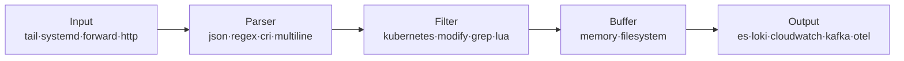

# Fluent Bit

> 최종 업데이트: 2026-05-14 | Fluent Bit v4.x + Kubernetes DaemonSet 운영 기준

## 개념

Fluent Bit은 **로그·메트릭·트레이스를 수집·파싱·필터링·전송하는 초경량 데이터 수집기**다. C로 작성되어 메모리 ~1MB, CPU 점유율이 매우 낮아 **각 노드/엣지에 배포되는 forwarder** 역할에 최적화돼 있다.

> 비유: [[fluentd|Fluentd]]가 공항 중앙의 대형 수하물 분류 센터라면, Fluent Bit은 **각 게이트의 컨베이어 벨트**다. 가볍고 빠르게 수하물(로그)을 받아 중앙으로 보낸다. 최근에는 Fluent Bit이 그 자체로 분류 능력을 갖춰 중앙 없이도 운영되는 경우가 많아짐.

핵심 명제: **"엣지에서 빠르게, 표준 OpenTelemetry까지 — 단일 바이너리로"**. Fluentd의 풍부함을 일부 포기하고 **성능·자원효율·이식성**을 극대화.

## 배경/역사

| 시기 | 사건 |
|---|---|
| 2014 | Treasure Data의 **Eduardo Silva**가 Fluentd 프로젝트 일부로 시작 — Ruby로 작성된 Fluentd를 IoT/임베디드 환경에 못 쓰는 문제 해결 목적 |
| 2015 | v0.1 공개 — C 언어, 메모리 푸터프린트 KB 단위 |
| 2019 | **Fluentd 프로젝트 산하로 CNCF Graduated** — Fluent Bit은 별도 그래듀에이션 아니라 Fluentd 우산 안에서 함께 졸업 |
| 2022 | **누적 다운로드 30억 돌파** |
| 2024-03 | **v3.0** — KubeCon EU에서 발표. 메트릭 처리 강화, OpenTelemetry 호환 본격화 |
| 2024-12 | **v3.2** — **SIMD** 기반 로그 처리/파싱 가속 |
| 2025-04 | **v4.0** — 프로젝트 10주년. 누적 다운로드 150억+ |
| 2025~ | **Fluentd → Fluent Bit 마이그레이션** 공식 가이드 등장. Fluent Bit이 사실상 신규 표준 |

> 2026년 현재 Fluent Bit은 **Fluentd의 경량 버전이 아니라 독립적 차세대 수집기**로 자리잡음. K8s/EKS에서 신규 도입 시 1순위.

## 아키텍처 — Pipeline



| 컴포넌트 | 역할 | 대표 플러그인 |
|---|---|---|
| **Input** | 수집 시작점 | `tail`, `systemd`, `forward`, `http`, `kubernetes_events` |
| **Parser** | 비정형 → 구조화 | `json`, `regex`, `cri`, `logfmt`, `ltsv` |
| **Multiline Parser** | 여러 줄 → 하나의 레코드 | `java`, `python`, `go`, `ruby`, `cri` (built-in) |
| **Filter** | 변환·메타데이터·필터링 | `kubernetes`, `modify`, `grep`, `lua`(스크립팅), `nest` |
| **Buffer** | 장애 대비 | `memory`(빠름), `filesystem`(영속) — 둘 다 동시에 사용 가능 |
| **Output** | 전송 | `es`(Elasticsearch), `loki`, `cloudwatch_logs`, `kafka`, `opentelemetry`, `stdout` |

> **Fluentd와의 가장 큰 구조적 차이**: Fluent Bit은 **buffer가 memory + filesystem 하이브리드**라 RAM 한도 초과분만 디스크로 자동 spill — 메모리 한도와 안정성을 동시에 잡음.

## 핵심 심화 1 — Multiline Parser (Java 스택트레이스)

### 문제 — 한 예외가 N개 레코드로 쪼개진다

컨테이너 로그(`/var/log/containers/*.log`)는 **한 줄 = 한 JSON 레코드**로 저장되고, Fluent Bit의 `tail` input도 기본은 **개행 단위**로 읽는다. Java 스택트레이스는 줄이 여러 개라 쪼개진다.

```
Exception in thread "main" java.lang.NullPointerException     ← 레코드 1
    at com.example.Service.doWork(Service.java:42)             ← 레코드 2
    at com.example.Controller.handle(Controller.java:25)       ← 레코드 3
Caused by: java.sql.SQLException: connection refused           ← 레코드 4
```

→ Kibana/Loki에서 흩어진 줄로 보이고, 알람 룰·검색이 모두 어긋남.

### 해결 — `multiline.parser` 옵션

```ini
[INPUT]
    Name              tail
    Path              /var/log/containers/*.log
    multiline.parser  cri, java
    Tag               kube.*
    Refresh_Interval  5
    DB                /var/log/flb_kube.db          # 재시작 시 read position 영속화
    Skip_Long_Lines   On
```

- **`cri`** — 컨테이너 런타임(`containerd`/`CRI-O`)이 16KB 넘는 로그를 잘라 붙이는 `partial(P)`/`full(F)` 마커를 합쳐 **원본 로그 복원**
- **`java`** — 복원된 로그에서 `at ...`, `Caused by:`, `... N more` 같은 Java 스택트레이스 패턴을 감지해 한 레코드로 묶음

> **순서가 중요**: `cri`를 먼저 실행해야 컨테이너 런타임의 partial 라인이 합쳐진 상태에서 Java 패턴 매칭이 정상 동작. 순서 바뀌면 매칭 자체가 깨짐.

### 빌트인 멀티라인 파서 목록

| 이름 | 대상 |
|---|---|
| `cri` | containerd/CRI-O의 partial(P) 라인 결합 (모든 K8s 환경 필수) |
| `docker` | Docker `json-file` 로그의 partial 라인 결합 |
| `java` | Java 스택트레이스 (`at ...`, `Caused by:`, `... N more`) |
| `python` | `Traceback (most recent call last):` |
| `go` | Go panic + goroutine stack |
| `ruby` | Ruby 예외 |

### 커스텀 멀티라인 룰

빌트인이 안 맞는 앱 포맷(예: 커스텀 로그 prefix)은 정규식으로 직접 정의:

```ini
[MULTILINE_PARSER]
    name          custom_java
    type          regex
    flush_timeout 1000                             # ms — 다음 라인이 없어도 이 시간 후 flush
    rule          "start_state"  "/^\d{4}-\d{2}-\d{2} \d{2}:\d{2}:\d{2}/"  "cont"
    rule          "cont"         "/^[\s]+at .*|^Caused by:.*|^\s*\.\.\..*more/" "cont"
```

- **`start_state`**: 새 로그의 시작 패턴 (보통 타임스탬프로 시작하는 첫 줄)
- **`cont`**: 이어지는 라인 패턴 (`    at ...`, `Caused by:`, `... N more`)
- 상태 다이어그램 기반이라 복수 상태 정의 가능 (drain 패턴 등)

### flush_timeout의 함정

멀티라인은 **다음 로그가 와야 이전 로그가 끝났음을 알 수 있다**. 트래픽이 적은 앱에서는 마지막 스택트레이스가 한참 후에야 flush됨.

| 설정 | 동작 |
|---|---|
| `flush_timeout 1000` | 1초 지나도 새 라인 없으면 강제 flush |
| 너무 짧음 (100ms) | 큰 스택트레이스가 중간에 잘릴 수 있음 |
| 너무 김 (10s+) | 알람 지연 |
| 권장 | **1000~3000ms** |

## 핵심 심화 2 — Kubernetes Filter

쿠버네티스 메타데이터(파드 이름, 네임스페이스, 라벨, 컨테이너 이미지 등)를 자동 부여하는 필수 필터.

```ini
[FILTER]
    Name                kubernetes
    Match               kube.*
    Kube_URL            https://kubernetes.default.svc:443
    Kube_CA_File        /var/run/secrets/kubernetes.io/serviceaccount/ca.crt
    Kube_Token_File     /var/run/secrets/kubernetes.io/serviceaccount/token
    Merge_Log           On                       # log 필드가 JSON이면 파싱해서 합침
    Merge_Log_Key       log_processed
    K8S-Logging.Parser  On                       # 파드 어노테이션으로 파서 선택 가능
    K8S-Logging.Exclude On                       # 파드 어노테이션으로 수집 제외
    Keep_Log            Off                      # 원본 log 필드 제거 (Merge 후)
    Annotations         Off                      # 어노테이션은 보통 안 씀 (용량)
    Labels              On
```

### 파드 어노테이션 활용

```yaml
metadata:
  annotations:
    fluentbit.io/parser: json                    # 이 파드는 json 파서로
    fluentbit.io/exclude: "true"                 # 이 파드 로그는 수집 X
```

→ 앱 팀이 **YAML 어노테이션만으로 자기 파드 로그 처리 방식 제어** 가능. 중앙 fluent-bit 설정 안 건드려도 됨.

## EKS 표준 설정 예시

DaemonSet으로 각 노드에 배포. EKS에서 가장 자주 보는 형태(AWS의 `aws-for-fluent-bit` 이미지 기준):

```ini
[SERVICE]
    Flush                5
    Daemon               Off
    Log_Level            info
    Parsers_File         parsers.conf
    HTTP_Server          On                      # /api/v1/metrics — Prometheus 수집용
    HTTP_Listen          0.0.0.0
    HTTP_Port            2020
    storage.path         /var/log/flb-storage/   # filesystem buffer 위치
    storage.sync         normal
    storage.backlog.mem_limit  5M

[INPUT]
    Name                 tail
    Path                 /var/log/containers/*.log
    multiline.parser     cri, java
    Tag                  kube.*
    DB                   /var/log/flb_kube.db
    Mem_Buf_Limit        50MB
    storage.type         filesystem              # ← 메모리 초과분 디스크로
    Refresh_Interval     5

[FILTER]
    Name                 kubernetes
    Match                kube.*
    Merge_Log            On
    K8S-Logging.Parser   On
    K8S-Logging.Exclude  On

[OUTPUT]
    Name                 cloudwatch_logs
    Match                kube.*
    region               ap-northeast-2
    log_group_name       /aws/eks/my-cluster/application
    log_stream_prefix    ${hostname}-
    auto_create_group    true
    log_retention_days   30
```

> **IRSA(IAM Roles for Service Accounts)** 로 CloudWatch 권한을 Pod에 부여하는 게 표준. ServiceAccount 어노테이션에 `eks.amazonaws.com/role-arn` 달면 됨.

### DaemonSet의 핵심 마운트

| 호스트 경로 | 컨테이너 마운트 | 용도 |
|---|---|---|
| `/var/log` | `/var/log` (ro) | 컨테이너 로그 + position DB 저장 |
| `/var/lib/docker/containers` | (ro) | (Docker 런타임 시만, 최신 EKS는 containerd라 불필요) |
| `/etc/machine-id` | (ro) | systemd 로그 수집 시 |

## 핵심 심화 3 — Buffer 전략

Fluent Bit은 메모리 + 파일시스템을 **동시에** 쓸 수 있다 (Fluentd는 둘 중 택1).

```ini
[INPUT]
    Name           tail
    Mem_Buf_Limit  50MB                          # 메모리 한도
    storage.type   filesystem                    # 한도 초과 시 디스크 spill
```

```ini
[SERVICE]
    storage.path               /var/log/flb-storage/
    storage.sync               normal             # normal | full(fsync 매번)
    storage.checksum           off                # crc32 체크섬
    storage.max_chunks_up      128                # 메모리에 동시 보유할 chunk 수
    storage.backlog.mem_limit  5M                 # 백로그 처리 시 메모리 한도
```

| 상황 | 권장 |
|---|---|
| 일반 운영 | `storage.type filesystem` + `Mem_Buf_Limit 50~100MB` |
| 극한 로그 손실 방지 (금융 등) | `storage.sync full` (성능 ↓) |
| 로그 양 많고 디스크 작음 | `Mem_Buf_Limit` 크게, `storage.backlog.mem_limit` 신중하게 |

## 운영 함정 (자주 만나는 실수)

| 증상 | 원인 / 해결 |
|---|---|
| Java 스택트레이스가 여전히 쪼개짐 | `cri` 파서를 빼먹음 — `multiline.parser cri, java` 순서로 둘 다 명시 |
| 일부 줄만 합쳐짐 | 앱 로그 prefix가 빌트인 `java` 패턴과 안 맞음 → 커스텀 멀티라인 룰 |
| 합쳐졌는데 검색 안 됨 | `Merge_Log On`을 안 해서 `log` 필드 안에 통째로 들어가 있음 |
| Pod 재시작 후 같은 로그 다시 수집 | `tail`의 `DB` 옵션 미설정 (read position 휘발) |
| Fluent Bit Pod 재시작 시 일부 로그 손실 | memory 버퍼만 사용 → `storage.type filesystem`로 영속화 |
| CloudWatch 비용 폭증 | DEBUG 로그까지 다 전송 → `grep` 필터로 drop 또는 K8S-Logging.Exclude 어노테이션 |
| K8s 메타데이터가 안 붙음 | RBAC 누락 (Pod·Namespace get/list/watch 권한 필요) |
| 큰 로그가 잘림 | `Buffer_Chunk_Size`, `Buffer_Max_Size` 기본값(32KB/32KB) 초과. 늘려야 함 |
| EKS containerd 환경에서 partial 로그 깨짐 | `cri` 멀티라인 파서 빠뜨림 |

## Fluentd vs Fluent Bit 비교

자세한 비교표는 [[fluentd|Fluentd 문서]]의 비교 섹션 참고. 요점만:

| 항목 | Fluentd | Fluent Bit |
|---|---|---|
| 메모리 | ~40MB+ | **~1MB** |
| 언어 | Ruby + C | **순수 C** |
| 플러그인 | 1000+ | 100+ |
| 적합 위치 | 중앙 Aggregator | **Edge/Forwarder** |
| 신규 K8s 환경 | 점차 줄어듦 | **표준 선택** |

> 2025년 CNCF가 [Fluentd → Fluent Bit 마이그레이션 가이드](https://www.cncf.io/blog/2025/10/01/fluentd-to-fluent-bit-a-migration-guide/)를 공식 발행. 방향성은 명확.

## 한 줄 요약

> **Fluent Bit = C로 작성된 차세대 경량 로그/메트릭/트레이스 수집기.** 2014 Eduardo Silva 시작, 2019 CNCF Graduated, 2025 v4.0(10주년). **EKS·K8s 신규 환경 표준**. 핵심 운영 포인트는 **`multiline.parser cri, java`로 스택트레이스 묶기**, **`storage.type filesystem`으로 손실 방지**, **`kubernetes` 필터로 메타데이터 자동 부여**, **IRSA로 권한 부여**.

## 관련 문서

- [[fluentd]] — 원조 Fluentd, 풍부한 플러그인·중앙 aggregator 역할 비교
- [[Loki]] — Fluent Bit의 주요 출력 대상 (LGTM 스택)
- [[쿠버네티스-Pod-로그]] — `/var/log/pods` · `/var/log/containers` 구조와 로그 회전
- [[Buffering]] — 일반적 버퍼링·백프레셔 개념

## 참조

- [Fluent Bit 공식](https://fluentbit.io/)
- [Fluent Bit 공식 문서 — Multiline Parsing](https://docs.fluentbit.io/manual/administration/configuring-fluent-bit/multiline-parsing)
- [Fluent Bit 공식 문서 — Kubernetes Filter](https://docs.fluentbit.io/manual/pipeline/filters/kubernetes)
- [Fluent Bit v4.0 — 10주년 발표 (CNCF, 2025-04)](https://www.cncf.io/blog/2025/04/25/fluent-bit-v4-0-celebrating-new-features-and-10th-anniversary/)
- [Fluentd → Fluent Bit 마이그레이션 가이드 (CNCF, 2025-10)](https://www.cncf.io/blog/2025/10/01/fluentd-to-fluent-bit-a-migration-guide/)
- [aws-for-fluent-bit GitHub](https://github.com/aws/aws-for-fluent-bit)
