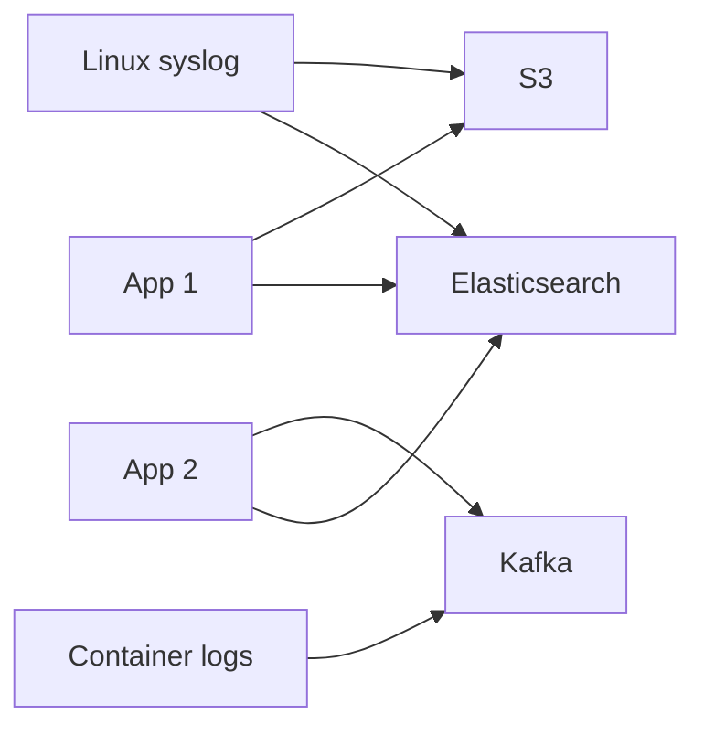
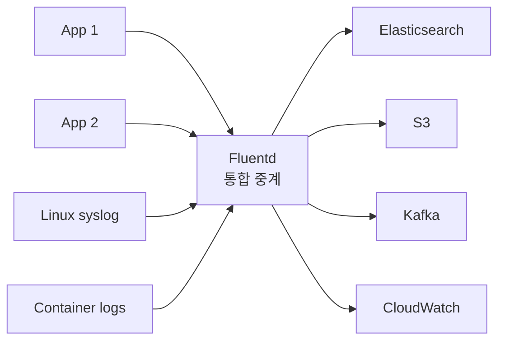
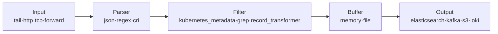
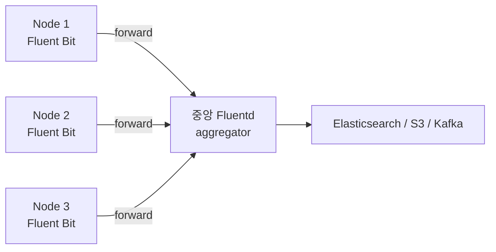

# Fluentd

> 최종 업데이트: 2026-05-03 | Fluentd v1.16+ + Fluent Bit 비교 / Kubernetes DaemonSet 배포 기준

## 개념

Fluentd는 **다양한 소스의 로그·이벤트를 수집·파싱·변환·전송하는 오픈소스 데이터 수집기(Data Collector)** 다. *"Unified Logging Layer"*가 슬로건 — 100가지 입력 소스와 1000가지 목적지 사이의 **통합 중계 레이어** 역할.

> 비유: 로그계의 만능 어댑터. 여러 모양의 플러그(앱·시스템·파일)와 여러 종류의 콘센트(Elasticsearch·Kafka·S3·CloudWatch)를 가운데서 변환·중계해주는 장치. 어떤 입력이든 어떤 출력으로든 변환 가능.

핵심 명제: **"로그 수집·전송을 표준화·플러그인화"**. 코드 변경 없이 설정 파일과 플러그인만으로 입력→파싱→필터→버퍼→출력의 파이프라인을 구성.

## 배경/역사

- **2011** **Sadayuki Furuhashi**(Treasure Data 공동창업자)가 Ruby로 개발 시작 — Treasure Data 내부 로그 인프라 표준화 목적
- **2014** **Fluent Bit** 프로젝트 분기 — Eduardo Silva 주도, C 언어로 경량화
- **2016-11** **CNCF 가입**
- **2019-04** **CNCF Graduated** — Kubernetes·Prometheus·Envoy 다음 **4번째 졸업 프로젝트**
- **2020년대** Kubernetes 환경 표준 로그 수집기로 자리잡음. EFK 스택(Elasticsearch + Fluentd + Kibana)이 ELK의 대안으로 부상
- **2024~** Fluent Bit이 점진적으로 더 인기 (Grafana Alloy·OpenTelemetry Collector 등 신규 수집기와 경쟁)

> Fluentd는 **CNCF의 단 4번째 졸업 프로젝트**. K8s 환경에선 사실상 표준급 도구. Treasure Data(현 Arm 자회사)가 메인 스폰서.

## Fluentd가 풀려는 문제

### Before — 로그 수집의 N×M 지옥



→ N개 입력 × M개 출력 = N×M개의 통합 코드. 새 시스템 추가마다 모든 곳 수정.

### After — Unified Logging Layer



→ N + M 통합 코드. **Fluentd 한 군데**가 변환·라우팅 담당. 새 입력/출력은 플러그인 추가로 끝.

## 핵심 아키텍처 — 5단계 파이프라인



| 컴포넌트 | 역할 | 대표 플러그인 |
|---|---|---|
| **Input (Source)** | 로그 수집 시작점 | `tail`(파일), `http`, `tcp`, `forward`, `syslog` |
| **Parser** | 비정형 텍스트 → 구조화 | `json`, `regexp`, `multi_format`, `cri`, `apache2` |
| **Filter** | 변환·필터링·메타데이터 추가 | `kubernetes_metadata`, `record_transformer`, `grep` |
| **Buffer** | 네트워크·출력 장애 대비 | `memory`(빠름), `file`(안전) |
| **Output (Match)** | 목적지로 전송 | `elasticsearch`, `loki`, `kafka`, `s3`, `cloudwatch_logs` |

## Tag 기반 라우팅 — Fluentd의 핵심

각 로그 이벤트는 **태그(tag)**를 가지며, 태그 패턴 매칭으로 어떤 Filter·Output을 거칠지 결정.

```
tag: kubernetes.var.log.containers.payment-7d4f.payment_default_xyz.log
```

```conf
# 태그가 kubernetes.**인 로그 → 메타데이터 추가
<filter kubernetes.**>
  @type kubernetes_metadata
</filter>

# 태그가 kubernetes.**인 로그 → Elasticsearch로
<match kubernetes.**>
  @type elasticsearch
</match>

# 태그가 fluent.**인 내부 로그 → stdout으로
<match fluent.**>
  @type stdout
</match>
```

→ 태그 패턴(`*`, `**`, `{a,b}`)으로 라우팅 분기. 라우터 역할.

## Fluentd vs Fluent Bit — 가장 자주 묻는 비교

> Fluent Bit 자체에 대한 심화 운영(멀티라인 파서로 Java 스택트레이스 묶기, 버퍼 전략, EKS 표준 설정 등)은 [[Fluent-Bit|Fluent Bit 문서]] 참조.

| 항목 | Fluentd | Fluent Bit |
|---|---|---|
| **언어** | Ruby + C 일부 | **순수 C** |
| **메모리** | 약 40MB+ | 약 **650KB**~ |
| **CPU** | 보통 | 매우 낮음 |
| **플러그인 수** | **1000+** | 100+ |
| **설정 복잡도** | 풍부·유연 | 단순 |
| **적합 위치** | **중앙 Aggregator** | **Edge/Forwarder** (각 노드) |
| **K8s DaemonSet** | 가능하지만 무거움 | **권장** |

### 일반적 운영 패턴: Fluent Bit + Fluentd 조합



→ **각 노드는 가벼운 Fluent Bit, 중앙은 풍부한 Fluentd**. 스타 토폴로지.

## 다른 로그 수집기 비교

| 수집기 | 언어 | 강점 | 약점 |
|---|---|---|---|
| **Fluentd** | Ruby | 풍부한 플러그인, CNCF 졸업, K8s 표준 | 무거움 |
| **Fluent Bit** | C | 매우 가벼움, 빠름 | 플러그인 적음 |
| **Logstash** | JRuby | ELK 통합, 강력한 grok | 매우 무거움 |
| **Vector** | Rust | 빠름, 메모리 효율 | 비교적 신규(2019~) |
| **Promtail** | Go | Loki 전용, 단순 | Loki만 출력 (deprecated 추세) |
| **Grafana Alloy** | Go | Promtail+Agent 통합, OTel 호환 | 신규, 학습 필요 |
| **OpenTelemetry Collector** | Go | 벤더 중립, 메트릭·로그·트레이스 통합 | 로그는 후발 |

> **2026 트렌드**: Vector·Alloy·OTel Collector가 부상. Fluentd는 여전히 K8s 표준급이지만 신규 환경엔 OTel Collector를 검토하는 곳도 늘어남.

## Kubernetes 환경 로그 수집 방식

### 1. DaemonSet으로 배포 (표준 패턴)

- 클러스터의 **각 노드(Node)에 데몬셋(DaemonSet)** 형태로 배포
- 새 노드가 추가되면 **자동으로 Fluentd 파드가 생성**되어 로그 수집 시작

### 2. 노드 로그 파일 접근

- 각 노드의 **`/var/log/containers`** 또는 **`/var/log/pods`**에 접근
- Kubernetes는 컨테이너의 **stdout/stderr**를 이 디렉토리에 파일로 저장 (kubelet의 역할)

### 3. 파싱 및 필터링

- 수집한 로그를 **구조화된 데이터로 변환**
- 로그 형식(JSON, 정규식 등)에 맞춰 파서 설정
- **Kubernetes 메타데이터**(파드명·네임스페이스·라벨 등)를 자동 부여 → 검색·분석 용이

### 4. 데이터 전송

- 처리된 로그를 설정된 목적지로 전송
- 대표 출력: Elasticsearch, Kafka, Loki, Splunk, Amazon S3, CloudWatch Logs, Google Cloud Logging

## 신뢰성·확장성 핵심 기능

| 기능 | 설명 |
|---|---|
| **유연성·확장성** | 풍부한 플러그인 생태계로 다양한 입력·출력 지원 |
| **신뢰성 (Buffer)** | 메모리/파일 버퍼로 네트워크·출력 장애 시 로그 유실 방지 |
| **재시도** | 실패 시 지수 백오프로 자동 재시도 |
| **At-least-once 전달** | 기본 보장 (중복은 가능하나 손실 X) |
| **경량 변형** (Fluent Bit) | 리소스 제한적 환경용 경량 버전 |
| **K8s 통합** | `fluent-plugin-kubernetes_metadata_filter`로 메타데이터 자동 부여 |
| **데이터 변환** | Filter 플러그인으로 구조 변경·풍부화 가능 |

## 배포 가이드 — Fluentd on Kubernetes

DaemonSet 배포가 가장 일반적.

### 1. Fluentd Docker 이미지 준비

- Docker Hub의 **공식 이미지** 사용: `fluent/fluentd`, `fluent/fluentd-kubernetes-daemonset` 등
- K8s 환경에 필요한 플러그인(예: `fluent-plugin-kubernetes_metadata_filter`)이 미리 설치된 이미지 다수

### 2. fluent.conf — Fluentd 설정 파일

입력·필터·출력을 정의. ConfigMap으로 K8s에 저장하고 파드에 마운트.

```conf
# ============== INPUTS ==============
# 호스트의 컨테이너 로그 수집
<source>
  @type tail
  @id in_tail_container_logs
  path /var/log/containers/*.log  # 컨테이너 로그 파일 경로
  pos_file /var/log/fluentd-containers.log.pos
  tag kubernetes.* # 로그에 태그 부여
  read_from_head true
  <parse>
    @type cri                     # Container Runtime Interface 로그 형식 (containerd, CRI-O)
                                  # Docker의 경우 json 또는 다른 파서 사용 가능
  </parse>
</source>

# ============== FILTERS ==============
# 쿠버네티스 메타데이터 추가 (파드 이름, 네임스페이스, 레이블 등)
<filter kubernetes.**>
  @type kubernetes_metadata
  @id filter_kube_metadata
</filter>

# ============== OUTPUTS ==============
# 특정 태그를 가진 로그를 어디로 보낼지 정의 — 예시: Elasticsearch
<match kubernetes.**>
  @type elasticsearch
  @id out_es
  host YOUR_ELASTICSEARCH_HOST
  port YOUR_ELASTICSEARCH_PORT
  logstash_format true
  logstash_prefix fluentd

  # 버퍼 설정 (로그 유실 방지)
  <buffer>
    @type file
    path /var/log/fluentd-buffers/kubernetes.system.buffer
    flush_interval 10s
  </buffer>
</match>

# Fluentd 내부 로그 출력 (디버깅용)
<match fluent.**>
  @type stdout
</match>
```

### 3. ConfigMap 작성

```yaml
apiVersion: v1
kind: ConfigMap
metadata:
  name: fluentd-config
  namespace: kube-system # 또는 로깅 전용 네임스페이스
data:
  fluent.conf: |
    <source>
      @type tail
      # ... (위 fluent.conf 전체 내용)
    </source>
    <filter kubernetes.**>
      @type kubernetes_metadata
    </filter>
    <match kubernetes.**>
      @type elasticsearch
    </match>
```

### 4. RBAC — ServiceAccount + ClusterRole + ClusterRoleBinding

Fluentd 파드가 K8s API에 접근해 파드 메타데이터를 조회하고, 노드 로그 파일에 접근하려면 권한 필요.

```yaml
apiVersion: v1
kind: ServiceAccount
metadata:
  name: fluentd
  namespace: kube-system
---
apiVersion: rbac.authorization.k8s.io/v1
kind: ClusterRole
metadata:
  name: fluentd
rules:
- apiGroups: [""]
  resources: ["pods", "namespaces"]
  verbs: ["get", "list", "watch"]
- apiGroups: [""]
  resources: ["nodes/proxy"]   # kubelet API 접근 (수집 방식에 따라 필요)
  verbs: ["get"]
---
apiVersion: rbac.authorization.k8s.io/v1
kind: ClusterRoleBinding
metadata:
  name: fluentd
roleRef:
  kind: ClusterRole
  name: fluentd
  apiGroup: rbac.authorization.k8s.io
subjects:
- kind: ServiceAccount
  name: fluentd
  namespace: kube-system
```

### 5. DaemonSet — EKS + CloudWatch 예시

```yaml
apiVersion: apps/v1
kind: DaemonSet
metadata:
  name: fluentd-eks
  namespace: kube-system
  labels:
    k8s-app: fluentd-logging
    app: fluentd
    version: v1.0
spec:
  selector:
    matchLabels:
      k8s-app: fluentd-logging
      app: fluentd
  template:
    metadata:
      labels:
        k8s-app: fluentd-logging
        app: fluentd
        version: v1.0
      # EKS IRSA 사용 시 어노테이션:
      # annotations:
      #   iam.amazonaws.com/role: arn:aws:iam::ACCOUNT:role/EKS_FLUENTD_IAM_ROLE
    spec:
      serviceAccountName: fluentd

      # 마스터/컨트롤플레인 노드에도 배포하려면 toleration 필요
      tolerations:
        - key: node-role.kubernetes.io/master
          effect: NoSchedule
        - key: node-role.kubernetes.io/control-plane
          effect: NoSchedule

      hostNetwork: false
      dnsPolicy: ClusterFirst

      containers:
      - name: fluentd
        # CloudWatch 플러그인 포함 이미지 (실제 사용 가능한 최신 태그 확인 필요)
        image: fluent/fluentd-kubernetes-daemonset:v1.16-debian-cloudwatch-1
        env:
          - name: AWS_REGION
            value: "ap-northeast-2"   # EKS 리전
          - name: K8S_NODE_NAME
            valueFrom:
              fieldRef:
                apiVersion: v1
                fieldPath: spec.nodeName

        # 리소스 요청·제한 (로그 볼륨에 따라 조정)
        resources:
          requests:
            cpu: "100m"
            memory: "200Mi"
          limits:
            cpu: "1"
            memory: "500Mi"

        volumeMounts:
        # 1. ConfigMap (fluent.conf) 마운트
        - name: config-volume
          mountPath: /fluentd/etc
          readOnly: true

        # 2. 호스트 노드의 컨테이너 로그 (containerd 기준 /var/log)
        - name: varlog
          mountPath: /var/log
          readOnly: true

        # 3. (Docker 런타임 시) /var/lib/docker/containers — 최신 EKS는 containerd라 선택적
        - name: varlibdockercontainers
          mountPath: /var/lib/docker/containers
          readOnly: true

        # 4. 파일 버퍼 — 파드 재시작에도 유지되도록 hostPath 사용
        - name: fluentd-buffer
          mountPath: /fluentd/buffer

      # 종료 시 버퍼 flush 시간 확보
      terminationGracePeriodSeconds: 30

      volumes:
      - name: config-volume
        configMap:
          name: fluentd-config-eks
      - name: varlog
        hostPath:
          path: /var/log
      - name: varlibdockercontainers
        hostPath:
          path: /var/lib/docker/containers
      - name: fluentd-buffer
        hostPath:
          path: /var/log/fluentd-buffer
          # type: DirectoryOrCreate   # K8s 1.17+. 필요 시 권한·SELinux 고려
```

> EKS IRSA(IAM Roles for Service Accounts)로 AWS CloudWatch 등 접근 권한을 안전하게 부여하는 게 표준 패턴.

## 백엔드 개발자 관점 실무 포인트

- **Spring Boot 권장 셋업** — Logback + Logstash JSON Encoder → stdout → Fluentd `tail` + `cri` parser. JSON으로 출력해야 Fluentd가 구조화 가능
- **Fluent Bit이 신규 권장** — 신규 환경은 Fluent Bit (또는 OTel Collector). 기존 Fluentd가 잘 돌면 굳이 안 옮겨도 OK
- **버퍼는 file 권장** — 메모리 버퍼는 파드 재시작 시 손실. file + hostPath로 영속화
- **`flush_interval` 조정** — 너무 짧으면 출력 시스템 부하, 너무 길면 지연. 5~30s 표준
- **Kubernetes 메타데이터는 필수** — `kubernetes_metadata_filter` 없으면 어느 파드 로그인지 모름
- **태그 설계** — `kubernetes.<namespace>.<pod>` 같은 계층 구조로 라우팅 유연하게
- **로그 양 통제** — DEBUG 로그를 그대로 보내면 인제스트 비용 폭증. Filter에서 grep으로 drop 또는 sampling
- **`@id` 명명** — 모든 input/filter/output에 `@id` 부여하면 Fluentd 메트릭에서 식별 가능
- **모니터링 활성화** — `<system>` 섹션에 `enable_monitor_agent true` 추가하면 `/api/plugins.json`에서 메트릭 노출 → Prometheus로 수집
- **재시작 대비 pos_file 영속화** — `tail` input의 `pos_file`이 hostPath에 있으면 재시작 후 어디부터 읽을지 기억
- **로그 라우팅을 코드처럼 관리** — fluent.conf를 Git에 두고 ConfigMap으로 배포. 변경 추적 가능

## 안티패턴

| 안티패턴 | 왜 위험 |
|---|---|
| **메모리 버퍼만 사용** | 파드 재시작 시 버퍼 손실 |
| **`pos_file` 미설정 또는 메모리** | 파드 재시작 시 처음부터 다시 읽거나 일부 누락 |
| **너무 많은 필터 체인** | 파이프라인 복잡도 ↑, CPU 부담 |
| **출력 시스템 부재 시 무한 재시도** | 디스크 가득 → 노드 장애. retry_max_interval·retry_forever false 설정 필수 |
| **Fluentd를 SPOF로** | 모든 로그가 한 인스턴스 통과 → HA 또는 aggregator 다중화 필요 |
| **K8s metadata filter 누락** | 어느 파드 로그인지 식별 불가 |
| **무거운 Fluentd를 모든 노드에** | Fluent Bit + 중앙 Fluentd 패턴 권장 |
| **fluent.conf 직접 컨테이너에 박기** | 변경 시 이미지 재빌드 필요. ConfigMap 마운트가 표준 |

## 한 줄 요약

> **Fluentd = "Unified Logging Layer" — 100가지 입력과 1000가지 출력 사이의 통합 중계 레이어.** 2011 Treasure Data의 Sadayuki Furuhashi가 만들고 **CNCF 4번째 졸업 프로젝트**(2019). 핵심 파이프라인은 **Input → Parser → Filter → Buffer → Output**이며 **Tag 기반 라우팅**으로 분기. **K8s에선 DaemonSet 배포가 표준**, fluent.conf는 ConfigMap으로 관리. 신규 환경은 가벼운 **Fluent Bit + 중앙 Fluentd** 또는 **Fluent Bit/OTel Collector 단독** 패턴으로 이동 중.

## 관련 문서

- [Fluent-Bit](Fluent-Bit.md) — Fluent Bit 단독 심화 (멀티라인 파서, EKS 표준 설정 등)
- [쿠버네티스-Pod-로그](../kubernetes/쿠버네티스-Pod-로그.md) — Fluentd가 수집하는 입력 소스, `/var/log/pods` · `/var/log/containers` 구조와 로그 회전
- [Loki](Loki.md) — Loki는 Fluentd의 출력 대상 중 하나 (LGTM 스택)
- [Grafana](../grafana/Grafana.md) — Loki/ES 시각화
- [Prometheus](../Prometheus/Prometheus-개념.md) — 메트릭 수집 (Fluentd는 로그)
- [opentelemery](../opentelemery/) — 차세대 통합 수집기 (메트릭·로그·트레이스)

## 참조

- [Fluentd 공식](https://www.fluentd.org/)
- [Fluentd GitHub](https://github.com/fluent/fluentd)
- [Fluent Bit 공식](https://fluentbit.io/)
- [Fluentd 공식 문서 — Configuration](https://docs.fluentd.org/configuration)
- [Fluentd Kubernetes DaemonSet 공식 이미지](https://github.com/fluent/fluentd-kubernetes-daemonset)
- [CNCF Fluentd 프로젝트 페이지](https://www.cncf.io/projects/fluentd/)
- [Fluentd vs Fluent Bit (공식 비교)](https://docs.fluentbit.io/manual/about/fluentd-and-fluent-bit)
- [EKS IRSA 가이드](https://docs.aws.amazon.com/eks/latest/userguide/iam-roles-for-service-accounts.html)
