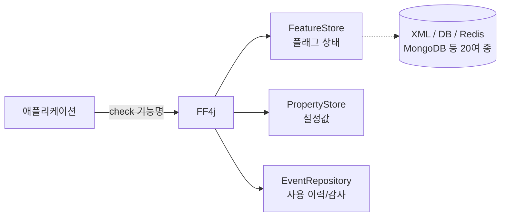

# FF4J (Feature Flipping for Java)

> 최종 업데이트: 2026-05-26 | 기준: ff4j 2.x

## 개념

**FF4J**는 **Feature Toggle(기능 토글) 패턴을 Java로 구현한 오픈소스 프레임워크**다. 코드를 다시 배포하지 않고도 설정(파일·DB)이나 런타임에서 특정 기능을 **켜고 끌 수 있게** 해준다. `ff4j.check("기능명")` 한 줄로 기능의 ON/OFF를 판단하는 것이 핵심이다.

> 비유하자면 집안의 **두꺼비집(차단기)** 같은 것. 전등을 떼었다 붙였다(재배포) 하는 대신, 스위치만 올렸다 내렸다 하며 특정 방의 전기를 통제한다. 새 기능을 코드에는 넣어두되, 스위치는 내려둔 채로 배포할 수 있다.

## 배경/역사

- **개발자**: Cédrick Lunven (GitHub [@clun](https://github.com/clun))
- **최초 릴리스**: 2013년
- **라이선스**: Apache License 2.0
- **이름의 유래**: **F**eature **F**lipping **4**(for) **J**ava — "Feature Flipping"은 Feature Toggle과 같은 뜻으로 쓰는 표현
- **등장 배경**: 긴 수명의 feature branch가 만들어내는 머지 충돌과 "배포해야만 기능이 켜지는" 경직성을 해소하기 위해, Martin Fowler 등이 정리한 **Feature Toggle 패턴**을 Java/Spring 생태계에 맞게 구현한 것

## Feature Toggle이란 — 왜 쓰는가

**Feature Toggle**(= Feature Flag)은 기능의 활성화 여부를 **코드가 아니라 설정으로** 제어하는 기법이다. 미완성·실험적 기능을 일단 배포해두고, 스위치로 노출 시점을 따로 결정한다.

> 영화관에 새 상영관을 미리 지어두되, 입구에 "준비 중" 팻말만 붙였다 떼었다 하는 것과 같다. 건물(코드)은 이미 거기 있고, 손님을 들일지(노출)는 팻말(플래그)로 정한다.

대표적인 활용 패턴:

| 패턴 | 설명 |
| --- | --- |
| **Canary Release** | 일부 사용자에게만 먼저 노출해 반응을 본 뒤 점진 확대 |
| **A/B 테스트** | 사용자 그룹별로 다른 기능을 보여주고 지표 비교 |
| **Dark Launch** | 기능을 켜되 UI에는 노출하지 않고 부하·동작만 미리 검증 |
| **Kill Switch** | 장애 시 문제 기능만 즉시 차단 (Graceful Degradation) |
| **Trunk-based 개발** | 미완성 코드를 토글로 가린 채 main에 자주 머지 → 머지 충돌 감소 |

## 핵심 구성 요소

FF4J는 세 종류의 저장소(Store)를 중심으로 동작한다.

| 구성 요소 | 역할 |
| --- | --- |
| **FeatureStore** | 기능 플래그의 ON/OFF 상태와 활성화 조건을 저장·관리 |
| **PropertyStore** | 플래그와 별개로, 런타임에 바꿀 수 있는 **설정값**(숫자·문자열 등)을 저장 |
| **EventRepository** | 기능 사용 이력·감사 로그(audit)·모니터링 지표를 기록 |



`FF4j` 객체가 세 저장소를 묶는 **진입점(facade)** 역할을 하고, 실제 데이터는 XML·관계형 DB·Redis 등 다양한 백엔드에 저장된다.

## 기본 사용법

의존성 추가 (Maven):

```xml
<dependency>
    <groupId>org.ff4j</groupId>
    <artifactId>ff4j-core</artifactId>
    <version>2.0.0</version>
</dependency>
```

기능 생성과 상태 확인:

```java
// FF4j 진입점 생성 + 기능 등록 (true = 켜진 상태)
FF4j ff4j = new FF4j();
ff4j.createFeature(new Feature("new-checkout", true));
```

```java
// 코드 분기에서 기능 ON/OFF 판단
if (ff4j.check("new-checkout")) {
    newCheckout();   // 기능 켜짐
} else {
    legacyCheckout(); // 기능 꺼짐
}
```

```java
// 런타임 토글 — 재배포 없이 즉시 전환
ff4j.disable("new-checkout");
ff4j.enable("new-checkout");
```

## @Flip 어노테이션 (AOP)

`if (ff4j.check(...))` 분기가 코드 곳곳에 흩어지는 것을 막기 위해, FF4J는 **AOP 기반 `@Flip` 어노테이션**을 제공한다. 기능이 꺼져 있으면 지정한 대체 메서드(`alterBean`)로 호출이 우회된다.

```java
// 기능이 켜져 있으면 이 메서드 실행
@Flip(name = "new-checkout", alterBean = "legacyCheckoutService")
public Receipt checkout(Cart cart) {
    return newCheckoutLogic(cart);
}
```

> 분기문 대신 "이 기능이 꺼지면 저쪽 담당자(대체 빈)에게 넘겨라"라고 **선언만** 해두는 방식. 비즈니스 로직에서 토글 검사 코드가 사라져 가독성이 좋아진다.

## FlippingStrategy — 조건부 활성화

단순 ON/OFF를 넘어, **언제·누구에게** 켤지를 전략(Strategy 패턴)으로 정할 수 있다. `check()` 호출 시 이 전략이 평가되어 최종 결과를 결정한다.

| 전략 | 동작 |
| --- | --- |
| **PonderationStrategy** | 확률(가중치)로 활성화 — 예: 30%의 요청에만 켬 (Canary) |
| **ReleaseDateFlipStrategy** | 지정한 날짜·시간 이후 자동 활성화 |
| **ExpressionFlipStrategy** | 다른 플래그들의 논리식(AND/OR)으로 결정 |
| **DarkLaunchStrategy** | 기능을 평가만 하고 결과는 노출하지 않음 |
| **커스텀 전략** | `FlippingStrategy` 인터페이스 구현으로 직접 정의 |

```java
// 요청의 50%에만 기능을 켜는 점진 배포
Feature f = new Feature("new-ui", true);
f.setFlippingStrategy(new PonderationStrategy(0.5));
ff4j.createFeature(f);
```

여기에 **role/group**을 결합하면 "특정 권한 사용자에게만 노출" 같은 접근 제어도 가능하다.

## 저장소 백엔드

FeatureStore·PropertyStore는 용도에 따라 백엔드를 바꿔 끼울 수 있다. 20여 종을 지원한다.

| 백엔드 | 특징 / 적합 상황 |
| --- | --- |
| **In-Memory** | 기본값. 테스트·프로토타입용 (재시작 시 초기화) |
| **XML 파일** | 간단한 정적 설정, 형상 관리에 포함시키기 좋음 |
| **JDBC (RDB)** | 운영 환경 표준. 영속성과 트랜잭션 보장 |
| **Redis** | 빠른 조회, 분산 환경에서 다중 인스턴스 공유 |
| **MongoDB / Cassandra / DynamoDB / Consul** | NoSQL·클라우드·서비스 디스커버리 연계 |

```xml
<!-- 예: Redis 스토어 추가 -->
<dependency>
    <groupId>org.ff4j</groupId>
    <artifactId>ff4j-store-redis</artifactId>
</dependency>
```

분산 환경에서 매 `check()`마다 DB를 때리지 않도록, **JSR-107 호환 캐싱**을 얹어 저장소 부하를 줄일 수 있다.

## Spring Boot 통합

`ff4j-spring-boot-starter`를 추가하면 **REST API와 웹 콘솔이 자동 노출**되고 메트릭 대시보드가 함께 활성화된다.

```xml
<dependency>
    <groupId>org.ff4j</groupId>
    <artifactId>ff4j-spring-boot-starter</artifactId>
    <version>2.0.0</version>
</dependency>
```

```java
// FF4j를 빈으로 등록하면 starter가 나머지를 자동 구성
@Bean
public FF4j ff4j() {
    FF4j ff4j = new FF4j();
    ff4j.createFeature(new Feature("new-checkout", false));
    return ff4j;
}
```

## 운영 기능 — 웹 콘솔 · REST API · 모니터링

| 기능 | 설명 |
| --- | --- |
| **웹 콘솔** | 브라우저에서 플래그를 켜고/끄고 전략을 수정하는 관리 UI (다국어 지원) |
| **REST API** | HTTP로 플래그를 조작 — Java가 아닌 다른 언어 앱에서도 연동 가능 |
| **Audit Trail** | 생성·수정·삭제·토글 등 모든 변경 이력 기록 |
| **모니터링** | 기능별 사용 횟수·성능 지표 수집 및 대시보드 시각화 |
| **CLI & JMX** | DevOps 자동화·운영 도구 연동 |

> 운영 중에 개발자가 코드를 만지지 않고, **운영자가 콘솔에서 직접** 기능을 켜고 끌 수 있다는 점이 Feature Toggle의 실무적 강점이다.

## 관련 문서

- [개발문화/개발방법론](../개발문화/개발방법론) — Trunk-based 개발, 점진적 배포 전략
- [Spring](../Spring) — Spring Boot 자동 구성, AOP
