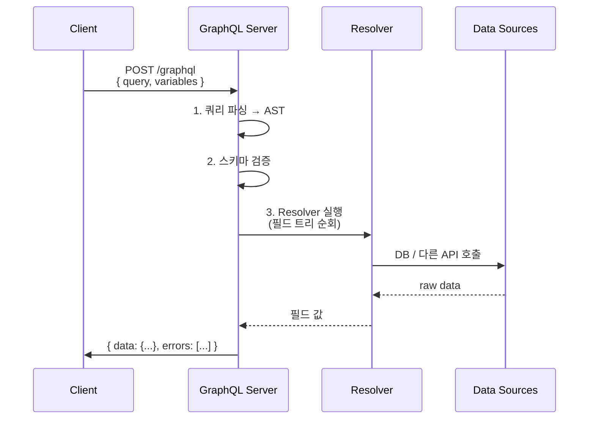
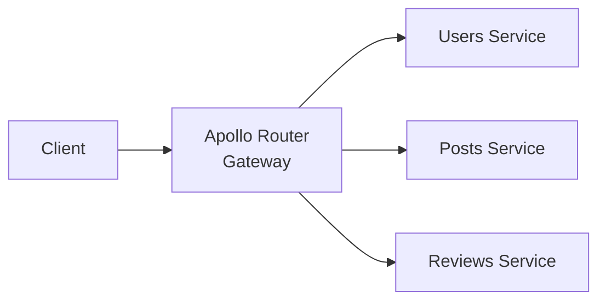

# GraphQL

> 최종 업데이트: 2026-06-06 | 기준: GraphQL 사양(October 2021), GraphQL over HTTP 사양

## 개념

**GraphQL**은 클라이언트가 **필요한 데이터의 형태를 직접 명시**해서 요청하면, 서버가 **딱 그 모양 그대로** 응답해주는 API 질의 언어(Query Language) 겸 런타임이다.

> 비유하자면 **카페에서 메뉴를 조합 주문**하는 것과 같다. REST가 "A세트 주세요" → 정해진 구성으로 통째로 받는 거라면, GraphQL은 "아메리카노 샷 추가, 우유 빼고, 시럽 반만"처럼 **원하는 필드만 골라 한 번에** 받는 식이다.

REST는 **자원(Resource) 중심으로 URL이 갈라지고**, 응답 형태는 서버가 결정한다. GraphQL은 **단일 엔드포인트**(보통 `POST /graphql`)에 **쿼리를 보내** 원하는 필드만 가져온다. **Over-fetching**(불필요한 필드까지 받음)과 **Under-fetching**(여러 번 호출해야 함) 문제를 한 번에 해결하는 게 핵심 가치.

## 배경/역사

- **2012년**: **페이스북** 내부에서 모바일 앱(특히 뉴스피드)의 데이터 페칭 문제를 풀기 위해 **Lee Byron**, **Nick Schrock**, **Dan Schafer**가 설계
- **2015년 7월**: 페이스북이 **GraphQL 사양과 레퍼런스 구현(JavaScript)을 오픈소스로 공개**
- **2018년**: 페이스북이 GraphQL을 **Linux Foundation 산하 GraphQL Foundation**으로 이관 → 중립적 거버넌스
- **2021년 10월**: GraphQL 사양 정식 버전(October 2021 Edition) 확정
- **현재**: Apollo, Relay, Hasura, GitHub API, Shopify, Netflix 등 전방위로 채택

> GraphQL이라는 이름은 데이터를 **그래프(노드+관계)** 로 보고 그것을 **질의(Query)** 한다는 의미. SQL과 비슷한 발상이지만 **DB가 아니라 API 레이어**를 향한다.

## 왜 만들었나 (REST의 한계)

페이스북 모바일 앱이 마주친 현실:

- 뉴스피드 한 화면에 **수십 개 자원**이 필요 → REST면 호출이 N번
- 각 호출이 **필요 없는 필드까지** 다 내려옴 → 모바일 대역폭 낭비
- 화면 디자인 바뀔 때마다 **백엔드 API 새로 만들어야** 함

GraphQL은 이걸 **클라이언트 주도 쿼리**로 풀었다. 클라이언트가 "이 화면에 필요한 데이터 모양"을 직접 쿼리로 그리면 서버가 한 번에 조립해서 내려준다.

## 핵심 개념

### 3가지 작업(Operation) 타입

| 타입 | 역할 | HTTP 비유 |
|---|---|---|
| **Query** | 데이터 조회 (읽기) | GET |
| **Mutation** | 데이터 생성·수정·삭제 (쓰기) | POST/PUT/DELETE |
| **Subscription** | 서버 → 클라 실시간 푸시 | WebSocket |

### Schema와 타입 시스템

GraphQL의 본질은 **스키마(Schema)** 다. 서버가 "내가 제공하는 데이터의 모양"을 타입으로 선언한다.

```graphql
type User {
  id: ID!
  name: String!
  email: String
  posts: [Post!]!
}

type Post {
  id: ID!
  title: String!
  author: User!
}

type Query {
  user(id: ID!): User
  posts(limit: Int = 10): [Post!]!
}

type Mutation {
  createPost(title: String!, authorId: ID!): Post!
}
```

- `!` = Non-null (반드시 값 존재)
- `[Post!]!` = "절대 null 아닌 Post들의 절대 null 아닌 배열"
- 스칼라 기본형: `Int`, `Float`, `String`, `Boolean`, `ID`

### Resolver

각 필드에 대해 "실제로 데이터를 어떻게 가져올지"를 정의하는 함수.

```javascript
const resolvers = {
  Query: {
    user: (parent, args, context) => db.users.findById(args.id),
  },
  User: {
    posts: (user) => db.posts.findByAuthorId(user.id),
  },
};
```

스키마가 **what**(무엇을 줄 수 있는지)이라면, Resolver는 **how**(어떻게 가져오는지)다.

## 쿼리 예시

### Query — 필드 골라 받기

```graphql
query {
  user(id: "42") {
    name
    email
    posts {
      title
    }
  }
}
```

응답:

```json
{
  "data": {
    "user": {
      "name": "길동",
      "email": "gd@example.com",
      "posts": [
        { "title": "GraphQL 입문" },
        { "title": "React 메모" }
      ]
    }
  }
}
```

요청한 필드만 정확히 응답에 등장. REST면 `/users/42` + `/users/42/posts` 두 번 호출하고 불필요한 필드도 다 받았을 것.

### Mutation — 쓰기

```graphql
mutation {
  createPost(title: "오늘의 TIL", authorId: "42") {
    id
    title
  }
}
```

### Subscription — 실시간

```graphql
subscription {
  postAdded {
    id
    title
    author { name }
  }
}
```

WebSocket 위에서 새 게시글이 생길 때마다 푸시.

### Variables — 동적 파라미터

```graphql
query GetUser($userId: ID!) {
  user(id: $userId) {
    name
  }
}
```

```json
{ "userId": "42" }
```

쿼리 문자열에 값을 직접 박지 않고 변수로 분리.

### Fragment — 재사용 단위

```graphql
fragment UserBasic on User {
  id
  name
  email
}

query {
  me { ...UserBasic }
  friends { ...UserBasic }
}
```

같은 필드 묶음을 여러 쿼리에서 재사용.

## 동작 흐름



핵심: 쿼리 트리를 따라 **필드별 Resolver를 순차/병렬**로 호출. 한 요청 안에서 여러 자원을 한 번에 조립한다.

## GraphQL over HTTP

전송 방식은 **HTTP가 표준**이지만 GraphQL 자체는 전송 비의존적이다.

| 방식 | 용도 |
|---|---|
| `POST /graphql` (JSON 바디) | **사실상 표준**. Query/Mutation 모두 |
| `GET /graphql?query=...` | 쿼리만 가능 (캐싱·공유 URL용) |
| WebSocket / SSE | Subscription |

요청 바디:

```json
{
  "query": "query GetUser($id: ID!) { user(id: $id) { name } }",
  "variables": { "id": "42" },
  "operationName": "GetUser"
}
```

응답은 HTTP 상태코드가 **거의 항상 200**이고, 실패는 응답 본문의 `errors` 필드로 표현된다. REST와 가장 다른 부분 중 하나.

## REST vs GraphQL

| 항목 | REST | GraphQL |
|---|---|---|
| 엔드포인트 | 자원별 여러 URL | **단일 엔드포인트** (`/graphql`) |
| 데이터 모양 | 서버가 결정 | **클라이언트가 결정** |
| Over/Under-fetching | 발생 | 거의 없음 |
| 캐싱 | HTTP 캐시 자연스럽게 | 까다로움 (POST + 쿼리별로 결과 다름) |
| 버전 관리 | `/v2/...` 흔함 | 보통 **스키마 진화**(필드 deprecation) |
| 파일 업로드 | `multipart/form-data` 기본 지원 | 별도 사양 필요 (multipart spec) |
| 에러 표현 | HTTP 상태코드 | 200 + `errors` 필드 |
| 학습 곡선 | 낮음 | 중간 (스키마·Resolver·N+1 이해 필요) |
| 도구 생태계 | 성숙 | 풍부 (Apollo, Relay, codegen) |
| 모니터링 | URL 단위 메트릭 자연스러움 | **단일 URL → 쿼리별 분해 필요** |

> 우열의 문제가 아니라 **클라이언트 다양성** 문제다. 클라이언트(웹/모바일/파트너)가 많고 화면마다 필요한 데이터가 제각각이면 GraphQL이 우위. 백오피스 한두 개면 REST가 낫다.

## 강점과 약점

### 강점

- **필요한 데이터만**: 모바일·저대역폭 환경에 유리
- **단일 요청 다중 자원**: round-trip 절감
- **강한 타입 시스템**: 스키마가 곧 계약 + 문서 + 코드 생성 소스
- **자기 문서화(Introspection)**: 스키마를 클라가 질의해 자동 문서·툴링 생성 (GraphQL Playground, GraphiQL)
- **버전 없는 진화**: 필드 추가는 자유, 제거는 `@deprecated`로 표시 후 점진 제거

### 약점

- **N+1 문제**: Resolver를 순진하게 짜면 자식 필드마다 DB 호출 폭증 → **DataLoader 같은 배치 로더로 해결**
- **캐싱 어려움**: GET 캐싱이 안 되니 클라이언트 측 캐시(Apollo Client 등)에 의존
- **쿼리 복잡도/깊이 공격**: 악의적 쿼리로 서버 폭주 → **depth/complexity 제한**, **persisted queries** 필요
- **파일 업로드/바이너리** 처리는 사양 외 영역 (graphql-multipart-request-spec 등 별도)
- **모니터링**: 단일 엔드포인트라 URL 기반 APM 그대로 못 씀 → operationName 기준 메트릭 필요
- **서버 구현 난이도**: 스키마 설계·Resolver·인증/인가·로깅을 직접 짜야 함

## N+1 문제와 DataLoader

GraphQL을 운영하면 거의 반드시 마주치는 문제.

```graphql
query {
  posts {
    title
    author { name }   # 각 post마다 author 1회씩 호출 → N+1
  }
}
```

posts 10개면 author 호출 10번 + posts 호출 1번 = 11번 DB 쿼리.

**DataLoader**는 같은 요청 안에서 발생한 `author` 호출들을 **자동으로 모아 한 번에**(batch) DB로 보내는 라이브러리.

```javascript
const userLoader = new DataLoader(ids => db.users.findByIds(ids));
// 여러 author(id) 호출이 1 tick 안에 모이면 한 번의 SQL로 변환
```

GraphQL 백엔드의 사실상 필수 패턴.

## 주요 라이브러리/도구

| 카테고리 | 도구 |
|---|---|
| 서버 (JS) | **Apollo Server**, **GraphQL Yoga**, Mercurius (Fastify) |
| 서버 (Java/Kotlin) | **Spring for GraphQL**, DGS (Netflix), graphql-java |
| 서버 (Python) | Strawberry, Graphene, Ariadne |
| 서버 (Go) | gqlgen |
| 클라이언트 | **Apollo Client**, **Relay** (Meta), urql, graphql-request |
| 게이트웨이 | Apollo Federation, GraphQL Mesh, Hasura |
| 개발 도구 | GraphiQL, GraphQL Playground (deprecated → Apollo Sandbox), graphql-codegen |

### Spring for GraphQL (백엔드 관점)

```java
@Controller
public class UserController {

    @QueryMapping
    public User user(@Argument String id) {
        return userService.findById(id);
    }

    @SchemaMapping(typeName = "User", field = "posts")
    public List<Post> posts(User user) {
        return postService.findByAuthorId(user.getId());
    }

    @MutationMapping
    public Post createPost(@Argument String title, @Argument String authorId) {
        return postService.create(title, authorId);
    }
}
```

스키마는 `src/main/resources/graphql/*.graphqls`에 두고, 각 필드를 `@QueryMapping` / `@SchemaMapping` / `@MutationMapping` 어노테이션으로 Resolver와 매핑.

## Federation (GraphQL의 MSA화)

여러 마이크로서비스가 각각 GraphQL 서버를 운영하고, **하나의 통합 스키마**로 게이트웨이에서 합치는 패턴.



- **Apollo Federation**: 사실상 표준. 각 서비스가 부분 스키마(subgraph) 정의 → 라우터가 합성(supergraph)
- 대안: **Schema Stitching** (오래됨, 권장 X)

MSA에서 BFF(Backend For Frontend) 패턴 대체용으로 자주 쓰임.

## 보안 고려사항

| 위협 | 방어 |
|---|---|
| **악의적 깊은 쿼리** (`a { b { c { d ... } } }`) | **쿼리 깊이 제한** (depth limit) |
| **복잡도 폭탄** (관계 곱연산) | **쿼리 복잡도 계산** + 한도 |
| **Introspection 노출** | 프로덕션에서 introspection 비활성화 (단, GraphiQL·codegen은 못 씀 → 관리망에서만 허용) |
| **임의 쿼리 허용으로 인한 부하** | **Persisted Queries** — 클라이언트가 미리 등록한 쿼리만 허용 |
| **권한 우회** | 필드 단위 인가 (Resolver 안에서 context의 user 검사) |
| **배치 공격** | 한 요청 내 동일 mutation 반복 제한 |

## 언제 쓰고 언제 피할까

| 상황 | 추천 |
|---|---|
| 클라이언트 종류가 많고 화면마다 데이터 요구가 다름 | **GraphQL** |
| 공개 API (외부 개발자가 자유롭게 조립) | **GraphQL** (GitHub API 사례) |
| MSA 통합 / BFF 대체 | **GraphQL + Federation** |
| CRUD 백오피스 한두 개 | **REST** (단순함이 곧 가치) |
| 파일 업로드·바이너리 비중 큼 | **REST** |
| HTTP 캐싱·CDN 적극 활용 | **REST** |
| 클라이언트가 정해진 한두 종류뿐 | **REST** (GraphQL은 오버스펙) |

## 관련 문서

- [../REST/REST.md](../REST/REST.md)
- [../CS-이론/네트워크/통신-프로토콜/HTTP/](../CS-이론/네트워크/통신-프로토콜/HTTP/)
- [../MSA/](../MSA/)
- [../Spring/](../Spring/)
