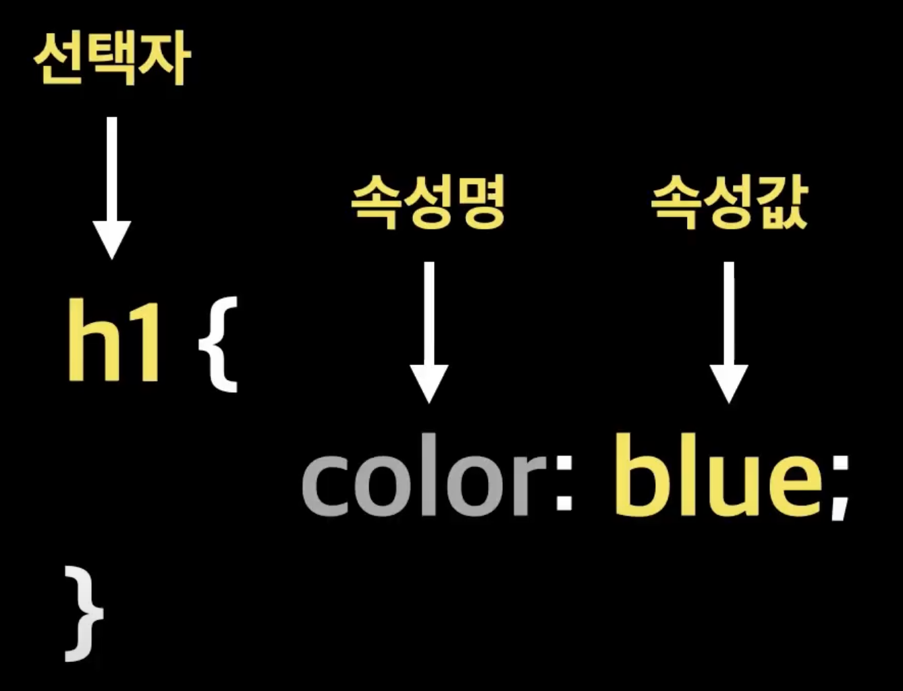

# CSS

Cascading Style Sheets

## CSS 적용 방법

### 인라인 스타일

html 태그 안에 style속성을 줘서 쓰는 방법
현업에서 거의 사용하지 않는다.
절대 변하지 않는 스타일, 꼭 사용해야하는 경우에 사용.

### 내부 스타일

head 태그 안에 style 태그 안에 작성
현업에서 역시 잘 사용하지 않음. 공통 css를 적용할 수 없기 때문에

### 외부 스타일

외부에 css 파일을 만들고,
link 태그로 stylesheet를 가져온다.

## css 출처

css 규칙이 어디서 적용된건지

### 제작자 스타일

개발자가 작성한 스타일 시트

### 브라우저 사용자 스타일

사이트에 방문한 유저들이 설정한 스타일
ex) 윈도우 고대비 설정

### 브라우저 기본 스타일

브라우저마다 기본적으로 지정하는 스타일.
크롬, 사파리, 엣지

### 적용 우선순위

사용자 !important > 제작자 !important > 제작자 > 사용자 > 브라우저

### Cascading

폭포와 같이 스타일이 우선순위에 맞게 연속적으로 적용된다.

## 구조



속성명 : 꾸미고 싶은 속성 명
속성값 : 해당 값.

css를 배운다 == 속성명의 종류를 알아간다.

### 선택자

`전체선택자`
꾸미고 싶은 html 요소. 태그
참고로 `* {}`는 모든 요소를 표시

`타입 선택자`
html 태그 명으로 선택

`클래스 선택자`
태그의 class 명으로 선택.
중복해서 여러 곳에 사용 가능.

`아이디 선택자`
태그의 id 명으로 선택
id는 웹문서에서 고유해야 한다.

`속성 선택자`
html에 있는 속성을 사용해서 특정 html 선택

```html
a[href] { }
```

a태그 중에서 href 속성이 있는 모든 곳에 적용됨.

`그룹 선택자`
쉼표를 사용해서 여러 선택자를 나열

### 결합자

`자손 결합자`
첫 번째 요소 하위에 있는 모든 선택자 선택. 모든 후손 요소

`자식 결합자`
바로 아래 하위에 있는 선택자 선택. 자식 요소만 선택.

`일반 형제 결합자`
동일 선상에 있는 태그들을 형제라고 한다.

`인접 형제 결합자`
