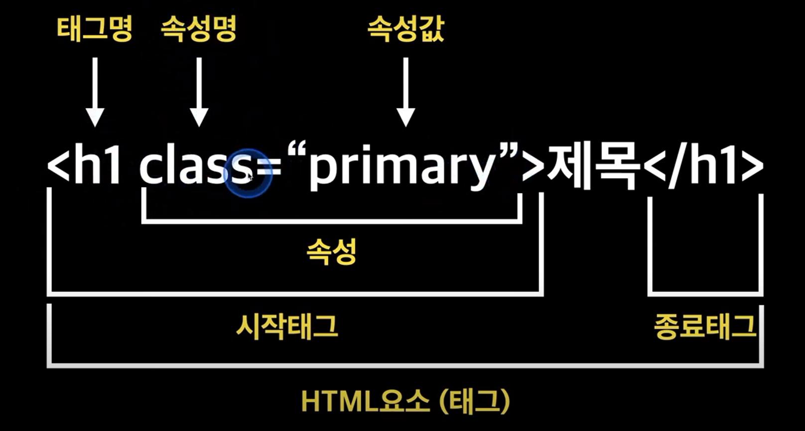
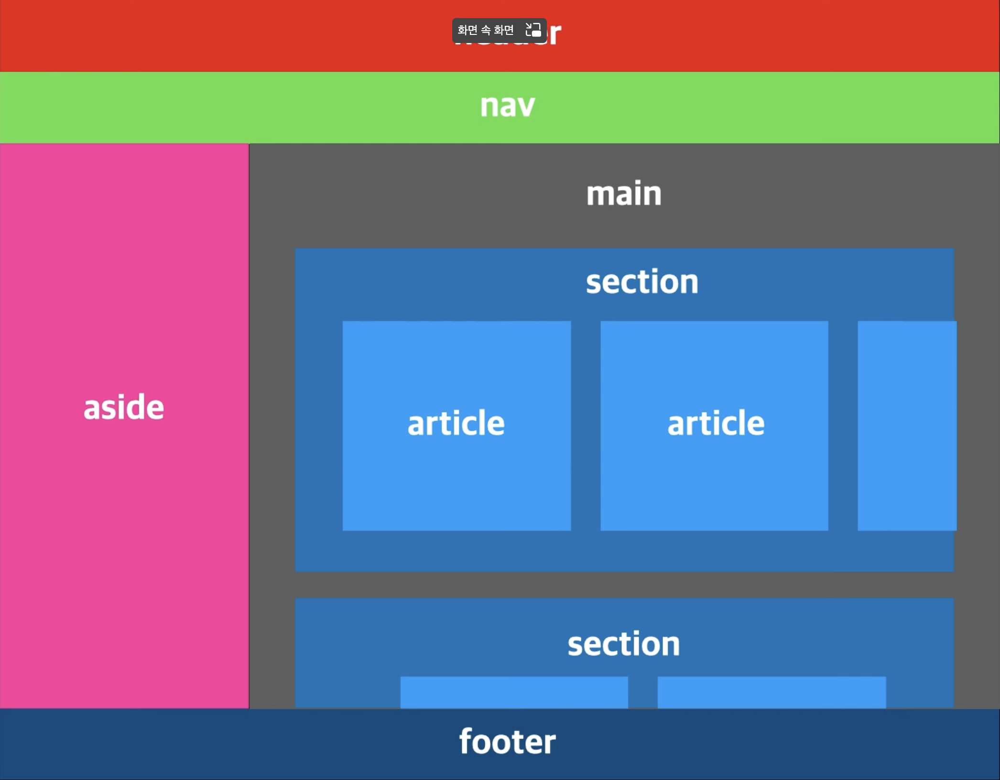
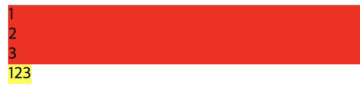
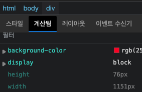

# HTML

## 정의

Hyper Text Markup Language

마크업 언어

## 형식



## 구조

```html
<!DOCTYPE html>
```

HTML5
현재 문서가 어떠한 버전으로 작성되어있는지.

html 문서 최상단

```html
<html lang="en"></html>
```

html태그 웹문서의 시작과 끝

lang : 문서가 어떤 언어로 작성되었는지

웹접근성이 향상된다.

## 태그 종류

`<strong>`과 `<em>`태그를 사용하자
웹접근성에 좋다.

`<ol>`
순서가 있는 목록

`<ul>`
순서가 없는 목록

`<li>`
하위 목록

`<table>`
표 태그. 표 전체를 감싼다.

`<caption>`
표의 제목이나 설명 태그

`<tr>`
행 태그
`<th>` 나 `<td>`가 반드시 있어야 한다.

`<th>`
표의 제목 열

`<td>`
열 태그

colspan : 열 병합
rowspan : 행 병합
대산 같은 group끼리만 가능

<colgroup>
<col>
테이블의 열 단위로 묶을 수 있다.

## 시멘틱 태그

semantic tag

[공식문서](https://developer.mozilla.org/ko/docs/Glossary/Semantics)

콘텐츠에 맞는 태그를 쓰자.

> 검색엔진 최적화
> 웹 접근성 최적화
> 가독성 향상



`<nav>`
웹사이트에서 주요한 지점으로 이동할 수 있는 네비게이션 역할 담당
주로 메뉴를 만들 때 사용.
과거에는 다 `<div>`에 넣었지만, html5에서는 영역별 의미를 나타내기 위해 `<nav>` 사용

## Inline vs Block Level Element

이러한 css display 속성에는
none, block, inline, inline-block, flex 등이 있다.

### Block Element

부모 요소의 전체 공간을 차지하여 블록을 만든다.
한칸을 모두 차지하기 때문에, 세로 방향


`<div>`
division.
어떠한 태그를 담는 컨테이너 역할.
semantic은 아님.
영역을 분할할 때 사용
박스형태
display:block


### Inline Element

콘텐츠의 흐름을 끊지 않고(줄바꿈x), 요소를 구성하는 태그에 할당된 공간만 차지
콘텐츠 영역만큼이기 때문에 가로영역.
margin css 적용이 안됨. 가로 세로 조절 x.

`<span>`
영역 태그.
박스 모양을 없고, 텍스트나 문장영역같은 컨텐츠만을 가리킨다.
display:inline


## 이미지 태그

``
src : 필수속성. 이미지의 경로 지정

alt : 웹 접근성 향상. 스크린 리더가 alt를 읽음. 이미지가 안 뜰 때 대신 alt값을 보여줌.

height : 이미지의 높이

width : 이미지 너비

### 절대경로

`/` : root directory. 최상위 위치

### 상대경로

현재 문서를 기준으로 경로를 인식
`../` : 상위 경로

## 오디오 & 비디오 태그

소리 콘텐츠를 넣을 때 사용.

`<audio controls>`

영상 콘텐츠를 삽입할 때 사용
`<video controls type=''>`

`src=""` : 소스 한 개일 때.
`<source>` : 소스 여러개 일 때

`controls` : 재생바 표시

`autoplay` : 자동 실행 설정

## 하이퍼링크 태그

`<a href="">`
다른 페이지나 같은 페이지의 특정위치, 파일, 이메일주소, 다른 URL로 연결할 수 있는 하이퍼링크 생성

`target="_black"` : 새 탭에서 열기

`<a href="mailto:xxxxx">` : URL을 사용하는 이메일 주소

## 입력 태그

### Form

웹에서 사용자의 정보를 입력받기 위해 사용
`<form action="" method="">`
form 데이터를 감싸는 역할.

action : 데이터를 처리할 서버프로그램의 URI

method : HTTP 메서드 타입.

### Input

`<input type="">`
요소로 데이터를 입력 받을 수 있음.
type 속성을 통해 다양한 방법으로 데이터를 받는다.

typd:hidden은 UI상으로는 표시되지 않지만, 서버에 데이터를 전송할 때 사용.

`required` : 입력값이 필수
`readonly` : 읽기전용 필드. 서버에는 전송됨.
`disabled` : 필드 비활성화. 서버에도 전송되지 않음.
`autofocus` : 초기에 해당 필드에 커서 위치하도록.
`placeholder` : 입력필드 설명

`type="checkbox"`
여러개의 체크박스 항목 중 2개 이상 선택 가능.

`type="radio"`
여러개의 라디오 항목 중 1개만 선택
하나를 선택하게 하려면, name 값을 모두 같게 해야한다.

### label

`<label for="">` 필드를 설명하는 태그
label태그의 for값과 input태그의 id 값을 일치시키면 된다.

### Textarea

`<textarea rows="" cols="">` : 여러줄의 데이터 입력 받을 수 있음.
rows : 한번에 보이는 행의 개수
cols : 컬럼 수(가로길이)

### select

`<select>` 옵션 메뉴 제공
`<option>` : 각 항목

### datalist

`<datatlist>` : input태그와 함께 사용.
input태그의 list 속성값과 datalist태그의 id 속성값이 같아야 한다.
검색도 가능.

### button

`<button type="">` 클릭 가능한 버튼.
type 종류
submit : 서버로 데이터 제출. default값
reset : 모든 입력 필드 초기값으로
button : 별도 기능은 없음. 주로 자바스크립트 함수 실행할 때.

## Head 태그

문서정보를 담고있는 태그

`<head>` : 파티콘, 타이틀, url 전송 정보.
`<base>` : 문서 안에 모든 상대URL이 사용할 기준 URL. 시작점이 현재문서가 아니라 해당 URL로 바뀜
`<link>` : 외부 리소스와의 관계 명시. 스타일 시트 연결할 때 자주 사용
`<style>` : 스타일 규칙
`<meta>` : 다른 메타관련 요소
`<script>` : 자바스크립트 코드 사용시.

## 출처

https://www.youtube.com/playlist?list=PLlaP-jSd-nK-ponbKDjrSn3BQG9MgHSKv
