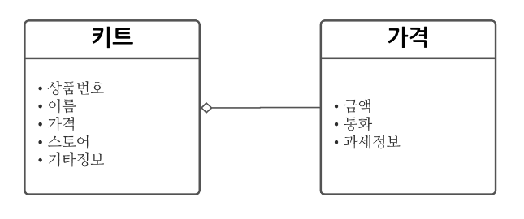
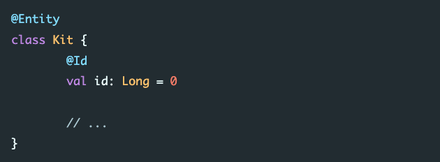
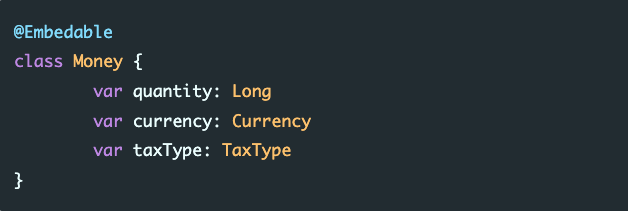

# Entity와 Value Object

## Entity

* 식별성과 연속성을 가진 객체
* 식별성 
  * 식별자를 가졌다.
  * ex) 주민등록번호, 택배송장번호 ..
* 연속성
  * 자기의 생명주기 동안에 형태와 내용이 변경될 수 있다.
  * ex) 이름, 성별, 주소들은 살면서 변경가능
  * 하지만, 주민등록번호는 변경 불가

* Entity의 동일성 확인 방법
  * 모든 객체에는 equals가 내장됨.
  * Entity는 메모리 주소를 식별자로 사용하지 않고, 
  * DB의 Primay Key를 식별자로 사용

## Value Object
* 값 객체
* 객체의 식별성은 중요하지 않고 속성의 값이 중요
* 속성 값이 동일하다면 동일한 객체로 취급
* 따라서 식별자를 필요로 하지 않음.
* DTO와 비슷해 보이지만, 지향하는 바는 다르다.

## 비교 

* 키트 - 상품번호를 식별자로 가지고 있는 Entity
* 가격 - 식별자가 없는 Value Object
* RDBMS는 구조상 Value Object를 표현하기 쉽지않음.

## 차이점 
### 식별자
* Entity는 반드시 식별자를 가지고 있음. 이 식별자를 통해서 동일한 객체임을 안다. 
* Value Object는 식별자가 없고 객체가 가진 속성을 통해서 동일한 객체임을 안다.

### 불변성
* Entity는 연속성을 가지고 있음. 식별자를 제외한 나머지 속성에 대해서는 변경 가능하도록 설계
* Value Object는 특별한 경우를 제외하고는 모든 속성이 불변성을 가지는 것이 기본. 
* Value Object를 변경하고자 하면, 새로운 객체를 생성해서 교체하는 것이 낫다.
* 멀티 쓰레드를 고려할 때, 불변 속성 객체가 있다면 코드의 단순함을 유지할 수 있다. 

## 함수 
* Entity는 속성 변경이 가능하기 때문에 명령형의 단어 사용
  * ex) changeTitle, increasePrice, getTitle, getPrice 등등
  * 반환타입은 거의 없다.
* Value Object는 속성 불변이기 때문에, 서술형? 단어를 사용
  * toTheLeft()
  * 변경자 함수의 특징은 명령형 이지만 반환타입이 있다.
    * 보통 값을 변경한다는 뜻은, 객체를 새로 생성한다는 것이기 때문에, 새로운 객체를 반환해야 한다.

### ORM(JPA)
* Entity
  * 
  * model에 @Entity 어노테이션
  * @Id 붙은 속성 필수

* Value Object
  * 
  * @Embedable 어노테이션 사용
  * @Id 값이 필수가 아니게 된다.

## 출처

https://veluxer62.github.io/explanation/about-entity-and-value-object/#entity