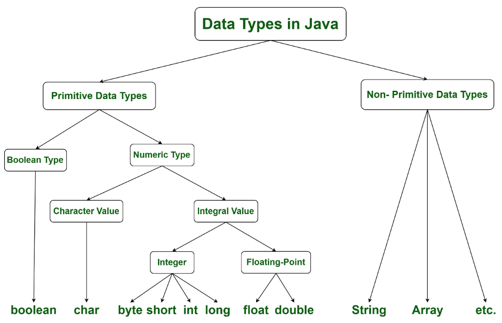

# Java Primitive Data Types

## 구조


Java의 데이터 타입은 **Primitive Type(기본형)** 과 **Reference Type(참조형)** 으로 나뉜다.
Primitive Type은 실제 값을 스택 메모리에 직접 저장하며, 총 8가지가 존재한다.

---

## 8가지 Primitive Type

| 분류 | 타입 | 크기 | 기본값 |
|------|------|------|--------|
| 논리형 | `boolean` | 1 bit | `false` |
| 문자형 | `char` | 2 byte | `'\u0000'` |
| 정수형 | `byte` | 1 byte | `0` |
| 정수형 | `short` | 2 byte | `0` |
| 정수형 | `int` | 4 byte | `0` |
| 정수형 | `long` | 8 byte | `0L` |
| 실수형 | `float` | 4 byte | `0.0f` |
| 실수형 | `double` | 8 byte | `0.0d` |

---

## 타입 변환

- **자동 형변환(Widening)**: 작은 타입 → 큰 타입으로 자동 변환
- **명시적 형변환(Narrowing)**: 큰 타입 → 작은 타입은 캐스팅 필요, 데이터 손실 가능

```
byte → short → int → long → float → double
              char ↗
```

---

## Primitive vs Reference Type

| 구분 | Primitive | Reference |
|------|-----------|-----------|
| 저장 값 | 실제 값 | 객체의 주소(참조) |
| 저장 위치 | 스택(Stack) | 힙(Heap) |
| null 가능 | 불가능 | 가능 |
| 제네릭 사용 | 불가능 | 가능 |

- Primitive를 객체로 다뤄야 할 때는 **Wrapper Class**(`Integer`, `Double` 등)를 사용하며, Java는 **Auto-boxing/unboxing**을 지원한다.
