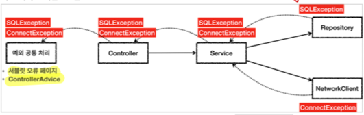

# 자바 예외 기본

[baeldung](https://www.baeldung.com/java-exceptions)

## 왜 예외 처리를 해야 되는가

- 우리의 코드는 비이상적인 상황을 맞을 수 있다. 파일시스템의 붕괴, 네트워크 차단, JVM 메모리 부족 등등
- 이러한 불행한 상황을 어떻게 처리하느냐에 코드의 안전성이 달려있다.
- 이러한 예외를 처리하지 않으면 프로그램이 멈춰버릴 수 도 있다. 

## 예외 계층 
                  ---> Throwable <--- 
                  |    (checked)     |
                  |                  |
                  |                  |
          ---> Exception           Error
          |    (checked)        (unchecked)
          |
    RuntimeException
    (unchecked)

### Throwable (checked)
최상위 예외

### Error (unchecked)
애플리케이션에서 복구 불가능한 시스템 예외.
개발자가 잡을 수 없는 예외다.
StackOverflowError, 

### Exception (checked)
애플리케이션 로직에서 사용할 수 있는 실질적 최상위 예외.

기본적으로 체크 예외라고 생각하면 된다. 
자바 컴파일러가 hanlde를 요구하는 예외이다.

체크 예외는 기본적으로 메서드를 호출하는 코드에서 예외를 처리하고, 어떠한 방식으로든 회복(recover)할 수 있을 때 사용하는 것이 좋다.

호출자가 예외 상황을 **예측** 할 수 있는 상황이라 보면 된다.

정상이 아닌 상황을 예외로 만든것이다. 예외 또한 `의도적`이라 할 수 있다.

#### 장점
컴파일 오류가 발생하기 떄문에 개발자가 실수로 누락할 일이 없다. 

#### 단점
작은 예외까지 항상 처리를 해줘야한다. 

리포지토리의 체크예외가 올라오면 비즈니스 계층에서 무조건 처리를 해줘야 한다. 하지만, 서비스에서 처리할 방법이 없다. Controller 역시 방법이 없어서 ControllerAdvice까지 올라간다.

또한, DB 기술이 JDBC에서 JPA로 변경되면 예외의 종류도 달라지기 때문에, 코드를 전부 변경해야 한다. 

이렇기 때문에, 런타임예외로 변경해서 던져주는 테크닉이 필요하다. 

런타임 예외는 throw 선언 생략이 가능하기 때문에, 코드를 변경할 일이 없어진다.

이런 해결 불가능한 예외는 로그를 남기고 별도 채널을 통해 개발자에게 전송되어야 한다. 

### RuntimeException
Exception에 속하지만 컴파일러 체크하지 못하는 언체크 예외이다. 

런타임 시점에 예외 확인되기 때문에 런타임 예외라고 많이 부른다.

예기치 못한 상황이기 때문에, 코드에서 명시적으로 처리하지 않아도 된다.

throws 예외 선언이 없어도 자동으로 던져진다. 

파멸적 문제, 처리할 수 없는 문제이기 때문에 위로 쭉 올릴 것이다.

#### 장점 
throws 생략이 가능해서 의존관계를 참조하지 않아도 된다.

#### 단점
런타임예외는 개발자가 실수로 누락할 수 있다.

## 언제 뭘 써야 되냐
호출한 코드에서 예외에 대해 복구를 할 수 있다면 checked exception을 사용.
코드 자체에서 발생하는 예외의 경우 unchecked exception 사용.

기본적으로 런타임예외를 사용하자. 

체크 예외는 비즈니스 로직상 의도적으로 던지는 예외로만 사용하자.
ex) 계좌 이체 실패, 결제 포인트 부족, 로그인 실패. 

## 참고
https://velog.io/@new_wisdom/Exception

https://www.baeldung.com/java-checked-unchecked-exceptions
