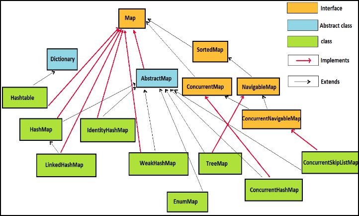

# Map

## 구조

## HashMap
synchronized 키워드가 존재하지 않음.

성능이 제일 좋지만, multi-thread에서 사용 불가.

## TreeMap

## LinkedHashMap

## MultiValueMap

    키의 중복이 허용됨.

    덮어쓰기 되지 않음.

    list대신 쓰는 이유는 시간복잡도 때문

## ConcurrentHashMap
multi-thread 환경에서 사용할 수 있도록 나온 클래스.

synchronized 키워드가 get()에는 없고 put()에는 중간 중간에 있음. 

읽기 작업에는 여러 쓰레드가 동시에 할 수 있지만, 쓰기 작업에는 버킷 단위 당 Lock 사용.

같은 버킷에 쓰기 작업을 할 때, LOCK이 적용된다. 

## 참고

https://devlog-wjdrbs96.tistory.com/269