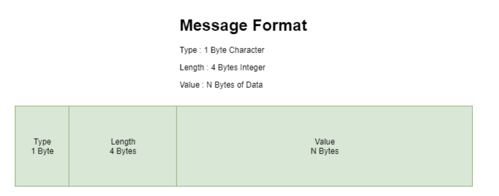

# Java Socket

> 최종 업데이트: 2026-04-06 | Java 21 기준 | [공식문서](https://docs.oracle.com/en/java/javase/21/docs/api/java.base/java/net/package-summary.html)

## 개념

네트워크를 통해 두 프로그램이 데이터를 주고받기 위한 **양쪽 끝점(Endpoint)**이다.

- 전화에 비유하면, 소켓은 **전화기**에 해당. 전화기(소켓)를 들고 상대방 번호(IP + Port)로 전화를 걸면 연결이 맺어지고, 연결된 전화기를 통해 대화(데이터 송수신)를 주고받는 것
- `java.net` 패키지에서 소켓 관련 클래스를 제공
- Java 소켓은 **TCP** 기반 (신뢰성 있는 연결 지향 통신). UDP는 `DatagramSocket`을 별도로 사용

```
┌──────────────┐                          ┌──────────────┐
│   Client     │                          │   Server     │
│              │   TCP 3-way Handshake    │              │
│  Socket ─────┼──── SYN ──────────────→  │ ServerSocket │
│              │  ← SYN+ACK ────────────  │   (listen)   │
│              │  ──── ACK ──────────────→│              │
│              │                          │   accept()   │
│              │      연결 수립 완료        │  → Socket    │
│              │                          │              │
│  write() ────┼──── 데이터 ──────────→   │── read()     │
│  read()  ←───┼──── 데이터 ←────────     │── write()    │
│              │                          │              │
│  close() ────┼──── FIN ──────────────→  │── close()    │
└──────────────┘                          └──────────────┘
```

## TCP vs UDP

소켓 프로그래밍에서 사용할 수 있는 2가지 프로토콜이다. 택배에 비유하면, TCP는 등기우편(수신 확인), UDP는 전단지 뿌리기(확인 없이 보냄)다.

| 항목 | TCP | UDP |
|---|---|---|
| 연결 | 연결 지향 (3-way Handshake) | 비연결 (세션 없음) |
| 신뢰성 | 순서 보장, 손실 시 재전송 | 보장 안 함 |
| 속도 | 상대적으로 느림 | 빠름 |
| Java 클래스 | `Socket`, `ServerSocket` | `DatagramSocket`, `DatagramPacket` |
| 용도 | HTTP, DB 연결, 파일 전송 | DNS, 실시간 스트리밍, 게임 |

## 통신 흐름

```
Server                                    Client
──────                                    ──────
1. new ServerSocket(port)   ← 포트 바인딩
2. accept()                 ← 연결 대기 (블로킹)
                                          3. new Socket(host, port)  ← 연결 요청
4. Socket 반환              ← 연결 수립
5. getInputStream().read()                6. getOutputStream().write()  ← 데이터 전송
7. getOutputStream().write()              8. getInputStream().read()    ← 데이터 수신
9. close()                                9. close()
```

## ServerSocket

서버 측에서 클라이언트의 연결 요청을 기다리는 역할. 전화 교환원처럼 특정 포트에서 들어오는 연결 요청을 듣고, 연결이 들어오면 수락하여 통신용 `Socket`을 생성한다.

```java
// 1. 포트 바인딩 — 8080 포트에서 대기 시작
ServerSocket serverSocket = new ServerSocket(8080);

// 2. 연결 대기 — 클라이언트가 연결할 때까지 블로킹
Socket clientSocket = serverSocket.accept();

// 3. 통신 완료 후 서버 소켓 닫기
serverSocket.close();
```

### 주요 메서드

| 메서드 | 설명 |
|---|---|
| `accept()` | 연결 요청 대기 (블로킹). 연결되면 통신용 `Socket` 반환 |
| `close()` | 서버 소켓을 닫고 시스템 리소스 해제 |
| `setSoTimeout(ms)` | `accept()`의 블로킹 제한 시간 설정. 초과 시 `SocketTimeoutException` |
| `isClosed()` | 소켓이 닫혔는지 확인 |
| `isBound()` | 포트에 바인딩되었는지 확인 |

### accept() 내부

```java
public Socket accept() throws IOException {
    if (isClosed())
        throw new SocketException("Socket is closed");
    if (!isBound())
        throw new SocketException("Socket is not bound yet");
    Socket s = new Socket((SocketImpl) null);
    implAccept(s);
    return s;
}
```

- 닫혔거나 바인딩 안 된 상태면 예외 발생
- 정상이면 새 `Socket` 객체를 생성하여 반환

## Socket

클라이언트 측에서 서버에 연결하고, 양방향으로 데이터를 주고받는 핵심 클래스.

```java
// 방법 1: 생성과 동시에 연결
Socket socket = new Socket("localhost", 8080);

// 방법 2: 생성 후 명시적 연결 (타임아웃 설정 가능)
Socket socket = new Socket();
socket.connect(new InetSocketAddress("localhost", 8080), 5000);  // 5초 타임아웃
```

### 데이터 송신

```java
// 문자열 전송 — PrintWriter 사용
PrintWriter out = new PrintWriter(socket.getOutputStream(), true);
out.println("hello");

// 바이트 전송 — OutputStream 직접 사용
OutputStream os = socket.getOutputStream();
os.write("HELLO".getBytes());

// 구조화된 데이터 전송 — DataOutputStream 사용
DataOutputStream dos = new DataOutputStream(socket.getOutputStream());
dos.writeChar('s');
dos.writeInt(data.length());
dos.write(dataInBytes);
```

### 데이터 수신

```java
// 문자열 수신 — BufferedReader 사용
BufferedReader in = new BufferedReader(new InputStreamReader(socket.getInputStream()));
String line = in.readLine();  // 한 줄 읽기 (블로킹)

// 바이트 수신 — InputStream 직접 사용
InputStream is = socket.getInputStream();
int b = is.read();  // 1바이트 읽기 (블로킹, 스트림 끝이면 -1 반환)

// 구조화된 데이터 수신 — DataInputStream 사용
DataInputStream dis = new DataInputStream(new BufferedInputStream(socket.getInputStream()));
int length = dis.readInt();
```

- `read()`는 데이터가 도착할 때까지 **블로킹**된다
- 스트림 끝(연결 종료)에 도달하면 **-1을 반환** — 이 값으로 종료를 판단해야 함
- 지속적인 통신은 while 루프에서 읽으면서, 종료 신호를 받으면 빠져나오는 구조

### 바이너리 데이터 — TLV 프로토콜

바이트 단위로 데이터를 주고받을 때는 서버-클라이언트 간 **자체 프로토콜**을 정의해야 한다. 가장 간단한 방식이 **TLV(Type-Length-Value)** 다.



| 필드 | 크기 | 설명 |
|---|---|---|
| Type | 1 byte (char) | 데이터 유형 |
| Length | 4 bytes (int) | 데이터 길이 |
| Value | Length bytes | 실제 데이터 |

```java
// 송신
DataOutputStream out = new DataOutputStream(socket.getOutputStream());
out.writeChar('s');              // Type
out.writeInt(data.length());     // Length
out.write(dataInBytes);          // Value

// 수신
DataInputStream in = new DataInputStream(new BufferedInputStream(socket.getInputStream()));
char type = in.readChar();       // Type
int length = in.readInt();       // Length
byte[] messageByte = new byte[length];
int totalBytesRead = 0;
while (totalBytesRead < length) {
    int bytesRead = in.read(messageByte, totalBytesRead, length - totalBytesRead);
    if (bytesRead == -1) break;  // 연결 끊김
    totalBytesRead += bytesRead;
}
```

> `read()`는 요청한 길이만큼 한 번에 읽는다는 보장이 없다. 네트워크 상황에 따라 부분적으로 읽힐 수 있으므로, 반드시 **루프를 돌면서 원하는 길이만큼 채워야** 한다.

## 주요 소켓 옵션

| 옵션 | 메서드 | 설명 |
|---|---|---|
| **SO_TIMEOUT** | `setSoTimeout(ms)` | `read()` 블로킹 제한 시간. 초과 시 `SocketTimeoutException` |
| **SO_KEEPALIVE** | `setKeepAlive(true)` | TCP Keep-Alive 활성화. 유휴 연결이 살아있는지 OS가 주기적으로 확인 |
| **TCP_NODELAY** | `setTcpNoDelay(true)` | Nagle 알고리즘 비활성화. 작은 패킷도 즉시 전송 (지연 감소, 대역폭 증가) |
| **SO_LINGER** | `setSoLinger(true, sec)` | `close()` 시 미전송 데이터를 보낼 때까지 최대 sec초 대기 |
| **SO_REUSEADDR** | `setReuseAddress(true)` | TIME_WAIT 상태의 포트 재사용 허용 |
| **SO_RCVBUF / SO_SNDBUF** | `setReceiveBufferSize(size)` | 수신/송신 버퍼 크기 설정 |

```java
Socket socket = new Socket();
socket.setSoTimeout(10_000);      // 10초 동안 데이터 안 오면 타임아웃
socket.setTcpNoDelay(true);       // 작은 패킷 즉시 전송
socket.setKeepAlive(true);        // 유휴 연결 체크
socket.connect(new InetSocketAddress("localhost", 8080), 5000);
```

## 리소스 관리

소켓은 OS 리소스(파일 디스크립터)를 사용하므로 반드시 닫아야 한다. **try-with-resources**를 사용하면 예외 발생 시에도 자동으로 닫힌다.

```java
// 권장: try-with-resources — 자동으로 close() 호출
try (ServerSocket serverSocket = new ServerSocket(8080);
     Socket clientSocket = serverSocket.accept();
     PrintWriter out = new PrintWriter(clientSocket.getOutputStream(), true);
     BufferedReader in = new BufferedReader(new InputStreamReader(clientSocket.getInputStream()))) {

    String line;
    while ((line = in.readLine()) != null) {
        out.println("Echo: " + line);
    }
}
// serverSocket, clientSocket, out, in 모두 자동 close
```

> 소켓을 닫으면 연결된 InputStream/OutputStream도 함께 닫힌다. 반대로 스트림을 먼저 닫으면 소켓도 닫힌다.

## 멀티 클라이언트 처리

`accept()`는 한 번에 하나의 연결만 수락한다. 여러 클라이언트를 동시에 처리하려면 별도 전략이 필요하다.

### Thread-per-Connection

클라이언트마다 스레드를 생성하는 가장 단순한 방식. 접속자가 많아지면 스레드가 무한히 늘어나는 문제가 있다.

```java
try (ServerSocket serverSocket = new ServerSocket(8080)) {
    while (true) {
        Socket clientSocket = serverSocket.accept();
        new Thread(() -> handleClient(clientSocket)).start();
    }
}
```

### Thread Pool

스레드 수를 제한하여 리소스를 관리한다. 실무에서 Blocking I/O 소켓을 쓸 때 가장 일반적인 방식.

```java
ExecutorService pool = Executors.newFixedThreadPool(100);

try (ServerSocket serverSocket = new ServerSocket(8080)) {
    while (true) {
        Socket clientSocket = serverSocket.accept();
        pool.submit(() -> handleClient(clientSocket));
    }
}
```

### NIO (Non-blocking I/O)

> `java.nio` 패키지. 하나의 스레드가 **Selector**를 통해 여러 채널(연결)을 감시하는 방식. 전화 교환원 한 명이 여러 회선의 불이 켜지는 걸 감시하다가, 불이 켜진 회선만 처리하는 것과 같다.

```
Thread-per-Connection:               NIO (Selector):
┌─ Thread 1 ←→ Client 1             ┌─ Thread 1 ─── Selector
├─ Thread 2 ←→ Client 2             │               ├── Channel (Client 1)
├─ Thread 3 ←→ Client 3             │               ├── Channel (Client 2)
├─ ...                               │               ├── Channel (Client 3)
└─ Thread N ←→ Client N             │               └── Channel (Client N)
   (클라이언트 수 = 스레드 수)          (소수의 스레드로 다수 연결 처리)
```

| 항목 | Blocking I/O (Socket) | NIO (SocketChannel + Selector) |
|---|---|---|
| 패키지 | `java.net` | `java.nio.channels` |
| I/O 방식 | 블로킹 (read/write 시 대기) | 논블로킹 (준비된 채널만 처리) |
| 스레드 모델 | 연결당 1스레드 | Selector로 다수 연결을 소수 스레드가 처리 |
| 버퍼 | Stream 기반 (1바이트씩) | Buffer 기반 (ByteBuffer) |
| 적합한 경우 | 접속 수 적고 로직 단순 | 대량 동시 접속 (C10K) |

```java
// NIO 서버 기본 구조
Selector selector = Selector.open();
ServerSocketChannel serverChannel = ServerSocketChannel.open();
serverChannel.bind(new InetSocketAddress(8080));
serverChannel.configureBlocking(false);
serverChannel.register(selector, SelectionKey.OP_ACCEPT);

while (true) {
    selector.select();  // 이벤트 발생까지 대기
    Set<SelectionKey> keys = selector.selectedKeys();
    for (SelectionKey key : keys) {
        if (key.isAcceptable()) {
            // 새 연결 수락
            SocketChannel client = serverChannel.accept();
            client.configureBlocking(false);
            client.register(selector, SelectionKey.OP_READ);
        } else if (key.isReadable()) {
            // 데이터 읽기
            SocketChannel client = (SocketChannel) key.channel();
            ByteBuffer buffer = ByteBuffer.allocate(1024);
            client.read(buffer);
        }
    }
    keys.clear();
}
```

> 실무에서는 NIO를 직접 사용하기보다 **Netty** 같은 프레임워크를 사용하는 것이 일반적이다. Netty는 NIO 위에 이벤트 루프, 코덱, 파이프라인 등을 추상화한 네트워크 프레임워크다.

## 전체 예제 — Echo 서버/클라이언트

클라이언트가 보낸 메시지를 그대로 돌려주는 가장 기본적인 소켓 프로그램.

```java
// Echo Server
public class EchoServer {
    public static void main(String[] args) throws IOException {
        try (ServerSocket serverSocket = new ServerSocket(8080)) {
            System.out.println("서버 대기 중...");
            try (Socket client = serverSocket.accept();
                 BufferedReader in = new BufferedReader(new InputStreamReader(client.getInputStream()));
                 PrintWriter out = new PrintWriter(client.getOutputStream(), true)) {

                String line;
                while ((line = in.readLine()) != null) {
                    System.out.println("수신: " + line);
                    out.println("Echo: " + line);
                }
            }
        }
    }
}
```

```java
// Echo Client
public class EchoClient {
    public static void main(String[] args) throws IOException {
        try (Socket socket = new Socket("localhost", 8080);
             PrintWriter out = new PrintWriter(socket.getOutputStream(), true);
             BufferedReader in = new BufferedReader(new InputStreamReader(socket.getInputStream()))) {

            out.println("Hello");
            System.out.println("응답: " + in.readLine());  // Echo: Hello
        }
    }
}
```

## Java 소켓 vs 상위 수준 대안

| 구분 | 용도 | 비유 |
|---|---|---|
| **Socket / ServerSocket** | TCP 레벨 직접 제어 | 직접 벽돌 쌓기 |
| **HttpURLConnection / HttpClient** | HTTP 프로토콜 통신 | 기성품 조립 |
| **Netty** | 고성능 비동기 네트워크 프레임워크 | 건축 회사에 맡기기 |
| **Spring WebSocket** | WebSocket 프로토콜 | 인테리어 업체까지 포함 |

- 백엔드 개발에서 raw Socket을 직접 다루는 경우는 드물지만, HTTP, gRPC, WebSocket 등 상위 프로토콜이 모두 소켓 위에서 동작하므로 **기본 원리를 이해하는 것이 중요**

## 참고

- https://www.baeldung.com/a-guide-to-java-sockets
- https://docs.oracle.com/en/java/javase/21/docs/api/java.base/java/net/Socket.html
