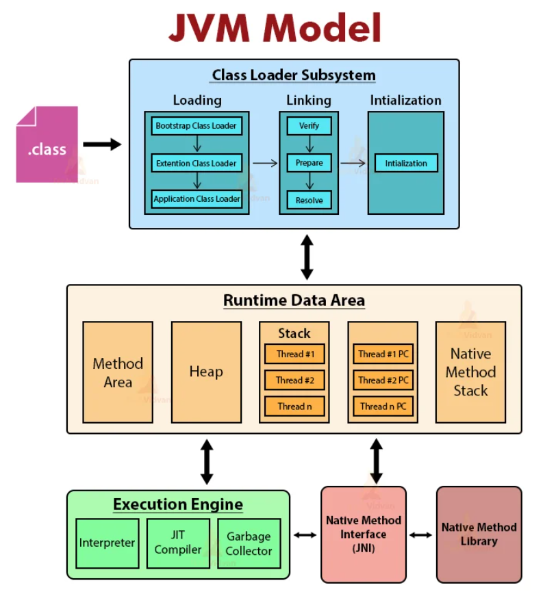

# JVM
Java Virtual Machine

[공식문서](https://docs.oracle.com/javase/specs/jvms/se20/html/index.html)

cornerstone(초석) of the Java platform

`JVM` is an abstract computing machine.

Java로 작성된 애플리케이션은 모두 이 JVM에서만 실행가능하다.

**JVM은 Java programming language를 전혀 알지 못한다.**

binary format만 알 뿐이다.

Compile된 자바 코드는 하드웨어 및 운영체제에 독립적인 binary format이며 `class` file format에 저장된다. 

`class` file에는 JVM 명령어와 symbol table, 등등이 포함되어 있다.

Java 언어(compile된 class file)는 운영체제, 하드웨어에 종속적이지 않지만 

JVM은 각 운영체제에 맞는 버전이 존재한다. 

## JVM Architecture

## JVM 클래스 로딩

- 자바 프로그램이 실행되는 과정에서 **클래스 파일(.class)** 이 **Java Virtual Machine(JVM)의 메모리 영역으로 적재**되고, 사용할 수 있는 형태로 준비되는 일련의 과정
- 자바 소스 코드(*.java)는 컴파일러에 의해 바이트코드(*.class)로 변환됨.
- 이 바이트코드는 컴퓨터가 직접 실행할 수 있는 기계어 코드가 아니며, JVM이라는 가상 머신 위에서 해석되고 실행됨.
- JVM이 프로그램을 실행하기 위해서는, 필요한 클래스의 바이트코드 내용을 .class 파일에서 읽어와 JVM 내부의 메모리 영역(특히 메서드 영역)에 배치하고, 해당 클래스에 대한 내부적인 자료구조를 생성함.

### 로딩 프로세스

- Loading (로드): 
  - 프로그램에 필요한 모든 클래스를 시작 시점에 한꺼번에 로드하지 않는다. 이는 비효율적이기 때문에
    - 필요한 시점에 동적으로 로드하는 **지연 로딩(Lazy Loading)** 방식을 사용
      - new 키워드를 사용하여 해당 클래스의 인스턴스를 생성할 때
      - 클래스의 static 멤버(필드 또는 메서드)에 처음으로 접근할 때
      - Class.forName() 메서드를 통해 명시적으로 클래스를 로드할 때
      - 애플리케이션의 main 메서드가 포함된 클래스가 시작될 때
  - **클래스 로더(Class Loader)** 라는 서브 시스템이 이 로딩 작업을 담당
    - `부트스트랩 클래스 로더` (Bootstrap ClassLoader): 
      - JVM이 시작될 때 활성화되며, 자바 표준 라이브러리(rt.jar 등)를 로드합니다.
    - `확장 클래스 로더` (Extension ClassLoader): 
      - jre/lib/ext 디렉토리에 있는 JAR 파일들을 로드합니다.
    - `애플리케이션 클래스 로더` (Application ClassLoader): 
      - 사용자가 작성한 클래스(CLASSPATH에 명시된 경로의 .class 파일)를 로드합니다.
  - **.class 파일을 찾아**서 바이트코드를 읽어들이고, 이를 JVM의 메모리에 저장.
  - 이 과정에서 Class 객체가 **힙(Heap) 영역**에 생성됨.
- Linking (링크):
  - Verification (검증): 
    - 로드된 바이트코드가 유효하고 안전한지 확인. (예: 코드 형식이 올바른지, 스택 오버플로우나 언더플로우를 일으키지 않는지 등)
  - Preparation (준비): 
    - 클래스의 static 필드에 대한 메모리를 할당하고, 기본값으로 초기화 (예: int는 0, boolean은 false, 참조 타입은 null).
  - Resolution (분석): 
    - 심볼릭 참조(예: 다른 클래스나 메서드의 이름)를 실제 메모리 주소(직접 참조)로 변환합
- Initialization (초기화): 
  - 클래스의 **static 변수**를 선언 시 할당된 값이나 **static 초기화 블록**의 코드를 실행하여 최종적인 값으로 초기화. 바로 이 단계에서 static 초기화 블록의 코드가 실행됨

## Runtime Data Area

### 모든 thread가 공유해서 사용하는 메모리(Garbage Collector 대상)

#### Method Area
`.class`, 클래스 파일을 읽어서 클래스 데이터를 저장하는 메모리.
이때, `클래스 변수`(static이 붙은 클래스 영역 내의 변수)도 이 곳에 저장된다.

#### Heap Area
new 키워드로 생성되는 인스턴스가 생성되는 공간.
프로그램 실행 중 생성되는 인스턴스는 모두 이곳에 생성된다.
`인스턴스 변수`(static이 붙지 않은 클래스 영역 내의 변수)도 이 곳에 있다.

### Thread 마다 하나씩 생성되는 메모리

#### Stack

#### PC Register

#### Native Method Stack