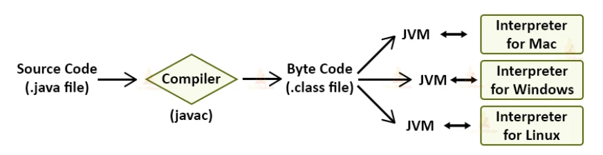

# Java 동작 원리

> 최종 업데이트: 2026-03-28 | Java 21 기준

## 개념

Java는 **"Write Once, Run Anywhere"** — 한 번 작성하면 어디서든 실행 가능한 구조.

- 소스 코드를 OS별 기계어로 직접 컴파일하지 않고, **중간 언어(바이트코드)** 로 변환한 뒤 **JVM이 실행 시점에 기계어로 변환**하는 2단계 구조
- 국제 학회에 비유하면: 발표자(개발자)가 에스페란토(바이트코드)로 발표문을 작성하면, 각 나라 통역사(JVM)가 현지어(기계어)로 동시통역하는 것

## 전체 실행 흐름



```
 ① 소스 코드 작성          ② 컴파일               ③ 클래스 로딩
┌──────────────┐    javac    ┌──────────────┐   ClassLoader  ┌──────────────┐
│  Hello.java  │ ──────────→ │  Hello.class │ ─────────────→ │ JVM 메모리에  │
│  (소스 코드)  │   컴파일타임  │  (바이트코드)  │    런타임       │   적재        │
└──────────────┘            └──────────────┘               └──────┬───────┘
                                                                  │
                            ⑤ OS 실행                ④ 실행 엔진   ▼
                         ┌──────────────┐         ┌──────────────────────┐
                         │   기계어      │ ←────── │ Interpreter + JIT    │
                         │ (OS/CPU별)   │         │ (바이트코드 → 기계어)  │
                         └──────────────┘         └──────────────────────┘
```

| 단계 | 시점 | 수행 주체 | 입력 → 출력 |
|------|------|----------|------------|
| ① 작성 | 개발 시 | 개발자 | — → `.java` |
| ② 컴파일 | 빌드 시 (컴파일타임) | `javac` | `.java` → `.class` (바이트코드) |
| ③ 클래스 로딩 | 실행 시 (런타임) | Class Loader | `.class` → JVM 메모리 |
| ④ 실행 | 실행 시 (런타임) | Interpreter + JIT | 바이트코드 → 기계어 |
| ⑤ OS 실행 | 실행 시 | OS/CPU | 기계어 실행 |

## ① 소스 코드 (.java)

Java 소스 코드는 `.java` 파일에 작성하며, 모든 코드는 **클래스 안에** 존재해야 함.

```java
public class Hello {
    public static void main(String[] args) {    // 진입점 (Entry Point)
        System.out.println("Hello, Java!");
    }
}
```

- 여러 클래스가 모여 하나의 애플리케이션을 구성
- 실행의 시작점이 되는 클래스에 **`main` 메서드**가 반드시 존재해야 함
- `public static void main(String[] args)` — JVM이 인스턴스 생성 없이 직접 호출하기 위해 `static`

## ② 컴파일 (javac)

`javac` 컴파일러가 소스 코드를 검증하고 **바이트코드(.class)** 로 변환하는 단계.

- 출판 전 **교정·교열** 과정에 비유: 문법 오류를 찾고(Syntax Check), 내용 일관성을 확인한 뒤(Type Check), 인쇄 가능한 형태(바이트코드)로 변환

```sh
javac Hello.java    # → Hello.class 생성
```

**컴파일러가 수행하는 작업:**

| 작업 | 설명 | 예시 |
|------|------|------|
| 문법 검사 | Java 언어 규칙에 맞는지 확인 | 세미콜론 누락, 괄호 불일치 |
| 타입 검사 | 타입 안전성 확인 | `String x = 1;` → 컴파일 에러 |
| 바이트코드 생성 | `.java` → `.class` 변환 | JVM이 이해하는 명령어로 변환 |
| 상수 인라이닝 | `static final` 상수를 사용 위치에 직접 삽입 | 아래 예시 참고 |
| 제네릭 타입 소거 | 제네릭 타입 정보를 제거 (Type Erasure) | `List<String>` → `List` |
| Syntactic Sugar 제거 | 편의 문법을 기본 구조로 변환 | 향상된 for → Iterator, 오토박싱 등 |

```java
// 상수 인라이닝 (Constant Inlining)
public class Constants {
    public static final int MAX = 100;
}

public class App {
    int value = Constants.MAX;
    // 컴파일 후 바이트코드에는 Constants.MAX 참조가 아닌 100이 직접 삽입됨
    // → Constants 클래스가 변경되어도 App을 재컴파일하지 않으면 반영 안 됨 (주의)
}
```

상세 내용은 [컴파일과 바이트코드](./컴파일과%20바이트코드.md) 참고.

## ③ 클래스 로딩 (Class Loader)

JVM이 `.class` 파일을 **필요한 시점에 동적으로** 메모리에 적재하는 단계.

- 도서관 사서에 비유: 책(클래스)을 처음부터 전부 꺼내두지 않고, 요청이 올 때 서고에서 찾아오는 것

```
Class Loading 과정:

.class 파일
    ↓  Loading — 바이트코드를 읽어들임
    ↓  Verification — 유효한 바이트코드인지 검증 (보안)
    ↓  Preparation — static 필드 메모리 할당 (기본값)
    ↓  Resolution — 심볼릭 참조 → 실제 메모리 주소 변환
    ↓  Initialization — static 변수에 실제 값 할당, static 블록 실행
    ↓
  JVM 메모리 (Method Area)에 클래스 정보 적재
```

상세 내용은 [JVM - Class Loader Subsystem](./JVM.md) 참고.

## ④ 실행 (Execution Engine)

바이트코드를 **기계어로 변환하여 실행**하는 단계. Interpreter와 JIT Compiler의 혼합 방식.

- 처음 가는 식당에서: 처음엔 메뉴판을 한 줄씩 읽으며 주문(Interpreter), 자주 가게 되면 단골 메뉴를 외워서 바로 주문(JIT)

```
실행 흐름:

바이트코드
    ↓
Interpreter (한 줄씩 해석/실행)
    ↓  실행 횟수 카운팅 (프로파일링)
    ↓  자주 실행되는 코드(핫스팟) 감지
    ↓
JIT Compiler (기계어로 한 번에 변환)
    ↓
Code Cache (변환된 기계어 저장)
    ↓
이후 동일 코드 실행 시 → Code Cache에서 기계어 직접 실행 (빠름)
```

### Warm-up (워밍업)

Java 애플리케이션은 시작 직후에는 Interpreter로 실행되어 느리고, **JIT이 핫스팟을 컴파일한 후부터 최대 성능**에 도달.

- 자동차 엔진에 비유: 시동 직후(Cold Start)에는 성능이 낮고, 엔진이 적정 온도에 올라야(Warm-up) 최대 출력이 나옴

```
성능
 ▲
 │              ┌──────────── 최대 성능 (JIT 최적화 완료)
 │            ╱
 │          ╱   ← JIT 컴파일 진행 중
 │        ╱
 │──────╱  ← Interpreter 단계
 └──────────────────────→ 시간
   Cold     Warm-up    Warmed-up
```

- 실무에서 배포 직후 첫 몇 건의 요청이 느린 이유
- 부하 테스트 시 Warm-up 구간을 제외하고 측정해야 정확한 성능 수치를 얻음
- GraalVM Native Image(AOT)는 미리 기계어로 컴파일하여 Warm-up 없이 즉시 최대 성능

상세 내용은 [JVM - Execution Engine](./JVM.md) 참고.

## 다른 언어와의 실행 방식 비교

| 언어 | 실행 방식 | 특징 |
|------|----------|------|
| **C/C++** | 소스 → 기계어 (AOT 컴파일) | OS별 재컴파일 필요, 실행 속도 빠름 |
| **Java** | 소스 → 바이트코드 → JVM이 기계어 변환 | OS 독립적, JVM 필요, Warm-up 후 고성능 |
| **Python** | 소스 → 인터프리터가 직접 실행 | 별도 컴파일 불필요, 실행 속도 느림 |
| **Go** | 소스 → 기계어 (AOT 컴파일) | OS별 크로스 컴파일 지원, VM 불필요 |
| **Kotlin/Scala** | 소스 → 바이트코드 → JVM | Java와 동일한 실행 구조, JVM 생태계 공유 |

```
C/C++:    .c   → [컴파일러] → 기계어 (OS별)  → 실행
Java:     .java → [javac]  → .class        → [JVM] → 기계어 → 실행
Python:   .py   ─────────────────────────── → [인터프리터] → 실행
Go:       .go   → [go build] → 기계어 (OS별) → 실행
```

## Java 실행 명령어

```sh
# 컴파일
javac Hello.java                     # Hello.class 생성
javac -d out src/Hello.java          # 출력 디렉토리 지정

# 실행
java Hello                           # 클래스 직접 실행
java -jar myapp.jar                  # JAR 파일 실행
java -cp lib/*:. com.example.Main    # 클래스패스 지정 실행

# Java 11+: 단일 소스 파일 직접 실행 (컴파일 + 실행을 한 번에)
java Hello.java                      # javac 없이 바로 실행 가능 (단일 파일 한정)
```

## 관련 문서

- [컴파일과 바이트코드](./컴파일과%20바이트코드.md)
- [JVM](./JVM.md)
- [JDK](./JDK.md)
- [Java Memory](./Java%20Memory.md)
