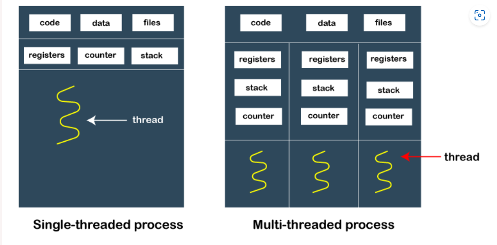
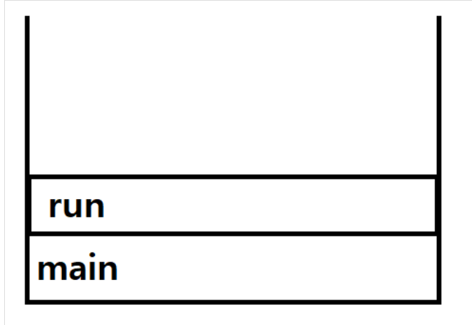
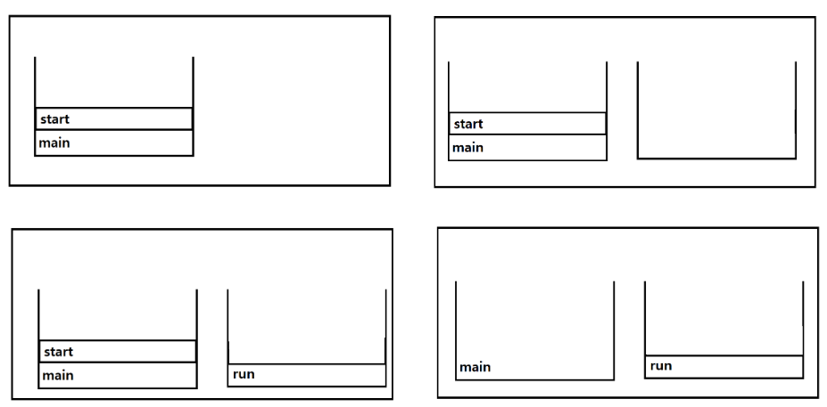
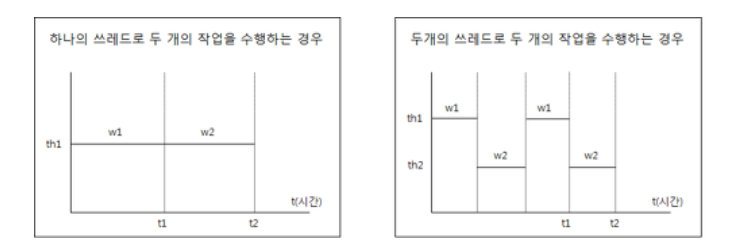
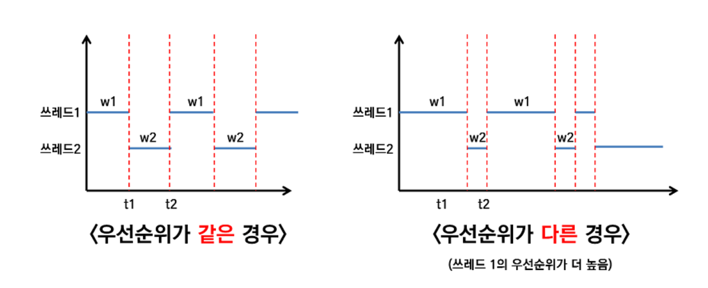

# Java Thread

## 정의

**program**을 실행하면 OS로부터 실행에 필요한 자원(메모리)를 할당받는다.
그러면 **process**(실행중인 프로그램)이 된다.

process는 데이터, 메모리, 쓰레드로 구성이 되어있다.

process의 자원을 이용해서 실제로 작업을 수행하는 것이 바로 **쓰레드**이다.

일종의 일꾼 역할.



프로세스에는 최소 하나 이상의 쓰레드가 존재한다. 만약 쓰레드가 여러개 있으면 **멀티쓰레드 프로세스**라고 부른다.

## process vs thread

물리적 메모리 공간에 메모리 매핑을 통해 메모리 공간을 할당받아야 프로그램이 실행된다. 메모리에 올라온다고 해서 이걸 **Load**라고 한다.

이렇게 실행중인 프로그램을 **Process** 라고 한다.

이 자바 Process 내부를 보면, **main thread**가 제일 먼저 실행된다.

하나의 thread가 시작되면, **JVM stack(thread stack)** 이 만들어진다.

이 스택은 자바 method들을 위한 메모리 공간이다. 쓰고 나면 사라진다.

main method에서 새로운 thread를 시작하면 이 thread를 위한 thread stack이 또 만들어진다.

모든 쓰레드는 하나의 **Heap Memory**를 공유한다. 여기에 new로 만드는 객체들이 저장된다.

2개의 프로세스가 돌고 있다면, OS의 thread scheduler가 CPU에 프로세스를 할당해준다.

즉, 하나의 process 안에 n개의 thread가 가능하다.

- process 에는 최소 하나의 thread가 있다.
- process는 별도의 memory 공간에서 실행된다.
- 사실 하나로 보이는 프로그램이 여러개의 프로세스가 협력하는 것일 수 있다.
- process는 task(작업)이라고 부르기도 한다.

## 멀티태스킹과 멀티쓰레딩

멀티태스킹(multi-tasking) : 여러개의 프로세스가 동시에 실행
멀팅쓰레딩(multi-threading) : 여러개의 쓰레드가 동시에 작업 수행

사실 CPU의 Core는 한 번에 단 하나의 작업만 수행가능하다. 여러개의 작업을 아주 짧은 시간동안 번갈아 수행함으로써 여러 작업이 동시에 수행되는 것처럼 보이게 한다.

만약, 서버가 싱글쓰레드였다면 모든 사용자의 요청마다 각각 프로세스를 생성해야 했을 것이다. 프로세스의 생성 비용은 쓰레드보다 훨씬 비싸다.

## 특징

> 쓰레드의 개수에는 제한이 없다.
> 하지만, 쓰레드는 개별적인 메모리 공간(호출스택)을 필요로 하기 때문에, 프로세스의 메모리 한계에 영향을 받는다.

> Java의 main()도 쓰레드 이다. 그래서 **메인쓰레드**라고 불린다. 자바 애플리케이션은 이 메인쓰레드라 불리는 싱글쓰레드로 시작된다.

> 실행중인 **user thread**(사용자 쓰레드)가 없을 때, 프로그램이 종료된다.

> 스레드들은 동일한 메모리 공간에서 실행된다. 쓰레드끼리 쉽게 통신이 가능하다.

## Java에서의 Thread 구현 방법

### Runnable interface 구현

`Runnable` interface에는 `run()`만 정의되어있다.

```java
@FunctionalInterface
public interface Runnable {
    public abstract void run();
}
```

Java8부터 단일 추상 메서드만 있는 인터페이스는 함수형 인터페이스로 취급된다.
**@FunctionalInterface**가 붙어있는 것을 알 수 있다.

따라서, 람다 표현식으로도 구현할 수 있다.

```java
public class RunnableImpl implements Runnable{
    @Override
    public void run() {    }
}
```

```java
Runnable runnable = () -> System.out.println("runnable");
```

### Thread class 상속법

```java
public class ThreadEx extends Thread{
    @Override
    public void run() {    }
}
```

### Runnable 구현 방법을 사용하자

Thread class를 상속받으면, 다른 class를 상속받을 수 없기 때문에 일반적이진 않음.

람다 표현식으로 쓰는 것이 편하다.

## start()와 run()

```java
var thread = new Thread(() -> System.out.println("runnable"));

thread.start();
```

구현한 thread를 실행할 때, run()이 아닌 start()를 호출하는 이유가 있다.

### run()



run()을 호출하는 것은 단순히 선언된 메소드를 호출하는 것이다. 생성된 쓰레드를 실행하는 것과 무관하다.

따라서, main()에서 쓰레드의 run()을 호출했을 때는 위처럼 Call Stack에 run()이 올라오게 된다.

### start()



1. start()를 호출하게 되면, 새로운 쓰레드가 생성이 된다.
2. 새로운 쓰레드가 자신만의 Call Stack을 생성한다.
3. 생성된 Call Stack에 쓰레드의 run()을 첫번 째로 올린다.
4. run() 수행이 종료되면, call stack이 비워지고 사라진다.

쓰레드의 start()가 호출되면 바로 실행되는 것이 아니라, 실행대기 상태에 있다가 자신의 차례가 되어야 실행된다.

**스케줄러**는 쓰레드의 실행대기중인 쓰레드들의 우선순위를 고려하여 실행순서와 실행시간을 결정한다.

> 한 번 실행이 종료된 쓰레드는 다시 실행할 수 없기 때문에, start()는 딱 한 번 호출될 수 있다.

```java
public synchronized void start() {
    .....
    try {
        start0();
        started = true;
    }
```
- 자바 Thread 클래스의 start() 매서드 내부 코드를 보면 실제로 `start0()` 메서드를 호출하는데
- 자바가 아닌 **네이티브 코드**로 구현되어있으며, JVM 내부에서 새로운 OS 스레드를 생성하고, 그 스레드에서 `run()`을 호출함.

## 싱글쓰레드와 멀티쓰레드



- 싱글쓰레드에서 2개의 작업을 한다면 순차적으로 진행된다.
- 멀티쓰레드에서 2개의 작업을 한다면 2개의 쓰레드가 **짧은 시간동안 번갈아가면서 진행한다.** 이게 마치 동시에 작업이 진행되는 것처럼 보이는 것이다.

### 컨텍스트 스위칭(context switching)

오히려, 멀티쓰레드의 작업시간이 싱글쓰레드보다 오래 걸릴 수가 있다.
이유는 프로세스/쓰레드가 작업 전환(context switching)을 할 때, 정보를 I/O하는 시간이 필요하기 때문이다.

만약 서로 다른 자원을 필요로 하는 작업인 경우에는 멀티쓰레드가 훨씬 효율적이다.

만약 **멀티코어** 이상일 경우에는, 두개의 쓰레드가 동시에 수행될 수 있다.

자바 OS 독립적이라고 말하지만, 사실 쓰레드 만큼은 OS 종속적인 부분이 있다.

## 쓰레드의 우선순위


`Thread` Class는 **우선순위**(priority)라는 멤버변수를 가지고 있다.

우선순위에 따라서 쓰레드가 받을 수 있는 작업시간이 달라진다.

주로, 시각적인 부분이나 빠른 반응이 필요한 작업을 하는 쓰레드는 우선순위가 높다.

```java
private int priority;
void setPriority(int a);
int getPriority();
/**
 * The minimum priority that a thread can have.
 */
public static final int MIN_PRIORITY = 1;

/**
 * The default priority that is assigned to a thread.
 */
public static final int NORM_PRIORITY = 5;

/**
 * The maximum priority that a thread can have.
 */
public static final int MAX_PRIORITY = 10;
```

쓰레드의 우선순위는 1~10이다.

숫자가 높을수록 우선순위가 높다.

쓰레드의 우선순위는 쓰레드를 호출한 쓰레드의 우선순위를 그대로 가져가는데, 자바의 main 쓰레드는 우선순위가 5이다.

하지만, OS의 JVM마다 우선순위에 대한 구현이 다르기 때문에 우선순위가 높다고 차이가 없을 수 있다.

차라리, 쓰레드가 아닌 작업에 우선순위를 두어서 PriorityQueue에 저장해두는 것이 나을 수 있다.

## 쓰레드 그룹(ThreadGroup)

관련된 쓰레드를 그룹으로 묶어서 관리가 가능.

참고로, 모든 쓰레드는 반드시 쓰레드 그룹에 속해있다.

default로 thread를 생성할 때 thread group 값을 인수로 주지 않아도 자신을 생성한 thread와 같은 그룹에 속한다.

```java
 public Thread(ThreadGroup group, Runnable target){}
```

thread를 생성할 떄, ThreadGroup을 지정할 수 있다.

참고로 JVM은 **main** 과 **system**이라는 쓰레드그룹을 만든다.

**main 메서드**는 **main 쓰레드 그룹**에 속하고, 사실상 생성하는 모든 쓰레드 그룹은 main 쓰레드 그룹 하위에 속한다. 지정하지 않으면 자동적으로 main 쓰레드그룹에 속한다.

가비지컬렉션을 수행하는 **Finalizer Thread**는 **system 쓰레드 그룹**에 속한다.

## 데몬 쓰레드

daemon thread
일반 쓰레드의 작업을 돕는 보조 역할
일반 쓰레드가 모두 종료되면 데몬 쓰레드도 더이상 필요없기 때문에 강제 종료된다.

주로 가비지 컬렉터, 워드 자동저장, 화면갱신에 쓰인다.

```java
thread.setDaemon(true); //해당 쓰레드를 데몬쓰레드로 설정
```

데몬 쓰레드 설정은 반드시 start()전에 해줘야 한다.

## 참고

자바의 정석

https://www.baeldung.com/java-runnable-vs-extending-thread

https://www.baeldung.com/java-start-thread
