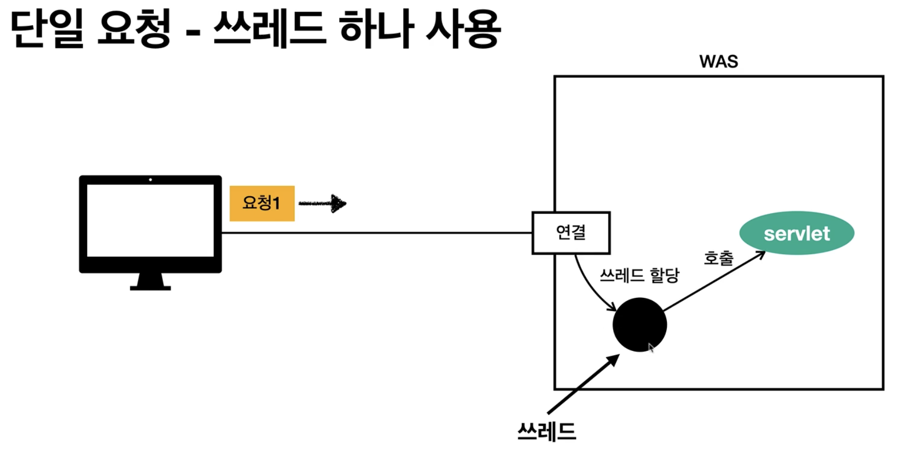
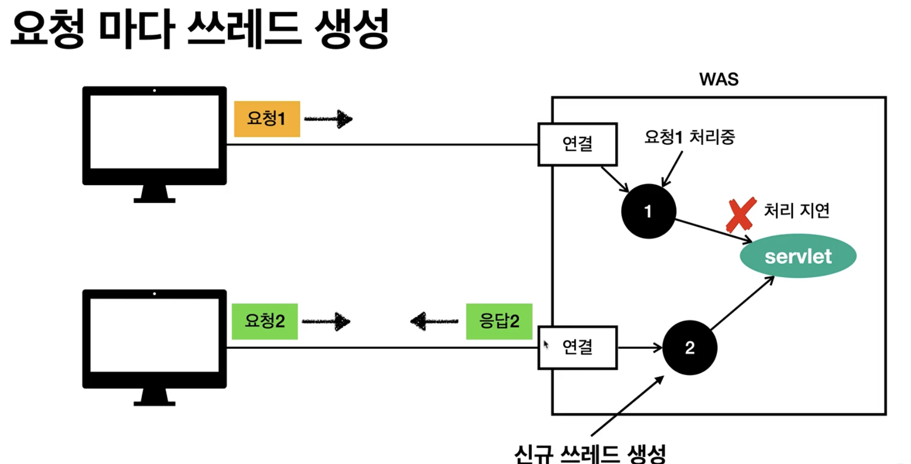
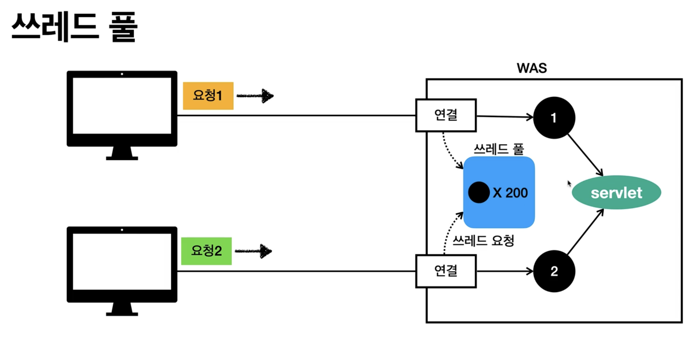

# 쓰레드 

## 역할
WAS에 요청이 들어왔을 때, servlet을 호출하는 역할. 

## 특징
한번에 하나의 코드 라인만 수행.
동시에 처리가 필요하면, 쓰레드가 추가되야함.

단점
쓰레드를 요청마다 생성하면, 응답 속도가 늦어진다. 

컨텍스트 스위칭 비용. 

쓰레드 생성에 제한이 없어서 무한정 늘 수 있다. 서버 터짐.

WAS가 대부분 멀티 쓰레드 처리를 해준다. 
설정만 해주면 되지 직접 코드를 짜지 않아도 된다. 

## 쓰레드풀
 

보통 WAS들은 쓰레드풀을 구현해 놓았다. 

요청이 오면 풀에 요청을 해서 쓰레드를 가져다 씀. 

커넥션풀 HikariPool이랑 비슷함.

풀에 쓰레드가 없으면 대기 혹은 거절 할 수 있다. 

톰캣 최대 200개 기본.

## 포인트

WAS의 주요 포인트는 최대 쓰레드 수 설정이다. 

CPU 50퍼는 써줘야 됨.

높게 잡냐 낮게 잡냐 튜닝을 해야됨.

## 쓰레드 풀 적정 숫자 찾기

로직의 복잡도, CPU, 메모리, IO 리소스에 따라 다르다. 

성능 테스트 사용하기
아파치ab, 제이미터, nGrinder