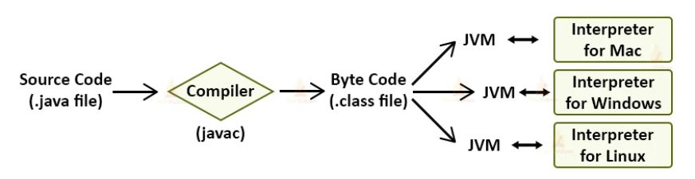

# Java 동작 원리

## Java 기본 실행 순서

## Java source code
Java 소스 코드는 --.java 형식의 파일에 작성된다.

Java의 모든 코드는 class 안에 존재해야 한다.

~~~java
class Java{
    ------
}
~~~

여러 Class 들이 모여서 Java Application을 이루는데, 이 중 하나의 Class에는 필수로 **main** Method가 존재해야 한다.

## javac

## JVME이란?

[공식문서](https://docs.oracle.com/javase/specs/jvms/se20/html/index.html)

Java Virtual Machine

cornerstone(초석) of the Java platform

`JVM` is an abstract computing machine.

Java로 작성된 애플리케이션은 모두 이 JVM에서만 실행가능하다.

**JVM은 Java programming language를 전혀 알지 못한다.**

binary format만 알 뿐이다.

Compile된 자바 코드는 하드웨어 및 운영체제에 독립적인 binary format이며 `class` file format에 저장된다. 

`class` file에는 JVM 명령어와 symbol table, 등등이 포함되어 있다.

Java 언어(compile된 class file)는 운영체제, 하드웨어에 종속적이지 않지만 

JVM은 각 운영체제에 맞는 버전이 존재한다. 

## JVM Architecture

## JIT

바이트코드를 하드웨어의 기계어로 바로 변환해주는 컴파일러

## Hotspot

## 출처
https://techvidvan.com/tutorials/java-virtual-machine/