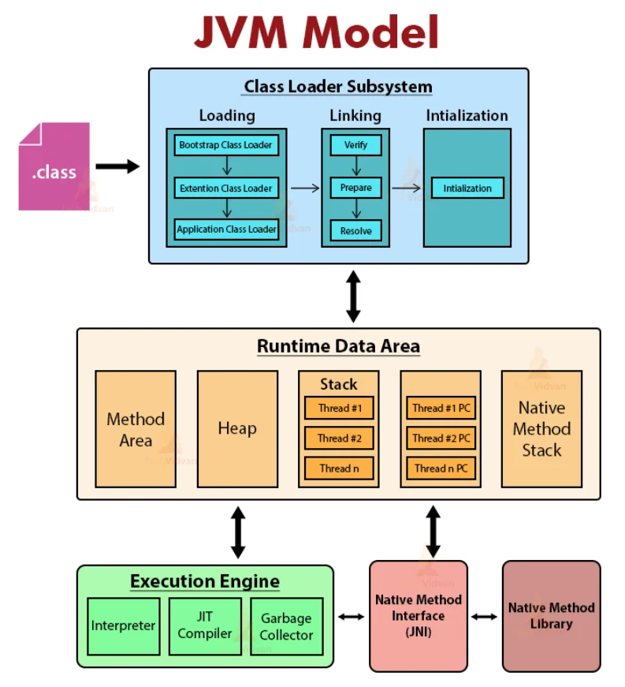

# JVM (Java Virtual Machine)

> 최종 업데이트: 2026-03-28 | Java 21 기준 | [공식문서](https://docs.oracle.com/javase/specs/jvms/se21/html/index.html)

## 개념

Java 바이트코드를 실행하는 **가상 머신**.

- 각 나라에 파견된 **통역사**에 비유할 수 있음. 바이트코드(에스페란토)를 각 OS(나라)의 기계어(현지 언어)로 변환해서 실행
- JVM 자체는 Java 언어를 모름 — **.class 파일(바이트코드)** 만 이해함
- 바이트코드는 OS 독립적이지만, JVM은 **각 OS에 맞는 버전**이 존재
- JVM 위에서 Java뿐 아니라 **Kotlin, Scala, Groovy, Clojure** 등도 동작 — .class 파일로 컴파일되기만 하면 JVM이 실행 가능

## JVM Architecture



```
.class 파일
    ↓
┌─────────────────────────────────────────┐
│  Class Loader Subsystem                 │
│  (Loading → Linking → Initialization)   │
└─────────────────┬───────────────────────┘
                  ↓
┌─────────────────────────────────────────┐
│  Runtime Data Areas                     │
│  ┌──────────┐ ┌──────────┐             │
│  │ Method   │ │   Heap   │  ← 전체 공유 │
│  │  Area    │ │          │             │
│  └──────────┘ └──────────┘             │
│  ┌───────┐ ┌──────┐ ┌────────────┐    │
│  │ Stack │ │  PC  │ │Native Stack│ ← 스레드별│
│  └───────┘ └──────┘ └────────────┘    │
└─────────────────┬───────────────────────┘
                  ↓
┌─────────────────────────────────────────┐
│  Execution Engine                       │
│  Interpreter + JIT Compiler + GC        │
└─────────────────────────────────────────┘
                  ↓
         Native Method Interface (JNI)
                  ↓
         Native Method Libraries (OS)
```

## Class Loader Subsystem

.class 파일을 읽어 JVM 메모리에 적재하는 시스템.

- 프로그램 시작 시 모든 클래스를 한꺼번에 로드하지 않고, **필요한 시점에 동적으로 로드(Lazy Loading)**

### Loading (로드)

클래스 로더가 .class 파일을 찾아 바이트코드를 읽어들이는 단계.

- 택배 시스템에 비유하면: 주문(클래스 참조)이 들어왔을 때 비로소 물류센터에서 상품(.class)을 찾아오는 것

**로드가 트리거되는 시점:**
- `new` 키워드로 인스턴스 생성
- static 멤버에 처음 접근
- `Class.forName()`으로 명시적 로드
- main 메서드가 포함된 클래스 시작
- 리플렉션을 통한 접근

**클래스 로더 계층 (위임 모델):**

```
Bootstrap ClassLoader        ← Java 표준 라이브러리 (java.lang, java.util 등)
    ↑                           C/C++로 구현, Java 코드에서 null로 표시
Extension/Platform ClassLoader  ← 확장 라이브러리 (jre/lib/ext)
    ↑                           Java 9+: Platform ClassLoader로 명칭 변경
Application ClassLoader      ← 사용자가 작성한 클래스 (CLASSPATH)
    ↑
Custom ClassLoader           ← 필요 시 직접 구현 (예: 웹 컨테이너, OSGi)
```

- 클래스 로드 요청 시 **부모 로더에게 먼저 위임** (Parent Delegation Model)
- 부모가 못 찾으면 자식이 직접 로드 → 핵심 클래스(java.lang.String 등)가 변조되는 것을 방지

```java
// 클래스 로더 확인
System.out.println(String.class.getClassLoader());       // null (Bootstrap)
System.out.println(MyApp.class.getClassLoader());        // AppClassLoader
System.out.println(MyApp.class.getClassLoader().getParent()); // PlatformClassLoader
```

### Linking (링크)

| 단계 | 설명 |
|------|------|
| Verification (검증) | 바이트코드가 유효하고 안전한지 확인 (형식, 스택 오버플로우 등) |
| Preparation (준비) | static 필드에 메모리 할당 후 기본값으로 초기화 (int→0, 참조→null) |
| Resolution (분석) | 심볼릭 참조(이름)를 실제 메모리 주소(직접 참조)로 변환 |

- 이사에 비유하면: **검증**은 짐이 제대로 포장되었는지 확인, **준비**는 가구 배치 자리만 잡아두기(아직 정리 안 됨), **분석**은 "거실 옆 방"이라는 설명을 실제 주소로 변환하는 것

### Initialization (초기화)

static 변수에 선언된 값을 할당하고, static 초기화 블록을 실행하는 단계.

```java
public class Config {
    static int timeout = 30;           // Preparation: 0 → Initialization: 30
    static List<String> list;

    static {
        list = new ArrayList<>();      // 이 블록이 Initialization 단계에서 실행
        list.add("default");
    }
}
```

## Runtime Data Areas

JVM이 프로그램 실행 중 사용하는 메모리 영역. 상세 내용은 [Java Memory](./Java-Memory.md) 참고.

| 영역 | 공유 범위 | 저장 내용 |
|------|----------|----------|
| Method Area | 전체 공유 | 클래스 메타데이터, 상수 풀, static 변수 |
| Heap | 전체 공유 | 객체 인스턴스, 배열 (GC 대상) |
| Stack | 스레드별 | 스택 프레임 (지역 변수, 매개변수, 반환 주소) |
| PC Register | 스레드별 | 현재 실행 중인 바이트코드 주소 |
| Native Method Stack | 스레드별 | 네이티브 코드(C/C++) 실행 스택 |

## Execution Engine (실행 엔진)

바이트코드를 실제로 실행하는 컴포넌트. 세 가지 방식을 조합하여 동작.

- 요리에 비유하면: **Interpreter**는 레시피를 한 줄씩 읽으며 요리하는 초보 요리사, **JIT Compiler**는 자주 만드는 메뉴를 아예 외워버린 숙련 요리사

### Interpreter

- 바이트코드를 **한 줄씩 해석/실행**
- 시작은 빠르지만 동일 코드 반복 시 매번 재해석 → 느림

### JIT (Just-In-Time) Compiler

자주 실행되는 코드(**핫스팟**)를 감지하여 기계어로 **한 번에 변환**하고 캐싱.

- 자주 주문받는 메뉴의 레시피를 머릿속에 외워두는 것 — 다음부터는 레시피를 안 봐도 됨
- JIT이 변환한 기계어는 **Code Cache**에 저장되어 재사용

#### Tiered Compilation (계층 컴파일)

Java 8+부터 기본 활성화. Interpreter와 JIT을 **단계적으로 전환**하여 시작 속도와 최적화를 모두 확보.

```
Level 0: Interpreter            ← 바이트코드 해석, 프로파일링 데이터 수집 시작
    ↓
Level 1~3: C1 Compiler (Client) ← 빠른 컴파일, 간단한 최적화
    ↓  프로파일링 데이터 충분히 축적
Level 4: C2 Compiler (Server)   ← 느린 컴파일, 고급 최적화 (인라이닝, 루프 언롤링, 탈출 분석 등)
```

| 컴파일러 | 별칭 | 컴파일 속도 | 최적화 수준 | 역할 |
|---------|------|-----------|-----------|------|
| **C1** | Client Compiler | 빠름 | 낮음 | 빠른 시작을 위한 초기 컴파일 |
| **C2** | Server Compiler | 느림 | **높음** | 핫스팟 코드의 고성능 최적화 |

**C2가 수행하는 주요 최적화:**

| 최적화 | 설명 |
|--------|------|
| Method Inlining | 자주 호출되는 짧은 메서드를 호출 지점에 직접 삽입 (호출 오버헤드 제거) |
| Loop Unrolling | 반복문을 펼쳐서 분기 비용 감소 |
| Escape Analysis | 객체가 메서드 밖으로 탈출하지 않으면 스택에 할당 (힙 할당/GC 회피) |
| Dead Code Elimination | 실행되지 않는 코드 제거 |
| Null Check Elimination | 불필요한 null 체크 제거 |

```java
// Escape Analysis 예시
void process() {
    Point p = new Point(1, 2);  // p가 이 메서드 밖으로 나가지 않음
    int sum = p.x + p.y;       // → JIT이 힙 할당 없이 스택에서 직접 처리
}
```

### Garbage Collector

참조되지 않는 객체를 자동으로 메모리에서 해제. 상세 내용은 [Java Garbage Collection](./Java-Garbage-Collection.md) 참고.

## JVM 구현체

JVM은 **스펙(명세)**이며, 여러 벤더가 각자의 구현체를 제공. 같은 설계도(JVM 스펙)로 지은 건물이지만 시공사(벤더)마다 내부 구조와 특성이 다른 것.

### HotSpot VM

- **Oracle/OpenJDK의 기본 JVM** — 가장 널리 사용됨
- "HotSpot"이라는 이름은 **자주 실행되는 코드(핫스팟)를 감지하여 JIT 최적화**하는 방식에서 유래
- C1/C2 Tiered Compilation, G1/ZGC 등 모든 주요 GC 지원
- Eclipse Temurin, Amazon Corretto, Azul Zulu 등 대부분의 JDK 배포판이 HotSpot 기반

### GraalVM

- Oracle Labs에서 개발한 **고성능 다중 언어 런타임**
- **Graal JIT Compiler** — C2를 대체하는 Java로 작성된 JIT 컴파일러. 더 공격적인 최적화 가능
- **Native Image (AOT 컴파일)** — Java 애플리케이션을 네이티브 바이너리로 미리 컴파일
  - JVM 없이 즉시 실행 → **시작 시간 대폭 단축**, 메모리 사용량 감소
  - 서버리스, CLI 도구, 마이크로서비스에 유리
  - Spring Boot 3+, Quarkus, Micronaut 등에서 GraalVM Native Image 공식 지원
- **Polyglot** — JavaScript, Python, Ruby, R 등을 JVM 위에서 실행 가능

```
HotSpot 방식:  .class → [JVM 시작] → Interpreter → JIT(C2) → 실행     (Warm-up 필요)
GraalVM AOT:  .class → [빌드 시] → Native Binary → 즉시 실행          (Warm-up 없음)
```

| 비교 | HotSpot (JIT) | GraalVM Native Image (AOT) |
|------|---------------|---------------------------|
| 시작 시간 | 느림 (Warm-up 필요) | **빠름 (수십 ms)** |
| 최대 성능 | **높음** (런타임 프로파일링 기반 최적화) | 보통 (빌드 시 정적 분석 한계) |
| 메모리 | 많음 | **적음** |
| 리플렉션 | 자유롭게 사용 | 별도 설정 필요 (빌드 시 정적 분석) |
| 적합 환경 | 장기 실행 서버 | 서버리스, CLI, 컨테이너 |

### Eclipse OpenJ9

- IBM이 개발하여 Eclipse 재단에 기증한 JVM
- HotSpot 대비 **메모리 사용량이 적고 시작이 빠름**
- 공유 클래스 캐시(Shared Classes Cache)로 빠른 시작 지원
- IBM Semeru Runtime에서 사용

## JVM 주요 옵션

| 옵션 | 설명 |
|------|------|
| `-Xms` / `-Xmx` | 초기/최대 힙 크기 (예: `-Xms512m`, `-Xmx2g`) |
| `-Xss` | 스레드 스택 크기 (예: `-Xss1m`) |
| `-XX:+UseG1GC` | G1 GC 사용 (Java 9+ 기본) |
| `-XX:+UseZGC` | ZGC 사용 (초저지연, Java 15+) |
| `-XX:MetaspaceSize` | Metaspace 초기 크기 |
| `-XX:+PrintFlagsFinal` | 모든 JVM 플래그와 현재 값 출력 |
| `-Xlog:gc*` | GC 로그 활성화 (Java 9+) |

GC 튜닝, 모니터링 도구 등 상세 내용은 [JVM 메모리 튜닝](./JVM-메모리-튜닝.md) 참고.

## 관련 문서

- [JDK](./JDK.md)
- [컴파일과 바이트코드](./컴파일과-바이트코드.md)
- [Java 동작 원리](./Java-동작-원리.md)
- [Java Memory](./Java-Memory.md)
- [Java Garbage Collection](./Java-Garbage-Collection.md)
- [JVM 메모리 튜닝](./JVM-메모리-튜닝.md)
