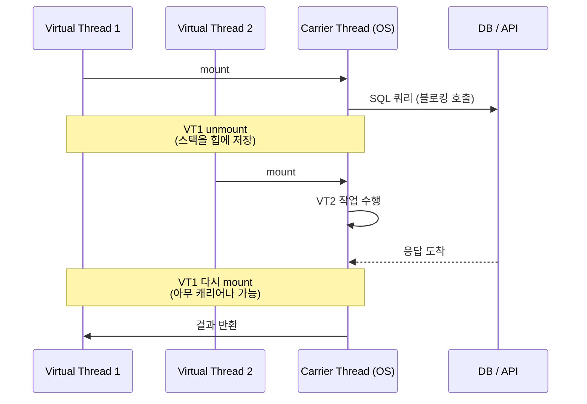
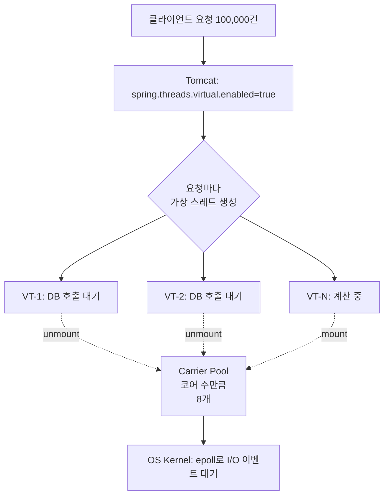

# Java Virtual Threads

> 최종 업데이트: 2026-06-07 | 기준: Java 21 LTS (JEP 444 정식 채택), Project Loom

## 개념

**Virtual Threads(가상 스레드)** 는 JVM이 자체적으로 관리하는 **경량 스레드**다. 기존의 플랫폼 스레드(=OS 스레드)와 달리, OS 커널에 1:1로 매핑되지 않고 **JVM 안에서 수십~수백만 개를 만들 수 있다**.

> 비유하자면 **고속도로(플랫폼 스레드) vs 시내 자전거(가상 스레드)** 의 관계. 고속도로는 한 번 깔면 비싸고 차선이 제한적이지만 차량당 속도가 빠르다. 자전거는 거의 공짜로 늘릴 수 있고, 신호 대기(I/O 블로킹) 중엔 다른 자전거가 같은 차선을 쓰면 된다. 대부분 시간을 신호 대기로 보내는 웹 요청 처리에는 자전거가 압도적으로 유리하다.

핵심은 **블로킹 코드를 그대로 두면서 처리량을 올리는 것**. 기존엔 "스레드 1만 개 = OS 자원 폭주"였지만, 가상 스레드는 "100만 개 = 무리 없음"이 가능해졌다. 그래서 **Reactive(WebFlux 등)의 복잡한 비동기 코드를 다시 동기 스타일로 되돌려도 성능이 나오는** 게 가능해진다.

> ⚠️ Virtual Threads는 **CPU 바운드** 작업엔 효과가 없다. **I/O 바운드** 작업(DB·HTTP 호출·파일)이 압도적으로 많은 서버 워크로드를 겨냥한 기술이다.

## 배경/역사

- **2017년**: 오라클 **Project Loom** 시작. 목표는 "동기 코드처럼 짜되 비동기 처리량을 얻는다"
- **2018년**: 초기 프로토타입 공개. 리드는 **Ron Pressler** (오라클 Java Architect)
- **2022년 9월 Java 19**: **JEP 425** Virtual Threads 1차 Preview
- **2023년 3월 Java 20**: JEP 436 2차 Preview
- **2023년 9월 Java 21 LTS**: **JEP 444** 정식 기능(Stable)으로 채택 — Virtual Threads의 진짜 시작점
- **2023년~**: Spring Boot 3.2, Tomcat 10.1, Helidon, Quarkus 등 주요 프레임워크가 가상 스레드 지원 추가
- **현재**: Reactive 진영(WebFlux, Reactor)이 가졌던 "고동시성 서버"의 주류 지위를 가상 스레드가 빠르게 잠식 중

> Project Loom의 디자인 원칙: **"동기 스타일 + 블로킹 코드를 유지하라."** 비동기·콜백·CompletableFuture 지옥에서 벗어나는 게 첫째 목적.

## 왜 만들었나

### 기존 플랫폼 스레드의 한계

자바의 `Thread`는 **OS 스레드와 1:1 매핑**된다. 스택 크기가 보통 **1MB** 이고, 컨텍스트 스위칭 비용도 크다.

- 톰캣 기본 스레드풀: **200개** 정도가 일반적
- 요청 하나당 스레드 하나 → 동시 요청 200건 넘으면 큐에 쌓이거나 거부
- 실제로 그 스레드는 대부분 시간을 **DB·외부 API 응답을 기다리며 놀고 있음** (CPU는 한가)

### 두 가지 해법

| 접근 | 사상 | 코드 스타일 | 대표 기술 |
|---|---|---|---|
| **비동기/Reactive** | 스레드를 적게 쓰되 블로킹하지 말자 | 콜백·체이닝 (`flatMap`, `Mono`) | WebFlux, Reactor, Netty |
| **Virtual Threads** | 스레드를 무지하게 늘리되 블로킹 OK | 기존 동기 스타일 그대로 | Project Loom (Java 21+) |

Reactive는 코드가 복잡해지고 디버깅·스택 트레이스가 불친절. 가상 스레드는 **"걍 평소처럼 짜라"** 가 메시지.

## 핵심 개념

### Platform Thread vs Virtual Thread

| 항목 | Platform Thread | Virtual Thread |
|---|---|---|
| 매핑 | OS 스레드와 1:1 | **JVM이 관리, M:N 매핑** |
| 스택 크기 | ~1MB 고정 | **수백 바이트~수 KB** (가변, 힙에 저장) |
| 생성 비용 | 비쌈 | 거의 무료 |
| 컨텍스트 스위칭 | OS 스케줄러 | **JVM 스케줄러** (ForkJoinPool) |
| 풀링 필요 | ✅ 필수 (생성 비싸서) | ❌ **풀링하지 말 것** (생성이 싸서) |
| 적정 개수 | 수백~수천 | 수십만~수백만 |
| CPU 바운드 작업 | 적합 | 부적합 (의미 없음) |
| I/O 바운드 작업 | 비효율 (스레드 낭비) | **압도적으로 유리** |

### Carrier Thread와 마운트/언마운트

Virtual Thread는 실행할 때 **Carrier Thread**(실제 OS 플랫폼 스레드)에 **마운트(mount)** 돼서 동작한다. I/O 블로킹이 발생하면 가상 스레드는 **언마운트(unmount)** 되고, 캐리어 스레드는 즉시 **다른 가상 스레드**를 실행하러 간다.



캐리어 스레드 수는 기본적으로 **CPU 코어 수**(예: 8개). 그 위에서 수백만 가상 스레드가 돌아간다. 이게 **M:N 스케줄링** 모델.

### Continuation

JVM이 가상 스레드를 멈추고 재개할 수 있는 건 **Continuation**(JEP 444 내부 기술) 덕분. 가상 스레드의 스택을 통째로 **힙에 직렬화**해뒀다가, 다시 마운트할 때 복원한다.

> Kotlin Coroutine의 `suspend`/`resume`과 비슷한 원리. 가상 스레드는 그걸 자바 표준에서 투명하게 처리한다는 게 차이.

## 사용법

### 직접 생성

```java
// 한 번만 실행할 때
Thread vt = Thread.startVirtualThread(() -> {
    System.out.println("Hello from " + Thread.currentThread());
});

// 더 일반적인 빌더
Thread vt2 = Thread.ofVirtual()
    .name("worker-1")
    .start(() -> doWork());
```

### Executor

기존 `ExecutorService` API와 호환. 풀 크기를 지정하지 않는 게 핵심.

```java
try (ExecutorService executor = Executors.newVirtualThreadPerTaskExecutor()) {
    for (int i = 0; i < 100_000; i++) {
        executor.submit(() -> {
            httpClient.send(request, BodyHandlers.ofString());  // 블로킹 OK
            return null;
        });
    }
}  // try-with-resources로 자동 shutdown
```

**`newVirtualThreadPerTaskExecutor`** — 작업마다 새 가상 스레드를 만든다. 풀링이 아님.

### Spring Boot 3.2+에서 활성화

```properties
# application.properties — 단 한 줄
spring.threads.virtual.enabled=true
```

이 한 줄로 톰캣 워커, `@Async`, `@Scheduled`가 전부 가상 스레드 위에서 동작.

## 언제 효과 보나

### ✅ 효과적

- **I/O 바운드 서버**: DB 조회, 외부 API 호출, 파일 처리가 대부분인 일반적 백엔드
- **MSA 환경**: 한 요청이 N개 다운스트림 호출을 만드는 fan-out 패턴
- **레거시 동기 코드**: 비동기 전환 비용을 들이지 않고 처리량 향상
- **WebFlux 도입은 부담스러운 팀**: 동기 스타일 그대로 두고 성능만 챙김

### ❌ 효과 없거나 역효과

- **CPU 바운드 작업**: 가상 스레드를 늘려도 CPU 코어 수만큼만 병렬. 오히려 컨텍스트 스위칭 오버헤드 증가
- **`synchronized` 블록 안의 블로킹**: 캐리어 스레드가 **pin** 돼서 언마운트 못함 → 가상 스레드 이점 무력화. `ReentrantLock`으로 바꿔야 함
- **JNI/네이티브 코드 안의 블로킹**: 마찬가지로 pinning 유발
- **이미 잘 동작하는 Reactive 코드**: 굳이 갈아엎을 이유 없음

## Pinning 문제

캐리어 스레드에 가상 스레드가 **고정되어 언마운트 못 하는** 상태. Virtual Threads의 대표적 함정.

### 원인

| 원인 | 해결 |
|---|---|
| `synchronized` 블록 안에서 블로킹 호출 | `ReentrantLock` 사용 |
| JNI 네이티브 메서드 안에서 블로킹 | 라이브러리 교체 또는 격리 |
| `Object.wait()` 호출 | 자바 24+에서 일부 개선 |

### 진단

```bash
# JVM 옵션으로 핀 발생 시 스택 트레이스 출력
-Djdk.tracePinnedThreads=full
```

또는 JFR(Java Flight Recorder)의 `jdk.VirtualThreadPinned` 이벤트로 추적.

> 자바 24부터는 `synchronized` 내부 블로킹도 캐리어를 pin하지 않도록 개선 진행 중(JEP 491).

## Reactive(WebFlux) vs Virtual Threads

같은 문제(고동시성)에 대한 두 답.

| 항목 | Reactive (WebFlux) | Virtual Threads |
|---|---|---|
| 코드 스타일 | 함수형·체이닝 (`Mono`, `Flux`) | **명령형·동기 그대로** |
| 학습 곡선 | 가파름 | **거의 없음** |
| 디버깅 | 스택 트레이스 난해 | 평소와 동일 |
| 백프레셔(backpressure) | 정교한 제어 가능 | 별도 기법 필요 |
| 블로킹 라이브러리 | 사용 시 큰 패널티 | **그대로 OK** |
| 메모리 효율 | 매우 좋음 | 좋음 (가상 스레드 자체는 작지만 수가 많음) |
| CPU 효율 | 매우 좋음 | 좋음 |
| 도입 비용 | 코드 전면 재작성 | **설정 한 줄** |
| 적합 사례 | 스트리밍, 백프레셔 필수 | 일반 REST 백엔드 |

> 결론적으로 **대부분의 백엔드**는 가상 스레드가 더 실용적. Reactive는 진짜로 스트리밍·백프레셔가 필요한 영역에 남는다.

## 주의사항

### ThreadLocal 사용

가상 스레드는 수십만 개가 만들어지므로 **`ThreadLocal`에 큰 객체를 담으면 메모리 폭증**. 캐싱 용도로 ThreadLocal을 쓰던 패턴은 재검토 필요.

대안: **`ScopedValue`** (JEP 446, Java 21 Preview → Java 25 정식 예정)

```java
private static final ScopedValue<User> CURRENT_USER = ScopedValue.newInstance();

ScopedValue.where(CURRENT_USER, user)
    .run(() -> doSomething());
```

### 커넥션 풀

가상 스레드가 수십만 개여도 **DB 커넥션 풀은 그대로 작음**(HikariCP 기본 10개). 가상 스레드가 풀에서 커넥션을 못 받으면 **대기**한다 → DB가 새 병목.

→ 커넥션 풀 사이즈는 가상 스레드 도입 후에도 신중히. 무작정 늘리면 DB가 죽는다.

### 풀링하지 말 것

JEP가 명시적으로 경고한다: **가상 스레드를 풀로 묶지 마라.**

```java
// ❌ 안티패턴 — 가상 스레드의 이점을 통째로 버림
ExecutorService pool = Executors.newFixedThreadPool(100, Thread.ofVirtual().factory());

// ✅ 작업당 새로 만들기
ExecutorService exec = Executors.newVirtualThreadPerTaskExecutor();
```

**왜 풀이 원래 있었나**: 풀(pool)은 *비싼 자원을 재사용*하려고 쓴다. 플랫폼 스레드는 스택 ~1MB, 생성·소멸에 OS 시스템 콜 비용이 들어 비싸므로, 미리 만들어두고 빌려 쓰고 반납해 재활용했다.

**가상 스레드는 안 비싸다**: 힙에 올라가는 수백 바이트~수 KB짜리 가벼운 객체라 수백만 개를 만들어도 된다. 비싸지 않으니 **재활용(풀)할 이유가 없다.**

> 비유: 플랫폼 스레드는 비싼 텀블러(씻어서 재사용 = 풀), 가상 스레드는 일회용 종이컵(쓰고 버리고 새로 뽑음). 종이컵을 풀에 모아 돌려쓰자는 건 난센스다.

풀링은 단지 무의미한 게 아니라 **역효과**다. 풀은 스레드 개수를 *제한*하는데, 가상 스레드의 존재 이유가 "블로킹 I/O를 수십만 개 동시에"다. `newFixedThreadPool(200)`으로 묶으면 동시성이 200개로 제한되어 가상 스레드를 쓰는 의미가 사라진다.

**`newVirtualThreadPerTaskExecutor()`는 풀이 아니다**: 이름에 `Executor`가 들어가 오해하기 쉽지만, task가 들어올 때마다 **새 가상 스레드를 만들고 끝나면 버린다**. 재사용·반납이 없다. 여기서 `Executor`는 "재사용 풀"이 아니라 task 제출용 편의 API일 뿐이다.

| | 플랫폼 스레드 풀 | `newVirtualThreadPerTaskExecutor()` |
|---|---|---|
| 동작 | N개 미리 만들어 재사용 | 1 task = 1 새 VT = 버림 |
| 목적 | 비싼 자원 재활용 + 개수 제한 | 제한 없음, task마다 생성 |

**개수 제한이 필요하면 풀이 아니라 `Semaphore`**: 다운스트림 보호 등으로 동시 호출 수를 제한해야 할 때는 스레드 풀로 묶지 말고, 가상 스레드는 마음껏 만들되 임계 구간만 세마포어로 조인다. 스레드 개수(자원)와 동시성 제한(정책)을 분리하는 것이다.

```java
Semaphore limiter = new Semaphore(100);
limiter.acquire();
try { callDownstream(); } finally { limiter.release(); }
```

## Structured Concurrency

가상 스레드와 짝으로 도입된 동시성 모델. 자식 작업의 생명주기를 부모 스코프에 묶는다 (JEP 462, Java 24 4차 Preview).

```java
try (var scope = new StructuredTaskScope.ShutdownOnFailure()) {
    Subtask<User> user = scope.fork(() -> fetchUser(id));
    Subtask<Order> orders = scope.fork(() -> fetchOrders(id));

    scope.join();           // 둘 다 끝날 때까지 대기
    scope.throwIfFailed();  // 하나라도 실패하면 예외

    return new Result(user.get(), orders.get());
}
```

병렬 호출이지만 **스코프 종료 시 자식 작업이 자동 취소·정리**된다. 누수 위험이 줄어들고 에러 처리가 명확해짐.

## 동작 흐름



OS 스레드는 8개뿐인데 동시 처리는 10만 건 — 가상 스레드의 핵심 그림.

## 관련 문서

- [Java-Thread-Basic.md](Java-Thread-Basic.md)
- [Java-Thread-Synchronization.md](Java-Thread-Synchronization.md)
- [Java-Thread-Scheduling.md](Java-Thread-Scheduling.md)
- [Java-ThreadLocal.md](Java-ThreadLocal.md)
- [WAS-Thread.md](WAS-Thread.md)
- [thread-고급.md](thread-고급.md)
- [../비동기성/](../비동기성/)

## 출처

- [JEP 444: Virtual Threads](https://openjdk.org/jeps/444)
- [JEP 462: Structured Concurrency](https://openjdk.org/jeps/462)
- [JEP 491: Synchronize Virtual Threads without Pinning](https://openjdk.org/jeps/491)
- [Project Loom Wiki](https://wiki.openjdk.org/display/loom)
