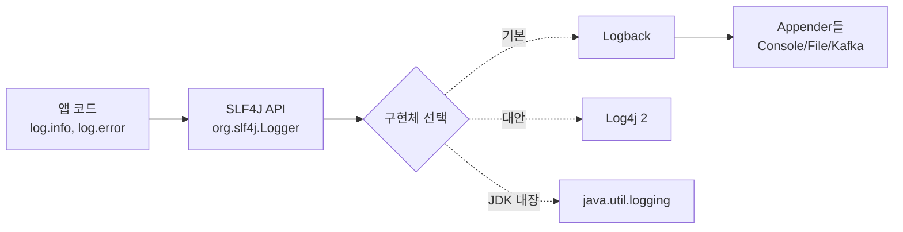
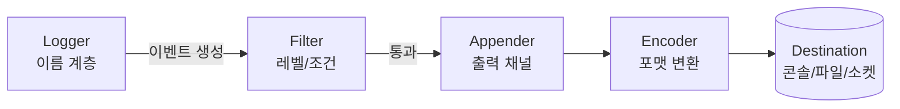

# Logback

> 최종 업데이트: 2026-05-14 | Logback 1.5.32 (2026-02 릴리스) + SLF4J 2.0.17 + Spring Boot 3.x 기준

## 개념

Logback은 **Java 진영의 표준급 로깅 프레임워크**다. 앱 코드가 호출하는 로깅 API([[SLF4J]])의 가장 널리 쓰이는 구현체로, **출력 위치(콘솔/파일/네트워크), 형식(평문/JSON), 회전 정책, 로그 레벨 필터링**을 코드 변경 없이 XML 설정으로 제어한다.

> 비유: 로그 메시지를 다루는 **방송국 콘솔**이다. 앱이 "결제 실패!"라고 말하면 Logback이 — 어디로 송출할지(콘솔/파일/Kafka), 어떤 자막 양식으로(시간·레벨·스레드), 누구는 송출 안 할지(DEBUG 차단), 파일이 차면 어떻게 회전할지를 모두 결정. 앱은 그냥 `log.error("...")`만 부르면 됨.

핵심 명제: **"Log4j 1.x의 후속, SLF4J 네이티브 구현, Spring Boot 기본 로깅"**. 빠르고, 메모리 효율 좋고, 설정 reload·자동 압축·다양한 Appender를 표준으로 제공.

## 배경/역사

| 시기 | 사건 |
|---|---|
| 1999 | **Ceki Gülcü**가 **Log4j 1.x** 개발 시작 (Apache 프로젝트) — Java 로깅의 사실상 표준이 됨 |
| 2002 | Java 표준의 `java.util.logging`(JUL) 등장하지만 늦은 출발로 Log4j를 못 따라잡음 |
| 2005~2006 | Ceki Gülcü가 Apache를 떠나 **SLF4J**(Simple Logging Facade for Java) 개발 시작 — Log4j의 API 종속 문제 해결 목적 |
| **2006** | 같은 사람이 **Logback** 개발 시작 — "Log4j 1.x의 후속" 명시. 자신의 회사 **QOS.ch**에서 운영 |
| 2012 | Apache가 Log4j 1.x를 버리고 **Log4j 2.x**를 완전히 새로 작성 — Logback의 경쟁자로 부상 |
| 2014 | **Spring Boot 1.0이 Logback을 기본 로깅으로 채택** — 사실상 Java 백엔드 표준 등극 |
| 2015 | **Log4j 1.x EOL** — 보안 패치 중단. 남은 사용자 대부분 Logback 또는 Log4j 2로 이동 |
| **2021-12** | **Log4Shell (CVE-2021-44228)** — Log4j 2의 JNDI Lookup 취약점. Logback은 해당 기능 없어 영향 없음. 일부 사용자가 Log4j 2 → Logback으로 회귀 |
| 2022~2025 | Logback도 [CVE-2023-6378](https://logback.qos.ch/news.html) 등 자체 취약점 일부 발견. 1.4.x/1.5.x로 보강 |
| **2026-02** | **Logback 1.5.32 릴리스** — JDK 11+ 요구, SLF4J 2.0.1+ 런타임 필요 |

> Logback은 **Log4j의 원저자가 직접 만든 후속작**이라는 점이 핵심. "Log4j보다 더 Log4j다운" 설계를 목표로 했다. 같은 사람이 SLF4J·Logback을 같이 운영하므로 둘의 통합성은 압도적.

## SLF4J와의 관계 — Facade와 Implementation

SLF4J는 **로깅 API 표준(인터페이스)**, Logback은 **그 구현체**다. 앱 코드는 SLF4J만 import한다.

```java
import org.slf4j.Logger;
import org.slf4j.LoggerFactory;

public class PaymentService {
    private static final Logger log = LoggerFactory.getLogger(PaymentService.class);

    public void pay() {
        log.info("결제 시작 userId={}", userId);
        log.error("결제 실패", exception);
    }
}
```

런타임에 classpath에 Logback이 있으면 SLF4J가 자동 연결.



| 라이브러리 | 역할 |
|---|---|
| **SLF4J API** | 앱이 사용하는 로깅 인터페이스 |
| **Logback Classic** | SLF4J를 네이티브 구현. Logger·Appender·Encoder 제공 |
| **Logback Core** | Classic이 사용하는 기반 클래스 |
| **Logback Access** | Servlet 컨테이너 액세스 로그용 (Tomcat 등 연동) |

> **"왜 SLF4J를 거쳐서 쓰나?"** 앱 코드를 변경하지 않고 로깅 구현체만 바꿀 수 있게 하려는 디자인. Logback → Log4j 2 이주 같은 경우 의존성만 교체하면 됨. 또한 Spring·Hibernate 등 라이브러리가 모두 SLF4J 인터페이스를 따르므로 통일된 로그 출력 가능.

## 핵심 아키텍처



| 컴포넌트 | 역할 |
|---|---|
| **Logger** | 로그 이벤트 생성기. 이름(보통 클래스 FQN) 기반 계층 구조 |
| **Level** | TRACE < DEBUG < INFO < WARN < ERROR < OFF |
| **Filter** | 이벤트를 통과·차단. 레벨/MDC/표현식 기반 |
| **Appender** | 출력 채널. 콘솔·파일·소켓·DB·Kafka 등 |
| **Encoder** | 이벤트를 문자열/JSON 등 출력 포맷으로 변환 |
| **Layout** | (구버전 개념) 단순 포맷터. 현재는 Encoder 권장 |

## Logger 계층 — 이름이 곧 트리

Logger는 점(`.`)으로 구분된 이름이 **부모-자식 트리**를 만든다.

```
root
 └─ com
     └─ example
         ├─ service       ← com.example.service
         │   └─ Payment   ← com.example.service.Payment
         └─ repository    ← com.example.repository
```

```xml
<configuration>
    <logger name="com.example.service" level="DEBUG"/>
    <logger name="com.example.repository" level="WARN"/>

    <root level="INFO">
        <appender-ref ref="STDOUT"/>
    </root>
</configuration>
```

- **레벨 상속**: 자식 Logger가 레벨을 지정하지 않으면 부모 레벨을 따름. `com.example.service.Payment`는 위 설정에서 `DEBUG`
- **Appender 부가**: Appender는 상속되며 자식에서 누적(additive). `<logger ... additivity="false">`로 차단

## 설정 파일

| 파일 | 위치 | 우선순위 |
|---|---|---|
| `logback-test.xml` | `src/test/resources` | 가장 높음 (테스트 시) |
| `logback.xml` | `src/main/resources` | 표준 |
| **`logback-spring.xml`** | `src/main/resources` | **Spring Boot 권장** — `<springProfile>`, `<springProperty>` 사용 가능 |

> Spring Boot는 `logback.xml`보다 `logback-spring.xml`을 권장. **Spring 부트스트랩 후에 로딩**되므로 프로파일·프로퍼티 치환이 가능. 그냥 `logback.xml`을 쓰면 Spring 컨텍스트 시작 전에 평가되어 일부 기능 사용 불가.

## Appender — 출력 채널

### ConsoleAppender — 표준 출력

```xml
<appender name="STDOUT" class="ch.qos.logback.core.ConsoleAppender">
    <encoder>
        <pattern>%d{HH:mm:ss.SSS} [%thread] %-5level %logger{36} - %msg%n</pattern>
    </encoder>
</appender>
```

컨테이너 환경(K8s, Docker)에서는 **stdout만 권장** — kubelet이 자동으로 `/var/log/containers/*.log`로 수집. 앱이 파일에 직접 쓸 필요 없음.

### FileAppender — 단일 파일

```xml
<appender name="FILE" class="ch.qos.logback.core.FileAppender">
    <file>logs/app.log</file>
    <append>true</append>
    <encoder>
        <pattern>%d %-5level [%thread] %logger - %msg%n</pattern>
    </encoder>
</appender>
```

### RollingFileAppender — 회전 + 압축

운영에서 가장 자주 쓰임. 시간/크기 기반 회전.

```xml
<appender name="ROLLING" class="ch.qos.logback.core.rolling.RollingFileAppender">
    <file>logs/app.log</file>
    <rollingPolicy class="ch.qos.logback.core.rolling.SizeAndTimeBasedRollingPolicy">
        <fileNamePattern>logs/app.%d{yyyy-MM-dd}.%i.log.gz</fileNamePattern>
        <maxFileSize>100MB</maxFileSize>      <!-- 단일 파일 크기 한도 -->
        <maxHistory>30</maxHistory>           <!-- 30일치 보관 -->
        <totalSizeCap>10GB</totalSizeCap>     <!-- 전체 용량 상한 -->
    </rollingPolicy>
    <encoder>
        <pattern>%d %-5level %logger - %msg%n</pattern>
    </encoder>
</appender>
```

회전 정책 종류:

| 정책 | 기준 |
|---|---|
| `TimeBasedRollingPolicy` | 날짜/시간만 |
| `SizeAndTimeBasedRollingPolicy` | 시간 + 크기 (권장) |
| `FixedWindowRollingPolicy` | 고정 인덱스 윈도우 |

### AsyncAppender — 비동기 래퍼

블로킹 I/O로부터 비즈니스 스레드를 보호. **다른 Appender를 감싸는** 형태.

```xml
<appender name="ASYNC_FILE" class="ch.qos.logback.classic.AsyncAppender">
    <appender-ref ref="ROLLING"/>
    <queueSize>8192</queueSize>           <!-- 큐 크기 -->
    <discardingThreshold>0</discardingThreshold>  <!-- 0=손실 안 함, 큐 차면 블록 -->
    <neverBlock>false</neverBlock>        <!-- true면 큐 차도 안 막고 drop -->
    <includeCallerData>false</includeCallerData>  <!-- 호출자 정보(느림)는 보통 false -->
</appender>
```

> **함정**: `discardingThreshold > 0`이면 큐가 일정 수준 차면 **INFO/DEBUG/TRACE를 자동 폐기**. 기본 동작이 손실이라서 무심코 두면 운영 디버깅 시 로그 누락. 손실 막으려면 0으로.

### SocketAppender / SyslogAppender / 기타

| Appender | 용도 |
|---|---|
| `SocketAppender` | 원격 Logback 서버로 직렬화 전송 |
| `SyslogAppender` | rsyslog/syslog-ng로 전송 |
| `SMTPAppender` | ERROR 발생 시 이메일 (drop-in alerting) |
| `DBAppender` | DB에 직접 기록 (요즘 권장 X — 성능·결합도) |

## Encoder — 출력 포맷

### PatternLayoutEncoder — 평문

```xml
<encoder>
    <pattern>%d{yyyy-MM-dd HH:mm:ss.SSS} [%thread] %-5level %logger{36} - %msg%n</pattern>
</encoder>
```

| 패턴 | 의미 |
|---|---|
| `%d{...}` | 시간 (포맷 지정 가능) |
| `%thread` 또는 `%t` | 스레드 이름 |
| `%-5level` 또는 `%-5p` | 레벨 (왼쪽 정렬 5칸) |
| `%logger{36}` 또는 `%c{36}` | Logger 이름 (최대 36자, 패키지 축약) |
| `%msg` 또는 `%m` | 메시지 |
| `%n` | 줄바꿈 |
| `%ex` | 예외 스택트레이스 (기본 자동 출력) |
| `%X{key}` | MDC 값 (예: `%X{traceId}`) |
| `%highlight(...)` | 콘솔 컬러 (개발 환경) |
| `%mdc` | MDC 전체 |

### LogstashEncoder — JSON 한 줄

`logstash-logback-encoder` 의존성 추가 후:

```xml
<appender name="JSON_STDOUT" class="ch.qos.logback.core.ConsoleAppender">
    <encoder class="net.logstash.logback.encoder.LogstashEncoder">
        <includeMdcKeyName>traceId</includeMdcKeyName>
        <includeMdcKeyName>spanId</includeMdcKeyName>
        <customFields>{"service":"payment","env":"prod"}</customFields>
    </encoder>
</appender>
```

출력 한 줄 예시:

```json
{"@timestamp":"2026-05-14T10:23:45.123Z","level":"ERROR","logger_name":"com.example.Service","message":"결제 실패","stack_trace":"java.lang.NullPointer...","traceId":"abc123","service":"payment","env":"prod"}
```

> 컨테이너/K8s 환경에서는 **JSON 인코딩을 강력 권장**. 스택트레이스가 `stack_trace` 한 필드에 들어가 [[Fluent-Bit|Fluent Bit]] 멀티라인 파서가 불필요해지고, Kibana/Loki에서 필드 단위 검색·집계가 깔끔.

## MDC (Mapped Diagnostic Context)

스레드 로컬 변수로 **요청 단위 컨텍스트(traceId, userId 등)** 를 모든 로그에 자동 첨부.

```java
import org.slf4j.MDC;

public class TraceFilter implements Filter {
    public void doFilter(...) {
        try {
            MDC.put("traceId", UUID.randomUUID().toString());
            MDC.put("userId", currentUser.getId());
            chain.doFilter(req, res);
        } finally {
            MDC.clear();              // 반드시 clear (스레드 풀 재사용 누수 방지)
        }
    }
}
```

```xml
<pattern>%d %-5p [%X{traceId}] [%X{userId}] %logger - %msg%n</pattern>
```

→ 같은 요청에서 발생한 모든 로그가 `traceId`를 공유 → 분산 환경에서 요청 추적 가능. Spring Sleuth/Micrometer Tracing이 자동으로 MDC에 traceId 넣어줌.

## OpenTelemetry Agent와의 관계 — 다른 계층, 함께 쓴다

Logback과 [[opentelemetry-agent|OpenTelemetry Agent]]는 **경쟁이 아니라 다른 계층**이다. Logback은 "로그를 만들어 출력"하고, OTel Agent는 "trace·metric·log를 수집해 OTLP로 전송"한다. 분산 추적이 필요해지면 Logback **위에** OTel Agent를 얹는 구조다.

| 구분 | Logback | OpenTelemetry Agent |
|---|---|---|
| 정체 | **로깅 프레임워크** | **관측성 수집 도구** |
| 다루는 신호 | Log만 | **Trace + Metric + Log** |
| 데이터 종착지 | 콘솔/파일/소켓 | OTLP → Collector → Grafana 등 |
| 적용 방식 | SLF4J 구현체로 classpath에 포함 | `-javaagent` JVM 옵션 |
| 비유 | 일지를 **쓰는 펜** | 일지·계기판·동선을 **모아 본사로 보내는 택배** |

> **꼭 같이 써야 하나?** 단일 서비스에 로그만으로 충분하면 Logback만으로 OK. **MSA에서 서비스 간 요청 흐름·병목을 추적**하려는 순간부터 OTel Agent가 필요해진다.

### 협력 방식 1 — traceId 자동 주입 (MDC bridge)

OTel Agent를 부착하면 **현재 진행 중인 Span의 `trace_id`/`span_id`를 자동으로 MDC에 넣어준다**. 코드 변경 없이 Logback 패턴에 그대로 꽂힌다.

```xml
<!-- Agent가 MDC에 trace_id/span_id를 자동으로 넣어줌 -->
<pattern>%d %-5p [trace=%X{trace_id} span=%X{span_id}] %logger - %msg%n</pattern>
```

```
2026-05-31 10:23:45 ERROR [trace=4bf92f3577b34da6 span=00f067aa0ba902b7] PaymentService - 결제 실패
                          └ 이 ID로 Grafana Tempo/Jaeger에서 요청 전체 흐름 즉시 조회
```

LogstashEncoder를 쓰면 JSON 필드(`trace_id`, `span_id`)로 자동 노출되어 Loki/Elastic에서 trace ↔ log 양방향 점프가 가능해진다.

### 협력 방식 2 — OpenTelemetry Logback Appender

로그 자체를 **OTLP로 직접 전송**하고 싶을 때 사용. Agent 없이 SDK만으로도 가능하며, Agent 환경에서는 자동 구성된다.

```xml
<!-- Logback에서 OTel로 로그 이벤트 직접 전송 -->
<appender name="OTEL" class="io.opentelemetry.instrumentation.logback.appender.v1_0.OpenTelemetryAppender"/>

<root level="INFO">
    <appender-ref ref="STDOUT"/>
    <appender-ref ref="OTEL"/>   <!-- stdout과 병행 -->
</root>
```

> 정리: **Logback만으로 충분한 프로젝트가 대부분**이고, 분산 추적이 필요해지면 OTel Agent를 얹어 `trace_id`를 MDC에 자동 주입받아 쓰는 것이 가장 흔한 패턴이다.

## Filter

Appender 직전 단계에서 이벤트를 통과·차단.

```xml
<appender name="STDOUT" class="ch.qos.logback.core.ConsoleAppender">
    <!-- 임계값 필터: WARN 이상만 -->
    <filter class="ch.qos.logback.classic.filter.ThresholdFilter">
        <level>WARN</level>
    </filter>

    <!-- 레벨 정확 매칭: INFO만 통과 (위 STDOUT은 ERROR 받고, 별도 Appender는 INFO만) -->
    <filter class="ch.qos.logback.classic.filter.LevelFilter">
        <level>INFO</level>
        <onMatch>ACCEPT</onMatch>
        <onMismatch>DENY</onMismatch>
    </filter>

    <encoder>...</encoder>
</appender>
```

`EvaluatorFilter`를 쓰면 Groovy 등 표현식으로 조건 작성 가능.

## Spring Boot에서의 Logback

Spring Boot는 Logback을 **기본 로깅 구현체**로 포함한다 (`spring-boot-starter-logging`). 별도 의존성 추가 불필요.

> **YAML 기반 설정 심화는 별도 문서 [[Springboot-로깅-설정]] 참고.** 이 문서에서는 핵심만 정리.

### Spring Boot 3.4+ — YAML만으로 거의 모든 설정 가능

2024-11 릴리스부터 **Structured Logging**이 표준 기능으로 들어와 JSON 로깅까지 XML 없이 가능:

```yaml
logging:
  level:
    root: INFO
    com.example.service: DEBUG
  pattern:
    console: "%d{HH:mm:ss} %-5p [%X{traceId:-}] %logger - %msg%n"
  file:
    name: logs/app.log
  logback:
    rollingpolicy:
      max-file-size: 100MB
      max-history: 30
      total-size-cap: 10GB
  structured:                       # ★ 3.4+ 신규 — JSON 로깅 표준화
    format:
      console: ecs                  # 또는 logstash, gelf
```

이거 하나로 **레벨 / 패턴 / 파일 / 회전 / JSON 출력**까지 다 됨. `logstash-logback-encoder` 의존성·XML 모두 불필요.

### XML이 여전히 필요한 경우

- `AsyncAppender` 비동기 래핑
- 복수 Appender + 각각 다른 Filter
- `SyslogAppender` / `SocketAppender` / `SMTPAppender`
- `EvaluatorFilter` (Groovy 표현식)

이런 경우 `logback-spring.xml`을 만들어 YAML과 병행:

```xml
<configuration>
    <include resource="org/springframework/boot/logging/logback/defaults.xml"/>
    <include resource="org/springframework/boot/logging/logback/console-appender.xml"/>

    <appender name="ASYNC_FILE" class="ch.qos.logback.classic.AsyncAppender">
        <appender-ref ref="FILE"/>
        <queueSize>8192</queueSize>
        <discardingThreshold>0</discardingThreshold>
    </appender>

    <springProfile name="prod">
        <root level="INFO"><appender-ref ref="ASYNC_FILE"/></root>
    </springProfile>
</configuration>
```

### Log4j 2로 바꾸려면

```gradle
configurations.all {
    exclude group: 'org.springframework.boot', module: 'spring-boot-starter-logging'
}
implementation 'org.springframework.boot:spring-boot-starter-log4j2'
```

## Logback vs Log4j 2 비교

| 항목 | Logback | Log4j 2 |
|---|---|---|
| 원저자 | **Ceki Gülcü** (Log4j 1.x 원저자) | Apache 팀 (재작성) |
| SLF4J 통합 | **네이티브** (같은 저자) | 어댑터(`log4j-slf4j-impl`) 필요 |
| Spring Boot 기본 | **예** | 옵션 |
| 비동기 성능 | AsyncAppender 보통 | **LMAX Disruptor** 기반, 일반적으로 더 빠름 |
| 가비지 프리 모드 | 일부 | 본격 지원 (GC 압력 최소화) |
| 설정 형식 | XML, Groovy | XML, YAML, JSON, properties |
| Log4Shell 영향 | **없음** (JNDI Lookup 미구현) | 있었음 (CVE-2021-44228) |
| 시장 점유 | Spring Boot 효과로 백엔드 다수 | 고성능 요구 시스템에서 선택 |

> **결정 기준**: 일반 백엔드는 Logback이 무난(Spring Boot 기본). 초저지연·초고처리량(거래소·게임 서버)이라면 Log4j 2의 비동기 성능 검토.

## 운영에서 자주 보는 함정

| 안티패턴 | 왜 위험 |
|---|---|
| `log.info("user " + user + " logged in")` | 문자열 연결이 **레벨 차단되어도 항상 발생** → `log.info("user {} logged in", user)` 사용 |
| `e.printStackTrace()` 사용 | stdout 직접 출력, Logback 파이프라인 우회 → `log.error("...", e)` |
| MDC `clear()` 누락 | 스레드 풀 재사용으로 **다른 요청에 컨텍스트 누수** |
| AsyncAppender `discardingThreshold` 기본값 | 큐 차면 INFO/DEBUG 자동 폐기 → **0으로 설정**해야 손실 없음 |
| RollingFile + 컨테이너 환경 | 컨테이너 파일시스템에 쓰면 재시작 시 소실 → **stdout + 외부 수집기** 권장 |
| `logger`를 메서드 안에서 매번 생성 | 비용 큼 → `static final Logger log = ...` |
| 평문 로그를 K8s에 그대로 | 스택트레이스 쪼개짐 → **JSON 인코더 + 구조화 필드** |
| 동일 메시지 폭주(loop ERROR) | 인제스트 비용 폭증·진짜 ERROR 묻힘 → `DuplicateMessageFilter` 또는 sampling |

## 한 줄 요약

> **Logback = Log4j 1.x 원저자 Ceki Gülcü가 만든 후속작, SLF4J 네이티브 구현, Spring Boot 기본 로깅.** 핵심 구성은 **Logger(계층) → Filter → Appender → Encoder → Destination**. 운영 권장 패턴은 **stdout + LogstashEncoder(JSON) + MDC(traceId)** — 이래야 [[Fluent-Bit]] 같은 수집기에서 스택트레이스 안 쪼개지고 필드 단위 검색이 깔끔. 설정 파일은 Spring Boot에서 **`logback-spring.xml`** 권장.

## 관련 문서

- [[Springboot-로그-사용법]] — 코드에서 `log.info`, `@Slf4j`, MDC, Fluent API 호출하는 **실용 가이드**
- [[Springboot-로깅-설정]] — Spring Boot에서 **YAML 기반 Logback 설정 심화** (3.4+ Structured Logging, 프로파일 분리, SQL/HTTP 로깅 등)
- [[Fluent-Bit]] — Logback JSON 로그를 K8s에서 수집·전송하는 차세대 수집기
- [[fluentd]] — 동일 역할의 원조 수집기
- [[Java-Exception]] — 스택트레이스 구조 (Logback이 출력하는 `%ex`의 내용)
- [[쿠버네티스-Pod-로그]] — Logback stdout이 도달하는 `/var/log/containers/*.log` 구조
- [[Spring-모니터링-설정]] — Spring Boot 운영 모니터링 전반
- [[opentelemetry-agent]] — `-javaagent`로 trace·metric·log를 자동 수집. Logback MDC에 `trace_id`를 자동 주입해 로그와 분산 추적을 연결

## 참조

- [Logback 공식 홈](https://logback.qos.ch/)
- [Logback 1.5.32 릴리스 노트 (2026-02)](https://logback.qos.ch/news.html)
- [SLF4J 공식](https://www.slf4j.org/)
- [logstash-logback-encoder GitHub](https://github.com/logfellow/logstash-logback-encoder)
- [Spring Boot Logging 공식 문서](https://docs.spring.io/spring-boot/reference/features/logging.html)
- [Reasons to prefer logback over log4j 1.x (QOS.ch)](https://logback.qos.ch/reasonsToSwitch.html)
