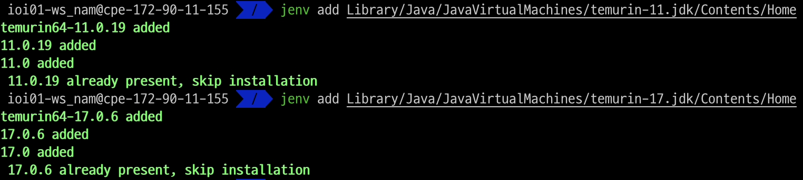
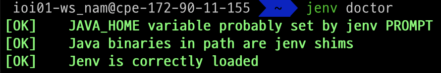
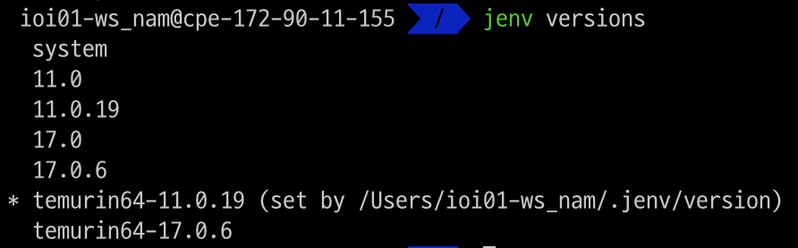
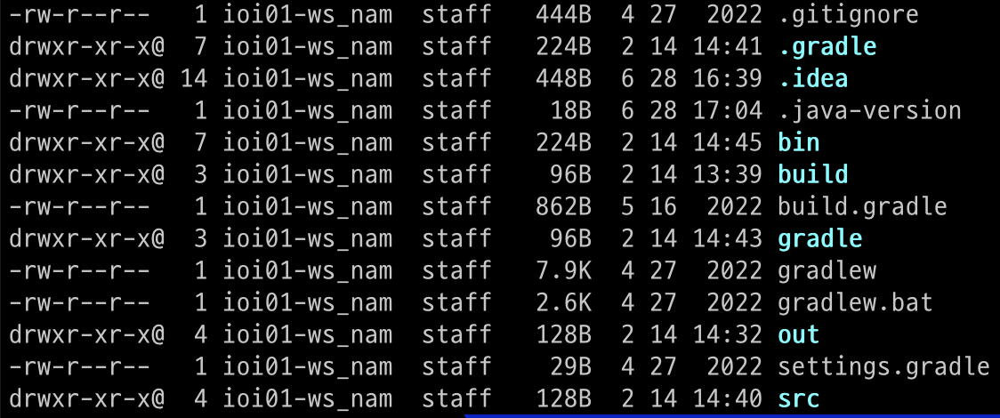
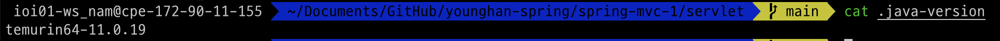

#jEnv

## 설명 
jEnv를 사용해서 JAVA_HOME의 jdk 버전을 한 줄의 명령어로 바꾸게 도와주는 도구

## 사용법
1. jEnv 설치
~~~sh
brew install jenv
~~~

2. jEnv 환경설정
먼저 Default shell을 알아보자
~~~sh
echo $SHELL
~~~

bash 혹은 zsh에 따라 환경설정을 하자.

zsh
~~~sh
$ echo 'export PATH="$HOME/.jenv/bin:$PATH"' >> ~/.zshrc
$ echo 'eval "$(jenv init -)"' >> ~/.zshrc

source ~/.zshrc
~~~
bash
~~~sh
$ echo 'export PATH="$HOME/.jenv/bin:$PATH"' >> ~/.bash_profile
$ echo 'eval "$(jenv init -)"' >> ~/.bash_profile

source ~/.bash_profile
~~~

3. 자바 설치
```sh
brew install --cask temurin@21
```

4. 설치된 JDK jEnv에 등록하기

먼저, 설치된 JDK의 경로를 알아보자 
~~~sh
$ /usr/libexec/java_home -V
Matching Java Virtual Machines (2):
    17.0.6 (arm64) "Eclipse Adoptium" - "OpenJDK 17.0.6" /Library/Java/JavaVirtualMachines/temurin-17.jdk/Contents/Home
    11.0.19 (arm64) "Eclipse Adoptium" - "OpenJDK 11.0.19" /Library/Java/JavaVirtualMachines/temurin-11.jdk/Contents/Home
/Library/Java/JavaVirtualMachines/temurin-17.jdk/Contents/Home
~~~
위에서 확인한 JDK 경로를 적어주자. 뒤에 Contents/Home은 동일
~~~sh
$ jenv add Library/Java/JavaVirtualMachines/{jdk 이름}/Contents/Home
   added
$ jenv add Library/Java/JavaVirtualMachines/{jdk 이름}/Contents/Home
   added

jenv rehash # 새로 등록하거나 제거한 JDK의 실행 파일(java, javac, keytool 등)에 대한 심볼릭 링크를 jenv 내부에 다시 생성하는 명령
~~~

아래처럼 나오면 성공.



5. JAVA_HOME 등록하기
~~~sh
jenv doctor
[OK]	No JAVA_HOME set
[ERROR]	Java binary in path is not in the jenv shims.
[ERROR]	Please check your path, or try using /path/to/java/home is not a valid path to java installation.
	PATH : /Users/user/.jenv/libexec:/Users/user/.jenv/shims:/Users/user/.jenv/bin:/usr/local/bin:/usr/bin:/bin:/usr/sbin:/sbin
[OK]	Jenv is correctly loaded
~~~

처음 jenv doctor를 실행하면, JAVA_HOME이 아직 set 되지 않았다고 뜬다. 

~~~sh
jenv enable-plugin export
exec $SHELL -l
~~~
export plugin을 enable해주면 



위처럼 모두 OK가 뜨게 된다. 

6. jenv에 등록된 jdk 확인
~~~sh
jenv versions
~~~




add 해준 JDK가 보이게 된다. 

7. Global 버전 변경해주기

mac OS 전체에 적용되는 JAVA_HOME 값을 바꾼다.
~~~sh
jenv global {version 이름}

~~~

JAVA_HOME 확인
global로 version을 바꾼후 확인해보면 바뀌어있다.
~~~sh
java -version
~~~

{}안에 위에 versions 했을 때, 뜨는 이름을 적어주면 된다. 적용이 되면 옆에 set이 붙는다.

8. Local 적용
특정 프로젝트에만 특정 자바 버전을 적용시키고 싶을 때 사용한다. 
프로젝트가 있는 경로에서 명령어를 실행한다.
~~~sh
jenv local {version 이름}
exec $SHELL -l
cat .java-version
~~~




위처럼 .java-version이라는 파일이 생기고 확인해보면 지정한 자바 버전으로 돼있다.


## 출처
https://www.jenv.be/

https://github.com/jenv/jenv