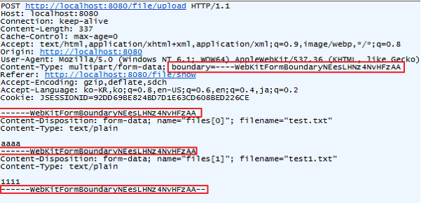

# multipartFile

## HTTP multipart/form-data

### form 태그

name 

    form의 이름. 서버로 보내질 때 이름의 값으로 데이터 전송. 

action 

    form이 전송되는 서버  url

method 

    전송방법 설정. get 또느 post

enctype 

    데이터가 서버로 제출될 때, 데이터가 인코딩되는 방법을 명시

### enctype 속성값

application/x-www-form-urlencoded

    Form 태그에 별도로 지정해주지 않으면 default값, 
    
    모든 문자들을 서버로 보내기 전에 인코딩됨을 명시. 

    username=kim&age=30 형태로 Body에 넘어감.

text/plain

    공백문자(space)는 "+"로 변환, 나머지 문자는 모두 인코딩되지 않음을 명시. 

**multipart/form-data**

    모든 문자를 인코딩하지 않음을 명시. 

    <form>으로 넘기는 요소 중에 파일이나 이미지가 있을 떄 주로 사용.

예시

~~~html
<form th:action="@{/api/upload}" method="post" enctype="multipart/form-data">
    제목 : <input type="text" name="title">  
    파일 : <input type="file" name="file">  
    <button>등록하기</button>
</form>
~~~

## multipart/form-data 원리

    일반적으로 HTTP Request Body의 Content-type은 하나만 지정할 수 있음. 

    하지만, 보통 File을 넘길 떄 문자가 아닌 바이너리 데이터를 전송해야 함. 
    
    첨부파일은 바이너리로, 설명은 문자로 동시에 전송해야 하기 때문에 content-type이 달라짐. 

    그래서 여러 종류의 데이터를 담을 수 있도록 multipart/form-data가 생기게 됨. 

    요청 헤더를 보면 위처럼, content-type이 multipart/form-data일 경우, 

    전송항목을 구분시켜줄 boundary가 무작위로 정해진 것을 알 수 있음.

    마지막 boundary는 끝임을 알리기 위해 '--'이 붙어있음.

## 참고

https://velog.io/@gmtmoney2357/%EC%8A%A4%ED%94%84%EB%A7%81-%EB%B6%80%ED%8A%B8-%ED%8C%8C%EC%9D%BC-%EC%97%85%EB%A1%9C%EB%93%9C-%EB%8B%A4%EC%9A%B4%EB%A1%9C%EB%93%9C-%EC%9D%B4%EB%AF%B8%EC%A7%80-%EB%B3%B4%EC%97%AC%EC%A3%BC%EA%B8%B0

https://lena-chamna.netlify.app/post/http_multipart_form-data/