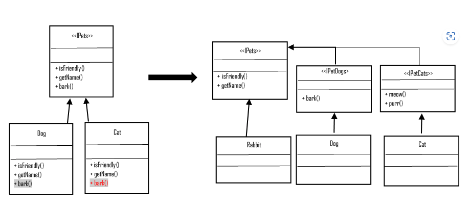
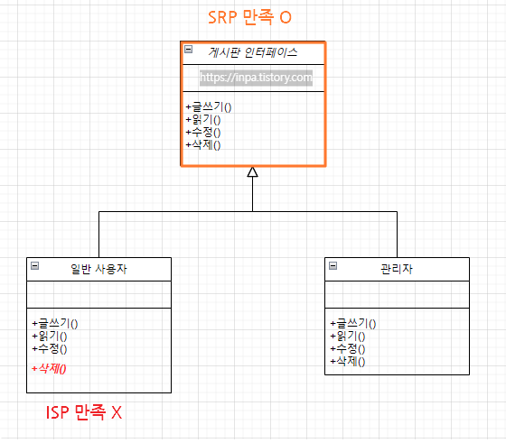

# 인터페이스 분리 원칙

## Interface Segregation Priniple

범용적인 인터페이스 보다는 사용자가 실제로 사용하는 Interface를 만들어야 한다. 

인터페이스를 사용에 맞게 각각 분리해야한다는 뜻

)

## SRP vs ISP

SRP : 클래스의 단일 책임
ISP : 인터페이스의 단일 책임

하지만, SRP을 만족하더라고 ISP가 만족되지 않을 수 있다.

## 출처 

https://inpa.tistory.com/entry/OOP-%F0%9F%92%A0-%EC%95%84%EC%A3%BC-%EC%89%BD%EA%B2%8C-%EC%9D%B4%ED%95%B4%ED%95%98%EB%8A%94-ISP-%EC%9D%B8%ED%84%B0%ED%8E%98%EC%9D%B4%EC%8A%A4-%EB%B6%84%EB%A6%AC-%EC%9B%90%EC%B9%99

https://blog.itcode.dev/posts/2021/08/16/interface-segregation-principle