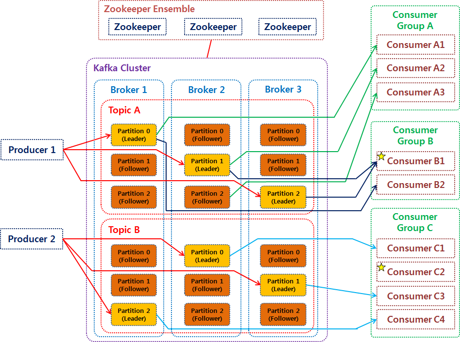
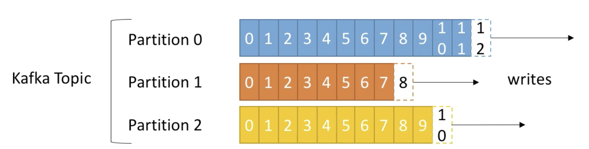
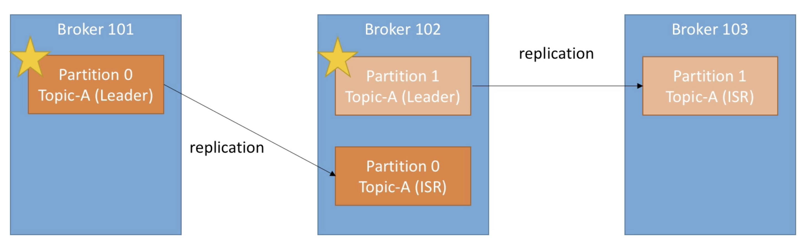
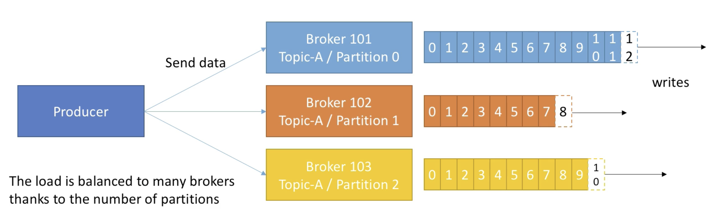
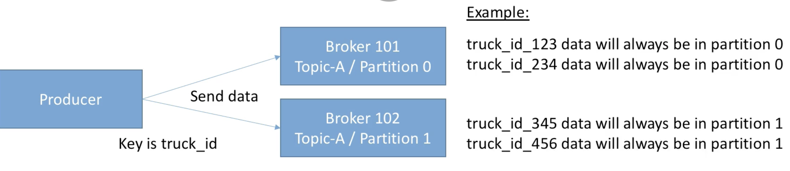
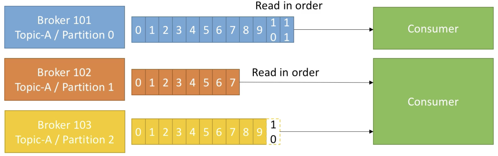
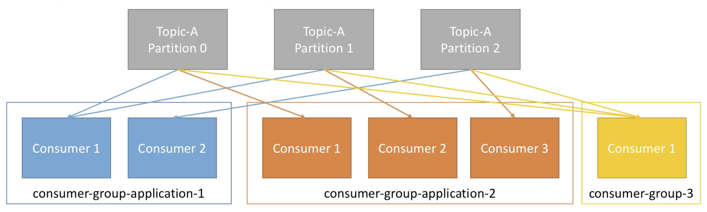

# Apache Kafka

## 카프카 아키텍처

## 동작 흐름

    1. 프로듀서는 새로운 메시지를 Kafka에 전달
    2. 전달된 메시지는 브로커의 '토픽'이라는 메시지 구분자에 저장
    3. 컨슈머는 구독한 '토픽'에 접근하여 메시지를 가져옴(pull)

## 기존 메시징 시스템과 다른 점

    1. 디스크에 메시지 저장
       1. 기존 메시징 시스템은 컨슈머가 메시지를 소비하면 큐에서 바로 삭제했음
       2. 디스크에 메시지를 일정기간 보관하기 때문에 메시지의 손실이 없음
    2. 멀티 프로듀서, 멀티 컨슈머
       1. 프로듀서와 컨슈머 모두 하나 이상의 메시지를 주고 받을 수 있음
    3. 분산형 스트리밍 플랫폼
       1. 단일 시스템 대비 성능 우수.
       2. 시스템 확장 용이
    4. 페이지 캐시
       1. 잔여 메모리를 이용하지 않고, 페이지 캐시를 통한 Read/Write를 함
    5. 배치 전송 처리
       1. 메세지를 작은 단위로 묶어 배치 처리를 해서 속도 향상을 시킴

## 카프카 구성요소

## 브로커(Brokers)

      Kafa Cluster는 여러대의 Broker(일종의 서버)로 구성

      카프카 서버라고도 불림.

      각 broker는 고유한 id값을 가짐.

      특정 topic의 partition을 포함함.

      통상적으로 3개의 broker를 운영하는 것이 이상적. 

## 토픽(Topic)

    브로커에서 데이터를 관리할 때 기준이 되는 개념

    일종의 폴더 혹은 주제

    토픽 이름으로 구분됨.

    프로듀서가 메시지를 보내면 해당 토픽에 저장되고 컨슈머가 가져간다

    토픽은 파티션으로 나뉘어서 처리됨.

## 파티션

    토픽을 구성하는 데이터 저장소.

    메시지가 저장되는 위치.

    일종의 입구라고 생각? 

    파티션 내의 메시지는 offset이라는 단위로 고유 id가 증가

    데이터의 보존주기는 default 7일

    프로듀서당 하나의 파티션에 연결하면 빠르다 

    하지만, 또 너무 많으면 낭비가 생김. 
    리플리케이션 (장애 복구) 시간이 증가함
    한번 늘리면 줄일 수 없음!

## 복제 계수(Replication Factor)

      토픽을 복제 해두는 것. 다운되는것을 예방하기 위해

      복제계수가 1인 경우, 브로커 A만 존재.

      원본의 broker가 리더, 복제품이 팔로워. 팔로워는 read/write 권한없고 리더 데이터 복제만 함.

      리더와 팔로워가 묶여서 ISR(In Sync Replica) 구성. 

#### 리더 파티션(Leader Partition) 

      프로듀서로부터 전달된 데이터를 보관하는 역할

      리더 파티션은 프로듀서, 컨슈머와 직접 통신하는 파티션

      읽기, 쓰기 연산 담당

#### 팔로워 파티션(Follower Partition)

      리더 파티션으로 전달된 데이터를 복제해서 복제된 데이터를 저장.

## 오프셋

      파티션마다 메시지가 저장되는 위치

      각 파티션 내에서 순차적인 숫자 형태로 저장됨

      같은 파티션 내에서의 순서는 보장되지만, 파티션끼리의 순서는 보장되지 않음.

      전체 메시지의 순서를 보장하고 싶다면, 파티션은 1개로만 설정해야 함

## 프로듀서(Producers)

      메시지를 생산해서 브로커의 토픽으로 메시지를 보내는 역할을 하는 애플리케이션이나 서버 모두를 프로듀서라고 부름.

      데이터를 쓰는 동시에 어떤 broker의 어떤 파티션으로 가게 될지 알고있음.

## 메세지 키(message keys)

      프로듀서가 데이터를 writer 할 때, 

      key값을 설정해서 보낼 수 있음.

      key = null이면, 메시지는 UniformStickyPartitioner 방식으로 데이터가 배치로 모두 묶일 떄까지 기다린 뒤, 덩어리는 모두 동일한 파티션에 전송됨.

      key를 지정하면, 항상 같은 파티션으로 보내짐.

## 컨슈머(consumers)

      파티션에 저장되어 있는 메시지를 소비하는 역할을 하는 애플리케이션이나 서버 모두

      각 파티션 내에서 순서대로 읽어옴.

## 컨슈머 그룹

    동일 토픽에 대해 여러 컨슈머가 메시지를 가져갈 수 있도록 컨슈머 그룹을 만듦.

    프로듀서가 메시지를 전달하는 속도가 컨슈머가 메시를 가져가는 속도 보다 빠를 때, 메시지가 점점 쌓이기 떄문에 

    하나의 파티션당 하나의 컨슈머가 연결. 그룹 내의 컨슈머는 각기 다른 파티션에 할당.

    컨슈머의 수가 파티션의 수보다 많다면, 몇 컨슈머는 놀게 됨

## 참조

https://velog.io/@jaehyeong/Apache-Kafka%EC%95%84%ED%8C%8C%EC%B9%98-%EC%B9%B4%ED%94%84%EC%B9%B4%EB%9E%80-%EB%AC%B4%EC%97%87%EC%9D%B8%EA%B0%80

https://velog.io/@king3456/Apache-Kafka-%EA%B8%B0%EB%B3%B8%EA%B0%9C%EB%85%90

https://velog.io/@jwpark06/Kafka-%EC%8B%9C%EC%8A%A4%ED%85%9C-%EA%B5%AC%EC%A1%B0-%EC%95%8C%EC%95%84%EB%B3%B4%EA%B8%B0