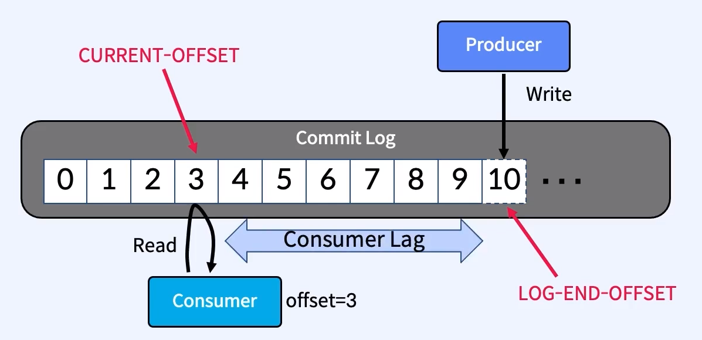
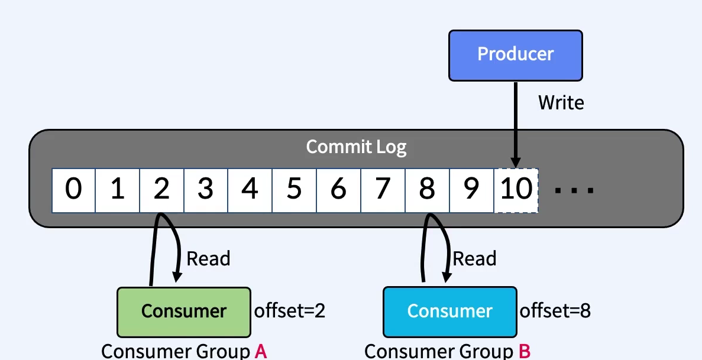

# Apache Kafka

## 카프카 아키텍처

## 아파치 카프카는 무엇인가?
- Data in Motion Platform
  - 움직이는 데이터를 처리하는 플랫폼
- Real-time Event Streams을 받아서 Real-time Event Streams이 필요로 하는 곳으로 보낸다.
- LinkedIn에서 개발
  - 하루 4.5조개 event stream 처리
- 프란츠 카프카에서 이름을 따옴
  - 디스크에 write하는 카프카와 writer 카프카
- confluent
  - kafka 창시자 jay kreps가 창업한 회사

### Event란?
- 비즈니스에서 일어나는 모든 일(데이터)
- BigData라는 특징
  - 비즈니스 모든 영역에서 광범위하게 발생
- Event Stream
  - 연속적인 많은 이벤트가 흐름처럼 온다는 의미

## 특징
- 이벤트 스트림을 안전하게 전송. publish & subscribe
- event stream을 디스크에 저장 (기존과 가장 크게 다른 특징)
- event stream을 분석 및 처리

## 사용 사례
- messaging system
- iot 디바이스 수집
- 애플리케이션 로그 수집
- 이상감지
- MSA 기반의 분리된 DB간 동기화
- 실시간 ETL
- spark, hadoop 빅데이터 

## 기존 메시징 시스템과 다른 점

1. 디스크에 메시지 저장
    1. 기존 메시징 시스템은 컨슈머가 메시지를 소비하면 큐에서 바로 삭제했음
    2. 디스크에 메시지를 일정기간 보관하기 때문에 메시지의 손실이 없음
2. 멀티 프로듀서, 멀티 컨슈머
    1. 프로듀서와 컨슈머 모두 하나 이상의 메시지를 주고 받을 수 있음
3. 분산형 스트리밍 플랫폼
    1. 단일 시스템 대비 성능 우수.
    2. 시스템 확장 용이
4. 페이지 캐시
    1. 잔여 메모리를 이용하지 않고, 페이지 캐시를 통한 Read/Write를 함
5. 배치 전송 처리
    1. 메세지를 작은 단위로 묶어 배치 처리를 해서 속도 향상을 시킴

## 카프카 구성요소

## 동작 흐름

1. 프로듀서는 새로운 메시지를 Kafka에 전달
2. 전달된 메시지는 브로커의 '토픽'이라는 메시지 구분자에 저장
3. 컨슈머는 구독한 '토픽'에 접근하여 메시지를 가져옴(pull)

## 브로커(Broker)

- Kafa Cluster는 여러대의 Broker로 구성
- `Kafka Server`라고도 불림. 
- Partition에 대한 Read, Write를 관리하는 소프트웨어
- Topic 내의 Partition들을 분산배치, 유지, 관리하는 역할
- 각 broker는 고유한 id(숫자)로 식별됨.
- 특정 topic의 partition들을 가지고 있다.
- Broker ID와 Partition ID는 관계가 없음.
- 동일한 Topic의 Partition들은 여러 Broker에 분산돼서 배치된다.
- Client(producer, consumer)는 특정 Broker에만 연결하면 전체 Cluster에 연결가능함.
  - Client는 **Bootstrap Server** 라는 파라미터를 가지고 접속함.
    - kafka cluster 내의 전체 Broker를 부르는 말
  - 하나의 Broker에 연결을 하면
  - 이 Broker는 Cluster 내의 전체 Broker의 리스트를 전달해줌
  - Client는 topic의 Partition들이 어느 Broker에 있는지 알게돼서 그 Broker들에 접속하게 됨.
  - 그런데 일반적으로 최초 접속하려는 Broker가 죽어버리면 접속할 수 없어져서 그냥 전체 Broker를 ,로 구분해서 다 집어넣음
- 최소 3대 이상의 Broker로 하나의 Cluster를 구성해야 하며 안정성을 위해 `4대` 이상을 권장한다.

## Zookeeper
- Broker 목록/설정을 관리해주는 소프트웨어
- 변경사항에 대해 Broker에게 알려줌
  - topic 생성/제거, broker 추가/제거
- KIP-500을 통해서 Zookeeper 제거가 진행중
- 홀수개수의 서버로 작동
  - 최소3, 권장5
- 

## 토픽(Topic)

- kafka 안에서 메시지가 저장되는 장소
- 논리적인 표현 단위 (눈으로 보이는 물리적 공간이 아님)
- 브로커에서 데이터를 관리할 때 기준이 되는 개념
- 토픽 이름으로 구분됨.
- Topic 생성시에 Partition 개수를 지정한다
  - 운영 도중에 변경을 권장하지 않음.

### Partition 파티션

- 눈에 보이는 디렉토리, 파일
- Partition이 곧 Commit Log
- 하나의 Topic은 하나 이상의 Partition으로 구성됨
  - 병렬처리가 가능해짐
- 하나의 Partition은 여러개의 `Segment`로 구성됨
  - 실제 데이터가 저장되는 물리적 file
  - 지정된 크기보다 크거나 지정된 기간보다 오래되면 새 file이 열리고 메시지는 새 file에 추가됨.
  - segment0, segment1. segment2 등등등 계속 생성됨. 과거의 segment0, 1에는 데이터가 write 되지 않음.
  - segment 롤링 기준은 용량(default 1G) 혹은 시간(default 168H)
- Topic 생성시 Partition 개수를 지정하면, 각 Partition들은 Broker에 분산돼서 배치됨.
- 즉, 같은 Topic의 Partition일지라도 서로 다른 Broker에 배치될 수 있다.
  - 분산 기준은 Broker cluster가 최적으로 배치
- Partition 번호는 0부터 오름차순
- Topic 내의 Partition 들은 서로 독립적
  - 어떤 Partition은 3번 offset, 어떤 partition은 1번 offset
- 같은 Partition 내에서의 Event 순서는 보장된다.
- 한번 Partition에 저장된 데이터는 변경 불가 (immutable)

데이터의 보존주기는 default 7일

프로듀서당 하나의 파티션에 연결하면 빠르다 

하지만, 또 너무 많으면 낭비가 생김. 
리플리케이션 (장애 복구) 시간이 증가함
한번 늘리면 줄일 수 없음!

#### Commit Log

- 추가만 가능하고 변경 불가능한 데이터 스트럭처
- 데이터는 항상 끝에 추가된다.

#### Offset

- Partition에서 Event의 위치 
  - 위 그림에서 0~10번의 위치
- Producer가 Write하는 `LOG-END-OFFSET`
- Consumer가 Read하고 여기까지 읽어갔다고 Commit한 위치가 `CURRENT-OFFSET`
- 이 둘의 offset 위치 차이를 `Consuemr Lag`이라고 부름
- 각 파티션 내에서 0으로 시작해서 순차적으로 증가함
- 서로 다른 Partition에서 offset은 아무 의미가 없다.
  - Partition 0의 1번 offset과 Partition 1의 1번 offset은 아무 관계가 없음.
- 전체 메시지의 순서를 보장하고 싶다면, 파티션은 1개로만 설정해야 함

### 복제 계수(Replication Factor)

토픽을 복제 해두는 것. 다운되는것을 예방하기 위해

복제계수가 1인 경우, 브로커 A만 존재.

원본의 broker가 리더, 복제품이 팔로워. 팔로워는 read/write 권한없고 리더 데이터 복제만 함.

리더와 팔로워가 묶여서 ISR(In Sync Replica) 구성. 

#### 리더 파티션(Leader Partition) 

프로듀서로부터 전달된 데이터를 보관하는 역할

리더 파티션은 프로듀서, 컨슈머와 직접 통신하는 파티션

읽기, 쓰기 연산 담당

#### 팔로워 파티션(Follower Partition)

리더 파티션으로 전달된 데이터를 복제해서 복제된 데이터를 저장.

## Producer와 Consumer

- `producer`와 `consumer`는 서로를 모름
- 각각 고유의 속도로 `Commit Log`에 write하고 read한다

## 프로듀서(Producers)

- 메시지를 생산(Produce)해서 브로커의 Topic으로 메시지를 보내는 애플리케이션
- 데이터를 쓰는 동시에 어떤 broker의 어떤 파티션으로 가게 될지 알고있음.

### 메세지 키(message keys)

프로듀서가 데이터를 writer 할 때, 

key값을 설정해서 보낼 수 있음.

key = null이면, 메시지는 UniformStickyPartitioner 방식으로 데이터가 배치로 모두 묶일 떄까지 기다린 뒤, 덩어리는 모두 동일한 파티션에 전송됨.

key를 지정하면, 항상 같은 파티션으로 보내짐.

## 컨슈머(consumers)

- Topic 파티션에 저장되어 있는 메시지를 소비(Consume)하는 애플리케이션
- 서로 다른 그룹의 Consumer들은 서로 관련이 없다
각 파티션 내에서 순서대로 읽어옴.

## 컨슈머 그룹

- Consumer들의 집합
- 동일 토픽에 대해 여러 컨슈머가 분산 병렬 처리
- 프로듀서가 메시지를 전달하는 속도가 컨슈머가 메시를 가져가는 속도 보다 빠를 때, 메시지가 점점 쌓이기 떄문에 
- 하나의 파티션당 하나의 컨슈머가 연결. 그룹 내의 컨슈머는 각기 다른 파티션에 할당.
- 컨슈머의 수가 파티션의 수보다 많다면, 몇 컨슈머는 놀게 됨

## 참조

https://velog.io/@jaehyeong/Apache-Kafka%EC%95%84%ED%8C%8C%EC%B9%98-%EC%B9%B4%ED%94%84%EC%B9%B4%EB%9E%80-%EB%AC%B4%EC%97%87%EC%9D%B8%EA%B0%80

https://velog.io/@king3456/Apache-Kafka-%EA%B8%B0%EB%B3%B8%EA%B0%9C%EB%85%90

https://velog.io/@jwpark06/Kafka-%EC%8B%9C%EC%8A%A4%ED%85%9C-%EA%B5%AC%EC%A1%B0-%EC%95%8C%EC%95%84%EB%B3%B4%EA%B8%B0